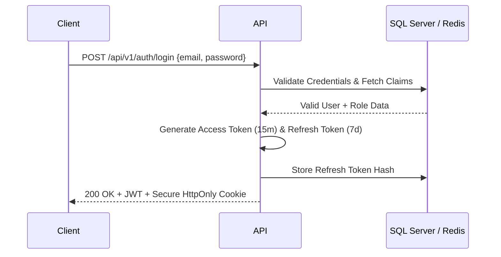
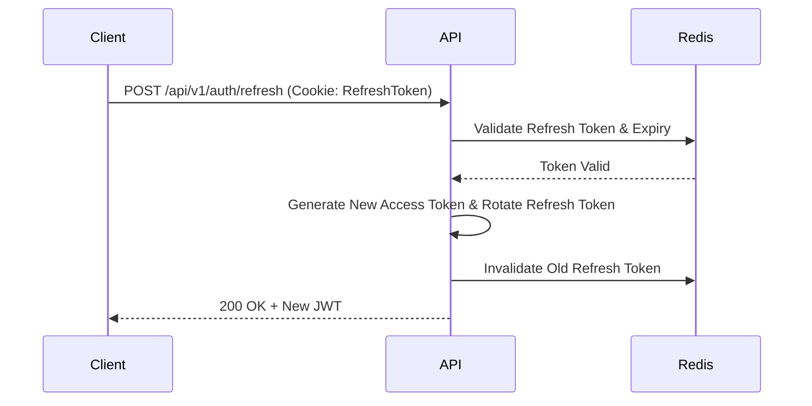

# Enterprise IT Asset Management System (Project Tracer)
## Document 5: REST API Design Specification

**Prepared By:** Sakthivel P, Principal API Architect  
**Document Version:** 1.0  
**Target Stack:** ASP.NET Core 9, REST, OpenAPI 3.0  

---

## 1. Global API Architecture & Standards

### 1.1 API Naming Standards
* **Base URL:** `https://api.tracer.internal/api/v{version}/`
* **Resource Names:** Plural, kebab-case (e.g., `/api/v1/asset-models`).
* **Nested Resources:** Used only when strictly bound to the parent (e.g., `/api/v1/assets/{id}/components`).
* **Actions:** Use standard HTTP verbs. Non-CRUD operations utilize verb suffixes (e.g., `POST /api/v1/assets/{id}/checkout`).

### 1.2 API Versioning Strategy
* **Method:** URL Path versioning (`/api/v1/`) combined with Swagger document grouping.
* **Deprecation:** Sunset headers (`Sunset`, `Deprecation`) will be utilized 6 months prior to v1 retirement.

### 1.3 Error Handling Strategy & Problem Details (RFC 7807)
All errors return an RFC 7807 compliant `application/problem+json` payload handled by a Global Exception Middleware.

```json
{
  "type": "https://tools.ietf.org/html/rfc7231#section-6.5.1",
  "title": "Validation Error",
  "status": 400,
  "detail": "One or more validation errors occurred.",
  "instance": "/api/v1/assets",
  "traceId": "00-4bf92f3577b34da6a3ce929d0e0e4736-00f067aa0ba902b7-01",
  "errors": {
    "AssetTag": ["The AssetTag 'PC-100' is already in use."]
  }
}
```

### 1.4 Security Best Practices
* **Authentication:** Stateless Bearer JWT tokens.
* **Idempotency:** Required for `POST` and `PATCH` requests utilizing the `Idempotency-Key` header.
* **Rate Limiting:** IP-based sliding window (100 req/min for read, 50 req/min for write) implemented via ASP.NET Core 9 RateLimiter.
* **Headers:** Enforced `Strict-Transport-Security`, `X-Content-Type-Options: nosniff`, and `Content-Security-Policy`.

### 1.5 Swagger Documentation Standards
* Utilizes **Swashbuckle.AspNetCore**.
* All controllers and DTOs MUST include XML comments.
* Example payloads must be provided via `ISchemaFilter` and `IOperationFilter`.

---

## 2. Authentication & Authorization Flows

### 2.1 Standard JWT Authentication Flow


### 2.2 Refresh Token Flow


---

## 3. Module API Specifications

### 3.1 Module: Authentication

#### POST /api/v1/auth/login
**Purpose:** Authenticate user and issue JWT.

**Request DTO:** `LoginDto { Email, Password }`

**Response DTO:** `TokenResponseDto { AccessToken, ExpiresIn }` (Refresh token in HttpOnly cookie)

**Security:** Rate limited to 5 req/min. Account lockout after 5 failed attempts.

#### POST /api/v1/auth/refresh
**Purpose:** Issue a new JWT using a valid refresh token cookie.

### 3.2 Module: Users

#### GET /api/v1/users
**Purpose:** Retrieve a paginated, filterable list of Users.

**Authorization:** Bearer JWT

**Permission Required:** `Users.View`

**Request DTO:** (Query Parameters) `page`, `limit`, `sortBy`, `sortDesc`, `search`, `filters`

**Response DTO:** `PaginatedResponse<UsersDto>`

**Validation Rules:** `page` > 0, `limit` between 1 and 1000.

**Business Rules:** Row-Level Security applies. Users only see Users assigned to their Company.

**Status Codes:** 200 OK, 401 Unauthorized, 403 Forbidden

**Example Request:** `GET /api/v1/users?page=1&limit=50&sortBy=createdAt&sortDesc=true`

**Example Response:**
```json
{
  "data": [],
  "meta": { "totalRecords": 150, "currentPage": 1, "totalPages": 3 }
}
```

**Pagination / Filtering / Sorting / Searching:** Supported via EF Core LINQ dynamic queries.

**Rate Limiting:** 100 requests / minute per IP.

**Caching:** `Cache-Control: private, max-age=60`, Supports `ETag`.

**Idempotency:** Yes.

#### POST /api/v1/users
**Purpose:** Create a new Users record.

**Authorization:** Bearer JWT

**Permission Required:** `Users.Create`

**Request DTO:** `CreateUsersCommand`

**Response DTO:** `UsersDto`

**Validation Rules:** FluentValidation enforced for required domain fields.

**Business Rules:** Creation triggers an `ActivityLog` event.

**Status Codes:** 201 Created, 400 Bad Request, 401 Unauthorized, 409 Conflict

**Error Responses:** RFC 7807 Problem Details for validation failures.

**Idempotency:** Requires `Idempotency-Key` header (UUID). Overlapping keys within 24h return the cached 201 response.

#### PUT /api/v1/users/{id}
**Purpose:** Full update of a Users record.

**Authorization:** Bearer JWT

**Permission Required:** `Users.Update`

**Request DTO:** `UpdateUsersCommand`

**Business Rules:** Optimistic concurrency validated via `rowVersion`. Historical snapshot created.

**Idempotency:** Yes (PUT is inherently idempotent).

#### DELETE /api/v1/users/{id}
**Purpose:** Soft delete a Users record.

**Authorization:** Bearer JWT

**Permission Required:** `Users.Delete`

**Business Rules:** Fails if dependent entities exist (e.g., cannot delete an Asset Model if Assets are mapped to it).

**Status Codes:** 204 No Content, 404 Not Found, 409 Conflict.

**Idempotency:** Yes.

### 3.3 Module: Roles

#### GET /api/v1/roles
**Purpose:** Retrieve a paginated, filterable list of Roles.

**Authorization:** Bearer JWT

**Permission Required:** `Roles.View`

**Request DTO:** (Query Parameters) `page`, `limit`, `sortBy`, `sortDesc`, `search`, `filters`

**Response DTO:** `PaginatedResponse<RolesDto>`

**Validation Rules:** `page` > 0, `limit` between 1 and 1000.

**Business Rules:** Row-Level Security applies. Users only see Roles assigned to their Company.

**Status Codes:** 200 OK, 401 Unauthorized, 403 Forbidden

**Example Request:** `GET /api/v1/roles?page=1&limit=50&sortBy=createdAt&sortDesc=true`

**Example Response:**
```json
{
  "data": [],
  "meta": { "totalRecords": 150, "currentPage": 1, "totalPages": 3 }
}
```

**Pagination / Filtering / Sorting / Searching:** Supported via EF Core LINQ dynamic queries.

**Rate Limiting:** 100 requests / minute per IP.

**Caching:** `Cache-Control: private, max-age=60`, Supports `ETag`.

**Idempotency:** Yes.

#### POST /api/v1/roles
**Purpose:** Create a new Roles record.

**Authorization:** Bearer JWT

**Permission Required:** `Roles.Create`

**Request DTO:** `CreateRolesCommand`

**Response DTO:** `RolesDto`

**Validation Rules:** FluentValidation enforced for required domain fields.

**Business Rules:** Creation triggers an `ActivityLog` event.

**Status Codes:** 201 Created, 400 Bad Request, 401 Unauthorized, 409 Conflict

**Error Responses:** RFC 7807 Problem Details for validation failures.

**Idempotency:** Requires `Idempotency-Key` header (UUID). Overlapping keys within 24h return the cached 201 response.

#### PUT /api/v1/roles/{id}
**Purpose:** Full update of a Roles record.

**Authorization:** Bearer JWT

**Permission Required:** `Roles.Update`

**Request DTO:** `UpdateRolesCommand`

**Business Rules:** Optimistic concurrency validated via `rowVersion`. Historical snapshot created.

**Idempotency:** Yes (PUT is inherently idempotent).

#### DELETE /api/v1/roles/{id}
**Purpose:** Soft delete a Roles record.

**Authorization:** Bearer JWT

**Permission Required:** `Roles.Delete`

**Business Rules:** Fails if dependent entities exist (e.g., cannot delete an Asset Model if Assets are mapped to it).

**Status Codes:** 204 No Content, 404 Not Found, 409 Conflict.

**Idempotency:** Yes.

### 3.4 Module: Permissions

#### GET /api/v1/permissions
**Purpose:** Retrieve a paginated, filterable list of Permissions.

**Authorization:** Bearer JWT

**Permission Required:** `Permissions.View`

**Request DTO:** (Query Parameters) `page`, `limit`, `sortBy`, `sortDesc`, `search`, `filters`

**Response DTO:** `PaginatedResponse<PermissionsDto>`

**Validation Rules:** `page` > 0, `limit` between 1 and 1000.

**Business Rules:** Row-Level Security applies. Users only see Permissions assigned to their Company.

**Status Codes:** 200 OK, 401 Unauthorized, 403 Forbidden

**Example Request:** `GET /api/v1/permissions?page=1&limit=50&sortBy=createdAt&sortDesc=true`

**Example Response:**
```json
{
  "data": [],
  "meta": { "totalRecords": 150, "currentPage": 1, "totalPages": 3 }
}
```

**Pagination / Filtering / Sorting / Searching:** Supported via EF Core LINQ dynamic queries.

**Rate Limiting:** 100 requests / minute per IP.

**Caching:** `Cache-Control: private, max-age=60`, Supports `ETag`.

**Idempotency:** Yes.

#### POST /api/v1/permissions
**Purpose:** Create a new Permissions record.

**Authorization:** Bearer JWT

**Permission Required:** `Permissions.Create`

**Request DTO:** `CreatePermissionsCommand`

**Response DTO:** `PermissionsDto`

**Validation Rules:** FluentValidation enforced for required domain fields.

**Business Rules:** Creation triggers an `ActivityLog` event.

**Status Codes:** 201 Created, 400 Bad Request, 401 Unauthorized, 409 Conflict

**Error Responses:** RFC 7807 Problem Details for validation failures.

**Idempotency:** Requires `Idempotency-Key` header (UUID). Overlapping keys within 24h return the cached 201 response.

#### PUT /api/v1/permissions/{id}
**Purpose:** Full update of a Permissions record.

**Authorization:** Bearer JWT

**Permission Required:** `Permissions.Update`

**Request DTO:** `UpdatePermissionsCommand`

**Business Rules:** Optimistic concurrency validated via `rowVersion`. Historical snapshot created.

**Idempotency:** Yes (PUT is inherently idempotent).

#### DELETE /api/v1/permissions/{id}
**Purpose:** Soft delete a Permissions record.

**Authorization:** Bearer JWT

**Permission Required:** `Permissions.Delete`

**Business Rules:** Fails if dependent entities exist (e.g., cannot delete an Asset Model if Assets are mapped to it).

**Status Codes:** 204 No Content, 404 Not Found, 409 Conflict.

**Idempotency:** Yes.

### 3.5 Module: Assets

#### GET /api/v1/assets
**Purpose:** Retrieve a paginated, filterable list of Assets.

**Authorization:** Bearer JWT

**Permission Required:** `Assets.View`

**Request DTO:** (Query Parameters) `page`, `limit`, `sortBy`, `sortDesc`, `search`, `filters`

**Response DTO:** `PaginatedResponse<AssetsDto>`

**Validation Rules:** `page` > 0, `limit` between 1 and 1000.

**Business Rules:** Row-Level Security applies. Users only see Assets assigned to their Company.

**Status Codes:** 200 OK, 401 Unauthorized, 403 Forbidden

**Example Request:** `GET /api/v1/assets?page=1&limit=50&sortBy=createdAt&sortDesc=true`

**Example Response:**
```json
{
  "data": [],
  "meta": { "totalRecords": 150, "currentPage": 1, "totalPages": 3 }
}
```

**Pagination / Filtering / Sorting / Searching:** Supported via EF Core LINQ dynamic queries.

**Rate Limiting:** 100 requests / minute per IP.

**Caching:** `Cache-Control: private, max-age=60`, Supports `ETag`.

**Idempotency:** Yes.

#### POST /api/v1/assets
**Purpose:** Create a new Assets record.

**Authorization:** Bearer JWT

**Permission Required:** `Assets.Create`

**Request DTO:** `CreateAssetsCommand`

**Response DTO:** `AssetsDto`

**Validation Rules:** FluentValidation enforced for required domain fields.

**Business Rules:** Creation triggers an `ActivityLog` event.

**Status Codes:** 201 Created, 400 Bad Request, 401 Unauthorized, 409 Conflict

**Error Responses:** RFC 7807 Problem Details for validation failures.

**Idempotency:** Requires `Idempotency-Key` header (UUID). Overlapping keys within 24h return the cached 201 response.

#### PUT /api/v1/assets/{id}
**Purpose:** Full update of a Assets record.

**Authorization:** Bearer JWT

**Permission Required:** `Assets.Update`

**Request DTO:** `UpdateAssetsCommand`

**Business Rules:** Optimistic concurrency validated via `rowVersion`. Historical snapshot created.

**Idempotency:** Yes (PUT is inherently idempotent).

#### DELETE /api/v1/assets/{id}
**Purpose:** Soft delete a Assets record.

**Authorization:** Bearer JWT

**Permission Required:** `Assets.Delete`

**Business Rules:** Fails if dependent entities exist (e.g., cannot delete an Asset Model if Assets are mapped to it).

**Status Codes:** 204 No Content, 404 Not Found, 409 Conflict.

**Idempotency:** Yes.

#### POST /api/v1/assets/{id}/checkout
**Purpose:** Assign an asset to a user, location, or another asset.

**Business Rules:** Asset must have a 'Deployable' status. Triggers notification and EULA workflow.

#### POST /api/v1/assets/{id}/checkin
**Purpose:** Return an asset to inventory pool.

### 3.6 Module: Asset Models

#### GET /api/v1/asset-models
**Purpose:** Retrieve a paginated, filterable list of Asset Models.

**Authorization:** Bearer JWT

**Permission Required:** `AssetModels.View`

**Request DTO:** (Query Parameters) `page`, `limit`, `sortBy`, `sortDesc`, `search`, `filters`

**Response DTO:** `PaginatedResponse<AssetModelsDto>`

**Validation Rules:** `page` > 0, `limit` between 1 and 1000.

**Business Rules:** Row-Level Security applies. Users only see Asset Models assigned to their Company.

**Status Codes:** 200 OK, 401 Unauthorized, 403 Forbidden

**Example Request:** `GET /api/v1/asset-models?page=1&limit=50&sortBy=createdAt&sortDesc=true`

**Example Response:**
```json
{
  "data": [],
  "meta": { "totalRecords": 150, "currentPage": 1, "totalPages": 3 }
}
```

**Pagination / Filtering / Sorting / Searching:** Supported via EF Core LINQ dynamic queries.

**Rate Limiting:** 100 requests / minute per IP.

**Caching:** `Cache-Control: private, max-age=60`, Supports `ETag`.

**Idempotency:** Yes.

#### POST /api/v1/asset-models
**Purpose:** Create a new Asset Models record.

**Authorization:** Bearer JWT

**Permission Required:** `AssetModels.Create`

**Request DTO:** `CreateAssetModelsCommand`

**Response DTO:** `AssetModelsDto`

**Validation Rules:** FluentValidation enforced for required domain fields.

**Business Rules:** Creation triggers an `ActivityLog` event.

**Status Codes:** 201 Created, 400 Bad Request, 401 Unauthorized, 409 Conflict

**Error Responses:** RFC 7807 Problem Details for validation failures.

**Idempotency:** Requires `Idempotency-Key` header (UUID). Overlapping keys within 24h return the cached 201 response.

#### PUT /api/v1/asset-models/{id}
**Purpose:** Full update of a Asset Models record.

**Authorization:** Bearer JWT

**Permission Required:** `AssetModels.Update`

**Request DTO:** `UpdateAssetModelsCommand`

**Business Rules:** Optimistic concurrency validated via `rowVersion`. Historical snapshot created.

**Idempotency:** Yes (PUT is inherently idempotent).

#### DELETE /api/v1/asset-models/{id}
**Purpose:** Soft delete a Asset Models record.

**Authorization:** Bearer JWT

**Permission Required:** `AssetModels.Delete`

**Business Rules:** Fails if dependent entities exist (e.g., cannot delete an Asset Model if Assets are mapped to it).

**Status Codes:** 204 No Content, 404 Not Found, 409 Conflict.

**Idempotency:** Yes.

### 3.7 Module: Manufacturers

#### GET /api/v1/manufacturers
**Purpose:** Retrieve a paginated, filterable list of Manufacturers.

**Authorization:** Bearer JWT

**Permission Required:** `Manufacturers.View`

**Request DTO:** (Query Parameters) `page`, `limit`, `sortBy`, `sortDesc`, `search`, `filters`

**Response DTO:** `PaginatedResponse<ManufacturersDto>`

**Validation Rules:** `page` > 0, `limit` between 1 and 1000.

**Business Rules:** Row-Level Security applies. Users only see Manufacturers assigned to their Company.

**Status Codes:** 200 OK, 401 Unauthorized, 403 Forbidden

**Example Request:** `GET /api/v1/manufacturers?page=1&limit=50&sortBy=createdAt&sortDesc=true`

**Example Response:**
```json
{
  "data": [],
  "meta": { "totalRecords": 150, "currentPage": 1, "totalPages": 3 }
}
```

**Pagination / Filtering / Sorting / Searching:** Supported via EF Core LINQ dynamic queries.

**Rate Limiting:** 100 requests / minute per IP.

**Caching:** `Cache-Control: private, max-age=60`, Supports `ETag`.

**Idempotency:** Yes.

#### POST /api/v1/manufacturers
**Purpose:** Create a new Manufacturers record.

**Authorization:** Bearer JWT

**Permission Required:** `Manufacturers.Create`

**Request DTO:** `CreateManufacturersCommand`

**Response DTO:** `ManufacturersDto`

**Validation Rules:** FluentValidation enforced for required domain fields.

**Business Rules:** Creation triggers an `ActivityLog` event.

**Status Codes:** 201 Created, 400 Bad Request, 401 Unauthorized, 409 Conflict

**Error Responses:** RFC 7807 Problem Details for validation failures.

**Idempotency:** Requires `Idempotency-Key` header (UUID). Overlapping keys within 24h return the cached 201 response.

#### PUT /api/v1/manufacturers/{id}
**Purpose:** Full update of a Manufacturers record.

**Authorization:** Bearer JWT

**Permission Required:** `Manufacturers.Update`

**Request DTO:** `UpdateManufacturersCommand`

**Business Rules:** Optimistic concurrency validated via `rowVersion`. Historical snapshot created.

**Idempotency:** Yes (PUT is inherently idempotent).

#### DELETE /api/v1/manufacturers/{id}
**Purpose:** Soft delete a Manufacturers record.

**Authorization:** Bearer JWT

**Permission Required:** `Manufacturers.Delete`

**Business Rules:** Fails if dependent entities exist (e.g., cannot delete an Asset Model if Assets are mapped to it).

**Status Codes:** 204 No Content, 404 Not Found, 409 Conflict.

**Idempotency:** Yes.

### 3.8 Module: Categories

#### GET /api/v1/categories
**Purpose:** Retrieve a paginated, filterable list of Categories.

**Authorization:** Bearer JWT

**Permission Required:** `Categories.View`

**Request DTO:** (Query Parameters) `page`, `limit`, `sortBy`, `sortDesc`, `search`, `filters`

**Response DTO:** `PaginatedResponse<CategoriesDto>`

**Validation Rules:** `page` > 0, `limit` between 1 and 1000.

**Business Rules:** Row-Level Security applies. Users only see Categories assigned to their Company.

**Status Codes:** 200 OK, 401 Unauthorized, 403 Forbidden

**Example Request:** `GET /api/v1/categories?page=1&limit=50&sortBy=createdAt&sortDesc=true`

**Example Response:**
```json
{
  "data": [],
  "meta": { "totalRecords": 150, "currentPage": 1, "totalPages": 3 }
}
```

**Pagination / Filtering / Sorting / Searching:** Supported via EF Core LINQ dynamic queries.

**Rate Limiting:** 100 requests / minute per IP.

**Caching:** `Cache-Control: private, max-age=60`, Supports `ETag`.

**Idempotency:** Yes.

#### POST /api/v1/categories
**Purpose:** Create a new Categories record.

**Authorization:** Bearer JWT

**Permission Required:** `Categories.Create`

**Request DTO:** `CreateCategoriesCommand`

**Response DTO:** `CategoriesDto`

**Validation Rules:** FluentValidation enforced for required domain fields.

**Business Rules:** Creation triggers an `ActivityLog` event.

**Status Codes:** 201 Created, 400 Bad Request, 401 Unauthorized, 409 Conflict

**Error Responses:** RFC 7807 Problem Details for validation failures.

**Idempotency:** Requires `Idempotency-Key` header (UUID). Overlapping keys within 24h return the cached 201 response.

#### PUT /api/v1/categories/{id}
**Purpose:** Full update of a Categories record.

**Authorization:** Bearer JWT

**Permission Required:** `Categories.Update`

**Request DTO:** `UpdateCategoriesCommand`

**Business Rules:** Optimistic concurrency validated via `rowVersion`. Historical snapshot created.

**Idempotency:** Yes (PUT is inherently idempotent).

#### DELETE /api/v1/categories/{id}
**Purpose:** Soft delete a Categories record.

**Authorization:** Bearer JWT

**Permission Required:** `Categories.Delete`

**Business Rules:** Fails if dependent entities exist (e.g., cannot delete an Asset Model if Assets are mapped to it).

**Status Codes:** 204 No Content, 404 Not Found, 409 Conflict.

**Idempotency:** Yes.

### 3.9 Module: Suppliers

#### GET /api/v1/suppliers
**Purpose:** Retrieve a paginated, filterable list of Suppliers.

**Authorization:** Bearer JWT

**Permission Required:** `Suppliers.View`

**Request DTO:** (Query Parameters) `page`, `limit`, `sortBy`, `sortDesc`, `search`, `filters`

**Response DTO:** `PaginatedResponse<SuppliersDto>`

**Validation Rules:** `page` > 0, `limit` between 1 and 1000.

**Business Rules:** Row-Level Security applies. Users only see Suppliers assigned to their Company.

**Status Codes:** 200 OK, 401 Unauthorized, 403 Forbidden

**Example Request:** `GET /api/v1/suppliers?page=1&limit=50&sortBy=createdAt&sortDesc=true`

**Example Response:**
```json
{
  "data": [],
  "meta": { "totalRecords": 150, "currentPage": 1, "totalPages": 3 }
}
```

**Pagination / Filtering / Sorting / Searching:** Supported via EF Core LINQ dynamic queries.

**Rate Limiting:** 100 requests / minute per IP.

**Caching:** `Cache-Control: private, max-age=60`, Supports `ETag`.

**Idempotency:** Yes.

#### POST /api/v1/suppliers
**Purpose:** Create a new Suppliers record.

**Authorization:** Bearer JWT

**Permission Required:** `Suppliers.Create`

**Request DTO:** `CreateSuppliersCommand`

**Response DTO:** `SuppliersDto`

**Validation Rules:** FluentValidation enforced for required domain fields.

**Business Rules:** Creation triggers an `ActivityLog` event.

**Status Codes:** 201 Created, 400 Bad Request, 401 Unauthorized, 409 Conflict

**Error Responses:** RFC 7807 Problem Details for validation failures.

**Idempotency:** Requires `Idempotency-Key` header (UUID). Overlapping keys within 24h return the cached 201 response.

#### PUT /api/v1/suppliers/{id}
**Purpose:** Full update of a Suppliers record.

**Authorization:** Bearer JWT

**Permission Required:** `Suppliers.Update`

**Request DTO:** `UpdateSuppliersCommand`

**Business Rules:** Optimistic concurrency validated via `rowVersion`. Historical snapshot created.

**Idempotency:** Yes (PUT is inherently idempotent).

#### DELETE /api/v1/suppliers/{id}
**Purpose:** Soft delete a Suppliers record.

**Authorization:** Bearer JWT

**Permission Required:** `Suppliers.Delete`

**Business Rules:** Fails if dependent entities exist (e.g., cannot delete an Asset Model if Assets are mapped to it).

**Status Codes:** 204 No Content, 404 Not Found, 409 Conflict.

**Idempotency:** Yes.

### 3.10 Module: Companies

#### GET /api/v1/companies
**Purpose:** Retrieve a paginated, filterable list of Companies.

**Authorization:** Bearer JWT

**Permission Required:** `Companies.View`

**Request DTO:** (Query Parameters) `page`, `limit`, `sortBy`, `sortDesc`, `search`, `filters`

**Response DTO:** `PaginatedResponse<CompaniesDto>`

**Validation Rules:** `page` > 0, `limit` between 1 and 1000.

**Business Rules:** Row-Level Security applies. Users only see Companies assigned to their Company.

**Status Codes:** 200 OK, 401 Unauthorized, 403 Forbidden

**Example Request:** `GET /api/v1/companies?page=1&limit=50&sortBy=createdAt&sortDesc=true`

**Example Response:**
```json
{
  "data": [],
  "meta": { "totalRecords": 150, "currentPage": 1, "totalPages": 3 }
}
```

**Pagination / Filtering / Sorting / Searching:** Supported via EF Core LINQ dynamic queries.

**Rate Limiting:** 100 requests / minute per IP.

**Caching:** `Cache-Control: private, max-age=60`, Supports `ETag`.

**Idempotency:** Yes.

#### POST /api/v1/companies
**Purpose:** Create a new Companies record.

**Authorization:** Bearer JWT

**Permission Required:** `Companies.Create`

**Request DTO:** `CreateCompaniesCommand`

**Response DTO:** `CompaniesDto`

**Validation Rules:** FluentValidation enforced for required domain fields.

**Business Rules:** Creation triggers an `ActivityLog` event.

**Status Codes:** 201 Created, 400 Bad Request, 401 Unauthorized, 409 Conflict

**Error Responses:** RFC 7807 Problem Details for validation failures.

**Idempotency:** Requires `Idempotency-Key` header (UUID). Overlapping keys within 24h return the cached 201 response.

#### PUT /api/v1/companies/{id}
**Purpose:** Full update of a Companies record.

**Authorization:** Bearer JWT

**Permission Required:** `Companies.Update`

**Request DTO:** `UpdateCompaniesCommand`

**Business Rules:** Optimistic concurrency validated via `rowVersion`. Historical snapshot created.

**Idempotency:** Yes (PUT is inherently idempotent).

#### DELETE /api/v1/companies/{id}
**Purpose:** Soft delete a Companies record.

**Authorization:** Bearer JWT

**Permission Required:** `Companies.Delete`

**Business Rules:** Fails if dependent entities exist (e.g., cannot delete an Asset Model if Assets are mapped to it).

**Status Codes:** 204 No Content, 404 Not Found, 409 Conflict.

**Idempotency:** Yes.

### 3.11 Module: Departments

#### GET /api/v1/departments
**Purpose:** Retrieve a paginated, filterable list of Departments.

**Authorization:** Bearer JWT

**Permission Required:** `Departments.View`

**Request DTO:** (Query Parameters) `page`, `limit`, `sortBy`, `sortDesc`, `search`, `filters`

**Response DTO:** `PaginatedResponse<DepartmentsDto>`

**Validation Rules:** `page` > 0, `limit` between 1 and 1000.

**Business Rules:** Row-Level Security applies. Users only see Departments assigned to their Company.

**Status Codes:** 200 OK, 401 Unauthorized, 403 Forbidden

**Example Request:** `GET /api/v1/departments?page=1&limit=50&sortBy=createdAt&sortDesc=true`

**Example Response:**
```json
{
  "data": [],
  "meta": { "totalRecords": 150, "currentPage": 1, "totalPages": 3 }
}
```

**Pagination / Filtering / Sorting / Searching:** Supported via EF Core LINQ dynamic queries.

**Rate Limiting:** 100 requests / minute per IP.

**Caching:** `Cache-Control: private, max-age=60`, Supports `ETag`.

**Idempotency:** Yes.

#### POST /api/v1/departments
**Purpose:** Create a new Departments record.

**Authorization:** Bearer JWT

**Permission Required:** `Departments.Create`

**Request DTO:** `CreateDepartmentsCommand`

**Response DTO:** `DepartmentsDto`

**Validation Rules:** FluentValidation enforced for required domain fields.

**Business Rules:** Creation triggers an `ActivityLog` event.

**Status Codes:** 201 Created, 400 Bad Request, 401 Unauthorized, 409 Conflict

**Error Responses:** RFC 7807 Problem Details for validation failures.

**Idempotency:** Requires `Idempotency-Key` header (UUID). Overlapping keys within 24h return the cached 201 response.

#### PUT /api/v1/departments/{id}
**Purpose:** Full update of a Departments record.

**Authorization:** Bearer JWT

**Permission Required:** `Departments.Update`

**Request DTO:** `UpdateDepartmentsCommand`

**Business Rules:** Optimistic concurrency validated via `rowVersion`. Historical snapshot created.

**Idempotency:** Yes (PUT is inherently idempotent).

#### DELETE /api/v1/departments/{id}
**Purpose:** Soft delete a Departments record.

**Authorization:** Bearer JWT

**Permission Required:** `Departments.Delete`

**Business Rules:** Fails if dependent entities exist (e.g., cannot delete an Asset Model if Assets are mapped to it).

**Status Codes:** 204 No Content, 404 Not Found, 409 Conflict.

**Idempotency:** Yes.

### 3.12 Module: Locations

#### GET /api/v1/locations
**Purpose:** Retrieve a paginated, filterable list of Locations.

**Authorization:** Bearer JWT

**Permission Required:** `Locations.View`

**Request DTO:** (Query Parameters) `page`, `limit`, `sortBy`, `sortDesc`, `search`, `filters`

**Response DTO:** `PaginatedResponse<LocationsDto>`

**Validation Rules:** `page` > 0, `limit` between 1 and 1000.

**Business Rules:** Row-Level Security applies. Users only see Locations assigned to their Company.

**Status Codes:** 200 OK, 401 Unauthorized, 403 Forbidden

**Example Request:** `GET /api/v1/locations?page=1&limit=50&sortBy=createdAt&sortDesc=true`

**Example Response:**
```json
{
  "data": [],
  "meta": { "totalRecords": 150, "currentPage": 1, "totalPages": 3 }
}
```

**Pagination / Filtering / Sorting / Searching:** Supported via EF Core LINQ dynamic queries.

**Rate Limiting:** 100 requests / minute per IP.

**Caching:** `Cache-Control: private, max-age=60`, Supports `ETag`.

**Idempotency:** Yes.

#### POST /api/v1/locations
**Purpose:** Create a new Locations record.

**Authorization:** Bearer JWT

**Permission Required:** `Locations.Create`

**Request DTO:** `CreateLocationsCommand`

**Response DTO:** `LocationsDto`

**Validation Rules:** FluentValidation enforced for required domain fields.

**Business Rules:** Creation triggers an `ActivityLog` event.

**Status Codes:** 201 Created, 400 Bad Request, 401 Unauthorized, 409 Conflict

**Error Responses:** RFC 7807 Problem Details for validation failures.

**Idempotency:** Requires `Idempotency-Key` header (UUID). Overlapping keys within 24h return the cached 201 response.

#### PUT /api/v1/locations/{id}
**Purpose:** Full update of a Locations record.

**Authorization:** Bearer JWT

**Permission Required:** `Locations.Update`

**Request DTO:** `UpdateLocationsCommand`

**Business Rules:** Optimistic concurrency validated via `rowVersion`. Historical snapshot created.

**Idempotency:** Yes (PUT is inherently idempotent).

#### DELETE /api/v1/locations/{id}
**Purpose:** Soft delete a Locations record.

**Authorization:** Bearer JWT

**Permission Required:** `Locations.Delete`

**Business Rules:** Fails if dependent entities exist (e.g., cannot delete an Asset Model if Assets are mapped to it).

**Status Codes:** 204 No Content, 404 Not Found, 409 Conflict.

**Idempotency:** Yes.

### 3.13 Module: Software Licenses

#### GET /api/v1/software-licenses
**Purpose:** Retrieve a paginated, filterable list of Software Licenses.

**Authorization:** Bearer JWT

**Permission Required:** `SoftwareLicenses.View`

**Request DTO:** (Query Parameters) `page`, `limit`, `sortBy`, `sortDesc`, `search`, `filters`

**Response DTO:** `PaginatedResponse<SoftwareLicensesDto>`

**Validation Rules:** `page` > 0, `limit` between 1 and 1000.

**Business Rules:** Row-Level Security applies. Users only see Software Licenses assigned to their Company.

**Status Codes:** 200 OK, 401 Unauthorized, 403 Forbidden

**Example Request:** `GET /api/v1/software-licenses?page=1&limit=50&sortBy=createdAt&sortDesc=true`

**Example Response:**
```json
{
  "data": [],
  "meta": { "totalRecords": 150, "currentPage": 1, "totalPages": 3 }
}
```

**Pagination / Filtering / Sorting / Searching:** Supported via EF Core LINQ dynamic queries.

**Rate Limiting:** 100 requests / minute per IP.

**Caching:** `Cache-Control: private, max-age=60`, Supports `ETag`.

**Idempotency:** Yes.

#### POST /api/v1/software-licenses
**Purpose:** Create a new Software Licenses record.

**Authorization:** Bearer JWT

**Permission Required:** `SoftwareLicenses.Create`

**Request DTO:** `CreateSoftwareLicensesCommand`

**Response DTO:** `SoftwareLicensesDto`

**Validation Rules:** FluentValidation enforced for required domain fields.

**Business Rules:** Creation triggers an `ActivityLog` event.

**Status Codes:** 201 Created, 400 Bad Request, 401 Unauthorized, 409 Conflict

**Error Responses:** RFC 7807 Problem Details for validation failures.

**Idempotency:** Requires `Idempotency-Key` header (UUID). Overlapping keys within 24h return the cached 201 response.

#### PUT /api/v1/software-licenses/{id}
**Purpose:** Full update of a Software Licenses record.

**Authorization:** Bearer JWT

**Permission Required:** `SoftwareLicenses.Update`

**Request DTO:** `UpdateSoftwareLicensesCommand`

**Business Rules:** Optimistic concurrency validated via `rowVersion`. Historical snapshot created.

**Idempotency:** Yes (PUT is inherently idempotent).

#### DELETE /api/v1/software-licenses/{id}
**Purpose:** Soft delete a Software Licenses record.

**Authorization:** Bearer JWT

**Permission Required:** `SoftwareLicenses.Delete`

**Business Rules:** Fails if dependent entities exist (e.g., cannot delete an Asset Model if Assets are mapped to it).

**Status Codes:** 204 No Content, 404 Not Found, 409 Conflict.

**Idempotency:** Yes.

### 3.14 Module: License Seats

#### GET /api/v1/license-seats
**Purpose:** Retrieve a paginated, filterable list of License Seats.

**Authorization:** Bearer JWT

**Permission Required:** `LicenseSeats.View`

**Request DTO:** (Query Parameters) `page`, `limit`, `sortBy`, `sortDesc`, `search`, `filters`

**Response DTO:** `PaginatedResponse<LicenseSeatsDto>`

**Validation Rules:** `page` > 0, `limit` between 1 and 1000.

**Business Rules:** Row-Level Security applies. Users only see License Seats assigned to their Company.

**Status Codes:** 200 OK, 401 Unauthorized, 403 Forbidden

**Example Request:** `GET /api/v1/license-seats?page=1&limit=50&sortBy=createdAt&sortDesc=true`

**Example Response:**
```json
{
  "data": [],
  "meta": { "totalRecords": 150, "currentPage": 1, "totalPages": 3 }
}
```

**Pagination / Filtering / Sorting / Searching:** Supported via EF Core LINQ dynamic queries.

**Rate Limiting:** 100 requests / minute per IP.

**Caching:** `Cache-Control: private, max-age=60`, Supports `ETag`.

**Idempotency:** Yes.

#### POST /api/v1/license-seats
**Purpose:** Create a new License Seats record.

**Authorization:** Bearer JWT

**Permission Required:** `LicenseSeats.Create`

**Request DTO:** `CreateLicenseSeatsCommand`

**Response DTO:** `LicenseSeatsDto`

**Validation Rules:** FluentValidation enforced for required domain fields.

**Business Rules:** Creation triggers an `ActivityLog` event.

**Status Codes:** 201 Created, 400 Bad Request, 401 Unauthorized, 409 Conflict

**Error Responses:** RFC 7807 Problem Details for validation failures.

**Idempotency:** Requires `Idempotency-Key` header (UUID). Overlapping keys within 24h return the cached 201 response.

#### PUT /api/v1/license-seats/{id}
**Purpose:** Full update of a License Seats record.

**Authorization:** Bearer JWT

**Permission Required:** `LicenseSeats.Update`

**Request DTO:** `UpdateLicenseSeatsCommand`

**Business Rules:** Optimistic concurrency validated via `rowVersion`. Historical snapshot created.

**Idempotency:** Yes (PUT is inherently idempotent).

#### DELETE /api/v1/license-seats/{id}
**Purpose:** Soft delete a License Seats record.

**Authorization:** Bearer JWT

**Permission Required:** `LicenseSeats.Delete`

**Business Rules:** Fails if dependent entities exist (e.g., cannot delete an Asset Model if Assets are mapped to it).

**Status Codes:** 204 No Content, 404 Not Found, 409 Conflict.

**Idempotency:** Yes.

### 3.15 Module: Accessories

#### GET /api/v1/accessories
**Purpose:** Retrieve a paginated, filterable list of Accessories.

**Authorization:** Bearer JWT

**Permission Required:** `Accessories.View`

**Request DTO:** (Query Parameters) `page`, `limit`, `sortBy`, `sortDesc`, `search`, `filters`

**Response DTO:** `PaginatedResponse<AccessoriesDto>`

**Validation Rules:** `page` > 0, `limit` between 1 and 1000.

**Business Rules:** Row-Level Security applies. Users only see Accessories assigned to their Company.

**Status Codes:** 200 OK, 401 Unauthorized, 403 Forbidden

**Example Request:** `GET /api/v1/accessories?page=1&limit=50&sortBy=createdAt&sortDesc=true`

**Example Response:**
```json
{
  "data": [],
  "meta": { "totalRecords": 150, "currentPage": 1, "totalPages": 3 }
}
```

**Pagination / Filtering / Sorting / Searching:** Supported via EF Core LINQ dynamic queries.

**Rate Limiting:** 100 requests / minute per IP.

**Caching:** `Cache-Control: private, max-age=60`, Supports `ETag`.

**Idempotency:** Yes.

#### POST /api/v1/accessories
**Purpose:** Create a new Accessories record.

**Authorization:** Bearer JWT

**Permission Required:** `Accessories.Create`

**Request DTO:** `CreateAccessoriesCommand`

**Response DTO:** `AccessoriesDto`

**Validation Rules:** FluentValidation enforced for required domain fields.

**Business Rules:** Creation triggers an `ActivityLog` event.

**Status Codes:** 201 Created, 400 Bad Request, 401 Unauthorized, 409 Conflict

**Error Responses:** RFC 7807 Problem Details for validation failures.

**Idempotency:** Requires `Idempotency-Key` header (UUID). Overlapping keys within 24h return the cached 201 response.

#### PUT /api/v1/accessories/{id}
**Purpose:** Full update of a Accessories record.

**Authorization:** Bearer JWT

**Permission Required:** `Accessories.Update`

**Request DTO:** `UpdateAccessoriesCommand`

**Business Rules:** Optimistic concurrency validated via `rowVersion`. Historical snapshot created.

**Idempotency:** Yes (PUT is inherently idempotent).

#### DELETE /api/v1/accessories/{id}
**Purpose:** Soft delete a Accessories record.

**Authorization:** Bearer JWT

**Permission Required:** `Accessories.Delete`

**Business Rules:** Fails if dependent entities exist (e.g., cannot delete an Asset Model if Assets are mapped to it).

**Status Codes:** 204 No Content, 404 Not Found, 409 Conflict.

**Idempotency:** Yes.

### 3.16 Module: Components

#### GET /api/v1/components
**Purpose:** Retrieve a paginated, filterable list of Components.

**Authorization:** Bearer JWT

**Permission Required:** `Components.View`

**Request DTO:** (Query Parameters) `page`, `limit`, `sortBy`, `sortDesc`, `search`, `filters`

**Response DTO:** `PaginatedResponse<ComponentsDto>`

**Validation Rules:** `page` > 0, `limit` between 1 and 1000.

**Business Rules:** Row-Level Security applies. Users only see Components assigned to their Company.

**Status Codes:** 200 OK, 401 Unauthorized, 403 Forbidden

**Example Request:** `GET /api/v1/components?page=1&limit=50&sortBy=createdAt&sortDesc=true`

**Example Response:**
```json
{
  "data": [],
  "meta": { "totalRecords": 150, "currentPage": 1, "totalPages": 3 }
}
```

**Pagination / Filtering / Sorting / Searching:** Supported via EF Core LINQ dynamic queries.

**Rate Limiting:** 100 requests / minute per IP.

**Caching:** `Cache-Control: private, max-age=60`, Supports `ETag`.

**Idempotency:** Yes.

#### POST /api/v1/components
**Purpose:** Create a new Components record.

**Authorization:** Bearer JWT

**Permission Required:** `Components.Create`

**Request DTO:** `CreateComponentsCommand`

**Response DTO:** `ComponentsDto`

**Validation Rules:** FluentValidation enforced for required domain fields.

**Business Rules:** Creation triggers an `ActivityLog` event.

**Status Codes:** 201 Created, 400 Bad Request, 401 Unauthorized, 409 Conflict

**Error Responses:** RFC 7807 Problem Details for validation failures.

**Idempotency:** Requires `Idempotency-Key` header (UUID). Overlapping keys within 24h return the cached 201 response.

#### PUT /api/v1/components/{id}
**Purpose:** Full update of a Components record.

**Authorization:** Bearer JWT

**Permission Required:** `Components.Update`

**Request DTO:** `UpdateComponentsCommand`

**Business Rules:** Optimistic concurrency validated via `rowVersion`. Historical snapshot created.

**Idempotency:** Yes (PUT is inherently idempotent).

#### DELETE /api/v1/components/{id}
**Purpose:** Soft delete a Components record.

**Authorization:** Bearer JWT

**Permission Required:** `Components.Delete`

**Business Rules:** Fails if dependent entities exist (e.g., cannot delete an Asset Model if Assets are mapped to it).

**Status Codes:** 204 No Content, 404 Not Found, 409 Conflict.

**Idempotency:** Yes.

### 3.17 Module: Consumables

#### GET /api/v1/consumables
**Purpose:** Retrieve a paginated, filterable list of Consumables.

**Authorization:** Bearer JWT

**Permission Required:** `Consumables.View`

**Request DTO:** (Query Parameters) `page`, `limit`, `sortBy`, `sortDesc`, `search`, `filters`

**Response DTO:** `PaginatedResponse<ConsumablesDto>`

**Validation Rules:** `page` > 0, `limit` between 1 and 1000.

**Business Rules:** Row-Level Security applies. Users only see Consumables assigned to their Company.

**Status Codes:** 200 OK, 401 Unauthorized, 403 Forbidden

**Example Request:** `GET /api/v1/consumables?page=1&limit=50&sortBy=createdAt&sortDesc=true`

**Example Response:**
```json
{
  "data": [],
  "meta": { "totalRecords": 150, "currentPage": 1, "totalPages": 3 }
}
```

**Pagination / Filtering / Sorting / Searching:** Supported via EF Core LINQ dynamic queries.

**Rate Limiting:** 100 requests / minute per IP.

**Caching:** `Cache-Control: private, max-age=60`, Supports `ETag`.

**Idempotency:** Yes.

#### POST /api/v1/consumables
**Purpose:** Create a new Consumables record.

**Authorization:** Bearer JWT

**Permission Required:** `Consumables.Create`

**Request DTO:** `CreateConsumablesCommand`

**Response DTO:** `ConsumablesDto`

**Validation Rules:** FluentValidation enforced for required domain fields.

**Business Rules:** Creation triggers an `ActivityLog` event.

**Status Codes:** 201 Created, 400 Bad Request, 401 Unauthorized, 409 Conflict

**Error Responses:** RFC 7807 Problem Details for validation failures.

**Idempotency:** Requires `Idempotency-Key` header (UUID). Overlapping keys within 24h return the cached 201 response.

#### PUT /api/v1/consumables/{id}
**Purpose:** Full update of a Consumables record.

**Authorization:** Bearer JWT

**Permission Required:** `Consumables.Update`

**Request DTO:** `UpdateConsumablesCommand`

**Business Rules:** Optimistic concurrency validated via `rowVersion`. Historical snapshot created.

**Idempotency:** Yes (PUT is inherently idempotent).

#### DELETE /api/v1/consumables/{id}
**Purpose:** Soft delete a Consumables record.

**Authorization:** Bearer JWT

**Permission Required:** `Consumables.Delete`

**Business Rules:** Fails if dependent entities exist (e.g., cannot delete an Asset Model if Assets are mapped to it).

**Status Codes:** 204 No Content, 404 Not Found, 409 Conflict.

**Idempotency:** Yes.

### 3.18 Module: Maintenance

#### GET /api/v1/maintenance
**Purpose:** Retrieve a paginated, filterable list of Maintenance.

**Authorization:** Bearer JWT

**Permission Required:** `Maintenance.View`

**Request DTO:** (Query Parameters) `page`, `limit`, `sortBy`, `sortDesc`, `search`, `filters`

**Response DTO:** `PaginatedResponse<MaintenanceDto>`

**Validation Rules:** `page` > 0, `limit` between 1 and 1000.

**Business Rules:** Row-Level Security applies. Users only see Maintenance assigned to their Company.

**Status Codes:** 200 OK, 401 Unauthorized, 403 Forbidden

**Example Request:** `GET /api/v1/maintenance?page=1&limit=50&sortBy=createdAt&sortDesc=true`

**Example Response:**
```json
{
  "data": [],
  "meta": { "totalRecords": 150, "currentPage": 1, "totalPages": 3 }
}
```

**Pagination / Filtering / Sorting / Searching:** Supported via EF Core LINQ dynamic queries.

**Rate Limiting:** 100 requests / minute per IP.

**Caching:** `Cache-Control: private, max-age=60`, Supports `ETag`.

**Idempotency:** Yes.

#### POST /api/v1/maintenance
**Purpose:** Create a new Maintenance record.

**Authorization:** Bearer JWT

**Permission Required:** `Maintenance.Create`

**Request DTO:** `CreateMaintenanceCommand`

**Response DTO:** `MaintenanceDto`

**Validation Rules:** FluentValidation enforced for required domain fields.

**Business Rules:** Creation triggers an `ActivityLog` event.

**Status Codes:** 201 Created, 400 Bad Request, 401 Unauthorized, 409 Conflict

**Error Responses:** RFC 7807 Problem Details for validation failures.

**Idempotency:** Requires `Idempotency-Key` header (UUID). Overlapping keys within 24h return the cached 201 response.

#### PUT /api/v1/maintenance/{id}
**Purpose:** Full update of a Maintenance record.

**Authorization:** Bearer JWT

**Permission Required:** `Maintenance.Update`

**Request DTO:** `UpdateMaintenanceCommand`

**Business Rules:** Optimistic concurrency validated via `rowVersion`. Historical snapshot created.

**Idempotency:** Yes (PUT is inherently idempotent).

#### DELETE /api/v1/maintenance/{id}
**Purpose:** Soft delete a Maintenance record.

**Authorization:** Bearer JWT

**Permission Required:** `Maintenance.Delete`

**Business Rules:** Fails if dependent entities exist (e.g., cannot delete an Asset Model if Assets are mapped to it).

**Status Codes:** 204 No Content, 404 Not Found, 409 Conflict.

**Idempotency:** Yes.

### 3.19 Module: Reports

#### POST /api/v1/reports/jobs
**Purpose:** Enqueue an asynchronous background job.

**Response DTO:** `JobTrackerDto { JobId, Status, PollUrl }`

#### GET /api/v1/jobs/{jobId}/status
**Purpose:** Poll for job completion.

### 3.20 Module: Dashboard

#### GET /api/v1/dashboard/metrics
**Purpose:** Retrieve aggregated KPIs for the enterprise dashboard.

**Caching:** Redis cached for 5 minutes.

### 3.21 Module: Notifications

#### GET /api/v1/notifications
**Purpose:** Retrieve a paginated, filterable list of Notifications.

**Authorization:** Bearer JWT

**Permission Required:** `Notifications.View`

**Request DTO:** (Query Parameters) `page`, `limit`, `sortBy`, `sortDesc`, `search`, `filters`

**Response DTO:** `PaginatedResponse<NotificationsDto>`

**Validation Rules:** `page` > 0, `limit` between 1 and 1000.

**Business Rules:** Row-Level Security applies. Users only see Notifications assigned to their Company.

**Status Codes:** 200 OK, 401 Unauthorized, 403 Forbidden

**Example Request:** `GET /api/v1/notifications?page=1&limit=50&sortBy=createdAt&sortDesc=true`

**Example Response:**
```json
{
  "data": [],
  "meta": { "totalRecords": 150, "currentPage": 1, "totalPages": 3 }
}
```

**Pagination / Filtering / Sorting / Searching:** Supported via EF Core LINQ dynamic queries.

**Rate Limiting:** 100 requests / minute per IP.

**Caching:** `Cache-Control: private, max-age=60`, Supports `ETag`.

**Idempotency:** Yes.

#### POST /api/v1/notifications
**Purpose:** Create a new Notifications record.

**Authorization:** Bearer JWT

**Permission Required:** `Notifications.Create`

**Request DTO:** `CreateNotificationsCommand`

**Response DTO:** `NotificationsDto`

**Validation Rules:** FluentValidation enforced for required domain fields.

**Business Rules:** Creation triggers an `ActivityLog` event.

**Status Codes:** 201 Created, 400 Bad Request, 401 Unauthorized, 409 Conflict

**Error Responses:** RFC 7807 Problem Details for validation failures.

**Idempotency:** Requires `Idempotency-Key` header (UUID). Overlapping keys within 24h return the cached 201 response.

#### PUT /api/v1/notifications/{id}
**Purpose:** Full update of a Notifications record.

**Authorization:** Bearer JWT

**Permission Required:** `Notifications.Update`

**Request DTO:** `UpdateNotificationsCommand`

**Business Rules:** Optimistic concurrency validated via `rowVersion`. Historical snapshot created.

**Idempotency:** Yes (PUT is inherently idempotent).

#### DELETE /api/v1/notifications/{id}
**Purpose:** Soft delete a Notifications record.

**Authorization:** Bearer JWT

**Permission Required:** `Notifications.Delete`

**Business Rules:** Fails if dependent entities exist (e.g., cannot delete an Asset Model if Assets are mapped to it).

**Status Codes:** 204 No Content, 404 Not Found, 409 Conflict.

**Idempotency:** Yes.

### 3.22 Module: Attachments

#### GET /api/v1/attachments
**Purpose:** Retrieve a paginated, filterable list of Attachments.

**Authorization:** Bearer JWT

**Permission Required:** `Attachments.View`

**Request DTO:** (Query Parameters) `page`, `limit`, `sortBy`, `sortDesc`, `search`, `filters`

**Response DTO:** `PaginatedResponse<AttachmentsDto>`

**Validation Rules:** `page` > 0, `limit` between 1 and 1000.

**Business Rules:** Row-Level Security applies. Users only see Attachments assigned to their Company.

**Status Codes:** 200 OK, 401 Unauthorized, 403 Forbidden

**Example Request:** `GET /api/v1/attachments?page=1&limit=50&sortBy=createdAt&sortDesc=true`

**Example Response:**
```json
{
  "data": [],
  "meta": { "totalRecords": 150, "currentPage": 1, "totalPages": 3 }
}
```

**Pagination / Filtering / Sorting / Searching:** Supported via EF Core LINQ dynamic queries.

**Rate Limiting:** 100 requests / minute per IP.

**Caching:** `Cache-Control: private, max-age=60`, Supports `ETag`.

**Idempotency:** Yes.

#### POST /api/v1/attachments
**Purpose:** Create a new Attachments record.

**Authorization:** Bearer JWT

**Permission Required:** `Attachments.Create`

**Request DTO:** `CreateAttachmentsCommand`

**Response DTO:** `AttachmentsDto`

**Validation Rules:** FluentValidation enforced for required domain fields.

**Business Rules:** Creation triggers an `ActivityLog` event.

**Status Codes:** 201 Created, 400 Bad Request, 401 Unauthorized, 409 Conflict

**Error Responses:** RFC 7807 Problem Details for validation failures.

**Idempotency:** Requires `Idempotency-Key` header (UUID). Overlapping keys within 24h return the cached 201 response.

#### PUT /api/v1/attachments/{id}
**Purpose:** Full update of a Attachments record.

**Authorization:** Bearer JWT

**Permission Required:** `Attachments.Update`

**Request DTO:** `UpdateAttachmentsCommand`

**Business Rules:** Optimistic concurrency validated via `rowVersion`. Historical snapshot created.

**Idempotency:** Yes (PUT is inherently idempotent).

#### DELETE /api/v1/attachments/{id}
**Purpose:** Soft delete a Attachments record.

**Authorization:** Bearer JWT

**Permission Required:** `Attachments.Delete`

**Business Rules:** Fails if dependent entities exist (e.g., cannot delete an Asset Model if Assets are mapped to it).

**Status Codes:** 204 No Content, 404 Not Found, 409 Conflict.

**Idempotency:** Yes.

### 3.23 Module: Audit Logs

#### GET /api/v1/audit-logs
**Purpose:** Retrieve a paginated, filterable list of Audit Logs.

**Authorization:** Bearer JWT

**Permission Required:** `AuditLogs.View`

**Request DTO:** (Query Parameters) `page`, `limit`, `sortBy`, `sortDesc`, `search`, `filters`

**Response DTO:** `PaginatedResponse<AuditLogsDto>`

**Validation Rules:** `page` > 0, `limit` between 1 and 1000.

**Business Rules:** Row-Level Security applies. Users only see Audit Logs assigned to their Company.

**Status Codes:** 200 OK, 401 Unauthorized, 403 Forbidden

**Example Request:** `GET /api/v1/audit-logs?page=1&limit=50&sortBy=createdAt&sortDesc=true`

**Example Response:**
```json
{
  "data": [],
  "meta": { "totalRecords": 150, "currentPage": 1, "totalPages": 3 }
}
```

**Pagination / Filtering / Sorting / Searching:** Supported via EF Core LINQ dynamic queries.

**Rate Limiting:** 100 requests / minute per IP.

**Caching:** `Cache-Control: private, max-age=60`, Supports `ETag`.

**Idempotency:** Yes.

#### POST /api/v1/audit-logs
**Purpose:** Create a new Audit Logs record.

**Authorization:** Bearer JWT

**Permission Required:** `AuditLogs.Create`

**Request DTO:** `CreateAuditLogsCommand`

**Response DTO:** `AuditLogsDto`

**Validation Rules:** FluentValidation enforced for required domain fields.

**Business Rules:** Creation triggers an `ActivityLog` event.

**Status Codes:** 201 Created, 400 Bad Request, 401 Unauthorized, 409 Conflict

**Error Responses:** RFC 7807 Problem Details for validation failures.

**Idempotency:** Requires `Idempotency-Key` header (UUID). Overlapping keys within 24h return the cached 201 response.

#### PUT /api/v1/audit-logs/{id}
**Purpose:** Full update of a Audit Logs record.

**Authorization:** Bearer JWT

**Permission Required:** `AuditLogs.Update`

**Request DTO:** `UpdateAuditLogsCommand`

**Business Rules:** Optimistic concurrency validated via `rowVersion`. Historical snapshot created.

**Idempotency:** Yes (PUT is inherently idempotent).

#### DELETE /api/v1/audit-logs/{id}
**Purpose:** Soft delete a Audit Logs record.

**Authorization:** Bearer JWT

**Permission Required:** `AuditLogs.Delete`

**Business Rules:** Fails if dependent entities exist (e.g., cannot delete an Asset Model if Assets are mapped to it).

**Status Codes:** 204 No Content, 404 Not Found, 409 Conflict.

**Idempotency:** Yes.

### 3.24 Module: Activity Logs

#### GET /api/v1/activity-logs
**Purpose:** Retrieve a paginated, filterable list of Activity Logs.

**Authorization:** Bearer JWT

**Permission Required:** `ActivityLogs.View`

**Request DTO:** (Query Parameters) `page`, `limit`, `sortBy`, `sortDesc`, `search`, `filters`

**Response DTO:** `PaginatedResponse<ActivityLogsDto>`

**Validation Rules:** `page` > 0, `limit` between 1 and 1000.

**Business Rules:** Row-Level Security applies. Users only see Activity Logs assigned to their Company.

**Status Codes:** 200 OK, 401 Unauthorized, 403 Forbidden

**Example Request:** `GET /api/v1/activity-logs?page=1&limit=50&sortBy=createdAt&sortDesc=true`

**Example Response:**
```json
{
  "data": [],
  "meta": { "totalRecords": 150, "currentPage": 1, "totalPages": 3 }
}
```

**Pagination / Filtering / Sorting / Searching:** Supported via EF Core LINQ dynamic queries.

**Rate Limiting:** 100 requests / minute per IP.

**Caching:** `Cache-Control: private, max-age=60`, Supports `ETag`.

**Idempotency:** Yes.

#### POST /api/v1/activity-logs
**Purpose:** Create a new Activity Logs record.

**Authorization:** Bearer JWT

**Permission Required:** `ActivityLogs.Create`

**Request DTO:** `CreateActivityLogsCommand`

**Response DTO:** `ActivityLogsDto`

**Validation Rules:** FluentValidation enforced for required domain fields.

**Business Rules:** Creation triggers an `ActivityLog` event.

**Status Codes:** 201 Created, 400 Bad Request, 401 Unauthorized, 409 Conflict

**Error Responses:** RFC 7807 Problem Details for validation failures.

**Idempotency:** Requires `Idempotency-Key` header (UUID). Overlapping keys within 24h return the cached 201 response.

#### PUT /api/v1/activity-logs/{id}
**Purpose:** Full update of a Activity Logs record.

**Authorization:** Bearer JWT

**Permission Required:** `ActivityLogs.Update`

**Request DTO:** `UpdateActivityLogsCommand`

**Business Rules:** Optimistic concurrency validated via `rowVersion`. Historical snapshot created.

**Idempotency:** Yes (PUT is inherently idempotent).

#### DELETE /api/v1/activity-logs/{id}
**Purpose:** Soft delete a Activity Logs record.

**Authorization:** Bearer JWT

**Permission Required:** `ActivityLogs.Delete`

**Business Rules:** Fails if dependent entities exist (e.g., cannot delete an Asset Model if Assets are mapped to it).

**Status Codes:** 204 No Content, 404 Not Found, 409 Conflict.

**Idempotency:** Yes.

### 3.25 Module: Settings

#### GET /api/v1/settings
**Purpose:** Retrieve a paginated, filterable list of Settings.

**Authorization:** Bearer JWT

**Permission Required:** `Settings.View`

**Request DTO:** (Query Parameters) `page`, `limit`, `sortBy`, `sortDesc`, `search`, `filters`

**Response DTO:** `PaginatedResponse<SettingsDto>`

**Validation Rules:** `page` > 0, `limit` between 1 and 1000.

**Business Rules:** Row-Level Security applies. Users only see Settings assigned to their Company.

**Status Codes:** 200 OK, 401 Unauthorized, 403 Forbidden

**Example Request:** `GET /api/v1/settings?page=1&limit=50&sortBy=createdAt&sortDesc=true`

**Example Response:**
```json
{
  "data": [],
  "meta": { "totalRecords": 150, "currentPage": 1, "totalPages": 3 }
}
```

**Pagination / Filtering / Sorting / Searching:** Supported via EF Core LINQ dynamic queries.

**Rate Limiting:** 100 requests / minute per IP.

**Caching:** `Cache-Control: private, max-age=60`, Supports `ETag`.

**Idempotency:** Yes.

#### POST /api/v1/settings
**Purpose:** Create a new Settings record.

**Authorization:** Bearer JWT

**Permission Required:** `Settings.Create`

**Request DTO:** `CreateSettingsCommand`

**Response DTO:** `SettingsDto`

**Validation Rules:** FluentValidation enforced for required domain fields.

**Business Rules:** Creation triggers an `ActivityLog` event.

**Status Codes:** 201 Created, 400 Bad Request, 401 Unauthorized, 409 Conflict

**Error Responses:** RFC 7807 Problem Details for validation failures.

**Idempotency:** Requires `Idempotency-Key` header (UUID). Overlapping keys within 24h return the cached 201 response.

#### PUT /api/v1/settings/{id}
**Purpose:** Full update of a Settings record.

**Authorization:** Bearer JWT

**Permission Required:** `Settings.Update`

**Request DTO:** `UpdateSettingsCommand`

**Business Rules:** Optimistic concurrency validated via `rowVersion`. Historical snapshot created.

**Idempotency:** Yes (PUT is inherently idempotent).

#### DELETE /api/v1/settings/{id}
**Purpose:** Soft delete a Settings record.

**Authorization:** Bearer JWT

**Permission Required:** `Settings.Delete`

**Business Rules:** Fails if dependent entities exist (e.g., cannot delete an Asset Model if Assets are mapped to it).

**Status Codes:** 204 No Content, 404 Not Found, 409 Conflict.

**Idempotency:** Yes.

### 3.26 Module: Search

#### GET /api/v1/search
**Purpose:** Retrieve a paginated, filterable list of Search.

**Authorization:** Bearer JWT

**Permission Required:** `Search.View`

**Request DTO:** (Query Parameters) `page`, `limit`, `sortBy`, `sortDesc`, `search`, `filters`

**Response DTO:** `PaginatedResponse<SearchDto>`

**Validation Rules:** `page` > 0, `limit` between 1 and 1000.

**Business Rules:** Row-Level Security applies. Users only see Search assigned to their Company.

**Status Codes:** 200 OK, 401 Unauthorized, 403 Forbidden

**Example Request:** `GET /api/v1/search?page=1&limit=50&sortBy=createdAt&sortDesc=true`

**Example Response:**
```json
{
  "data": [],
  "meta": { "totalRecords": 150, "currentPage": 1, "totalPages": 3 }
}
```

**Pagination / Filtering / Sorting / Searching:** Supported via EF Core LINQ dynamic queries.

**Rate Limiting:** 100 requests / minute per IP.

**Caching:** `Cache-Control: private, max-age=60`, Supports `ETag`.

**Idempotency:** Yes.

#### POST /api/v1/search
**Purpose:** Create a new Search record.

**Authorization:** Bearer JWT

**Permission Required:** `Search.Create`

**Request DTO:** `CreateSearchCommand`

**Response DTO:** `SearchDto`

**Validation Rules:** FluentValidation enforced for required domain fields.

**Business Rules:** Creation triggers an `ActivityLog` event.

**Status Codes:** 201 Created, 400 Bad Request, 401 Unauthorized, 409 Conflict

**Error Responses:** RFC 7807 Problem Details for validation failures.

**Idempotency:** Requires `Idempotency-Key` header (UUID). Overlapping keys within 24h return the cached 201 response.

#### PUT /api/v1/search/{id}
**Purpose:** Full update of a Search record.

**Authorization:** Bearer JWT

**Permission Required:** `Search.Update`

**Request DTO:** `UpdateSearchCommand`

**Business Rules:** Optimistic concurrency validated via `rowVersion`. Historical snapshot created.

**Idempotency:** Yes (PUT is inherently idempotent).

#### DELETE /api/v1/search/{id}
**Purpose:** Soft delete a Search record.

**Authorization:** Bearer JWT

**Permission Required:** `Search.Delete`

**Business Rules:** Fails if dependent entities exist (e.g., cannot delete an Asset Model if Assets are mapped to it).

**Status Codes:** 204 No Content, 404 Not Found, 409 Conflict.

**Idempotency:** Yes.

### 3.27 Module: Import

#### POST /api/v1/import/jobs
**Purpose:** Enqueue an asynchronous background job.

**Response DTO:** `JobTrackerDto { JobId, Status, PollUrl }`

#### GET /api/v1/jobs/{jobId}/status
**Purpose:** Poll for job completion.

### 3.28 Module: Export

#### POST /api/v1/export/jobs
**Purpose:** Enqueue an asynchronous background job.

**Response DTO:** `JobTrackerDto { JobId, Status, PollUrl }`

#### GET /api/v1/jobs/{jobId}/status
**Purpose:** Poll for job completion.

### 3.29 Module: Barcode

#### GET /api/v1/barcode
**Purpose:** Retrieve a paginated, filterable list of Barcode.

**Authorization:** Bearer JWT

**Permission Required:** `Barcode.View`

**Request DTO:** (Query Parameters) `page`, `limit`, `sortBy`, `sortDesc`, `search`, `filters`

**Response DTO:** `PaginatedResponse<BarcodeDto>`

**Validation Rules:** `page` > 0, `limit` between 1 and 1000.

**Business Rules:** Row-Level Security applies. Users only see Barcode assigned to their Company.

**Status Codes:** 200 OK, 401 Unauthorized, 403 Forbidden

**Example Request:** `GET /api/v1/barcode?page=1&limit=50&sortBy=createdAt&sortDesc=true`

**Example Response:**
```json
{
  "data": [],
  "meta": { "totalRecords": 150, "currentPage": 1, "totalPages": 3 }
}
```

**Pagination / Filtering / Sorting / Searching:** Supported via EF Core LINQ dynamic queries.

**Rate Limiting:** 100 requests / minute per IP.

**Caching:** `Cache-Control: private, max-age=60`, Supports `ETag`.

**Idempotency:** Yes.

#### POST /api/v1/barcode
**Purpose:** Create a new Barcode record.

**Authorization:** Bearer JWT

**Permission Required:** `Barcode.Create`

**Request DTO:** `CreateBarcodeCommand`

**Response DTO:** `BarcodeDto`

**Validation Rules:** FluentValidation enforced for required domain fields.

**Business Rules:** Creation triggers an `ActivityLog` event.

**Status Codes:** 201 Created, 400 Bad Request, 401 Unauthorized, 409 Conflict

**Error Responses:** RFC 7807 Problem Details for validation failures.

**Idempotency:** Requires `Idempotency-Key` header (UUID). Overlapping keys within 24h return the cached 201 response.

#### PUT /api/v1/barcode/{id}
**Purpose:** Full update of a Barcode record.

**Authorization:** Bearer JWT

**Permission Required:** `Barcode.Update`

**Request DTO:** `UpdateBarcodeCommand`

**Business Rules:** Optimistic concurrency validated via `rowVersion`. Historical snapshot created.

**Idempotency:** Yes (PUT is inherently idempotent).

#### DELETE /api/v1/barcode/{id}
**Purpose:** Soft delete a Barcode record.

**Authorization:** Bearer JWT

**Permission Required:** `Barcode.Delete`

**Business Rules:** Fails if dependent entities exist (e.g., cannot delete an Asset Model if Assets are mapped to it).

**Status Codes:** 204 No Content, 404 Not Found, 409 Conflict.

**Idempotency:** Yes.

### 3.30 Module: QR Code

#### GET /api/v1/qr-code
**Purpose:** Retrieve a paginated, filterable list of QR Code.

**Authorization:** Bearer JWT

**Permission Required:** `QRCode.View`

**Request DTO:** (Query Parameters) `page`, `limit`, `sortBy`, `sortDesc`, `search`, `filters`

**Response DTO:** `PaginatedResponse<QRCodeDto>`

**Validation Rules:** `page` > 0, `limit` between 1 and 1000.

**Business Rules:** Row-Level Security applies. Users only see QR Code assigned to their Company.

**Status Codes:** 200 OK, 401 Unauthorized, 403 Forbidden

**Example Request:** `GET /api/v1/qr-code?page=1&limit=50&sortBy=createdAt&sortDesc=true`

**Example Response:**
```json
{
  "data": [],
  "meta": { "totalRecords": 150, "currentPage": 1, "totalPages": 3 }
}
```

**Pagination / Filtering / Sorting / Searching:** Supported via EF Core LINQ dynamic queries.

**Rate Limiting:** 100 requests / minute per IP.

**Caching:** `Cache-Control: private, max-age=60`, Supports `ETag`.

**Idempotency:** Yes.

#### POST /api/v1/qr-code
**Purpose:** Create a new QR Code record.

**Authorization:** Bearer JWT

**Permission Required:** `QRCode.Create`

**Request DTO:** `CreateQRCodeCommand`

**Response DTO:** `QRCodeDto`

**Validation Rules:** FluentValidation enforced for required domain fields.

**Business Rules:** Creation triggers an `ActivityLog` event.

**Status Codes:** 201 Created, 400 Bad Request, 401 Unauthorized, 409 Conflict

**Error Responses:** RFC 7807 Problem Details for validation failures.

**Idempotency:** Requires `Idempotency-Key` header (UUID). Overlapping keys within 24h return the cached 201 response.

#### PUT /api/v1/qr-code/{id}
**Purpose:** Full update of a QR Code record.

**Authorization:** Bearer JWT

**Permission Required:** `QRCode.Update`

**Request DTO:** `UpdateQRCodeCommand`

**Business Rules:** Optimistic concurrency validated via `rowVersion`. Historical snapshot created.

**Idempotency:** Yes (PUT is inherently idempotent).

#### DELETE /api/v1/qr-code/{id}
**Purpose:** Soft delete a QR Code record.

**Authorization:** Bearer JWT

**Permission Required:** `QRCode.Delete`

**Business Rules:** Fails if dependent entities exist (e.g., cannot delete an Asset Model if Assets are mapped to it).

**Status Codes:** 204 No Content, 404 Not Found, 409 Conflict.

**Idempotency:** Yes.


---
*End of Document 5. Awaiting next instruction.*
