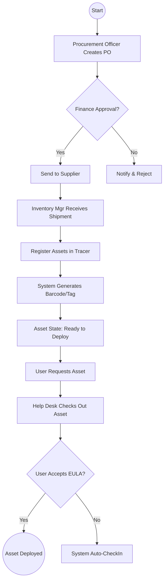
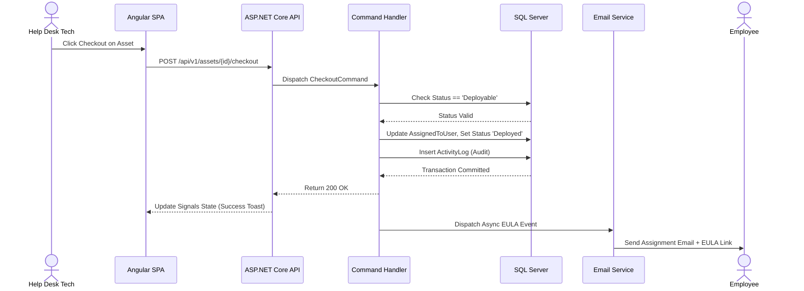
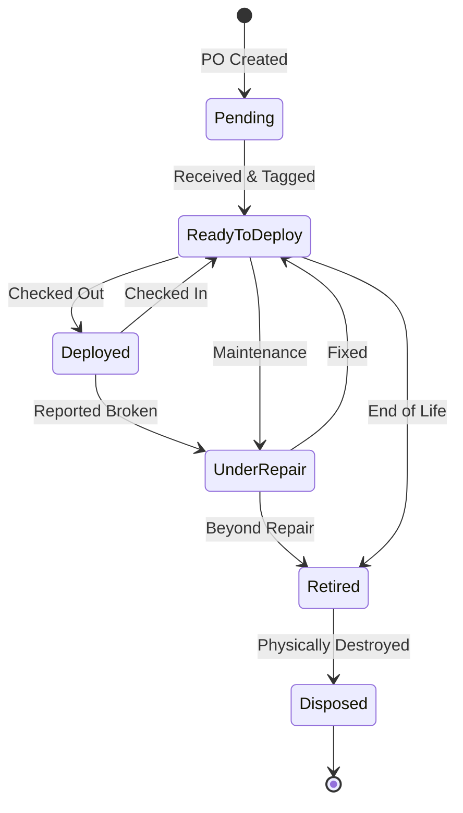
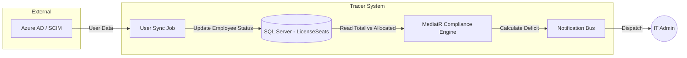
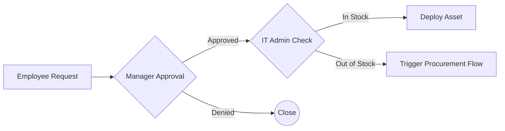

# Enterprise IT Asset Management System (Project Tracer)
## Document 8: Business Workflow Design Document

**Prepared By:** Sakthivel P, Principal Business Architect & Enterprise Solution Architect  
**Document Version:** 1.0  
**References:** Aligned strictly with Docs 1 (BRD), 2 (SRS), 3 (HLD), 4 (DDD), 5 (API), 6 (UI/UX), and 7 (RBAC).  

---

## 1. Executive Summary & Architecture Alignment
This document establishes the exhaustive operational blueprint for Tracer. It details every functional business process, decision matrix, approval routing, and system interaction required to govern the enterprise IT ecosystem. By mapping human interactions (Actors) to system executions (MediatR Commands, API Endpoints, EF Core DB Writes), this document ensures that backend developers, QA engineers, and business analysts have a unified, implementation-ready understanding of system behavior.

---

## 2. Core Enterprise Workflow Diagrams

### 2.1 BPMN-Style Activity Diagram: Asset Procurement to Deployment
This diagram maps the standard lifecycle from PO creation to physical deployment.

### 2.2 Sequence Diagram: Asset Assignment & Notification Flow
Detailed system-level interaction mapping Document 5 (API) and Document 6 (UI).

### 2.3 State Machine Diagram: Core Hardware Lifecycle
Maps to Document 2 (SRS) Status Labels.

### 2.4 Data Flow Diagram (DFD): Software License True-Up
Maps to Document 4 (DDD) and Document 3 (HLD).

### 2.5 Approval Flow Diagram: Hierarchical Authorizations
Maps to Document 7 (RBAC).

---

## 3. Detailed Business Workflows

## Workflow Category: PROCUREMENT

### Asset Procurement

**1. Purpose:** Defines the standardized business process for asset procurement within the Tracer ITAM ecosystem.

**2. Business Objective:** Ensures strict compliance, accurate inventory tracking, and seamless execution of the Procurement lifecycle, minimizing manual errors and audit discrepancies.

**3. Actors:** Procurement Officer, Department Manager.

**4. Trigger:** New budget allocation or hardware request.

**5. Preconditions:** The initiating actor must be authenticated (JWT) and possess the specific RBAC permissions (`PROCUREMENT.EXECUTE`) defined in Document 7. The target entity must exist in a valid state.

**6. Inputs:** Data payload containing contextual IDs (User ID, Entity ID), transactional metadata (Notes, Locations), and an Idempotency-Key.

**7. Validation Rules:** Enforced via ASP.NET Core FluentValidation. Payload must not be null. Constraints (e.g., Target state cannot equal current state) apply. Optimistic concurrency (`rowVersion`) must match.

**8. Step-by-step Process:**
   1. Actor initiates `Asset Procurement` via the Angular UI.
   2. UI dispatches request to `POST /api/v1/procurement`.
   3. API Gateway routes request to the MediatR command handler.
   4. System validates business rules and state machine constraints.
   5. System applies the mutation to the database entity.
   6. Domain event is published to the internal Event Bus.
   7. UI receives HTTP 200/201 and updates local Signals state.

**9. Decision Points:** Does this action require secondary approval based on organizational rules (e.g., asset cost > $1000)? If yes, route to 'Approval Workflows'.

**10. Alternative Flows:** If the entity is locked or under audit, the action is queued for manual IT Admin intervention.

**11. Exception Flows:** Concurrency failure (HTTP 409) -> UI prompts user to refresh. Validation failure (HTTP 400) -> UI highlights erroneous form fields using Problem Details (RFC 7807).

**12. Notifications:** Dispatches standard webhook/email notification to stakeholders defined in Document 2 (SRS).

**13. Audit Log Entries:** Inserts JSON before/after state into `ActivityLogs` (Document 4 DDD).

**14. Database Updates:** EF Core transaction committed against `Assets, ActivityLogs`.

**15. API Calls:** Primary execution via `POST /api/v1/procurement`.

**16. UI Interaction:** Triggered from `Procurement` Data Grid or Detail View (Document 6 UI/UX). A MatDialog confirms execution. A MatSnackBar displays success.

**17. Post Conditions:** The entity state is mutated. Activity log is immutable. Dependent aggregations (e.g., Available count) are recalculated.

**18. Business Rules:** State constraints strictly apply. For example, deployed assets cannot be directly retired without first being checked in.

**19. KPIs:** Execution time (system performance), SLA adherence for process completion.

**20. Security Considerations:** Cross-tenant access strictly prevented via RLS (Row-Level Security) from Document 4. All writes restricted via Policy-Based Authorization from Document 7.

---

### Purchase Order Registration

**1. Purpose:** Defines the standardized business process for purchase order registration within the Tracer ITAM ecosystem.

**2. Business Objective:** Ensures strict compliance, accurate inventory tracking, and seamless execution of the Procurement lifecycle, minimizing manual errors and audit discrepancies.

**3. Actors:** Procurement Officer.

**4. Trigger:** PO approved by Finance.

**5. Preconditions:** The initiating actor must be authenticated (JWT) and possess the specific RBAC permissions (`PROCUREMENT.EXECUTE`) defined in Document 7. The target entity must exist in a valid state.

**6. Inputs:** Data payload containing contextual IDs (User ID, Entity ID), transactional metadata (Notes, Locations), and an Idempotency-Key.

**7. Validation Rules:** Enforced via ASP.NET Core FluentValidation. Payload must not be null. Constraints (e.g., Target state cannot equal current state) apply. Optimistic concurrency (`rowVersion`) must match.

**8. Step-by-step Process:**
   1. Actor initiates `Purchase Order Registration` via the Angular UI.
   2. UI dispatches request to `POST /api/v1/purchase-orders`.
   3. API Gateway routes request to the MediatR command handler.
   4. System validates business rules and state machine constraints.
   5. System applies the mutation to the database entity.
   6. Domain event is published to the internal Event Bus.
   7. UI receives HTTP 200/201 and updates local Signals state.

**9. Decision Points:** Does this action require secondary approval based on organizational rules (e.g., asset cost > $1000)? If yes, route to 'Approval Workflows'.

**10. Alternative Flows:** If the entity is locked or under audit, the action is queued for manual IT Admin intervention.

**11. Exception Flows:** Concurrency failure (HTTP 409) -> UI prompts user to refresh. Validation failure (HTTP 400) -> UI highlights erroneous form fields using Problem Details (RFC 7807).

**12. Notifications:** Dispatches standard webhook/email notification to stakeholders defined in Document 2 (SRS).

**13. Audit Log Entries:** Inserts JSON before/after state into `ActivityLogs` (Document 4 DDD).

**14. Database Updates:** EF Core transaction committed against `ProcurementTable`.

**15. API Calls:** Primary execution via `POST /api/v1/purchase-orders`.

**16. UI Interaction:** Triggered from `Procurement` Data Grid or Detail View (Document 6 UI/UX). A MatDialog confirms execution. A MatSnackBar displays success.

**17. Post Conditions:** The entity state is mutated. Activity log is immutable. Dependent aggregations (e.g., Available count) are recalculated.

**18. Business Rules:** State constraints strictly apply. For example, deployed assets cannot be directly retired without first being checked in.

**19. KPIs:** Execution time (system performance), SLA adherence for process completion.

**20. Security Considerations:** Cross-tenant access strictly prevented via RLS (Row-Level Security) from Document 4. All writes restricted via Policy-Based Authorization from Document 7.

---

### Asset Receiving

**1. Purpose:** Defines the standardized business process for asset receiving within the Tracer ITAM ecosystem.

**2. Business Objective:** Ensures strict compliance, accurate inventory tracking, and seamless execution of the Procurement lifecycle, minimizing manual errors and audit discrepancies.

**3. Actors:** Inventory Manager.

**4. Trigger:** Physical delivery of hardware.

**5. Preconditions:** The initiating actor must be authenticated (JWT) and possess the specific RBAC permissions (`PROCUREMENT.EXECUTE`) defined in Document 7. The target entity must exist in a valid state.

**6. Inputs:** Data payload containing contextual IDs (User ID, Entity ID), transactional metadata (Notes, Locations), and an Idempotency-Key.

**7. Validation Rules:** Enforced via ASP.NET Core FluentValidation. Payload must not be null. Constraints (e.g., Target state cannot equal current state) apply. Optimistic concurrency (`rowVersion`) must match.

**8. Step-by-step Process:**
   1. Actor initiates `Asset Receiving` via the Angular UI.
   2. UI dispatches request to `POST /api/v1/receiving`.
   3. API Gateway routes request to the MediatR command handler.
   4. System validates business rules and state machine constraints.
   5. System applies the mutation to the database entity.
   6. Domain event is published to the internal Event Bus.
   7. UI receives HTTP 200/201 and updates local Signals state.

**9. Decision Points:** Does this action require secondary approval based on organizational rules (e.g., asset cost > $1000)? If yes, route to 'Approval Workflows'.

**10. Alternative Flows:** If the entity is locked or under audit, the action is queued for manual IT Admin intervention.

**11. Exception Flows:** Concurrency failure (HTTP 409) -> UI prompts user to refresh. Validation failure (HTTP 400) -> UI highlights erroneous form fields using Problem Details (RFC 7807).

**12. Notifications:** Dispatches standard webhook/email notification to stakeholders defined in Document 2 (SRS).

**13. Audit Log Entries:** Inserts JSON before/after state into `ActivityLogs` (Document 4 DDD).

**14. Database Updates:** EF Core transaction committed against `Assets, ActivityLogs`.

**15. API Calls:** Primary execution via `POST /api/v1/receiving`.

**16. UI Interaction:** Triggered from `Procurement` Data Grid or Detail View (Document 6 UI/UX). A MatDialog confirms execution. A MatSnackBar displays success.

**17. Post Conditions:** The entity state is mutated. Activity log is immutable. Dependent aggregations (e.g., Available count) are recalculated.

**18. Business Rules:** State constraints strictly apply. For example, deployed assets cannot be directly retired without first being checked in.

**19. KPIs:** Execution time (system performance), SLA adherence for process completion.

**20. Security Considerations:** Cross-tenant access strictly prevented via RLS (Row-Level Security) from Document 4. All writes restricted via Policy-Based Authorization from Document 7.

---

### Asset Registration

**1. Purpose:** Defines the standardized business process for asset registration within the Tracer ITAM ecosystem.

**2. Business Objective:** Ensures strict compliance, accurate inventory tracking, and seamless execution of the Procurement lifecycle, minimizing manual errors and audit discrepancies.

**3. Actors:** Inventory Manager, IT Admin.

**4. Trigger:** Items unboxed and verified.

**5. Preconditions:** The initiating actor must be authenticated (JWT) and possess the specific RBAC permissions (`PROCUREMENT.EXECUTE`) defined in Document 7. The target entity must exist in a valid state.

**6. Inputs:** Data payload containing contextual IDs (User ID, Entity ID), transactional metadata (Notes, Locations), and an Idempotency-Key.

**7. Validation Rules:** Enforced via ASP.NET Core FluentValidation. Payload must not be null. Constraints (e.g., Target state cannot equal current state) apply. Optimistic concurrency (`rowVersion`) must match.

**8. Step-by-step Process:**
   1. Actor initiates `Asset Registration` via the Angular UI.
   2. UI dispatches request to `POST /api/v1/assets`.
   3. API Gateway routes request to the MediatR command handler.
   4. System validates business rules and state machine constraints.
   5. System applies the mutation to the database entity.
   6. Domain event is published to the internal Event Bus.
   7. UI receives HTTP 200/201 and updates local Signals state.

**9. Decision Points:** Does this action require secondary approval based on organizational rules (e.g., asset cost > $1000)? If yes, route to 'Approval Workflows'.

**10. Alternative Flows:** If the entity is locked or under audit, the action is queued for manual IT Admin intervention.

**11. Exception Flows:** Concurrency failure (HTTP 409) -> UI prompts user to refresh. Validation failure (HTTP 400) -> UI highlights erroneous form fields using Problem Details (RFC 7807).

**12. Notifications:** Dispatches standard webhook/email notification to stakeholders defined in Document 2 (SRS).

**13. Audit Log Entries:** Inserts JSON before/after state into `ActivityLogs` (Document 4 DDD).

**14. Database Updates:** EF Core transaction committed against `Assets, ActivityLogs`.

**15. API Calls:** Primary execution via `POST /api/v1/assets`.

**16. UI Interaction:** Triggered from `Procurement` Data Grid or Detail View (Document 6 UI/UX). A MatDialog confirms execution. A MatSnackBar displays success.

**17. Post Conditions:** The entity state is mutated. Activity log is immutable. Dependent aggregations (e.g., Available count) are recalculated.

**18. Business Rules:** State constraints strictly apply. For example, deployed assets cannot be directly retired without first being checked in.

**19. KPIs:** Execution time (system performance), SLA adherence for process completion.

**20. Security Considerations:** Cross-tenant access strictly prevented via RLS (Row-Level Security) from Document 4. All writes restricted via Policy-Based Authorization from Document 7.

---

### Asset Tag Generation

**1. Purpose:** Defines the standardized business process for asset tag generation within the Tracer ITAM ecosystem.

**2. Business Objective:** Ensures strict compliance, accurate inventory tracking, and seamless execution of the Procurement lifecycle, minimizing manual errors and audit discrepancies.

**3. Actors:** System, Inventory Manager.

**4. Trigger:** Asset registered in DB.

**5. Preconditions:** The initiating actor must be authenticated (JWT) and possess the specific RBAC permissions (`PROCUREMENT.EXECUTE`) defined in Document 7. The target entity must exist in a valid state.

**6. Inputs:** Data payload containing contextual IDs (User ID, Entity ID), transactional metadata (Notes, Locations), and an Idempotency-Key.

**7. Validation Rules:** Enforced via ASP.NET Core FluentValidation. Payload must not be null. Constraints (e.g., Target state cannot equal current state) apply. Optimistic concurrency (`rowVersion`) must match.

**8. Step-by-step Process:**
   1. Actor initiates `Asset Tag Generation` via the Angular UI.
   2. UI dispatches request to `POST /api/v1/assets/{id}/tags`.
   3. API Gateway routes request to the MediatR command handler.
   4. System validates business rules and state machine constraints.
   5. System applies the mutation to the database entity.
   6. Domain event is published to the internal Event Bus.
   7. UI receives HTTP 200/201 and updates local Signals state.

**9. Decision Points:** Does this action require secondary approval based on organizational rules (e.g., asset cost > $1000)? If yes, route to 'Approval Workflows'.

**10. Alternative Flows:** If the entity is locked or under audit, the action is queued for manual IT Admin intervention.

**11. Exception Flows:** Concurrency failure (HTTP 409) -> UI prompts user to refresh. Validation failure (HTTP 400) -> UI highlights erroneous form fields using Problem Details (RFC 7807).

**12. Notifications:** Dispatches standard webhook/email notification to stakeholders defined in Document 2 (SRS).

**13. Audit Log Entries:** Inserts JSON before/after state into `ActivityLogs` (Document 4 DDD).

**14. Database Updates:** EF Core transaction committed against `Assets, ActivityLogs`.

**15. API Calls:** Primary execution via `POST /api/v1/assets/{id}/tags`.

**16. UI Interaction:** Triggered from `Procurement` Data Grid or Detail View (Document 6 UI/UX). A MatDialog confirms execution. A MatSnackBar displays success.

**17. Post Conditions:** The entity state is mutated. Activity log is immutable. Dependent aggregations (e.g., Available count) are recalculated.

**18. Business Rules:** State constraints strictly apply. For example, deployed assets cannot be directly retired without first being checked in.

**19. KPIs:** Execution time (system performance), SLA adherence for process completion.

**20. Security Considerations:** Cross-tenant access strictly prevented via RLS (Row-Level Security) from Document 4. All writes restricted via Policy-Based Authorization from Document 7.

---

### Barcode Generation

**1. Purpose:** Defines the standardized business process for barcode generation within the Tracer ITAM ecosystem.

**2. Business Objective:** Ensures strict compliance, accurate inventory tracking, and seamless execution of the Procurement lifecycle, minimizing manual errors and audit discrepancies.

**3. Actors:** System.

**4. Trigger:** Asset Tag assigned.

**5. Preconditions:** The initiating actor must be authenticated (JWT) and possess the specific RBAC permissions (`PROCUREMENT.EXECUTE`) defined in Document 7. The target entity must exist in a valid state.

**6. Inputs:** Data payload containing contextual IDs (User ID, Entity ID), transactional metadata (Notes, Locations), and an Idempotency-Key.

**7. Validation Rules:** Enforced via ASP.NET Core FluentValidation. Payload must not be null. Constraints (e.g., Target state cannot equal current state) apply. Optimistic concurrency (`rowVersion`) must match.

**8. Step-by-step Process:**
   1. Actor initiates `Barcode Generation` via the Angular UI.
   2. UI dispatches request to `GET /api/v1/assets/{id}/barcode`.
   3. API Gateway routes request to the MediatR command handler.
   4. System validates business rules and state machine constraints.
   5. System applies the mutation to the database entity.
   6. Domain event is published to the internal Event Bus.
   7. UI receives HTTP 200/201 and updates local Signals state.

**9. Decision Points:** Does this action require secondary approval based on organizational rules (e.g., asset cost > $1000)? If yes, route to 'Approval Workflows'.

**10. Alternative Flows:** If the entity is locked or under audit, the action is queued for manual IT Admin intervention.

**11. Exception Flows:** Concurrency failure (HTTP 409) -> UI prompts user to refresh. Validation failure (HTTP 400) -> UI highlights erroneous form fields using Problem Details (RFC 7807).

**12. Notifications:** Dispatches standard webhook/email notification to stakeholders defined in Document 2 (SRS).

**13. Audit Log Entries:** Inserts JSON before/after state into `ActivityLogs` (Document 4 DDD).

**14. Database Updates:** EF Core transaction committed against `ProcurementTable`.

**15. API Calls:** Primary execution via `GET /api/v1/assets/{id}/barcode`.

**16. UI Interaction:** Triggered from `Procurement` Data Grid or Detail View (Document 6 UI/UX). A MatDialog confirms execution. A MatSnackBar displays success.

**17. Post Conditions:** The entity state is mutated. Activity log is immutable. Dependent aggregations (e.g., Available count) are recalculated.

**18. Business Rules:** State constraints strictly apply. For example, deployed assets cannot be directly retired without first being checked in.

**19. KPIs:** Execution time (system performance), SLA adherence for process completion.

**20. Security Considerations:** Cross-tenant access strictly prevented via RLS (Row-Level Security) from Document 4. All writes restricted via Policy-Based Authorization from Document 7.

---

### QR Code Generation

**1. Purpose:** Defines the standardized business process for qr code generation within the Tracer ITAM ecosystem.

**2. Business Objective:** Ensures strict compliance, accurate inventory tracking, and seamless execution of the Procurement lifecycle, minimizing manual errors and audit discrepancies.

**3. Actors:** System.

**4. Trigger:** Asset Tag assigned.

**5. Preconditions:** The initiating actor must be authenticated (JWT) and possess the specific RBAC permissions (`PROCUREMENT.EXECUTE`) defined in Document 7. The target entity must exist in a valid state.

**6. Inputs:** Data payload containing contextual IDs (User ID, Entity ID), transactional metadata (Notes, Locations), and an Idempotency-Key.

**7. Validation Rules:** Enforced via ASP.NET Core FluentValidation. Payload must not be null. Constraints (e.g., Target state cannot equal current state) apply. Optimistic concurrency (`rowVersion`) must match.

**8. Step-by-step Process:**
   1. Actor initiates `QR Code Generation` via the Angular UI.
   2. UI dispatches request to `GET /api/v1/assets/{id}/qrcode`.
   3. API Gateway routes request to the MediatR command handler.
   4. System validates business rules and state machine constraints.
   5. System applies the mutation to the database entity.
   6. Domain event is published to the internal Event Bus.
   7. UI receives HTTP 200/201 and updates local Signals state.

**9. Decision Points:** Does this action require secondary approval based on organizational rules (e.g., asset cost > $1000)? If yes, route to 'Approval Workflows'.

**10. Alternative Flows:** If the entity is locked or under audit, the action is queued for manual IT Admin intervention.

**11. Exception Flows:** Concurrency failure (HTTP 409) -> UI prompts user to refresh. Validation failure (HTTP 400) -> UI highlights erroneous form fields using Problem Details (RFC 7807).

**12. Notifications:** Dispatches standard webhook/email notification to stakeholders defined in Document 2 (SRS).

**13. Audit Log Entries:** Inserts JSON before/after state into `ActivityLogs` (Document 4 DDD).

**14. Database Updates:** EF Core transaction committed against `ProcurementTable`.

**15. API Calls:** Primary execution via `GET /api/v1/assets/{id}/qrcode`.

**16. UI Interaction:** Triggered from `Procurement` Data Grid or Detail View (Document 6 UI/UX). A MatDialog confirms execution. A MatSnackBar displays success.

**17. Post Conditions:** The entity state is mutated. Activity log is immutable. Dependent aggregations (e.g., Available count) are recalculated.

**18. Business Rules:** State constraints strictly apply. For example, deployed assets cannot be directly retired without first being checked in.

**19. KPIs:** Execution time (system performance), SLA adherence for process completion.

**20. Security Considerations:** Cross-tenant access strictly prevented via RLS (Row-Level Security) from Document 4. All writes restricted via Policy-Based Authorization from Document 7.

---

## Workflow Category: LIFECYCLE

### Asset Assignment

**1. Purpose:** Defines the standardized business process for asset assignment within the Tracer ITAM ecosystem.

**2. Business Objective:** Ensures strict compliance, accurate inventory tracking, and seamless execution of the Lifecycle lifecycle, minimizing manual errors and audit discrepancies.

**3. Actors:** Help Desk Technician, Employee.

**4. Trigger:** User requests hardware / Onboarding.

**5. Preconditions:** The initiating actor must be authenticated (JWT) and possess the specific RBAC permissions (`LIFECYCLE.EXECUTE`) defined in Document 7. The target entity must exist in a valid state.

**6. Inputs:** Data payload containing contextual IDs (User ID, Entity ID), transactional metadata (Notes, Locations), and an Idempotency-Key.

**7. Validation Rules:** Enforced via ASP.NET Core FluentValidation. Payload must not be null. Constraints (e.g., Target state cannot equal current state) apply. Optimistic concurrency (`rowVersion`) must match.

**8. Step-by-step Process:**
   1. Actor initiates `Asset Assignment` via the Angular UI.
   2. UI dispatches request to `POST /api/v1/assets/{id}/checkout`.
   3. API Gateway routes request to the MediatR command handler.
   4. System validates business rules and state machine constraints.
   5. System applies the mutation to the database entity.
   6. Domain event is published to the internal Event Bus.
   7. UI receives HTTP 200/201 and updates local Signals state.

**9. Decision Points:** Does this action require secondary approval based on organizational rules (e.g., asset cost > $1000)? If yes, route to 'Approval Workflows'.

**10. Alternative Flows:** If the entity is locked or under audit, the action is queued for manual IT Admin intervention.

**11. Exception Flows:** Concurrency failure (HTTP 409) -> UI prompts user to refresh. Validation failure (HTTP 400) -> UI highlights erroneous form fields using Problem Details (RFC 7807).

**12. Notifications:** Dispatches standard webhook/email notification to stakeholders defined in Document 2 (SRS).

**13. Audit Log Entries:** Inserts JSON before/after state into `ActivityLogs` (Document 4 DDD).

**14. Database Updates:** EF Core transaction committed against `Assets, ActivityLogs`.

**15. API Calls:** Primary execution via `POST /api/v1/assets/{id}/checkout`.

**16. UI Interaction:** Triggered from `Lifecycle` Data Grid or Detail View (Document 6 UI/UX). A MatDialog confirms execution. A MatSnackBar displays success.

**17. Post Conditions:** The entity state is mutated. Activity log is immutable. Dependent aggregations (e.g., Available count) are recalculated.

**18. Business Rules:** State constraints strictly apply. For example, deployed assets cannot be directly retired without first being checked in.

**19. KPIs:** Execution time (system performance), SLA adherence for process completion.

**20. Security Considerations:** Cross-tenant access strictly prevented via RLS (Row-Level Security) from Document 4. All writes restricted via Policy-Based Authorization from Document 7.

---

### Asset Acceptance

**1. Purpose:** Defines the standardized business process for asset acceptance within the Tracer ITAM ecosystem.

**2. Business Objective:** Ensures strict compliance, accurate inventory tracking, and seamless execution of the Lifecycle lifecycle, minimizing manual errors and audit discrepancies.

**3. Actors:** Employee, System.

**4. Trigger:** Asset checked out to Employee.

**5. Preconditions:** The initiating actor must be authenticated (JWT) and possess the specific RBAC permissions (`LIFECYCLE.EXECUTE`) defined in Document 7. The target entity must exist in a valid state.

**6. Inputs:** Data payload containing contextual IDs (User ID, Entity ID), transactional metadata (Notes, Locations), and an Idempotency-Key.

**7. Validation Rules:** Enforced via ASP.NET Core FluentValidation. Payload must not be null. Constraints (e.g., Target state cannot equal current state) apply. Optimistic concurrency (`rowVersion`) must match.

**8. Step-by-step Process:**
   1. Actor initiates `Asset Acceptance` via the Angular UI.
   2. UI dispatches request to `POST /api/v1/assets/{id}/accept`.
   3. API Gateway routes request to the MediatR command handler.
   4. System validates business rules and state machine constraints.
   5. System applies the mutation to the database entity.
   6. Domain event is published to the internal Event Bus.
   7. UI receives HTTP 200/201 and updates local Signals state.

**9. Decision Points:** Does this action require secondary approval based on organizational rules (e.g., asset cost > $1000)? If yes, route to 'Approval Workflows'.

**10. Alternative Flows:** If the entity is locked or under audit, the action is queued for manual IT Admin intervention.

**11. Exception Flows:** Concurrency failure (HTTP 409) -> UI prompts user to refresh. Validation failure (HTTP 400) -> UI highlights erroneous form fields using Problem Details (RFC 7807).

**12. Notifications:** Dispatches standard webhook/email notification to stakeholders defined in Document 2 (SRS).

**13. Audit Log Entries:** Inserts JSON before/after state into `ActivityLogs` (Document 4 DDD).

**14. Database Updates:** EF Core transaction committed against `Assets, ActivityLogs`.

**15. API Calls:** Primary execution via `POST /api/v1/assets/{id}/accept`.

**16. UI Interaction:** Triggered from `Lifecycle` Data Grid or Detail View (Document 6 UI/UX). A MatDialog confirms execution. A MatSnackBar displays success.

**17. Post Conditions:** The entity state is mutated. Activity log is immutable. Dependent aggregations (e.g., Available count) are recalculated.

**18. Business Rules:** State constraints strictly apply. For example, deployed assets cannot be directly retired without first being checked in.

**19. KPIs:** Execution time (system performance), SLA adherence for process completion.

**20. Security Considerations:** Cross-tenant access strictly prevented via RLS (Row-Level Security) from Document 4. All writes restricted via Policy-Based Authorization from Document 7.

---

### Asset Reassignment

**1. Purpose:** Defines the standardized business process for asset reassignment within the Tracer ITAM ecosystem.

**2. Business Objective:** Ensures strict compliance, accurate inventory tracking, and seamless execution of the Lifecycle lifecycle, minimizing manual errors and audit discrepancies.

**3. Actors:** Help Desk Technician.

**4. Trigger:** Employee changes role or transfers asset.

**5. Preconditions:** The initiating actor must be authenticated (JWT) and possess the specific RBAC permissions (`LIFECYCLE.EXECUTE`) defined in Document 7. The target entity must exist in a valid state.

**6. Inputs:** Data payload containing contextual IDs (User ID, Entity ID), transactional metadata (Notes, Locations), and an Idempotency-Key.

**7. Validation Rules:** Enforced via ASP.NET Core FluentValidation. Payload must not be null. Constraints (e.g., Target state cannot equal current state) apply. Optimistic concurrency (`rowVersion`) must match.

**8. Step-by-step Process:**
   1. Actor initiates `Asset Reassignment` via the Angular UI.
   2. UI dispatches request to `POST /api/v1/assets/{id}/reassign`.
   3. API Gateway routes request to the MediatR command handler.
   4. System validates business rules and state machine constraints.
   5. System applies the mutation to the database entity.
   6. Domain event is published to the internal Event Bus.
   7. UI receives HTTP 200/201 and updates local Signals state.

**9. Decision Points:** Does this action require secondary approval based on organizational rules (e.g., asset cost > $1000)? If yes, route to 'Approval Workflows'.

**10. Alternative Flows:** If the entity is locked or under audit, the action is queued for manual IT Admin intervention.

**11. Exception Flows:** Concurrency failure (HTTP 409) -> UI prompts user to refresh. Validation failure (HTTP 400) -> UI highlights erroneous form fields using Problem Details (RFC 7807).

**12. Notifications:** Dispatches standard webhook/email notification to stakeholders defined in Document 2 (SRS).

**13. Audit Log Entries:** Inserts JSON before/after state into `ActivityLogs` (Document 4 DDD).

**14. Database Updates:** EF Core transaction committed against `Assets, ActivityLogs`.

**15. API Calls:** Primary execution via `POST /api/v1/assets/{id}/reassign`.

**16. UI Interaction:** Triggered from `Lifecycle` Data Grid or Detail View (Document 6 UI/UX). A MatDialog confirms execution. A MatSnackBar displays success.

**17. Post Conditions:** The entity state is mutated. Activity log is immutable. Dependent aggregations (e.g., Available count) are recalculated.

**18. Business Rules:** State constraints strictly apply. For example, deployed assets cannot be directly retired without first being checked in.

**19. KPIs:** Execution time (system performance), SLA adherence for process completion.

**20. Security Considerations:** Cross-tenant access strictly prevented via RLS (Row-Level Security) from Document 4. All writes restricted via Policy-Based Authorization from Document 7.

---

### Asset Return

**1. Purpose:** Defines the standardized business process for asset return within the Tracer ITAM ecosystem.

**2. Business Objective:** Ensures strict compliance, accurate inventory tracking, and seamless execution of the Lifecycle lifecycle, minimizing manual errors and audit discrepancies.

**3. Actors:** Help Desk Technician, Employee.

**4. Trigger:** Offboarding or hardware upgrade.

**5. Preconditions:** The initiating actor must be authenticated (JWT) and possess the specific RBAC permissions (`LIFECYCLE.EXECUTE`) defined in Document 7. The target entity must exist in a valid state.

**6. Inputs:** Data payload containing contextual IDs (User ID, Entity ID), transactional metadata (Notes, Locations), and an Idempotency-Key.

**7. Validation Rules:** Enforced via ASP.NET Core FluentValidation. Payload must not be null. Constraints (e.g., Target state cannot equal current state) apply. Optimistic concurrency (`rowVersion`) must match.

**8. Step-by-step Process:**
   1. Actor initiates `Asset Return` via the Angular UI.
   2. UI dispatches request to `POST /api/v1/assets/{id}/checkin`.
   3. API Gateway routes request to the MediatR command handler.
   4. System validates business rules and state machine constraints.
   5. System applies the mutation to the database entity.
   6. Domain event is published to the internal Event Bus.
   7. UI receives HTTP 200/201 and updates local Signals state.

**9. Decision Points:** Does this action require secondary approval based on organizational rules (e.g., asset cost > $1000)? If yes, route to 'Approval Workflows'.

**10. Alternative Flows:** If the entity is locked or under audit, the action is queued for manual IT Admin intervention.

**11. Exception Flows:** Concurrency failure (HTTP 409) -> UI prompts user to refresh. Validation failure (HTTP 400) -> UI highlights erroneous form fields using Problem Details (RFC 7807).

**12. Notifications:** Dispatches standard webhook/email notification to stakeholders defined in Document 2 (SRS).

**13. Audit Log Entries:** Inserts JSON before/after state into `ActivityLogs` (Document 4 DDD).

**14. Database Updates:** EF Core transaction committed against `Assets, ActivityLogs`.

**15. API Calls:** Primary execution via `POST /api/v1/assets/{id}/checkin`.

**16. UI Interaction:** Triggered from `Lifecycle` Data Grid or Detail View (Document 6 UI/UX). A MatDialog confirms execution. A MatSnackBar displays success.

**17. Post Conditions:** The entity state is mutated. Activity log is immutable. Dependent aggregations (e.g., Available count) are recalculated.

**18. Business Rules:** State constraints strictly apply. For example, deployed assets cannot be directly retired without first being checked in.

**19. KPIs:** Execution time (system performance), SLA adherence for process completion.

**20. Security Considerations:** Cross-tenant access strictly prevented via RLS (Row-Level Security) from Document 4. All writes restricted via Policy-Based Authorization from Document 7.

---

### Asset Transfer

**1. Purpose:** Defines the standardized business process for asset transfer within the Tracer ITAM ecosystem.

**2. Business Objective:** Ensures strict compliance, accurate inventory tracking, and seamless execution of the Lifecycle lifecycle, minimizing manual errors and audit discrepancies.

**3. Actors:** IT Admin, Location Manager.

**4. Trigger:** Asset moved between geographic locations.

**5. Preconditions:** The initiating actor must be authenticated (JWT) and possess the specific RBAC permissions (`LIFECYCLE.EXECUTE`) defined in Document 7. The target entity must exist in a valid state.

**6. Inputs:** Data payload containing contextual IDs (User ID, Entity ID), transactional metadata (Notes, Locations), and an Idempotency-Key.

**7. Validation Rules:** Enforced via ASP.NET Core FluentValidation. Payload must not be null. Constraints (e.g., Target state cannot equal current state) apply. Optimistic concurrency (`rowVersion`) must match.

**8. Step-by-step Process:**
   1. Actor initiates `Asset Transfer` via the Angular UI.
   2. UI dispatches request to `POST /api/v1/assets/{id}/transfer`.
   3. API Gateway routes request to the MediatR command handler.
   4. System validates business rules and state machine constraints.
   5. System applies the mutation to the database entity.
   6. Domain event is published to the internal Event Bus.
   7. UI receives HTTP 200/201 and updates local Signals state.

**9. Decision Points:** Does this action require secondary approval based on organizational rules (e.g., asset cost > $1000)? If yes, route to 'Approval Workflows'.

**10. Alternative Flows:** If the entity is locked or under audit, the action is queued for manual IT Admin intervention.

**11. Exception Flows:** Concurrency failure (HTTP 409) -> UI prompts user to refresh. Validation failure (HTTP 400) -> UI highlights erroneous form fields using Problem Details (RFC 7807).

**12. Notifications:** Dispatches standard webhook/email notification to stakeholders defined in Document 2 (SRS).

**13. Audit Log Entries:** Inserts JSON before/after state into `ActivityLogs` (Document 4 DDD).

**14. Database Updates:** EF Core transaction committed against `Assets, ActivityLogs`.

**15. API Calls:** Primary execution via `POST /api/v1/assets/{id}/transfer`.

**16. UI Interaction:** Triggered from `Lifecycle` Data Grid or Detail View (Document 6 UI/UX). A MatDialog confirms execution. A MatSnackBar displays success.

**17. Post Conditions:** The entity state is mutated. Activity log is immutable. Dependent aggregations (e.g., Available count) are recalculated.

**18. Business Rules:** State constraints strictly apply. For example, deployed assets cannot be directly retired without first being checked in.

**19. KPIs:** Execution time (system performance), SLA adherence for process completion.

**20. Security Considerations:** Cross-tenant access strictly prevented via RLS (Row-Level Security) from Document 4. All writes restricted via Policy-Based Authorization from Document 7.

---

## Workflow Category: MAINTENANCE

### Asset Maintenance

**1. Purpose:** Defines the standardized business process for asset maintenance within the Tracer ITAM ecosystem.

**2. Business Objective:** Ensures strict compliance, accurate inventory tracking, and seamless execution of the Maintenance lifecycle, minimizing manual errors and audit discrepancies.

**3. Actors:** Help Desk Technician, System.

**4. Trigger:** Hardware failure reported.

**5. Preconditions:** The initiating actor must be authenticated (JWT) and possess the specific RBAC permissions (`MAINTENANCE.EXECUTE`) defined in Document 7. The target entity must exist in a valid state.

**6. Inputs:** Data payload containing contextual IDs (User ID, Entity ID), transactional metadata (Notes, Locations), and an Idempotency-Key.

**7. Validation Rules:** Enforced via ASP.NET Core FluentValidation. Payload must not be null. Constraints (e.g., Target state cannot equal current state) apply. Optimistic concurrency (`rowVersion`) must match.

**8. Step-by-step Process:**
   1. Actor initiates `Asset Maintenance` via the Angular UI.
   2. UI dispatches request to `POST /api/v1/maintenance`.
   3. API Gateway routes request to the MediatR command handler.
   4. System validates business rules and state machine constraints.
   5. System applies the mutation to the database entity.
   6. Domain event is published to the internal Event Bus.
   7. UI receives HTTP 200/201 and updates local Signals state.

**9. Decision Points:** Does this action require secondary approval based on organizational rules (e.g., asset cost > $1000)? If yes, route to 'Approval Workflows'.

**10. Alternative Flows:** If the entity is locked or under audit, the action is queued for manual IT Admin intervention.

**11. Exception Flows:** Concurrency failure (HTTP 409) -> UI prompts user to refresh. Validation failure (HTTP 400) -> UI highlights erroneous form fields using Problem Details (RFC 7807).

**12. Notifications:** Dispatches standard webhook/email notification to stakeholders defined in Document 2 (SRS).

**13. Audit Log Entries:** Inserts JSON before/after state into `ActivityLogs` (Document 4 DDD).

**14. Database Updates:** EF Core transaction committed against `Assets, ActivityLogs`.

**15. API Calls:** Primary execution via `POST /api/v1/maintenance`.

**16. UI Interaction:** Triggered from `Maintenance` Data Grid or Detail View (Document 6 UI/UX). A MatDialog confirms execution. A MatSnackBar displays success.

**17. Post Conditions:** The entity state is mutated. Activity log is immutable. Dependent aggregations (e.g., Available count) are recalculated.

**18. Business Rules:** State constraints strictly apply. For example, deployed assets cannot be directly retired without first being checked in.

**19. KPIs:** Execution time (system performance), SLA adherence for process completion.

**20. Security Considerations:** Cross-tenant access strictly prevented via RLS (Row-Level Security) from Document 4. All writes restricted via Policy-Based Authorization from Document 7.

---

### Asset Repair

**1. Purpose:** Defines the standardized business process for asset repair within the Tracer ITAM ecosystem.

**2. Business Objective:** Ensures strict compliance, accurate inventory tracking, and seamless execution of the Maintenance lifecycle, minimizing manual errors and audit discrepancies.

**3. Actors:** IT Admin, External Supplier.

**4. Trigger:** Maintenance logged and approved.

**5. Preconditions:** The initiating actor must be authenticated (JWT) and possess the specific RBAC permissions (`MAINTENANCE.EXECUTE`) defined in Document 7. The target entity must exist in a valid state.

**6. Inputs:** Data payload containing contextual IDs (User ID, Entity ID), transactional metadata (Notes, Locations), and an Idempotency-Key.

**7. Validation Rules:** Enforced via ASP.NET Core FluentValidation. Payload must not be null. Constraints (e.g., Target state cannot equal current state) apply. Optimistic concurrency (`rowVersion`) must match.

**8. Step-by-step Process:**
   1. Actor initiates `Asset Repair` via the Angular UI.
   2. UI dispatches request to `PUT /api/v1/maintenance/{id}/repair`.
   3. API Gateway routes request to the MediatR command handler.
   4. System validates business rules and state machine constraints.
   5. System applies the mutation to the database entity.
   6. Domain event is published to the internal Event Bus.
   7. UI receives HTTP 200/201 and updates local Signals state.

**9. Decision Points:** Does this action require secondary approval based on organizational rules (e.g., asset cost > $1000)? If yes, route to 'Approval Workflows'.

**10. Alternative Flows:** If the entity is locked or under audit, the action is queued for manual IT Admin intervention.

**11. Exception Flows:** Concurrency failure (HTTP 409) -> UI prompts user to refresh. Validation failure (HTTP 400) -> UI highlights erroneous form fields using Problem Details (RFC 7807).

**12. Notifications:** Dispatches standard webhook/email notification to stakeholders defined in Document 2 (SRS).

**13. Audit Log Entries:** Inserts JSON before/after state into `ActivityLogs` (Document 4 DDD).

**14. Database Updates:** EF Core transaction committed against `Assets, ActivityLogs`.

**15. API Calls:** Primary execution via `PUT /api/v1/maintenance/{id}/repair`.

**16. UI Interaction:** Triggered from `Maintenance` Data Grid or Detail View (Document 6 UI/UX). A MatDialog confirms execution. A MatSnackBar displays success.

**17. Post Conditions:** The entity state is mutated. Activity log is immutable. Dependent aggregations (e.g., Available count) are recalculated.

**18. Business Rules:** State constraints strictly apply. For example, deployed assets cannot be directly retired without first being checked in.

**19. KPIs:** Execution time (system performance), SLA adherence for process completion.

**20. Security Considerations:** Cross-tenant access strictly prevented via RLS (Row-Level Security) from Document 4. All writes restricted via Policy-Based Authorization from Document 7.

---

### Warranty Claim

**1. Purpose:** Defines the standardized business process for warranty claim within the Tracer ITAM ecosystem.

**2. Business Objective:** Ensures strict compliance, accurate inventory tracking, and seamless execution of the Maintenance lifecycle, minimizing manual errors and audit discrepancies.

**3. Actors:** IT Admin.

**4. Trigger:** Repair qualifies under active warranty.

**5. Preconditions:** The initiating actor must be authenticated (JWT) and possess the specific RBAC permissions (`MAINTENANCE.EXECUTE`) defined in Document 7. The target entity must exist in a valid state.

**6. Inputs:** Data payload containing contextual IDs (User ID, Entity ID), transactional metadata (Notes, Locations), and an Idempotency-Key.

**7. Validation Rules:** Enforced via ASP.NET Core FluentValidation. Payload must not be null. Constraints (e.g., Target state cannot equal current state) apply. Optimistic concurrency (`rowVersion`) must match.

**8. Step-by-step Process:**
   1. Actor initiates `Warranty Claim` via the Angular UI.
   2. UI dispatches request to `POST /api/v1/maintenance/warranty`.
   3. API Gateway routes request to the MediatR command handler.
   4. System validates business rules and state machine constraints.
   5. System applies the mutation to the database entity.
   6. Domain event is published to the internal Event Bus.
   7. UI receives HTTP 200/201 and updates local Signals state.

**9. Decision Points:** Does this action require secondary approval based on organizational rules (e.g., asset cost > $1000)? If yes, route to 'Approval Workflows'.

**10. Alternative Flows:** If the entity is locked or under audit, the action is queued for manual IT Admin intervention.

**11. Exception Flows:** Concurrency failure (HTTP 409) -> UI prompts user to refresh. Validation failure (HTTP 400) -> UI highlights erroneous form fields using Problem Details (RFC 7807).

**12. Notifications:** Dispatches standard webhook/email notification to stakeholders defined in Document 2 (SRS).

**13. Audit Log Entries:** Inserts JSON before/after state into `ActivityLogs` (Document 4 DDD).

**14. Database Updates:** EF Core transaction committed against `MaintenanceTable`.

**15. API Calls:** Primary execution via `POST /api/v1/maintenance/warranty`.

**16. UI Interaction:** Triggered from `Maintenance` Data Grid or Detail View (Document 6 UI/UX). A MatDialog confirms execution. A MatSnackBar displays success.

**17. Post Conditions:** The entity state is mutated. Activity log is immutable. Dependent aggregations (e.g., Available count) are recalculated.

**18. Business Rules:** State constraints strictly apply. For example, deployed assets cannot be directly retired without first being checked in.

**19. KPIs:** Execution time (system performance), SLA adherence for process completion.

**20. Security Considerations:** Cross-tenant access strictly prevented via RLS (Row-Level Security) from Document 4. All writes restricted via Policy-Based Authorization from Document 7.

---

### Scheduled Maintenance

**1. Purpose:** Defines the standardized business process for scheduled maintenance within the Tracer ITAM ecosystem.

**2. Business Objective:** Ensures strict compliance, accurate inventory tracking, and seamless execution of the Maintenance lifecycle, minimizing manual errors and audit discrepancies.

**3. Actors:** System (Cron Job), IT Admin.

**4. Trigger:** Time-based trigger reached (e.g., 6 months).

**5. Preconditions:** The initiating actor must be authenticated (JWT) and possess the specific RBAC permissions (`MAINTENANCE.EXECUTE`) defined in Document 7. The target entity must exist in a valid state.

**6. Inputs:** Data payload containing contextual IDs (User ID, Entity ID), transactional metadata (Notes, Locations), and an Idempotency-Key.

**7. Validation Rules:** Enforced via ASP.NET Core FluentValidation. Payload must not be null. Constraints (e.g., Target state cannot equal current state) apply. Optimistic concurrency (`rowVersion`) must match.

**8. Step-by-step Process:**
   1. Actor initiates `Scheduled Maintenance` via the Angular UI.
   2. UI dispatches request to `POST /api/v1/jobs/scheduled-maintenance`.
   3. API Gateway routes request to the MediatR command handler.
   4. System validates business rules and state machine constraints.
   5. System applies the mutation to the database entity.
   6. Domain event is published to the internal Event Bus.
   7. UI receives HTTP 200/201 and updates local Signals state.

**9. Decision Points:** Does this action require secondary approval based on organizational rules (e.g., asset cost > $1000)? If yes, route to 'Approval Workflows'.

**10. Alternative Flows:** If the entity is locked or under audit, the action is queued for manual IT Admin intervention.

**11. Exception Flows:** Concurrency failure (HTTP 409) -> UI prompts user to refresh. Validation failure (HTTP 400) -> UI highlights erroneous form fields using Problem Details (RFC 7807).

**12. Notifications:** Dispatches standard webhook/email notification to stakeholders defined in Document 2 (SRS).

**13. Audit Log Entries:** Inserts JSON before/after state into `ActivityLogs` (Document 4 DDD).

**14. Database Updates:** EF Core transaction committed against `Maintenance, Assets`.

**15. API Calls:** Primary execution via `POST /api/v1/jobs/scheduled-maintenance`.

**16. UI Interaction:** Triggered from `Maintenance` Data Grid or Detail View (Document 6 UI/UX). A MatDialog confirms execution. A MatSnackBar displays success.

**17. Post Conditions:** The entity state is mutated. Activity log is immutable. Dependent aggregations (e.g., Available count) are recalculated.

**18. Business Rules:** State constraints strictly apply. For example, deployed assets cannot be directly retired without first being checked in.

**19. KPIs:** Execution time (system performance), SLA adherence for process completion.

**20. Security Considerations:** Cross-tenant access strictly prevented via RLS (Row-Level Security) from Document 4. All writes restricted via Policy-Based Authorization from Document 7.

---

### Preventive Maintenance

**1. Purpose:** Defines the standardized business process for preventive maintenance within the Tracer ITAM ecosystem.

**2. Business Objective:** Ensures strict compliance, accurate inventory tracking, and seamless execution of the Maintenance lifecycle, minimizing manual errors and audit discrepancies.

**3. Actors:** System.

**4. Trigger:** Usage threshold exceeded.

**5. Preconditions:** The initiating actor must be authenticated (JWT) and possess the specific RBAC permissions (`MAINTENANCE.EXECUTE`) defined in Document 7. The target entity must exist in a valid state.

**6. Inputs:** Data payload containing contextual IDs (User ID, Entity ID), transactional metadata (Notes, Locations), and an Idempotency-Key.

**7. Validation Rules:** Enforced via ASP.NET Core FluentValidation. Payload must not be null. Constraints (e.g., Target state cannot equal current state) apply. Optimistic concurrency (`rowVersion`) must match.

**8. Step-by-step Process:**
   1. Actor initiates `Preventive Maintenance` via the Angular UI.
   2. UI dispatches request to `POST /api/v1/jobs/preventive`.
   3. API Gateway routes request to the MediatR command handler.
   4. System validates business rules and state machine constraints.
   5. System applies the mutation to the database entity.
   6. Domain event is published to the internal Event Bus.
   7. UI receives HTTP 200/201 and updates local Signals state.

**9. Decision Points:** Does this action require secondary approval based on organizational rules (e.g., asset cost > $1000)? If yes, route to 'Approval Workflows'.

**10. Alternative Flows:** If the entity is locked or under audit, the action is queued for manual IT Admin intervention.

**11. Exception Flows:** Concurrency failure (HTTP 409) -> UI prompts user to refresh. Validation failure (HTTP 400) -> UI highlights erroneous form fields using Problem Details (RFC 7807).

**12. Notifications:** Dispatches standard webhook/email notification to stakeholders defined in Document 2 (SRS).

**13. Audit Log Entries:** Inserts JSON before/after state into `ActivityLogs` (Document 4 DDD).

**14. Database Updates:** EF Core transaction committed against `Maintenance, Assets`.

**15. API Calls:** Primary execution via `POST /api/v1/jobs/preventive`.

**16. UI Interaction:** Triggered from `Maintenance` Data Grid or Detail View (Document 6 UI/UX). A MatDialog confirms execution. A MatSnackBar displays success.

**17. Post Conditions:** The entity state is mutated. Activity log is immutable. Dependent aggregations (e.g., Available count) are recalculated.

**18. Business Rules:** State constraints strictly apply. For example, deployed assets cannot be directly retired without first being checked in.

**19. KPIs:** Execution time (system performance), SLA adherence for process completion.

**20. Security Considerations:** Cross-tenant access strictly prevented via RLS (Row-Level Security) from Document 4. All writes restricted via Policy-Based Authorization from Document 7.

---

### Asset Audit

**1. Purpose:** Defines the standardized business process for asset audit within the Tracer ITAM ecosystem.

**2. Business Objective:** Ensures strict compliance, accurate inventory tracking, and seamless execution of the Maintenance lifecycle, minimizing manual errors and audit discrepancies.

**3. Actors:** Auditor, IT Admin.

**4. Trigger:** Annual compliance check initiated.

**5. Preconditions:** The initiating actor must be authenticated (JWT) and possess the specific RBAC permissions (`MAINTENANCE.EXECUTE`) defined in Document 7. The target entity must exist in a valid state.

**6. Inputs:** Data payload containing contextual IDs (User ID, Entity ID), transactional metadata (Notes, Locations), and an Idempotency-Key.

**7. Validation Rules:** Enforced via ASP.NET Core FluentValidation. Payload must not be null. Constraints (e.g., Target state cannot equal current state) apply. Optimistic concurrency (`rowVersion`) must match.

**8. Step-by-step Process:**
   1. Actor initiates `Asset Audit` via the Angular UI.
   2. UI dispatches request to `POST /api/v1/audits`.
   3. API Gateway routes request to the MediatR command handler.
   4. System validates business rules and state machine constraints.
   5. System applies the mutation to the database entity.
   6. Domain event is published to the internal Event Bus.
   7. UI receives HTTP 200/201 and updates local Signals state.

**9. Decision Points:** Does this action require secondary approval based on organizational rules (e.g., asset cost > $1000)? If yes, route to 'Approval Workflows'.

**10. Alternative Flows:** If the entity is locked or under audit, the action is queued for manual IT Admin intervention.

**11. Exception Flows:** Concurrency failure (HTTP 409) -> UI prompts user to refresh. Validation failure (HTTP 400) -> UI highlights erroneous form fields using Problem Details (RFC 7807).

**12. Notifications:** Dispatches standard webhook/email notification to stakeholders defined in Document 2 (SRS).

**13. Audit Log Entries:** Inserts JSON before/after state into `ActivityLogs` (Document 4 DDD).

**14. Database Updates:** EF Core transaction committed against `Assets, ActivityLogs`.

**15. API Calls:** Primary execution via `POST /api/v1/audits`.

**16. UI Interaction:** Triggered from `Maintenance` Data Grid or Detail View (Document 6 UI/UX). A MatDialog confirms execution. A MatSnackBar displays success.

**17. Post Conditions:** The entity state is mutated. Activity log is immutable. Dependent aggregations (e.g., Available count) are recalculated.

**18. Business Rules:** State constraints strictly apply. For example, deployed assets cannot be directly retired without first being checked in.

**19. KPIs:** Execution time (system performance), SLA adherence for process completion.

**20. Security Considerations:** Cross-tenant access strictly prevented via RLS (Row-Level Security) from Document 4. All writes restricted via Policy-Based Authorization from Document 7.

---

### Physical Verification

**1. Purpose:** Defines the standardized business process for physical verification within the Tracer ITAM ecosystem.

**2. Business Objective:** Ensures strict compliance, accurate inventory tracking, and seamless execution of the Maintenance lifecycle, minimizing manual errors and audit discrepancies.

**3. Actors:** Inventory Manager.

**4. Trigger:** Location audit scheduled.

**5. Preconditions:** The initiating actor must be authenticated (JWT) and possess the specific RBAC permissions (`MAINTENANCE.EXECUTE`) defined in Document 7. The target entity must exist in a valid state.

**6. Inputs:** Data payload containing contextual IDs (User ID, Entity ID), transactional metadata (Notes, Locations), and an Idempotency-Key.

**7. Validation Rules:** Enforced via ASP.NET Core FluentValidation. Payload must not be null. Constraints (e.g., Target state cannot equal current state) apply. Optimistic concurrency (`rowVersion`) must match.

**8. Step-by-step Process:**
   1. Actor initiates `Physical Verification` via the Angular UI.
   2. UI dispatches request to `POST /api/v1/audits/{id}/verify`.
   3. API Gateway routes request to the MediatR command handler.
   4. System validates business rules and state machine constraints.
   5. System applies the mutation to the database entity.
   6. Domain event is published to the internal Event Bus.
   7. UI receives HTTP 200/201 and updates local Signals state.

**9. Decision Points:** Does this action require secondary approval based on organizational rules (e.g., asset cost > $1000)? If yes, route to 'Approval Workflows'.

**10. Alternative Flows:** If the entity is locked or under audit, the action is queued for manual IT Admin intervention.

**11. Exception Flows:** Concurrency failure (HTTP 409) -> UI prompts user to refresh. Validation failure (HTTP 400) -> UI highlights erroneous form fields using Problem Details (RFC 7807).

**12. Notifications:** Dispatches standard webhook/email notification to stakeholders defined in Document 2 (SRS).

**13. Audit Log Entries:** Inserts JSON before/after state into `ActivityLogs` (Document 4 DDD).

**14. Database Updates:** EF Core transaction committed against `MaintenanceTable`.

**15. API Calls:** Primary execution via `POST /api/v1/audits/{id}/verify`.

**16. UI Interaction:** Triggered from `Maintenance` Data Grid or Detail View (Document 6 UI/UX). A MatDialog confirms execution. A MatSnackBar displays success.

**17. Post Conditions:** The entity state is mutated. Activity log is immutable. Dependent aggregations (e.g., Available count) are recalculated.

**18. Business Rules:** State constraints strictly apply. For example, deployed assets cannot be directly retired without first being checked in.

**19. KPIs:** Execution time (system performance), SLA adherence for process completion.

**20. Security Considerations:** Cross-tenant access strictly prevented via RLS (Row-Level Security) from Document 4. All writes restricted via Policy-Based Authorization from Document 7.

---

## Workflow Category: END OF LIFE

### Asset Retirement

**1. Purpose:** Defines the standardized business process for asset retirement within the Tracer ITAM ecosystem.

**2. Business Objective:** Ensures strict compliance, accurate inventory tracking, and seamless execution of the End of Life lifecycle, minimizing manual errors and audit discrepancies.

**3. Actors:** Asset Manager.

**4. Trigger:** Hardware reaches End of Life (EOL).

**5. Preconditions:** The initiating actor must be authenticated (JWT) and possess the specific RBAC permissions (`END OF LIFE.EXECUTE`) defined in Document 7. The target entity must exist in a valid state.

**6. Inputs:** Data payload containing contextual IDs (User ID, Entity ID), transactional metadata (Notes, Locations), and an Idempotency-Key.

**7. Validation Rules:** Enforced via ASP.NET Core FluentValidation. Payload must not be null. Constraints (e.g., Target state cannot equal current state) apply. Optimistic concurrency (`rowVersion`) must match.

**8. Step-by-step Process:**
   1. Actor initiates `Asset Retirement` via the Angular UI.
   2. UI dispatches request to `POST /api/v1/assets/{id}/retire`.
   3. API Gateway routes request to the MediatR command handler.
   4. System validates business rules and state machine constraints.
   5. System applies the mutation to the database entity.
   6. Domain event is published to the internal Event Bus.
   7. UI receives HTTP 200/201 and updates local Signals state.

**9. Decision Points:** Does this action require secondary approval based on organizational rules (e.g., asset cost > $1000)? If yes, route to 'Approval Workflows'.

**10. Alternative Flows:** If the entity is locked or under audit, the action is queued for manual IT Admin intervention.

**11. Exception Flows:** Concurrency failure (HTTP 409) -> UI prompts user to refresh. Validation failure (HTTP 400) -> UI highlights erroneous form fields using Problem Details (RFC 7807).

**12. Notifications:** Dispatches standard webhook/email notification to stakeholders defined in Document 2 (SRS).

**13. Audit Log Entries:** Inserts JSON before/after state into `ActivityLogs` (Document 4 DDD).

**14. Database Updates:** EF Core transaction committed against `Assets, ActivityLogs`.

**15. API Calls:** Primary execution via `POST /api/v1/assets/{id}/retire`.

**16. UI Interaction:** Triggered from `End of Life` Data Grid or Detail View (Document 6 UI/UX). A MatDialog confirms execution. A MatSnackBar displays success.

**17. Post Conditions:** The entity state is mutated. Activity log is immutable. Dependent aggregations (e.g., Available count) are recalculated.

**18. Business Rules:** State constraints strictly apply. For example, deployed assets cannot be directly retired without first being checked in.

**19. KPIs:** Execution time (system performance), SLA adherence for process completion.

**20. Security Considerations:** Cross-tenant access strictly prevented via RLS (Row-Level Security) from Document 4. All writes restricted via Policy-Based Authorization from Document 7.

---

### Asset Disposal

**1. Purpose:** Defines the standardized business process for asset disposal within the Tracer ITAM ecosystem.

**2. Business Objective:** Ensures strict compliance, accurate inventory tracking, and seamless execution of the End of Life lifecycle, minimizing manual errors and audit discrepancies.

**3. Actors:** Asset Manager, Finance Officer.

**4. Trigger:** Retired asset physically destroyed.

**5. Preconditions:** The initiating actor must be authenticated (JWT) and possess the specific RBAC permissions (`END OF LIFE.EXECUTE`) defined in Document 7. The target entity must exist in a valid state.

**6. Inputs:** Data payload containing contextual IDs (User ID, Entity ID), transactional metadata (Notes, Locations), and an Idempotency-Key.

**7. Validation Rules:** Enforced via ASP.NET Core FluentValidation. Payload must not be null. Constraints (e.g., Target state cannot equal current state) apply. Optimistic concurrency (`rowVersion`) must match.

**8. Step-by-step Process:**
   1. Actor initiates `Asset Disposal` via the Angular UI.
   2. UI dispatches request to `POST /api/v1/assets/{id}/dispose`.
   3. API Gateway routes request to the MediatR command handler.
   4. System validates business rules and state machine constraints.
   5. System applies the mutation to the database entity.
   6. Domain event is published to the internal Event Bus.
   7. UI receives HTTP 200/201 and updates local Signals state.

**9. Decision Points:** Does this action require secondary approval based on organizational rules (e.g., asset cost > $1000)? If yes, route to 'Approval Workflows'.

**10. Alternative Flows:** If the entity is locked or under audit, the action is queued for manual IT Admin intervention.

**11. Exception Flows:** Concurrency failure (HTTP 409) -> UI prompts user to refresh. Validation failure (HTTP 400) -> UI highlights erroneous form fields using Problem Details (RFC 7807).

**12. Notifications:** Dispatches standard webhook/email notification to stakeholders defined in Document 2 (SRS).

**13. Audit Log Entries:** Inserts JSON before/after state into `ActivityLogs` (Document 4 DDD).

**14. Database Updates:** EF Core transaction committed against `Assets, ActivityLogs`.

**15. API Calls:** Primary execution via `POST /api/v1/assets/{id}/dispose`.

**16. UI Interaction:** Triggered from `End of Life` Data Grid or Detail View (Document 6 UI/UX). A MatDialog confirms execution. A MatSnackBar displays success.

**17. Post Conditions:** The entity state is mutated. Activity log is immutable. Dependent aggregations (e.g., Available count) are recalculated.

**18. Business Rules:** State constraints strictly apply. For example, deployed assets cannot be directly retired without first being checked in.

**19. KPIs:** Execution time (system performance), SLA adherence for process completion.

**20. Security Considerations:** Cross-tenant access strictly prevented via RLS (Row-Level Security) from Document 4. All writes restricted via Policy-Based Authorization from Document 7.

---

### Asset Archiving

**1. Purpose:** Defines the standardized business process for asset archiving within the Tracer ITAM ecosystem.

**2. Business Objective:** Ensures strict compliance, accurate inventory tracking, and seamless execution of the End of Life lifecycle, minimizing manual errors and audit discrepancies.

**3. Actors:** System Admin.

**4. Trigger:** Asset record no longer actively queried.

**5. Preconditions:** The initiating actor must be authenticated (JWT) and possess the specific RBAC permissions (`END OF LIFE.EXECUTE`) defined in Document 7. The target entity must exist in a valid state.

**6. Inputs:** Data payload containing contextual IDs (User ID, Entity ID), transactional metadata (Notes, Locations), and an Idempotency-Key.

**7. Validation Rules:** Enforced via ASP.NET Core FluentValidation. Payload must not be null. Constraints (e.g., Target state cannot equal current state) apply. Optimistic concurrency (`rowVersion`) must match.

**8. Step-by-step Process:**
   1. Actor initiates `Asset Archiving` via the Angular UI.
   2. UI dispatches request to `PUT /api/v1/assets/{id}/archive`.
   3. API Gateway routes request to the MediatR command handler.
   4. System validates business rules and state machine constraints.
   5. System applies the mutation to the database entity.
   6. Domain event is published to the internal Event Bus.
   7. UI receives HTTP 200/201 and updates local Signals state.

**9. Decision Points:** Does this action require secondary approval based on organizational rules (e.g., asset cost > $1000)? If yes, route to 'Approval Workflows'.

**10. Alternative Flows:** If the entity is locked or under audit, the action is queued for manual IT Admin intervention.

**11. Exception Flows:** Concurrency failure (HTTP 409) -> UI prompts user to refresh. Validation failure (HTTP 400) -> UI highlights erroneous form fields using Problem Details (RFC 7807).

**12. Notifications:** Dispatches standard webhook/email notification to stakeholders defined in Document 2 (SRS).

**13. Audit Log Entries:** Inserts JSON before/after state into `ActivityLogs` (Document 4 DDD).

**14. Database Updates:** EF Core transaction committed against `Assets, ActivityLogs`.

**15. API Calls:** Primary execution via `PUT /api/v1/assets/{id}/archive`.

**16. UI Interaction:** Triggered from `End of Life` Data Grid or Detail View (Document 6 UI/UX). A MatDialog confirms execution. A MatSnackBar displays success.

**17. Post Conditions:** The entity state is mutated. Activity log is immutable. Dependent aggregations (e.g., Available count) are recalculated.

**18. Business Rules:** State constraints strictly apply. For example, deployed assets cannot be directly retired without first being checked in.

**19. KPIs:** Execution time (system performance), SLA adherence for process completion.

**20. Security Considerations:** Cross-tenant access strictly prevented via RLS (Row-Level Security) from Document 4. All writes restricted via Policy-Based Authorization from Document 7.

---

### Asset Restoration

**1. Purpose:** Defines the standardized business process for asset restoration within the Tracer ITAM ecosystem.

**2. Business Objective:** Ensures strict compliance, accurate inventory tracking, and seamless execution of the End of Life lifecycle, minimizing manual errors and audit discrepancies.

**3. Actors:** System Admin.

**4. Trigger:** Archived asset needs to be reactivated.

**5. Preconditions:** The initiating actor must be authenticated (JWT) and possess the specific RBAC permissions (`END OF LIFE.EXECUTE`) defined in Document 7. The target entity must exist in a valid state.

**6. Inputs:** Data payload containing contextual IDs (User ID, Entity ID), transactional metadata (Notes, Locations), and an Idempotency-Key.

**7. Validation Rules:** Enforced via ASP.NET Core FluentValidation. Payload must not be null. Constraints (e.g., Target state cannot equal current state) apply. Optimistic concurrency (`rowVersion`) must match.

**8. Step-by-step Process:**
   1. Actor initiates `Asset Restoration` via the Angular UI.
   2. UI dispatches request to `PUT /api/v1/assets/{id}/restore`.
   3. API Gateway routes request to the MediatR command handler.
   4. System validates business rules and state machine constraints.
   5. System applies the mutation to the database entity.
   6. Domain event is published to the internal Event Bus.
   7. UI receives HTTP 200/201 and updates local Signals state.

**9. Decision Points:** Does this action require secondary approval based on organizational rules (e.g., asset cost > $1000)? If yes, route to 'Approval Workflows'.

**10. Alternative Flows:** If the entity is locked or under audit, the action is queued for manual IT Admin intervention.

**11. Exception Flows:** Concurrency failure (HTTP 409) -> UI prompts user to refresh. Validation failure (HTTP 400) -> UI highlights erroneous form fields using Problem Details (RFC 7807).

**12. Notifications:** Dispatches standard webhook/email notification to stakeholders defined in Document 2 (SRS).

**13. Audit Log Entries:** Inserts JSON before/after state into `ActivityLogs` (Document 4 DDD).

**14. Database Updates:** EF Core transaction committed against `Assets, ActivityLogs`.

**15. API Calls:** Primary execution via `PUT /api/v1/assets/{id}/restore`.

**16. UI Interaction:** Triggered from `End of Life` Data Grid or Detail View (Document 6 UI/UX). A MatDialog confirms execution. A MatSnackBar displays success.

**17. Post Conditions:** The entity state is mutated. Activity log is immutable. Dependent aggregations (e.g., Available count) are recalculated.

**18. Business Rules:** State constraints strictly apply. For example, deployed assets cannot be directly retired without first being checked in.

**19. KPIs:** Execution time (system performance), SLA adherence for process completion.

**20. Security Considerations:** Cross-tenant access strictly prevented via RLS (Row-Level Security) from Document 4. All writes restricted via Policy-Based Authorization from Document 7.

---

## Workflow Category: LICENSES

### License Purchase

**1. Purpose:** Defines the standardized business process for license purchase within the Tracer ITAM ecosystem.

**2. Business Objective:** Ensures strict compliance, accurate inventory tracking, and seamless execution of the Licenses lifecycle, minimizing manual errors and audit discrepancies.

**3. Actors:** IT Admin, Procurement Officer.

**4. Trigger:** SaaS or Perpetual License procured.

**5. Preconditions:** The initiating actor must be authenticated (JWT) and possess the specific RBAC permissions (`LICENSES.EXECUTE`) defined in Document 7. The target entity must exist in a valid state.

**6. Inputs:** Data payload containing contextual IDs (User ID, Entity ID), transactional metadata (Notes, Locations), and an Idempotency-Key.

**7. Validation Rules:** Enforced via ASP.NET Core FluentValidation. Payload must not be null. Constraints (e.g., Target state cannot equal current state) apply. Optimistic concurrency (`rowVersion`) must match.

**8. Step-by-step Process:**
   1. Actor initiates `License Purchase` via the Angular UI.
   2. UI dispatches request to `POST /api/v1/licenses`.
   3. API Gateway routes request to the MediatR command handler.
   4. System validates business rules and state machine constraints.
   5. System applies the mutation to the database entity.
   6. Domain event is published to the internal Event Bus.
   7. UI receives HTTP 200/201 and updates local Signals state.

**9. Decision Points:** Does this action require secondary approval based on organizational rules (e.g., asset cost > $1000)? If yes, route to 'Approval Workflows'.

**10. Alternative Flows:** If the entity is locked or under audit, the action is queued for manual IT Admin intervention.

**11. Exception Flows:** Concurrency failure (HTTP 409) -> UI prompts user to refresh. Validation failure (HTTP 400) -> UI highlights erroneous form fields using Problem Details (RFC 7807).

**12. Notifications:** Dispatches standard webhook/email notification to stakeholders defined in Document 2 (SRS).

**13. Audit Log Entries:** Inserts JSON before/after state into `ActivityLogs` (Document 4 DDD).

**14. Database Updates:** EF Core transaction committed against `SoftwareLicenses, LicenseSeats`.

**15. API Calls:** Primary execution via `POST /api/v1/licenses`.

**16. UI Interaction:** Triggered from `Licenses` Data Grid or Detail View (Document 6 UI/UX). A MatDialog confirms execution. A MatSnackBar displays success.

**17. Post Conditions:** The entity state is mutated. Activity log is immutable. Dependent aggregations (e.g., Available count) are recalculated.

**18. Business Rules:** State constraints strictly apply. For example, deployed assets cannot be directly retired without first being checked in.

**19. KPIs:** Execution time (system performance), SLA adherence for process completion.

**20. Security Considerations:** Cross-tenant access strictly prevented via RLS (Row-Level Security) from Document 4. All writes restricted via Policy-Based Authorization from Document 7.

---

### License Assignment

**1. Purpose:** Defines the standardized business process for license assignment within the Tracer ITAM ecosystem.

**2. Business Objective:** Ensures strict compliance, accurate inventory tracking, and seamless execution of the Licenses lifecycle, minimizing manual errors and audit discrepancies.

**3. Actors:** Help Desk Technician.

**4. Trigger:** User requires software access.

**5. Preconditions:** The initiating actor must be authenticated (JWT) and possess the specific RBAC permissions (`LICENSES.EXECUTE`) defined in Document 7. The target entity must exist in a valid state.

**6. Inputs:** Data payload containing contextual IDs (User ID, Entity ID), transactional metadata (Notes, Locations), and an Idempotency-Key.

**7. Validation Rules:** Enforced via ASP.NET Core FluentValidation. Payload must not be null. Constraints (e.g., Target state cannot equal current state) apply. Optimistic concurrency (`rowVersion`) must match.

**8. Step-by-step Process:**
   1. Actor initiates `License Assignment` via the Angular UI.
   2. UI dispatches request to `POST /api/v1/licenses/{id}/checkout`.
   3. API Gateway routes request to the MediatR command handler.
   4. System validates business rules and state machine constraints.
   5. System applies the mutation to the database entity.
   6. Domain event is published to the internal Event Bus.
   7. UI receives HTTP 200/201 and updates local Signals state.

**9. Decision Points:** Does this action require secondary approval based on organizational rules (e.g., asset cost > $1000)? If yes, route to 'Approval Workflows'.

**10. Alternative Flows:** If the entity is locked or under audit, the action is queued for manual IT Admin intervention.

**11. Exception Flows:** Concurrency failure (HTTP 409) -> UI prompts user to refresh. Validation failure (HTTP 400) -> UI highlights erroneous form fields using Problem Details (RFC 7807).

**12. Notifications:** Dispatches standard webhook/email notification to stakeholders defined in Document 2 (SRS).

**13. Audit Log Entries:** Inserts JSON before/after state into `ActivityLogs` (Document 4 DDD).

**14. Database Updates:** EF Core transaction committed against `SoftwareLicenses, LicenseSeats`.

**15. API Calls:** Primary execution via `POST /api/v1/licenses/{id}/checkout`.

**16. UI Interaction:** Triggered from `Licenses` Data Grid or Detail View (Document 6 UI/UX). A MatDialog confirms execution. A MatSnackBar displays success.

**17. Post Conditions:** The entity state is mutated. Activity log is immutable. Dependent aggregations (e.g., Available count) are recalculated.

**18. Business Rules:** State constraints strictly apply. For example, deployed assets cannot be directly retired without first being checked in.

**19. KPIs:** Execution time (system performance), SLA adherence for process completion.

**20. Security Considerations:** Cross-tenant access strictly prevented via RLS (Row-Level Security) from Document 4. All writes restricted via Policy-Based Authorization from Document 7.

---

### License Return

**1. Purpose:** Defines the standardized business process for license return within the Tracer ITAM ecosystem.

**2. Business Objective:** Ensures strict compliance, accurate inventory tracking, and seamless execution of the Licenses lifecycle, minimizing manual errors and audit discrepancies.

**3. Actors:** Help Desk Technician.

**4. Trigger:** User no longer requires software.

**5. Preconditions:** The initiating actor must be authenticated (JWT) and possess the specific RBAC permissions (`LICENSES.EXECUTE`) defined in Document 7. The target entity must exist in a valid state.

**6. Inputs:** Data payload containing contextual IDs (User ID, Entity ID), transactional metadata (Notes, Locations), and an Idempotency-Key.

**7. Validation Rules:** Enforced via ASP.NET Core FluentValidation. Payload must not be null. Constraints (e.g., Target state cannot equal current state) apply. Optimistic concurrency (`rowVersion`) must match.

**8. Step-by-step Process:**
   1. Actor initiates `License Return` via the Angular UI.
   2. UI dispatches request to `POST /api/v1/licenses/{id}/checkin`.
   3. API Gateway routes request to the MediatR command handler.
   4. System validates business rules and state machine constraints.
   5. System applies the mutation to the database entity.
   6. Domain event is published to the internal Event Bus.
   7. UI receives HTTP 200/201 and updates local Signals state.

**9. Decision Points:** Does this action require secondary approval based on organizational rules (e.g., asset cost > $1000)? If yes, route to 'Approval Workflows'.

**10. Alternative Flows:** If the entity is locked or under audit, the action is queued for manual IT Admin intervention.

**11. Exception Flows:** Concurrency failure (HTTP 409) -> UI prompts user to refresh. Validation failure (HTTP 400) -> UI highlights erroneous form fields using Problem Details (RFC 7807).

**12. Notifications:** Dispatches standard webhook/email notification to stakeholders defined in Document 2 (SRS).

**13. Audit Log Entries:** Inserts JSON before/after state into `ActivityLogs` (Document 4 DDD).

**14. Database Updates:** EF Core transaction committed against `SoftwareLicenses, LicenseSeats`.

**15. API Calls:** Primary execution via `POST /api/v1/licenses/{id}/checkin`.

**16. UI Interaction:** Triggered from `Licenses` Data Grid or Detail View (Document 6 UI/UX). A MatDialog confirms execution. A MatSnackBar displays success.

**17. Post Conditions:** The entity state is mutated. Activity log is immutable. Dependent aggregations (e.g., Available count) are recalculated.

**18. Business Rules:** State constraints strictly apply. For example, deployed assets cannot be directly retired without first being checked in.

**19. KPIs:** Execution time (system performance), SLA adherence for process completion.

**20. Security Considerations:** Cross-tenant access strictly prevented via RLS (Row-Level Security) from Document 4. All writes restricted via Policy-Based Authorization from Document 7.

---

### License Expiration

**1. Purpose:** Defines the standardized business process for license expiration within the Tracer ITAM ecosystem.

**2. Business Objective:** Ensures strict compliance, accurate inventory tracking, and seamless execution of the Licenses lifecycle, minimizing manual errors and audit discrepancies.

**3. Actors:** System (Worker).

**4. Trigger:** Expiration date within 30 days.

**5. Preconditions:** The initiating actor must be authenticated (JWT) and possess the specific RBAC permissions (`LICENSES.EXECUTE`) defined in Document 7. The target entity must exist in a valid state.

**6. Inputs:** Data payload containing contextual IDs (User ID, Entity ID), transactional metadata (Notes, Locations), and an Idempotency-Key.

**7. Validation Rules:** Enforced via ASP.NET Core FluentValidation. Payload must not be null. Constraints (e.g., Target state cannot equal current state) apply. Optimistic concurrency (`rowVersion`) must match.

**8. Step-by-step Process:**
   1. Actor initiates `License Expiration` via the Angular UI.
   2. UI dispatches request to `POST /api/v1/jobs/license-expiry`.
   3. API Gateway routes request to the MediatR command handler.
   4. System validates business rules and state machine constraints.
   5. System applies the mutation to the database entity.
   6. Domain event is published to the internal Event Bus.
   7. UI receives HTTP 200/201 and updates local Signals state.

**9. Decision Points:** Does this action require secondary approval based on organizational rules (e.g., asset cost > $1000)? If yes, route to 'Approval Workflows'.

**10. Alternative Flows:** If the entity is locked or under audit, the action is queued for manual IT Admin intervention.

**11. Exception Flows:** Concurrency failure (HTTP 409) -> UI prompts user to refresh. Validation failure (HTTP 400) -> UI highlights erroneous form fields using Problem Details (RFC 7807).

**12. Notifications:** Dispatches standard webhook/email notification to stakeholders defined in Document 2 (SRS).

**13. Audit Log Entries:** Inserts JSON before/after state into `ActivityLogs` (Document 4 DDD).

**14. Database Updates:** EF Core transaction committed against `SoftwareLicenses, LicenseSeats`.

**15. API Calls:** Primary execution via `POST /api/v1/jobs/license-expiry`.

**16. UI Interaction:** Triggered from `Licenses` Data Grid or Detail View (Document 6 UI/UX). A MatDialog confirms execution. A MatSnackBar displays success.

**17. Post Conditions:** The entity state is mutated. Activity log is immutable. Dependent aggregations (e.g., Available count) are recalculated.

**18. Business Rules:** State constraints strictly apply. For example, deployed assets cannot be directly retired without first being checked in.

**19. KPIs:** Execution time (system performance), SLA adherence for process completion.

**20. Security Considerations:** Cross-tenant access strictly prevented via RLS (Row-Level Security) from Document 4. All writes restricted via Policy-Based Authorization from Document 7.

---

### License Renewal

**1. Purpose:** Defines the standardized business process for license renewal within the Tracer ITAM ecosystem.

**2. Business Objective:** Ensures strict compliance, accurate inventory tracking, and seamless execution of the Licenses lifecycle, minimizing manual errors and audit discrepancies.

**3. Actors:** IT Admin, Finance Officer.

**4. Trigger:** License PO renewed.

**5. Preconditions:** The initiating actor must be authenticated (JWT) and possess the specific RBAC permissions (`LICENSES.EXECUTE`) defined in Document 7. The target entity must exist in a valid state.

**6. Inputs:** Data payload containing contextual IDs (User ID, Entity ID), transactional metadata (Notes, Locations), and an Idempotency-Key.

**7. Validation Rules:** Enforced via ASP.NET Core FluentValidation. Payload must not be null. Constraints (e.g., Target state cannot equal current state) apply. Optimistic concurrency (`rowVersion`) must match.

**8. Step-by-step Process:**
   1. Actor initiates `License Renewal` via the Angular UI.
   2. UI dispatches request to `PUT /api/v1/licenses/{id}/renew`.
   3. API Gateway routes request to the MediatR command handler.
   4. System validates business rules and state machine constraints.
   5. System applies the mutation to the database entity.
   6. Domain event is published to the internal Event Bus.
   7. UI receives HTTP 200/201 and updates local Signals state.

**9. Decision Points:** Does this action require secondary approval based on organizational rules (e.g., asset cost > $1000)? If yes, route to 'Approval Workflows'.

**10. Alternative Flows:** If the entity is locked or under audit, the action is queued for manual IT Admin intervention.

**11. Exception Flows:** Concurrency failure (HTTP 409) -> UI prompts user to refresh. Validation failure (HTTP 400) -> UI highlights erroneous form fields using Problem Details (RFC 7807).

**12. Notifications:** Dispatches standard webhook/email notification to stakeholders defined in Document 2 (SRS).

**13. Audit Log Entries:** Inserts JSON before/after state into `ActivityLogs` (Document 4 DDD).

**14. Database Updates:** EF Core transaction committed against `SoftwareLicenses, LicenseSeats`.

**15. API Calls:** Primary execution via `PUT /api/v1/licenses/{id}/renew`.

**16. UI Interaction:** Triggered from `Licenses` Data Grid or Detail View (Document 6 UI/UX). A MatDialog confirms execution. A MatSnackBar displays success.

**17. Post Conditions:** The entity state is mutated. Activity log is immutable. Dependent aggregations (e.g., Available count) are recalculated.

**18. Business Rules:** State constraints strictly apply. For example, deployed assets cannot be directly retired without first being checked in.

**19. KPIs:** Execution time (system performance), SLA adherence for process completion.

**20. Security Considerations:** Cross-tenant access strictly prevented via RLS (Row-Level Security) from Document 4. All writes restricted via Policy-Based Authorization from Document 7.

---

## Workflow Category: ACCESSORIES

### Accessory Checkout

**1. Purpose:** Defines the standardized business process for accessory checkout within the Tracer ITAM ecosystem.

**2. Business Objective:** Ensures strict compliance, accurate inventory tracking, and seamless execution of the Accessories lifecycle, minimizing manual errors and audit discrepancies.

**3. Actors:** Help Desk Technician.

**4. Trigger:** User needs peripheral.

**5. Preconditions:** The initiating actor must be authenticated (JWT) and possess the specific RBAC permissions (`ACCESSORIES.EXECUTE`) defined in Document 7. The target entity must exist in a valid state.

**6. Inputs:** Data payload containing contextual IDs (User ID, Entity ID), transactional metadata (Notes, Locations), and an Idempotency-Key.

**7. Validation Rules:** Enforced via ASP.NET Core FluentValidation. Payload must not be null. Constraints (e.g., Target state cannot equal current state) apply. Optimistic concurrency (`rowVersion`) must match.

**8. Step-by-step Process:**
   1. Actor initiates `Accessory Checkout` via the Angular UI.
   2. UI dispatches request to `POST /api/v1/accessories/{id}/checkout`.
   3. API Gateway routes request to the MediatR command handler.
   4. System validates business rules and state machine constraints.
   5. System applies the mutation to the database entity.
   6. Domain event is published to the internal Event Bus.
   7. UI receives HTTP 200/201 and updates local Signals state.

**9. Decision Points:** Does this action require secondary approval based on organizational rules (e.g., asset cost > $1000)? If yes, route to 'Approval Workflows'.

**10. Alternative Flows:** If the entity is locked or under audit, the action is queued for manual IT Admin intervention.

**11. Exception Flows:** Concurrency failure (HTTP 409) -> UI prompts user to refresh. Validation failure (HTTP 400) -> UI highlights erroneous form fields using Problem Details (RFC 7807).

**12. Notifications:** Dispatches standard webhook/email notification to stakeholders defined in Document 2 (SRS).

**13. Audit Log Entries:** Inserts JSON before/after state into `ActivityLogs` (Document 4 DDD).

**14. Database Updates:** EF Core transaction committed against `AccessoriesTable`.

**15. API Calls:** Primary execution via `POST /api/v1/accessories/{id}/checkout`.

**16. UI Interaction:** Triggered from `Accessories` Data Grid or Detail View (Document 6 UI/UX). A MatDialog confirms execution. A MatSnackBar displays success.

**17. Post Conditions:** The entity state is mutated. Activity log is immutable. Dependent aggregations (e.g., Available count) are recalculated.

**18. Business Rules:** State constraints strictly apply. For example, deployed assets cannot be directly retired without first being checked in.

**19. KPIs:** Execution time (system performance), SLA adherence for process completion.

**20. Security Considerations:** Cross-tenant access strictly prevented via RLS (Row-Level Security) from Document 4. All writes restricted via Policy-Based Authorization from Document 7.

---

### Accessory Return

**1. Purpose:** Defines the standardized business process for accessory return within the Tracer ITAM ecosystem.

**2. Business Objective:** Ensures strict compliance, accurate inventory tracking, and seamless execution of the Accessories lifecycle, minimizing manual errors and audit discrepancies.

**3. Actors:** Help Desk Technician.

**4. Trigger:** User returns peripheral.

**5. Preconditions:** The initiating actor must be authenticated (JWT) and possess the specific RBAC permissions (`ACCESSORIES.EXECUTE`) defined in Document 7. The target entity must exist in a valid state.

**6. Inputs:** Data payload containing contextual IDs (User ID, Entity ID), transactional metadata (Notes, Locations), and an Idempotency-Key.

**7. Validation Rules:** Enforced via ASP.NET Core FluentValidation. Payload must not be null. Constraints (e.g., Target state cannot equal current state) apply. Optimistic concurrency (`rowVersion`) must match.

**8. Step-by-step Process:**
   1. Actor initiates `Accessory Return` via the Angular UI.
   2. UI dispatches request to `POST /api/v1/accessories/{id}/checkin`.
   3. API Gateway routes request to the MediatR command handler.
   4. System validates business rules and state machine constraints.
   5. System applies the mutation to the database entity.
   6. Domain event is published to the internal Event Bus.
   7. UI receives HTTP 200/201 and updates local Signals state.

**9. Decision Points:** Does this action require secondary approval based on organizational rules (e.g., asset cost > $1000)? If yes, route to 'Approval Workflows'.

**10. Alternative Flows:** If the entity is locked or under audit, the action is queued for manual IT Admin intervention.

**11. Exception Flows:** Concurrency failure (HTTP 409) -> UI prompts user to refresh. Validation failure (HTTP 400) -> UI highlights erroneous form fields using Problem Details (RFC 7807).

**12. Notifications:** Dispatches standard webhook/email notification to stakeholders defined in Document 2 (SRS).

**13. Audit Log Entries:** Inserts JSON before/after state into `ActivityLogs` (Document 4 DDD).

**14. Database Updates:** EF Core transaction committed against `AccessoriesTable`.

**15. API Calls:** Primary execution via `POST /api/v1/accessories/{id}/checkin`.

**16. UI Interaction:** Triggered from `Accessories` Data Grid or Detail View (Document 6 UI/UX). A MatDialog confirms execution. A MatSnackBar displays success.

**17. Post Conditions:** The entity state is mutated. Activity log is immutable. Dependent aggregations (e.g., Available count) are recalculated.

**18. Business Rules:** State constraints strictly apply. For example, deployed assets cannot be directly retired without first being checked in.

**19. KPIs:** Execution time (system performance), SLA adherence for process completion.

**20. Security Considerations:** Cross-tenant access strictly prevented via RLS (Row-Level Security) from Document 4. All writes restricted via Policy-Based Authorization from Document 7.

---

## Workflow Category: COMPONENTS

### Component Installation

**1. Purpose:** Defines the standardized business process for component installation within the Tracer ITAM ecosystem.

**2. Business Objective:** Ensures strict compliance, accurate inventory tracking, and seamless execution of the Components lifecycle, minimizing manual errors and audit discrepancies.

**3. Actors:** Help Desk Technician.

**4. Trigger:** RAM/GPU upgrade requested.

**5. Preconditions:** The initiating actor must be authenticated (JWT) and possess the specific RBAC permissions (`COMPONENTS.EXECUTE`) defined in Document 7. The target entity must exist in a valid state.

**6. Inputs:** Data payload containing contextual IDs (User ID, Entity ID), transactional metadata (Notes, Locations), and an Idempotency-Key.

**7. Validation Rules:** Enforced via ASP.NET Core FluentValidation. Payload must not be null. Constraints (e.g., Target state cannot equal current state) apply. Optimistic concurrency (`rowVersion`) must match.

**8. Step-by-step Process:**
   1. Actor initiates `Component Installation` via the Angular UI.
   2. UI dispatches request to `POST /api/v1/components/{id}/checkout`.
   3. API Gateway routes request to the MediatR command handler.
   4. System validates business rules and state machine constraints.
   5. System applies the mutation to the database entity.
   6. Domain event is published to the internal Event Bus.
   7. UI receives HTTP 200/201 and updates local Signals state.

**9. Decision Points:** Does this action require secondary approval based on organizational rules (e.g., asset cost > $1000)? If yes, route to 'Approval Workflows'.

**10. Alternative Flows:** If the entity is locked or under audit, the action is queued for manual IT Admin intervention.

**11. Exception Flows:** Concurrency failure (HTTP 409) -> UI prompts user to refresh. Validation failure (HTTP 400) -> UI highlights erroneous form fields using Problem Details (RFC 7807).

**12. Notifications:** Dispatches standard webhook/email notification to stakeholders defined in Document 2 (SRS).

**13. Audit Log Entries:** Inserts JSON before/after state into `ActivityLogs` (Document 4 DDD).

**14. Database Updates:** EF Core transaction committed against `Components, Assets`.

**15. API Calls:** Primary execution via `POST /api/v1/components/{id}/checkout`.

**16. UI Interaction:** Triggered from `Components` Data Grid or Detail View (Document 6 UI/UX). A MatDialog confirms execution. A MatSnackBar displays success.

**17. Post Conditions:** The entity state is mutated. Activity log is immutable. Dependent aggregations (e.g., Available count) are recalculated.

**18. Business Rules:** State constraints strictly apply. For example, deployed assets cannot be directly retired without first being checked in.

**19. KPIs:** Execution time (system performance), SLA adherence for process completion.

**20. Security Considerations:** Cross-tenant access strictly prevented via RLS (Row-Level Security) from Document 4. All writes restricted via Policy-Based Authorization from Document 7.

---

### Component Replacement

**1. Purpose:** Defines the standardized business process for component replacement within the Tracer ITAM ecosystem.

**2. Business Objective:** Ensures strict compliance, accurate inventory tracking, and seamless execution of the Components lifecycle, minimizing manual errors and audit discrepancies.

**3. Actors:** Help Desk Technician.

**4. Trigger:** Part failure.

**5. Preconditions:** The initiating actor must be authenticated (JWT) and possess the specific RBAC permissions (`COMPONENTS.EXECUTE`) defined in Document 7. The target entity must exist in a valid state.

**6. Inputs:** Data payload containing contextual IDs (User ID, Entity ID), transactional metadata (Notes, Locations), and an Idempotency-Key.

**7. Validation Rules:** Enforced via ASP.NET Core FluentValidation. Payload must not be null. Constraints (e.g., Target state cannot equal current state) apply. Optimistic concurrency (`rowVersion`) must match.

**8. Step-by-step Process:**
   1. Actor initiates `Component Replacement` via the Angular UI.
   2. UI dispatches request to `PUT /api/v1/components/{id}/replace`.
   3. API Gateway routes request to the MediatR command handler.
   4. System validates business rules and state machine constraints.
   5. System applies the mutation to the database entity.
   6. Domain event is published to the internal Event Bus.
   7. UI receives HTTP 200/201 and updates local Signals state.

**9. Decision Points:** Does this action require secondary approval based on organizational rules (e.g., asset cost > $1000)? If yes, route to 'Approval Workflows'.

**10. Alternative Flows:** If the entity is locked or under audit, the action is queued for manual IT Admin intervention.

**11. Exception Flows:** Concurrency failure (HTTP 409) -> UI prompts user to refresh. Validation failure (HTTP 400) -> UI highlights erroneous form fields using Problem Details (RFC 7807).

**12. Notifications:** Dispatches standard webhook/email notification to stakeholders defined in Document 2 (SRS).

**13. Audit Log Entries:** Inserts JSON before/after state into `ActivityLogs` (Document 4 DDD).

**14. Database Updates:** EF Core transaction committed against `Components, Assets`.

**15. API Calls:** Primary execution via `PUT /api/v1/components/{id}/replace`.

**16. UI Interaction:** Triggered from `Components` Data Grid or Detail View (Document 6 UI/UX). A MatDialog confirms execution. A MatSnackBar displays success.

**17. Post Conditions:** The entity state is mutated. Activity log is immutable. Dependent aggregations (e.g., Available count) are recalculated.

**18. Business Rules:** State constraints strictly apply. For example, deployed assets cannot be directly retired without first being checked in.

**19. KPIs:** Execution time (system performance), SLA adherence for process completion.

**20. Security Considerations:** Cross-tenant access strictly prevented via RLS (Row-Level Security) from Document 4. All writes restricted via Policy-Based Authorization from Document 7.

---

### Component Removal

**1. Purpose:** Defines the standardized business process for component removal within the Tracer ITAM ecosystem.

**2. Business Objective:** Ensures strict compliance, accurate inventory tracking, and seamless execution of the Components lifecycle, minimizing manual errors and audit discrepancies.

**3. Actors:** Help Desk Technician.

**4. Trigger:** Part harvested for reuse.

**5. Preconditions:** The initiating actor must be authenticated (JWT) and possess the specific RBAC permissions (`COMPONENTS.EXECUTE`) defined in Document 7. The target entity must exist in a valid state.

**6. Inputs:** Data payload containing contextual IDs (User ID, Entity ID), transactional metadata (Notes, Locations), and an Idempotency-Key.

**7. Validation Rules:** Enforced via ASP.NET Core FluentValidation. Payload must not be null. Constraints (e.g., Target state cannot equal current state) apply. Optimistic concurrency (`rowVersion`) must match.

**8. Step-by-step Process:**
   1. Actor initiates `Component Removal` via the Angular UI.
   2. UI dispatches request to `POST /api/v1/components/{id}/checkin`.
   3. API Gateway routes request to the MediatR command handler.
   4. System validates business rules and state machine constraints.
   5. System applies the mutation to the database entity.
   6. Domain event is published to the internal Event Bus.
   7. UI receives HTTP 200/201 and updates local Signals state.

**9. Decision Points:** Does this action require secondary approval based on organizational rules (e.g., asset cost > $1000)? If yes, route to 'Approval Workflows'.

**10. Alternative Flows:** If the entity is locked or under audit, the action is queued for manual IT Admin intervention.

**11. Exception Flows:** Concurrency failure (HTTP 409) -> UI prompts user to refresh. Validation failure (HTTP 400) -> UI highlights erroneous form fields using Problem Details (RFC 7807).

**12. Notifications:** Dispatches standard webhook/email notification to stakeholders defined in Document 2 (SRS).

**13. Audit Log Entries:** Inserts JSON before/after state into `ActivityLogs` (Document 4 DDD).

**14. Database Updates:** EF Core transaction committed against `Components, Assets`.

**15. API Calls:** Primary execution via `POST /api/v1/components/{id}/checkin`.

**16. UI Interaction:** Triggered from `Components` Data Grid or Detail View (Document 6 UI/UX). A MatDialog confirms execution. A MatSnackBar displays success.

**17. Post Conditions:** The entity state is mutated. Activity log is immutable. Dependent aggregations (e.g., Available count) are recalculated.

**18. Business Rules:** State constraints strictly apply. For example, deployed assets cannot be directly retired without first being checked in.

**19. KPIs:** Execution time (system performance), SLA adherence for process completion.

**20. Security Considerations:** Cross-tenant access strictly prevented via RLS (Row-Level Security) from Document 4. All writes restricted via Policy-Based Authorization from Document 7.

---

## Workflow Category: CONSUMABLES

### Consumable Issue

**1. Purpose:** Defines the standardized business process for consumable issue within the Tracer ITAM ecosystem.

**2. Business Objective:** Ensures strict compliance, accurate inventory tracking, and seamless execution of the Consumables lifecycle, minimizing manual errors and audit discrepancies.

**3. Actors:** Help Desk Technician.

**4. Trigger:** User needs toner/paper.

**5. Preconditions:** The initiating actor must be authenticated (JWT) and possess the specific RBAC permissions (`CONSUMABLES.EXECUTE`) defined in Document 7. The target entity must exist in a valid state.

**6. Inputs:** Data payload containing contextual IDs (User ID, Entity ID), transactional metadata (Notes, Locations), and an Idempotency-Key.

**7. Validation Rules:** Enforced via ASP.NET Core FluentValidation. Payload must not be null. Constraints (e.g., Target state cannot equal current state) apply. Optimistic concurrency (`rowVersion`) must match.

**8. Step-by-step Process:**
   1. Actor initiates `Consumable Issue` via the Angular UI.
   2. UI dispatches request to `POST /api/v1/consumables/{id}/checkout`.
   3. API Gateway routes request to the MediatR command handler.
   4. System validates business rules and state machine constraints.
   5. System applies the mutation to the database entity.
   6. Domain event is published to the internal Event Bus.
   7. UI receives HTTP 200/201 and updates local Signals state.

**9. Decision Points:** Does this action require secondary approval based on organizational rules (e.g., asset cost > $1000)? If yes, route to 'Approval Workflows'.

**10. Alternative Flows:** If the entity is locked or under audit, the action is queued for manual IT Admin intervention.

**11. Exception Flows:** Concurrency failure (HTTP 409) -> UI prompts user to refresh. Validation failure (HTTP 400) -> UI highlights erroneous form fields using Problem Details (RFC 7807).

**12. Notifications:** Dispatches standard webhook/email notification to stakeholders defined in Document 2 (SRS).

**13. Audit Log Entries:** Inserts JSON before/after state into `ActivityLogs` (Document 4 DDD).

**14. Database Updates:** EF Core transaction committed against `ConsumablesTable`.

**15. API Calls:** Primary execution via `POST /api/v1/consumables/{id}/checkout`.

**16. UI Interaction:** Triggered from `Consumables` Data Grid or Detail View (Document 6 UI/UX). A MatDialog confirms execution. A MatSnackBar displays success.

**17. Post Conditions:** The entity state is mutated. Activity log is immutable. Dependent aggregations (e.g., Available count) are recalculated.

**18. Business Rules:** State constraints strictly apply. For example, deployed assets cannot be directly retired without first being checked in.

**19. KPIs:** Execution time (system performance), SLA adherence for process completion.

**20. Security Considerations:** Cross-tenant access strictly prevented via RLS (Row-Level Security) from Document 4. All writes restricted via Policy-Based Authorization from Document 7.

---

### Consumable Stock Replenishment

**1. Purpose:** Defines the standardized business process for consumable stock replenishment within the Tracer ITAM ecosystem.

**2. Business Objective:** Ensures strict compliance, accurate inventory tracking, and seamless execution of the Consumables lifecycle, minimizing manual errors and audit discrepancies.

**3. Actors:** Inventory Manager.

**4. Trigger:** Stock drops below minimum threshold.

**5. Preconditions:** The initiating actor must be authenticated (JWT) and possess the specific RBAC permissions (`CONSUMABLES.EXECUTE`) defined in Document 7. The target entity must exist in a valid state.

**6. Inputs:** Data payload containing contextual IDs (User ID, Entity ID), transactional metadata (Notes, Locations), and an Idempotency-Key.

**7. Validation Rules:** Enforced via ASP.NET Core FluentValidation. Payload must not be null. Constraints (e.g., Target state cannot equal current state) apply. Optimistic concurrency (`rowVersion`) must match.

**8. Step-by-step Process:**
   1. Actor initiates `Consumable Stock Replenishment` via the Angular UI.
   2. UI dispatches request to `PUT /api/v1/consumables/{id}/replenish`.
   3. API Gateway routes request to the MediatR command handler.
   4. System validates business rules and state machine constraints.
   5. System applies the mutation to the database entity.
   6. Domain event is published to the internal Event Bus.
   7. UI receives HTTP 200/201 and updates local Signals state.

**9. Decision Points:** Does this action require secondary approval based on organizational rules (e.g., asset cost > $1000)? If yes, route to 'Approval Workflows'.

**10. Alternative Flows:** If the entity is locked or under audit, the action is queued for manual IT Admin intervention.

**11. Exception Flows:** Concurrency failure (HTTP 409) -> UI prompts user to refresh. Validation failure (HTTP 400) -> UI highlights erroneous form fields using Problem Details (RFC 7807).

**12. Notifications:** Dispatches standard webhook/email notification to stakeholders defined in Document 2 (SRS).

**13. Audit Log Entries:** Inserts JSON before/after state into `ActivityLogs` (Document 4 DDD).

**14. Database Updates:** EF Core transaction committed against `ConsumablesTable`.

**15. API Calls:** Primary execution via `PUT /api/v1/consumables/{id}/replenish`.

**16. UI Interaction:** Triggered from `Consumables` Data Grid or Detail View (Document 6 UI/UX). A MatDialog confirms execution. A MatSnackBar displays success.

**17. Post Conditions:** The entity state is mutated. Activity log is immutable. Dependent aggregations (e.g., Available count) are recalculated.

**18. Business Rules:** State constraints strictly apply. For example, deployed assets cannot be directly retired without first being checked in.

**19. KPIs:** Execution time (system performance), SLA adherence for process completion.

**20. Security Considerations:** Cross-tenant access strictly prevented via RLS (Row-Level Security) from Document 4. All writes restricted via Policy-Based Authorization from Document 7.

---

## Workflow Category: DATA OPS

### Import Workflow

**1. Purpose:** Defines the standardized business process for import workflow within the Tracer ITAM ecosystem.

**2. Business Objective:** Ensures strict compliance, accurate inventory tracking, and seamless execution of the Data Ops lifecycle, minimizing manual errors and audit discrepancies.

**3. Actors:** System Admin.

**4. Trigger:** Migration from legacy systems.

**5. Preconditions:** The initiating actor must be authenticated (JWT) and possess the specific RBAC permissions (`DATA OPS.EXECUTE`) defined in Document 7. The target entity must exist in a valid state.

**6. Inputs:** Data payload containing contextual IDs (User ID, Entity ID), transactional metadata (Notes, Locations), and an Idempotency-Key.

**7. Validation Rules:** Enforced via ASP.NET Core FluentValidation. Payload must not be null. Constraints (e.g., Target state cannot equal current state) apply. Optimistic concurrency (`rowVersion`) must match.

**8. Step-by-step Process:**
   1. Actor initiates `Import Workflow` via the Angular UI.
   2. UI dispatches request to `POST /api/v1/import`.
   3. API Gateway routes request to the MediatR command handler.
   4. System validates business rules and state machine constraints.
   5. System applies the mutation to the database entity.
   6. Domain event is published to the internal Event Bus.
   7. UI receives HTTP 200/201 and updates local Signals state.

**9. Decision Points:** Does this action require secondary approval based on organizational rules (e.g., asset cost > $1000)? If yes, route to 'Approval Workflows'.

**10. Alternative Flows:** If the entity is locked or under audit, the action is queued for manual IT Admin intervention.

**11. Exception Flows:** Concurrency failure (HTTP 409) -> UI prompts user to refresh. Validation failure (HTTP 400) -> UI highlights erroneous form fields using Problem Details (RFC 7807).

**12. Notifications:** Dispatches standard webhook/email notification to stakeholders defined in Document 2 (SRS).

**13. Audit Log Entries:** Inserts JSON before/after state into `ActivityLogs` (Document 4 DDD).

**14. Database Updates:** EF Core transaction committed against `ImportJobs, ExportJobs`.

**15. API Calls:** Primary execution via `POST /api/v1/import`.

**16. UI Interaction:** Triggered from `Data Ops` Data Grid or Detail View (Document 6 UI/UX). A MatDialog confirms execution. A MatSnackBar displays success.

**17. Post Conditions:** The entity state is mutated. Activity log is immutable. Dependent aggregations (e.g., Available count) are recalculated.

**18. Business Rules:** State constraints strictly apply. For example, deployed assets cannot be directly retired without first being checked in.

**19. KPIs:** Execution time (system performance), SLA adherence for process completion.

**20. Security Considerations:** Cross-tenant access strictly prevented via RLS (Row-Level Security) from Document 4. All writes restricted via Policy-Based Authorization from Document 7.

---

### Export Workflow

**1. Purpose:** Defines the standardized business process for export workflow within the Tracer ITAM ecosystem.

**2. Business Objective:** Ensures strict compliance, accurate inventory tracking, and seamless execution of the Data Ops lifecycle, minimizing manual errors and audit discrepancies.

**3. Actors:** Auditor, Finance Officer.

**4. Trigger:** Data requested for compliance.

**5. Preconditions:** The initiating actor must be authenticated (JWT) and possess the specific RBAC permissions (`DATA OPS.EXECUTE`) defined in Document 7. The target entity must exist in a valid state.

**6. Inputs:** Data payload containing contextual IDs (User ID, Entity ID), transactional metadata (Notes, Locations), and an Idempotency-Key.

**7. Validation Rules:** Enforced via ASP.NET Core FluentValidation. Payload must not be null. Constraints (e.g., Target state cannot equal current state) apply. Optimistic concurrency (`rowVersion`) must match.

**8. Step-by-step Process:**
   1. Actor initiates `Export Workflow` via the Angular UI.
   2. UI dispatches request to `POST /api/v1/export`.
   3. API Gateway routes request to the MediatR command handler.
   4. System validates business rules and state machine constraints.
   5. System applies the mutation to the database entity.
   6. Domain event is published to the internal Event Bus.
   7. UI receives HTTP 200/201 and updates local Signals state.

**9. Decision Points:** Does this action require secondary approval based on organizational rules (e.g., asset cost > $1000)? If yes, route to 'Approval Workflows'.

**10. Alternative Flows:** If the entity is locked or under audit, the action is queued for manual IT Admin intervention.

**11. Exception Flows:** Concurrency failure (HTTP 409) -> UI prompts user to refresh. Validation failure (HTTP 400) -> UI highlights erroneous form fields using Problem Details (RFC 7807).

**12. Notifications:** Dispatches standard webhook/email notification to stakeholders defined in Document 2 (SRS).

**13. Audit Log Entries:** Inserts JSON before/after state into `ActivityLogs` (Document 4 DDD).

**14. Database Updates:** EF Core transaction committed against `ImportJobs, ExportJobs`.

**15. API Calls:** Primary execution via `POST /api/v1/export`.

**16. UI Interaction:** Triggered from `Data Ops` Data Grid or Detail View (Document 6 UI/UX). A MatDialog confirms execution. A MatSnackBar displays success.

**17. Post Conditions:** The entity state is mutated. Activity log is immutable. Dependent aggregations (e.g., Available count) are recalculated.

**18. Business Rules:** State constraints strictly apply. For example, deployed assets cannot be directly retired without first being checked in.

**19. KPIs:** Execution time (system performance), SLA adherence for process completion.

**20. Security Considerations:** Cross-tenant access strictly prevented via RLS (Row-Level Security) from Document 4. All writes restricted via Policy-Based Authorization from Document 7.

---

### User Import

**1. Purpose:** Defines the standardized business process for user import within the Tracer ITAM ecosystem.

**2. Business Objective:** Ensures strict compliance, accurate inventory tracking, and seamless execution of the Data Ops lifecycle, minimizing manual errors and audit discrepancies.

**3. Actors:** System Admin.

**4. Trigger:** AD/SCIM Sync triggered.

**5. Preconditions:** The initiating actor must be authenticated (JWT) and possess the specific RBAC permissions (`DATA OPS.EXECUTE`) defined in Document 7. The target entity must exist in a valid state.

**6. Inputs:** Data payload containing contextual IDs (User ID, Entity ID), transactional metadata (Notes, Locations), and an Idempotency-Key.

**7. Validation Rules:** Enforced via ASP.NET Core FluentValidation. Payload must not be null. Constraints (e.g., Target state cannot equal current state) apply. Optimistic concurrency (`rowVersion`) must match.

**8. Step-by-step Process:**
   1. Actor initiates `User Import` via the Angular UI.
   2. UI dispatches request to `POST /api/v1/users/import`.
   3. API Gateway routes request to the MediatR command handler.
   4. System validates business rules and state machine constraints.
   5. System applies the mutation to the database entity.
   6. Domain event is published to the internal Event Bus.
   7. UI receives HTTP 200/201 and updates local Signals state.

**9. Decision Points:** Does this action require secondary approval based on organizational rules (e.g., asset cost > $1000)? If yes, route to 'Approval Workflows'.

**10. Alternative Flows:** If the entity is locked or under audit, the action is queued for manual IT Admin intervention.

**11. Exception Flows:** Concurrency failure (HTTP 409) -> UI prompts user to refresh. Validation failure (HTTP 400) -> UI highlights erroneous form fields using Problem Details (RFC 7807).

**12. Notifications:** Dispatches standard webhook/email notification to stakeholders defined in Document 2 (SRS).

**13. Audit Log Entries:** Inserts JSON before/after state into `ActivityLogs` (Document 4 DDD).

**14. Database Updates:** EF Core transaction committed against `ImportJobs, ExportJobs`.

**15. API Calls:** Primary execution via `POST /api/v1/users/import`.

**16. UI Interaction:** Triggered from `Data Ops` Data Grid or Detail View (Document 6 UI/UX). A MatDialog confirms execution. A MatSnackBar displays success.

**17. Post Conditions:** The entity state is mutated. Activity log is immutable. Dependent aggregations (e.g., Available count) are recalculated.

**18. Business Rules:** State constraints strictly apply. For example, deployed assets cannot be directly retired without first being checked in.

**19. KPIs:** Execution time (system performance), SLA adherence for process completion.

**20. Security Considerations:** Cross-tenant access strictly prevented via RLS (Row-Level Security) from Document 4. All writes restricted via Policy-Based Authorization from Document 7.

---

### Bulk Asset Import

**1. Purpose:** Defines the standardized business process for bulk asset import within the Tracer ITAM ecosystem.

**2. Business Objective:** Ensures strict compliance, accurate inventory tracking, and seamless execution of the Data Ops lifecycle, minimizing manual errors and audit discrepancies.

**3. Actors:** IT Admin.

**4. Trigger:** New office setup.

**5. Preconditions:** The initiating actor must be authenticated (JWT) and possess the specific RBAC permissions (`DATA OPS.EXECUTE`) defined in Document 7. The target entity must exist in a valid state.

**6. Inputs:** Data payload containing contextual IDs (User ID, Entity ID), transactional metadata (Notes, Locations), and an Idempotency-Key.

**7. Validation Rules:** Enforced via ASP.NET Core FluentValidation. Payload must not be null. Constraints (e.g., Target state cannot equal current state) apply. Optimistic concurrency (`rowVersion`) must match.

**8. Step-by-step Process:**
   1. Actor initiates `Bulk Asset Import` via the Angular UI.
   2. UI dispatches request to `POST /api/v1/assets/bulk-import`.
   3. API Gateway routes request to the MediatR command handler.
   4. System validates business rules and state machine constraints.
   5. System applies the mutation to the database entity.
   6. Domain event is published to the internal Event Bus.
   7. UI receives HTTP 200/201 and updates local Signals state.

**9. Decision Points:** Does this action require secondary approval based on organizational rules (e.g., asset cost > $1000)? If yes, route to 'Approval Workflows'.

**10. Alternative Flows:** If the entity is locked or under audit, the action is queued for manual IT Admin intervention.

**11. Exception Flows:** Concurrency failure (HTTP 409) -> UI prompts user to refresh. Validation failure (HTTP 400) -> UI highlights erroneous form fields using Problem Details (RFC 7807).

**12. Notifications:** Dispatches standard webhook/email notification to stakeholders defined in Document 2 (SRS).

**13. Audit Log Entries:** Inserts JSON before/after state into `ActivityLogs` (Document 4 DDD).

**14. Database Updates:** EF Core transaction committed against `Assets, ActivityLogs`.

**15. API Calls:** Primary execution via `POST /api/v1/assets/bulk-import`.

**16. UI Interaction:** Triggered from `Data Ops` Data Grid or Detail View (Document 6 UI/UX). A MatDialog confirms execution. A MatSnackBar displays success.

**17. Post Conditions:** The entity state is mutated. Activity log is immutable. Dependent aggregations (e.g., Available count) are recalculated.

**18. Business Rules:** State constraints strictly apply. For example, deployed assets cannot be directly retired without first being checked in.

**19. KPIs:** Execution time (system performance), SLA adherence for process completion.

**20. Security Considerations:** Cross-tenant access strictly prevented via RLS (Row-Level Security) from Document 4. All writes restricted via Policy-Based Authorization from Document 7.

---

### Bulk Update

**1. Purpose:** Defines the standardized business process for bulk update within the Tracer ITAM ecosystem.

**2. Business Objective:** Ensures strict compliance, accurate inventory tracking, and seamless execution of the Data Ops lifecycle, minimizing manual errors and audit discrepancies.

**3. Actors:** IT Admin.

**4. Trigger:** Mass location change.

**5. Preconditions:** The initiating actor must be authenticated (JWT) and possess the specific RBAC permissions (`DATA OPS.EXECUTE`) defined in Document 7. The target entity must exist in a valid state.

**6. Inputs:** Data payload containing contextual IDs (User ID, Entity ID), transactional metadata (Notes, Locations), and an Idempotency-Key.

**7. Validation Rules:** Enforced via ASP.NET Core FluentValidation. Payload must not be null. Constraints (e.g., Target state cannot equal current state) apply. Optimistic concurrency (`rowVersion`) must match.

**8. Step-by-step Process:**
   1. Actor initiates `Bulk Update` via the Angular UI.
   2. UI dispatches request to `PUT /api/v1/assets/bulk-update`.
   3. API Gateway routes request to the MediatR command handler.
   4. System validates business rules and state machine constraints.
   5. System applies the mutation to the database entity.
   6. Domain event is published to the internal Event Bus.
   7. UI receives HTTP 200/201 and updates local Signals state.

**9. Decision Points:** Does this action require secondary approval based on organizational rules (e.g., asset cost > $1000)? If yes, route to 'Approval Workflows'.

**10. Alternative Flows:** If the entity is locked or under audit, the action is queued for manual IT Admin intervention.

**11. Exception Flows:** Concurrency failure (HTTP 409) -> UI prompts user to refresh. Validation failure (HTTP 400) -> UI highlights erroneous form fields using Problem Details (RFC 7807).

**12. Notifications:** Dispatches standard webhook/email notification to stakeholders defined in Document 2 (SRS).

**13. Audit Log Entries:** Inserts JSON before/after state into `ActivityLogs` (Document 4 DDD).

**14. Database Updates:** EF Core transaction committed against `Assets, ActivityLogs`.

**15. API Calls:** Primary execution via `PUT /api/v1/assets/bulk-update`.

**16. UI Interaction:** Triggered from `Data Ops` Data Grid or Detail View (Document 6 UI/UX). A MatDialog confirms execution. A MatSnackBar displays success.

**17. Post Conditions:** The entity state is mutated. Activity log is immutable. Dependent aggregations (e.g., Available count) are recalculated.

**18. Business Rules:** State constraints strictly apply. For example, deployed assets cannot be directly retired without first being checked in.

**19. KPIs:** Execution time (system performance), SLA adherence for process completion.

**20. Security Considerations:** Cross-tenant access strictly prevented via RLS (Row-Level Security) from Document 4. All writes restricted via Policy-Based Authorization from Document 7.

---

### Bulk Delete

**1. Purpose:** Defines the standardized business process for bulk delete within the Tracer ITAM ecosystem.

**2. Business Objective:** Ensures strict compliance, accurate inventory tracking, and seamless execution of the Data Ops lifecycle, minimizing manual errors and audit discrepancies.

**3. Actors:** Super Administrator.

**4. Trigger:** Data sanitization.

**5. Preconditions:** The initiating actor must be authenticated (JWT) and possess the specific RBAC permissions (`DATA OPS.EXECUTE`) defined in Document 7. The target entity must exist in a valid state.

**6. Inputs:** Data payload containing contextual IDs (User ID, Entity ID), transactional metadata (Notes, Locations), and an Idempotency-Key.

**7. Validation Rules:** Enforced via ASP.NET Core FluentValidation. Payload must not be null. Constraints (e.g., Target state cannot equal current state) apply. Optimistic concurrency (`rowVersion`) must match.

**8. Step-by-step Process:**
   1. Actor initiates `Bulk Delete` via the Angular UI.
   2. UI dispatches request to `DELETE /api/v1/assets/bulk-delete`.
   3. API Gateway routes request to the MediatR command handler.
   4. System validates business rules and state machine constraints.
   5. System applies the mutation to the database entity.
   6. Domain event is published to the internal Event Bus.
   7. UI receives HTTP 200/201 and updates local Signals state.

**9. Decision Points:** Does this action require secondary approval based on organizational rules (e.g., asset cost > $1000)? If yes, route to 'Approval Workflows'.

**10. Alternative Flows:** If the entity is locked or under audit, the action is queued for manual IT Admin intervention.

**11. Exception Flows:** Concurrency failure (HTTP 409) -> UI prompts user to refresh. Validation failure (HTTP 400) -> UI highlights erroneous form fields using Problem Details (RFC 7807).

**12. Notifications:** Dispatches standard webhook/email notification to stakeholders defined in Document 2 (SRS).

**13. Audit Log Entries:** Inserts JSON before/after state into `ActivityLogs` (Document 4 DDD).

**14. Database Updates:** EF Core transaction committed against `Assets, ActivityLogs`.

**15. API Calls:** Primary execution via `DELETE /api/v1/assets/bulk-delete`.

**16. UI Interaction:** Triggered from `Data Ops` Data Grid or Detail View (Document 6 UI/UX). A MatDialog confirms execution. A MatSnackBar displays success.

**17. Post Conditions:** The entity state is mutated. Activity log is immutable. Dependent aggregations (e.g., Available count) are recalculated.

**18. Business Rules:** State constraints strictly apply. For example, deployed assets cannot be directly retired without first being checked in.

**19. KPIs:** Execution time (system performance), SLA adherence for process completion.

**20. Security Considerations:** Cross-tenant access strictly prevented via RLS (Row-Level Security) from Document 4. All writes restricted via Policy-Based Authorization from Document 7.

---

## Workflow Category: SYSTEM

### Approval Workflows

**1. Purpose:** Defines the standardized business process for approval workflows within the Tracer ITAM ecosystem.

**2. Business Objective:** Ensures strict compliance, accurate inventory tracking, and seamless execution of the System lifecycle, minimizing manual errors and audit discrepancies.

**3. Actors:** Department Manager, IT Admin.

**4. Trigger:** High-value item requested.

**5. Preconditions:** The initiating actor must be authenticated (JWT) and possess the specific RBAC permissions (`SYSTEM.EXECUTE`) defined in Document 7. The target entity must exist in a valid state.

**6. Inputs:** Data payload containing contextual IDs (User ID, Entity ID), transactional metadata (Notes, Locations), and an Idempotency-Key.

**7. Validation Rules:** Enforced via ASP.NET Core FluentValidation. Payload must not be null. Constraints (e.g., Target state cannot equal current state) apply. Optimistic concurrency (`rowVersion`) must match.

**8. Step-by-step Process:**
   1. Actor initiates `Approval Workflows` via the Angular UI.
   2. UI dispatches request to `POST /api/v1/approvals/{id}/approve`.
   3. API Gateway routes request to the MediatR command handler.
   4. System validates business rules and state machine constraints.
   5. System applies the mutation to the database entity.
   6. Domain event is published to the internal Event Bus.
   7. UI receives HTTP 200/201 and updates local Signals state.

**9. Decision Points:** Does this action require secondary approval based on organizational rules (e.g., asset cost > $1000)? If yes, route to 'Approval Workflows'.

**10. Alternative Flows:** If the entity is locked or under audit, the action is queued for manual IT Admin intervention.

**11. Exception Flows:** Concurrency failure (HTTP 409) -> UI prompts user to refresh. Validation failure (HTTP 400) -> UI highlights erroneous form fields using Problem Details (RFC 7807).

**12. Notifications:** Dispatches standard webhook/email notification to stakeholders defined in Document 2 (SRS).

**13. Audit Log Entries:** Inserts JSON before/after state into `ActivityLogs` (Document 4 DDD).

**14. Database Updates:** EF Core transaction committed against `SystemTable`.

**15. API Calls:** Primary execution via `POST /api/v1/approvals/{id}/approve`.

**16. UI Interaction:** Triggered from `System` Data Grid or Detail View (Document 6 UI/UX). A MatDialog confirms execution. A MatSnackBar displays success.

**17. Post Conditions:** The entity state is mutated. Activity log is immutable. Dependent aggregations (e.g., Available count) are recalculated.

**18. Business Rules:** State constraints strictly apply. For example, deployed assets cannot be directly retired without first being checked in.

**19. KPIs:** Execution time (system performance), SLA adherence for process completion.

**20. Security Considerations:** Cross-tenant access strictly prevented via RLS (Row-Level Security) from Document 4. All writes restricted via Policy-Based Authorization from Document 7.

---

### Notification Workflows

**1. Purpose:** Defines the standardized business process for notification workflows within the Tracer ITAM ecosystem.

**2. Business Objective:** Ensures strict compliance, accurate inventory tracking, and seamless execution of the System lifecycle, minimizing manual errors and audit discrepancies.

**3. Actors:** System (Event Bus).

**4. Trigger:** Domain event triggered.

**5. Preconditions:** The initiating actor must be authenticated (JWT) and possess the specific RBAC permissions (`SYSTEM.EXECUTE`) defined in Document 7. The target entity must exist in a valid state.

**6. Inputs:** Data payload containing contextual IDs (User ID, Entity ID), transactional metadata (Notes, Locations), and an Idempotency-Key.

**7. Validation Rules:** Enforced via ASP.NET Core FluentValidation. Payload must not be null. Constraints (e.g., Target state cannot equal current state) apply. Optimistic concurrency (`rowVersion`) must match.

**8. Step-by-step Process:**
   1. Actor initiates `Notification Workflows` via the Angular UI.
   2. UI dispatches request to `POST /api/v1/notifications/dispatch`.
   3. API Gateway routes request to the MediatR command handler.
   4. System validates business rules and state machine constraints.
   5. System applies the mutation to the database entity.
   6. Domain event is published to the internal Event Bus.
   7. UI receives HTTP 200/201 and updates local Signals state.

**9. Decision Points:** Does this action require secondary approval based on organizational rules (e.g., asset cost > $1000)? If yes, route to 'Approval Workflows'.

**10. Alternative Flows:** If the entity is locked or under audit, the action is queued for manual IT Admin intervention.

**11. Exception Flows:** Concurrency failure (HTTP 409) -> UI prompts user to refresh. Validation failure (HTTP 400) -> UI highlights erroneous form fields using Problem Details (RFC 7807).

**12. Notifications:** Dispatches standard webhook/email notification to stakeholders defined in Document 2 (SRS).

**13. Audit Log Entries:** Inserts JSON before/after state into `ActivityLogs` (Document 4 DDD).

**14. Database Updates:** EF Core transaction committed against `SystemTable`.

**15. API Calls:** Primary execution via `POST /api/v1/notifications/dispatch`.

**16. UI Interaction:** Triggered from `System` Data Grid or Detail View (Document 6 UI/UX). A MatDialog confirms execution. A MatSnackBar displays success.

**17. Post Conditions:** The entity state is mutated. Activity log is immutable. Dependent aggregations (e.g., Available count) are recalculated.

**18. Business Rules:** State constraints strictly apply. For example, deployed assets cannot be directly retired without first being checked in.

**19. KPIs:** Execution time (system performance), SLA adherence for process completion.

**20. Security Considerations:** Cross-tenant access strictly prevented via RLS (Row-Level Security) from Document 4. All writes restricted via Policy-Based Authorization from Document 7.

---

### Email Workflows

**1. Purpose:** Defines the standardized business process for email workflows within the Tracer ITAM ecosystem.

**2. Business Objective:** Ensures strict compliance, accurate inventory tracking, and seamless execution of the System lifecycle, minimizing manual errors and audit discrepancies.

**3. Actors:** System (SMTP Relay).

**4. Trigger:** Notification requires external alert.

**5. Preconditions:** The initiating actor must be authenticated (JWT) and possess the specific RBAC permissions (`SYSTEM.EXECUTE`) defined in Document 7. The target entity must exist in a valid state.

**6. Inputs:** Data payload containing contextual IDs (User ID, Entity ID), transactional metadata (Notes, Locations), and an Idempotency-Key.

**7. Validation Rules:** Enforced via ASP.NET Core FluentValidation. Payload must not be null. Constraints (e.g., Target state cannot equal current state) apply. Optimistic concurrency (`rowVersion`) must match.

**8. Step-by-step Process:**
   1. Actor initiates `Email Workflows` via the Angular UI.
   2. UI dispatches request to `POST /api/v1/emails/send`.
   3. API Gateway routes request to the MediatR command handler.
   4. System validates business rules and state machine constraints.
   5. System applies the mutation to the database entity.
   6. Domain event is published to the internal Event Bus.
   7. UI receives HTTP 200/201 and updates local Signals state.

**9. Decision Points:** Does this action require secondary approval based on organizational rules (e.g., asset cost > $1000)? If yes, route to 'Approval Workflows'.

**10. Alternative Flows:** If the entity is locked or under audit, the action is queued for manual IT Admin intervention.

**11. Exception Flows:** Concurrency failure (HTTP 409) -> UI prompts user to refresh. Validation failure (HTTP 400) -> UI highlights erroneous form fields using Problem Details (RFC 7807).

**12. Notifications:** Dispatches standard webhook/email notification to stakeholders defined in Document 2 (SRS).

**13. Audit Log Entries:** Inserts JSON before/after state into `ActivityLogs` (Document 4 DDD).

**14. Database Updates:** EF Core transaction committed against `SystemTable`.

**15. API Calls:** Primary execution via `POST /api/v1/emails/send`.

**16. UI Interaction:** Triggered from `System` Data Grid or Detail View (Document 6 UI/UX). A MatDialog confirms execution. A MatSnackBar displays success.

**17. Post Conditions:** The entity state is mutated. Activity log is immutable. Dependent aggregations (e.g., Available count) are recalculated.

**18. Business Rules:** State constraints strictly apply. For example, deployed assets cannot be directly retired without first being checked in.

**19. KPIs:** Execution time (system performance), SLA adherence for process completion.

**20. Security Considerations:** Cross-tenant access strictly prevented via RLS (Row-Level Security) from Document 4. All writes restricted via Policy-Based Authorization from Document 7.

---

### Dashboard Refresh

**1. Purpose:** Defines the standardized business process for dashboard refresh within the Tracer ITAM ecosystem.

**2. Business Objective:** Ensures strict compliance, accurate inventory tracking, and seamless execution of the System lifecycle, minimizing manual errors and audit discrepancies.

**3. Actors:** User (Browser).

**4. Trigger:** Page load or SignalR push.

**5. Preconditions:** The initiating actor must be authenticated (JWT) and possess the specific RBAC permissions (`SYSTEM.EXECUTE`) defined in Document 7. The target entity must exist in a valid state.

**6. Inputs:** Data payload containing contextual IDs (User ID, Entity ID), transactional metadata (Notes, Locations), and an Idempotency-Key.

**7. Validation Rules:** Enforced via ASP.NET Core FluentValidation. Payload must not be null. Constraints (e.g., Target state cannot equal current state) apply. Optimistic concurrency (`rowVersion`) must match.

**8. Step-by-step Process:**
   1. Actor initiates `Dashboard Refresh` via the Angular UI.
   2. UI dispatches request to `GET /api/v1/dashboard/metrics`.
   3. API Gateway routes request to the MediatR command handler.
   4. System validates business rules and state machine constraints.
   5. System applies the mutation to the database entity.
   6. Domain event is published to the internal Event Bus.
   7. UI receives HTTP 200/201 and updates local Signals state.

**9. Decision Points:** Does this action require secondary approval based on organizational rules (e.g., asset cost > $1000)? If yes, route to 'Approval Workflows'.

**10. Alternative Flows:** If the entity is locked or under audit, the action is queued for manual IT Admin intervention.

**11. Exception Flows:** Concurrency failure (HTTP 409) -> UI prompts user to refresh. Validation failure (HTTP 400) -> UI highlights erroneous form fields using Problem Details (RFC 7807).

**12. Notifications:** Dispatches standard webhook/email notification to stakeholders defined in Document 2 (SRS).

**13. Audit Log Entries:** Inserts JSON before/after state into `ActivityLogs` (Document 4 DDD).

**14. Database Updates:** EF Core transaction committed against `SystemTable`.

**15. API Calls:** Primary execution via `GET /api/v1/dashboard/metrics`.

**16. UI Interaction:** Triggered from `System` Data Grid or Detail View (Document 6 UI/UX). A MatDialog confirms execution. A MatSnackBar displays success.

**17. Post Conditions:** The entity state is mutated. Activity log is immutable. Dependent aggregations (e.g., Available count) are recalculated.

**18. Business Rules:** State constraints strictly apply. For example, deployed assets cannot be directly retired without first being checked in.

**19. KPIs:** Execution time (system performance), SLA adherence for process completion.

**20. Security Considerations:** Cross-tenant access strictly prevented via RLS (Row-Level Security) from Document 4. All writes restricted via Policy-Based Authorization from Document 7.

---

### Scheduled Jobs

**1. Purpose:** Defines the standardized business process for scheduled jobs within the Tracer ITAM ecosystem.

**2. Business Objective:** Ensures strict compliance, accurate inventory tracking, and seamless execution of the System lifecycle, minimizing manual errors and audit discrepancies.

**3. Actors:** System (Quartz.NET).

**4. Trigger:** Cron trigger fired.

**5. Preconditions:** The initiating actor must be authenticated (JWT) and possess the specific RBAC permissions (`SYSTEM.EXECUTE`) defined in Document 7. The target entity must exist in a valid state.

**6. Inputs:** Data payload containing contextual IDs (User ID, Entity ID), transactional metadata (Notes, Locations), and an Idempotency-Key.

**7. Validation Rules:** Enforced via ASP.NET Core FluentValidation. Payload must not be null. Constraints (e.g., Target state cannot equal current state) apply. Optimistic concurrency (`rowVersion`) must match.

**8. Step-by-step Process:**
   1. Actor initiates `Scheduled Jobs` via the Angular UI.
   2. UI dispatches request to `POST /api/v1/jobs/execute`.
   3. API Gateway routes request to the MediatR command handler.
   4. System validates business rules and state machine constraints.
   5. System applies the mutation to the database entity.
   6. Domain event is published to the internal Event Bus.
   7. UI receives HTTP 200/201 and updates local Signals state.

**9. Decision Points:** Does this action require secondary approval based on organizational rules (e.g., asset cost > $1000)? If yes, route to 'Approval Workflows'.

**10. Alternative Flows:** If the entity is locked or under audit, the action is queued for manual IT Admin intervention.

**11. Exception Flows:** Concurrency failure (HTTP 409) -> UI prompts user to refresh. Validation failure (HTTP 400) -> UI highlights erroneous form fields using Problem Details (RFC 7807).

**12. Notifications:** Dispatches standard webhook/email notification to stakeholders defined in Document 2 (SRS).

**13. Audit Log Entries:** Inserts JSON before/after state into `ActivityLogs` (Document 4 DDD).

**14. Database Updates:** EF Core transaction committed against `SystemTable`.

**15. API Calls:** Primary execution via `POST /api/v1/jobs/execute`.

**16. UI Interaction:** Triggered from `System` Data Grid or Detail View (Document 6 UI/UX). A MatDialog confirms execution. A MatSnackBar displays success.

**17. Post Conditions:** The entity state is mutated. Activity log is immutable. Dependent aggregations (e.g., Available count) are recalculated.

**18. Business Rules:** State constraints strictly apply. For example, deployed assets cannot be directly retired without first being checked in.

**19. KPIs:** Execution time (system performance), SLA adherence for process completion.

**20. Security Considerations:** Cross-tenant access strictly prevented via RLS (Row-Level Security) from Document 4. All writes restricted via Policy-Based Authorization from Document 7.

---

