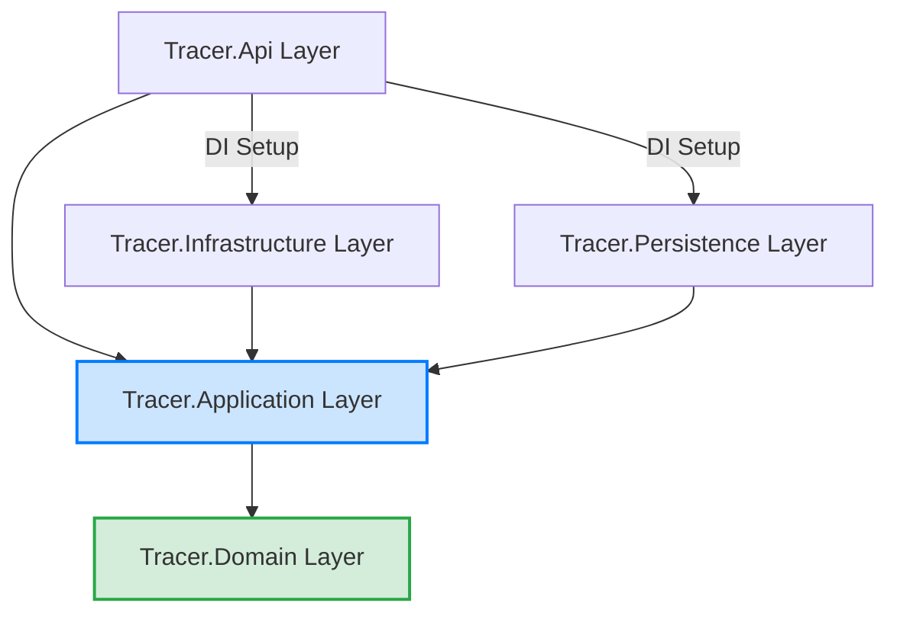
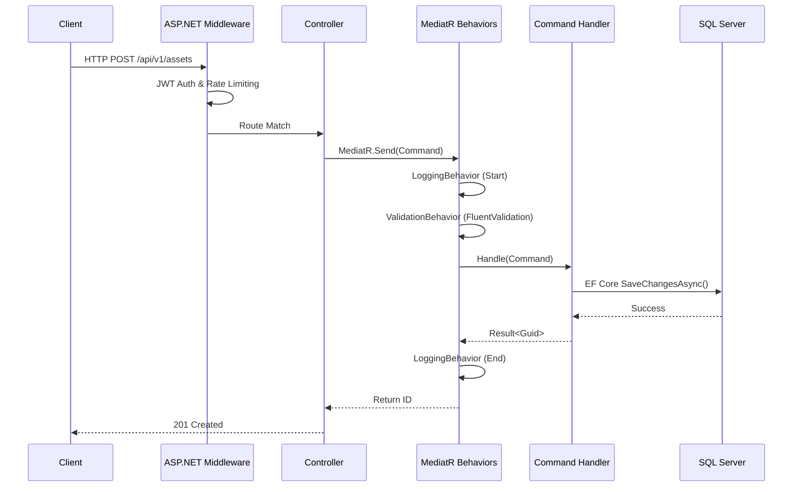
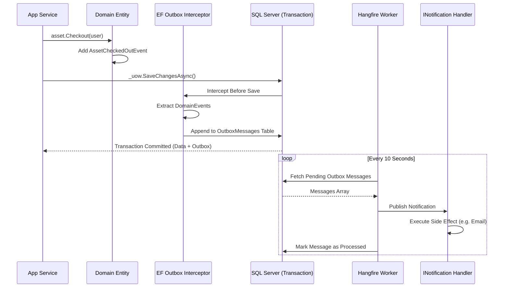
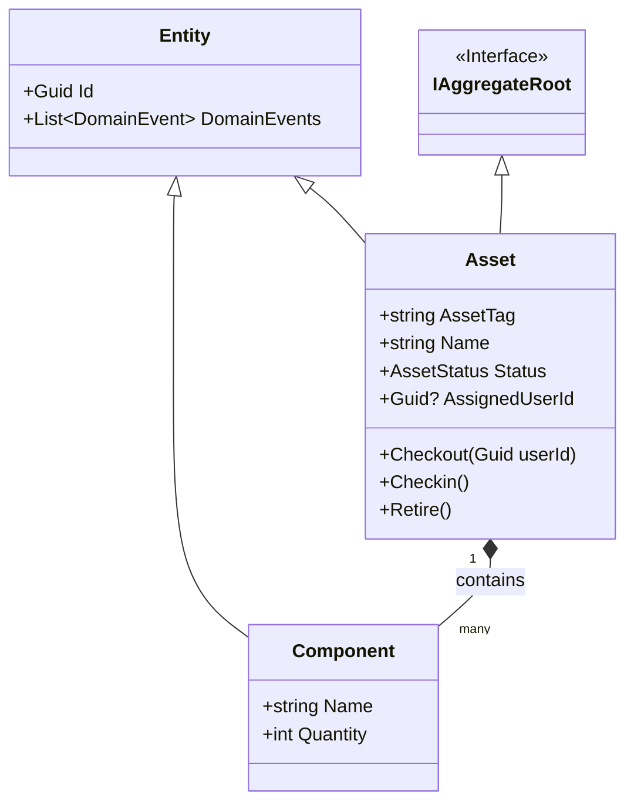

# Enterprise IT Asset Management System (Project Tracer)
## Document 10: Backend Architecture Specification

**Prepared By:** Sakthivel P, Principal .NET Solution Architect  
**Document Version:** 1.0  
**Stack:** ASP.NET Core 9, EF Core 9, Clean Architecture, CQRS (MediatR), SQL Server, Redis, Hangfire  

---

## 1. Executive Summary
This document defines the comprehensive backend architecture for Project Tracer. It translates the business workflows (Doc 8), data models (Doc 4), API specifications (Doc 5), and RBAC security rules (Doc 7) into a concrete, implementation-ready ASP.NET Core 9 solution. The architecture relies on **Clean Architecture** principles strictly segregated into Domain, Application, Infrastructure, Persistence, and API layers.

---

## 2. Solution & Project Structure

The solution `Tracer.sln` is divided into the following physical projects to enforce dependency rules (inner layers cannot reference outer layers).

```text
Tracer.sln
├── src/
│   ├── Tracer.Domain/          # [No Dependencies] Core entities, VO, interfaces, domain exceptions
│   ├── Tracer.Application/     # [Depends on Domain] CQRS Handlers, DTOs, Validators, AutoMapper
│   ├── Tracer.Infrastructure/  # [Depends on Application] Identity, Emails, Background Jobs, Outbox
│   ├── Tracer.Persistence/     # [Depends on Application] EF Core DbContext, Repositories, Migrations
│   ├── Tracer.Api/             # [Depends on App, Infra, Persist] Controllers, Middleware, DI Setup
│   └── Tracer.Shared/          # [No Dependencies] Common constants, Enums, Result wrappers
├── tests/
│   ├── Tracer.Domain.UnitTests/
│   ├── Tracer.Application.UnitTests/
│   └── Tracer.Api.IntegrationTests/
```

---

## 3. Layer Specifications & Folder Structures

### 3.1 Tracer.Domain Layer
The absolute core of the system. Contains enterprise logic.
* **Entities:** Base classes `Entity<T>`, `AggregateRoot<T>`.
* **ValueObjects:** `Money`, `MacAddress`, `EmailAddress`.
* **Events:** `DomainEvent` base record. E.g., `AssetCheckedOutEvent`.
* **Exceptions:** `DomainException` base class. E.g., `AssetNotDeployableException`.

```text
Tracer.Domain/
 ├── Aggregates/
 │    ├── AssetAggregate/ (Asset.cs, Component.cs)
 │    └── LicenseAggregate/ (SoftwareLicense.cs, LicenseSeat.cs)
 ├── Common/ (Entity.cs, IAggregateRoot.cs, ValueObject.cs, AuditableEntity.cs)
 ├── Events/ (AssetCreatedDomainEvent.cs)
 └── Exceptions/ (InsufficientSeatsException.cs)
```

### 3.2 Tracer.Application Layer
Orchestrates business use cases using MediatR.
* **Commands/Queries:** MediatR `IRequest<Result<T>>`.
* **Handlers:** Contains the business orchestration logic.
* **Pipelines:** MediatR `IPipelineBehavior` for Logging, Validation, and Performance.
* **Validators:** FluentValidation rules.
* **AutoMapper:** Profiles mapping Entities to DTOs.

```text
Tracer.Application/
 ├── Behaviors/ (ValidationBehavior.cs, LoggingBehavior.cs, CachingBehavior.cs)
 ├── Features/
 │    ├── Assets/
 │    │    ├── Commands/ (CreateAssetCommand.cs, CheckoutAssetCommand.cs)
 │    │    ├── Queries/ (GetAssetByIdQuery.cs, GetAssetsWithPaginationQuery.cs)
 │    │    └── DTOs/ (AssetDto.cs, AssetDetailDto.cs)
 ├── Interfaces/ (IEmailService.cs, IAssetRepository.cs)
 └── Mapping/ (AssetProfile.cs)
```

### 3.3 Tracer.Persistence Layer
Data access implementation using Entity Framework Core 9.
* **DbContext:** `TracerDbContext` with Fluent API configurations.
* **Interceptors:** `AuditableEntityInterceptor` (auto-fills CreatedAt/By), `OutboxMessageInterceptor` (extracts domain events and saves them as outbox messages).
* **Repositories:** Generic `Repository<T>` and specialized `AssetRepository`.

```text
Tracer.Persistence/
 ├── Contexts/ (TracerDbContext.cs)
 ├── Configurations/ (AssetConfiguration.cs - Fluent API)
 ├── Interceptors/ (AuditInterceptor.cs, OutboxInterceptor.cs)
 └── Repositories/ (UnitOfWork.cs, AssetRepository.cs)
```

### 3.4 Tracer.Infrastructure Layer
Integration with external systems and cross-cutting frameworks.
* **Identity:** JWT Generation, Token Validation.
* **Background Jobs:** Hangfire integration.
* **Caching:** Redis `IDistributedCache` implementation.
* **Outbox:** Quartz.NET or Hangfire worker to process the Outbox table.

```text
Tracer.Infrastructure/
 ├── Authentication/ (JwtProvider.cs, PermissionAuthorizationHandler.cs)
 ├── BackgroundJobs/ (OutboxProcessorJob.cs, LicenseExpiryJob.cs)
 ├── Caching/ (RedisCacheService.cs)
 └── Services/ (SmtpEmailService.cs, SystemClock.cs)
```

### 3.5 Tracer.Api Layer
The entry point. Minimal logic, strictly routes HTTP to Application layer.
* **Controllers:** standard API endpoints grouping routes.
* **Middleware:** Global Exception Handling (using .NET 9 `IExceptionHandler`), Request Logging.
* **Extensions:** `ServiceCollectionExtensions` for clean `Program.cs`.

```text
Tracer.Api/
 ├── Controllers/ (v1/AssetsController.cs)
 ├── Middleware/ (ExceptionHandlingMiddleware.cs)
 ├── Policies/ (RateLimitingSetup.cs)
 └── Program.cs
```

---

## 4. Core Architectural Patterns

### 4.1 CQRS with MediatR Pipeline
All requests flow through MediatR. Validation happens *before* the handler executes.
1. `ValidationBehavior`: Scans for `IValidator<T>`, throws `ValidationException` if invalid.
2. `LoggingBehavior`: Logs request entry and exit time using Serilog.
3. `CachingBehavior`: Checks Redis for queries implementing `ICachedQuery`.

### 4.2 Outbox Pattern & Domain Events
To guarantee reliable event publishing (e.g., sending emails after DB commit) without distributed transactions:
1. Domain entity generates a `DomainEvent` and holds it in memory (`entity.DomainEvents`).
2. EF Core `SaveChanges` triggers `OutboxInterceptor`.
3. Interceptor serializes events into the `OutboxMessages` table in the *same transaction*.
4. Hangfire background job polls `OutboxMessages` every 10 seconds and publishes them to an event bus or executes MediatR `INotification` handlers.

### 4.3 Repository & Unit of Work (UoW)
* **Repositories:** Only Aggregate Roots have repositories (`IAssetRepository`). Components are saved through their parent aggregate.
* **UoW:** `IUnitOfWork.SaveChangesAsync(cancellationToken)` ensures atomicity across multiple repository operations.

---

## 5. Security & RBAC Implementation (Document 7 Alignment)

### 5.1 JWT & Policy-Based Authorization
Permissions (e.g., `Assets.Edit`) are injected into the JWT as a `permissions` array claim.
* Custom `PermissionRequirement` and `PermissionAuthorizationHandler` dynamically evaluate these claims.
* Controllers use `[Authorize(Policy = "Assets.Edit")]`.

### 5.2 Rate Limiting
ASP.NET Core 9 built-in Rate Limiting.
* `GlobalLimiter`: 100 requests per minute per IP.
* `AuthLimiter`: 5 requests per minute for login endpoints.

---

## 6. Observability & Health Checks

### 6.1 OpenTelemetry & Serilog
* **Serilog:** Structured JSON logging. Enriches logs with `TraceId`, `UserId`, `TenantId`. Sinks to Elasticsearch/Seq.
* **OpenTelemetry:** Configured for Distributed Tracing (Jaeger) and Metrics (Prometheus).

### 6.2 Health Checks
Exposed at `/health` and `/health/ready`.
* Checks SQL Server connectivity.
* Checks Redis connectivity.
* Checks Hangfire job server status.

---

## 7. Mermaid Architecture Diagrams

### 7.1 Layer Interaction Diagram (Clean Architecture)


### 7.2 Request Pipeline (Middleware & MediatR)


### 7.3 Outbox Pattern Flow


### 7.4 Aggregate Root Class Diagram (Asset)


---
*End of Document 10. The backend architecture is fully specified for .NET 9 engineering execution.*
