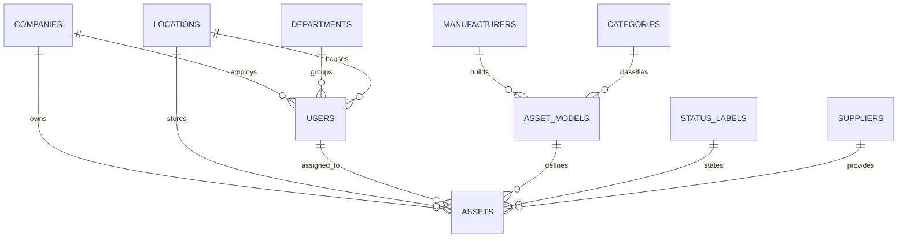
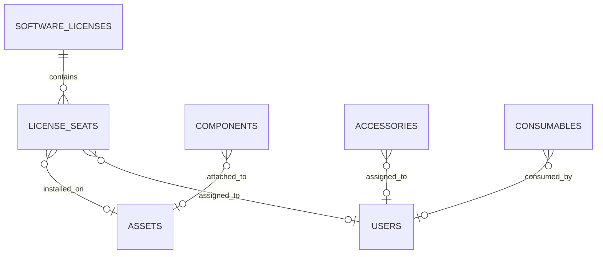

# Enterprise IT Asset Management System (Project Tracer)
## Document 4: Database Design Document (DDD)

**Prepared By:** Sakthivel P, Principal Enterprise Architect & Senior Database Architect  
**Document Version:** 1.0  
**Target RDBMS:** SQL Server 2022  
**ORM:** Entity Framework Core 9  

---

## 1. Database Architecture & Standards

### 1.1 Naming Conventions
* **Tables:** PascalCase, Plural (e.g., `Assets`, `AssetModels`).
* **Columns:** PascalCase, Singular (e.g., `AssetId`, `SerialNumber`).
* **Primary Keys:** TableName + `Id` (e.g., `AssetId`), except associative tables.
* **Foreign Keys:** TargetTableName + `Id` (e.g., `CompanyId`).
* **Indexes:** * Clustered: `CX_TableName_ColumnName`
    * Non-Clustered: `IX_TableName_ColumnName`
    * Unique: `UX_TableName_ColumnName`
* **Default Constraints:** `DF_TableName_ColumnName`
* **Foreign Key Constraints:** `FK_ChildTable_ParentTable`

### 1.2 Database Standards
* **Collation:** `SQL_Latin1_General_CP1_CI_AS` (Case-Insensitive, Accent-Sensitive).
* **Data Types:** Use `NVARCHAR` for strings to support internationalization. Use `DATETIME2(7)` for all timestamps (UTC). Use `UNIQUEIDENTIFIER` (Guid) for distributed primary keys on transactional tables (Assets, Users, Logs) to prevent identity insertion bottlenecks in EF Core. Use `INT` for smaller lookup tables (StatusLabels, Categories).
* **Concurrency:** Optimistic concurrency enforced via `RowVersion` (`TIMESTAMP`) on all mutable aggregates.
* **Soft Deletion:** Implemented globally via `IsDeleted (BIT)` and `DeletedAt (DATETIME2)`. EF Core Global Query Filters will automatically exclude these rows.

### 1.3 Partitioning Strategy
* **Temporal Partitioning:** High-volume tables (`ActivityLogs`, `AuditLogs`) are partitioned by `CreatedAt` using monthly boundaries.
* **Tenant Partitioning (Future-proofing):** All core transactional tables include a `CompanyId`. Partitioning functions can be applied to `CompanyId` for extreme scale multi-tenant deployments.

### 1.4 Archiving Strategy
* **Hot Tier:** Active data in primary SQL Server filegroups.
* **Cold Tier:** `ActivityLogs` and `AuditLogs` older than 18 months are archived to a secondary filegroup stored on lower-tier storage, or offloaded via Azure Data Factory to Azure Data Lake Storage (Parquet format) for long-term compliance retention.

### 1.5 Backup Strategy
* **Full Backups:** Weekly (Sunday 01:00 UTC).
* **Differential Backups:** Daily (01:00 UTC).
* **Transaction Log Backups:** Every 15 minutes.
* **Retention:** 35 days Point-in-Time Restore (PITR), monthly backups retained for 7 years (Compliance).

### 1.6 Migration Strategy
* Schema migrations are strictly managed via Entity Framework Core Migrations.
* Migration execution is integrated into the CI/CD pipeline (Azure DevOps/GitHub Actions) utilizing Idempotent SQL scripts (`dotnet ef migrations script --idempotent`).

### 1.7 Performance Recommendations & Index Optimization
* **Covering Indexes:** Applied to highly queried views (e.g., Asset Dashboard requires an index on `CompanyId, StatusLabelId INCLUDE (AssetTag, Name, AssignedToUserId)`).
* **Guid Fragmentation:** Primary Key Guids (`UNIQUEIDENTIFIER`) will use `NEWSEQUENTIALID()` via database default to prevent clustered index page fragmentation.
* **Query Store:** Enabled with Custom Capture mode to monitor EF Core LINQ-to-SQL plan regressions.

### 1.8 Security & Row Level Security (RLS)
* **Encryption at Rest:** Transparent Data Encryption (TDE) is enforced.
* **Encryption in Transit:** Enforced via `Encrypt=True` in connection strings (TLS 1.3).
* **Row-Level Security (RLS):** Implemented via Security Policies and Inline Table-Valued Functions (iTVF). Users mapped to specific `LocationId` or `CompanyId` will have queries automatically filtered at the SQL Server Engine level, preventing cross-tenant data spillage even if application logic fails.

### 1.9 Data Retention Policy
* **Active Assets:** Retained indefinitely.
* **Soft-Deleted Entities:** Retained for 90 days, then permanently purged via automated SQL Agent jobs or Background Worker Services.
* **System Logs (Activity/Audit):** Retained for 7 years per SOC2/ISO27001 requirements.

---

## 2. Entity Relationship Diagrams (ERD)

### 2.1 Core Asset Lifecycle ERD

### 2.2 License & Components ERD

---

## 3. Detailed Table Specifications

### 3.1 Table: `Companies`

**1. Purpose:** Stores enterprise data regarding Companies.

**2. Description:** Core transactional table mapped to the `Companies` aggregate root in EF Core. Includes standard temporal and auditing fields to support the Clean Architecture domain model.

**3. Columns, 4. SQL Data Types, & 5. Nullable Rules:**
| Column Name | SQL Data Type | Nullable | Description |
| :--- | :--- | :--- | :--- |
| `Id` | `INT` | No | Primary Identifier |
| `Name` | `NVARCHAR(255)` | No | Display name identifier |
| `CreatedBy` | `UNIQUEIDENTIFIER` | Yes | ID of creating user |
| `CreatedAt` | `DATETIME2(7)` | No | UTC Timestamp of creation |
| `UpdatedBy` | `UNIQUEIDENTIFIER` | Yes | ID of last updating user |
| `UpdatedAt` | `DATETIME2(7)` | Yes | UTC Timestamp of update |
| `IsDeleted` | `BIT` | No | Soft delete flag |
| `DeletedAt` | `DATETIME2(7)` | Yes | UTC Timestamp of deletion |
| `RowVersion` | `TIMESTAMP` | No | Optimistic concurrency token |

**6. Primary Key:** `PK_Companies` on column `Id` (Clustered).

**7. Foreign Keys:**
* None (Standard structural table or relationships handled externally)

**8. Constraints & 9. Default Values:**
* `DF_Companies_Id`: Default `IDENTITY(1,1)`
* `DF_Companies_CreatedAt`: Default `GETUTCDATE()`
* `DF_Companies_IsDeleted`: Default `0`

**10. Indexes, 11. Composite Indexes, & 12. Unique Constraints:**
* **Unique:** `UX_Companies_Name` on `Name` (Filtered: `WHERE IsDeleted = 0`)
* **Non-Clustered:** `IX_Companies_IsDeleted` on `IsDeleted` to optimize EF Core Global Query Filters.

**13. Soft Delete Strategy:** Supported. Rows are updated with `IsDeleted = 1` and `DeletedAt = GETUTCDATE()`. Dependent historical references remain intact.

**14. Audit Fields:** Tracked via `CreatedBy`, `CreatedAt`, `UpdatedBy`, `UpdatedAt`. State mutations also dispatch MediatR events pushing JSON snapshots to the `ActivityLogs` table.

**15. Sample Records:**
| Id | Name | IsDeleted |
| :--- | :--- | :--- |
| 1 | Sample Entry Alpha | 0 |

**16. Entity Relationships:**
* Acts as the `Companies` aggregate node within the Domain layer.
* Parent to Assets, Users, Departments, Locations.

---

### 3.2 Table: `Locations`

**1. Purpose:** Stores enterprise data regarding Locations.

**2. Description:** Core transactional table mapped to the `Locations` aggregate root in EF Core. Includes standard temporal and auditing fields to support the Clean Architecture domain model.

**3. Columns, 4. SQL Data Types, & 5. Nullable Rules:**
| Column Name | SQL Data Type | Nullable | Description |
| :--- | :--- | :--- | :--- |
| `Id` | `INT` | No | Primary Identifier |
| `Name` | `NVARCHAR(255)` | No | Display name identifier |
| `CreatedBy` | `UNIQUEIDENTIFIER` | Yes | ID of creating user |
| `CreatedAt` | `DATETIME2(7)` | No | UTC Timestamp of creation |
| `UpdatedBy` | `UNIQUEIDENTIFIER` | Yes | ID of last updating user |
| `UpdatedAt` | `DATETIME2(7)` | Yes | UTC Timestamp of update |
| `IsDeleted` | `BIT` | No | Soft delete flag |
| `DeletedAt` | `DATETIME2(7)` | Yes | UTC Timestamp of deletion |
| `RowVersion` | `TIMESTAMP` | No | Optimistic concurrency token |

**6. Primary Key:** `PK_Locations` on column `Id` (Clustered).

**7. Foreign Keys:**
* None (Standard structural table or relationships handled externally)

**8. Constraints & 9. Default Values:**
* `DF_Locations_Id`: Default `IDENTITY(1,1)`
* `DF_Locations_CreatedAt`: Default `GETUTCDATE()`
* `DF_Locations_IsDeleted`: Default `0`

**10. Indexes, 11. Composite Indexes, & 12. Unique Constraints:**
* **Unique:** `UX_Locations_Name` on `Name` (Filtered: `WHERE IsDeleted = 0`)
* **Non-Clustered:** `IX_Locations_IsDeleted` on `IsDeleted` to optimize EF Core Global Query Filters.

**13. Soft Delete Strategy:** Supported. Rows are updated with `IsDeleted = 1` and `DeletedAt = GETUTCDATE()`. Dependent historical references remain intact.

**14. Audit Fields:** Tracked via `CreatedBy`, `CreatedAt`, `UpdatedBy`, `UpdatedAt`. State mutations also dispatch MediatR events pushing JSON snapshots to the `ActivityLogs` table.

**15. Sample Records:**
| Id | Name | IsDeleted |
| :--- | :--- | :--- |
| 1 | Sample Entry Alpha | 0 |

**16. Entity Relationships:**
* Acts as the `Locations` aggregate node within the Domain layer.

---

### 3.3 Table: `Departments`

**1. Purpose:** Stores enterprise data regarding Departments.

**2. Description:** Core transactional table mapped to the `Departments` aggregate root in EF Core. Includes standard temporal and auditing fields to support the Clean Architecture domain model.

**3. Columns, 4. SQL Data Types, & 5. Nullable Rules:**
| Column Name | SQL Data Type | Nullable | Description |
| :--- | :--- | :--- | :--- |
| `Id` | `INT` | No | Primary Identifier |
| `Name` | `NVARCHAR(255)` | No | Display name identifier |
| `CreatedBy` | `UNIQUEIDENTIFIER` | Yes | ID of creating user |
| `CreatedAt` | `DATETIME2(7)` | No | UTC Timestamp of creation |
| `UpdatedBy` | `UNIQUEIDENTIFIER` | Yes | ID of last updating user |
| `UpdatedAt` | `DATETIME2(7)` | Yes | UTC Timestamp of update |
| `IsDeleted` | `BIT` | No | Soft delete flag |
| `DeletedAt` | `DATETIME2(7)` | Yes | UTC Timestamp of deletion |
| `RowVersion` | `TIMESTAMP` | No | Optimistic concurrency token |

**6. Primary Key:** `PK_Departments` on column `Id` (Clustered).

**7. Foreign Keys:**
* None (Standard structural table or relationships handled externally)

**8. Constraints & 9. Default Values:**
* `DF_Departments_Id`: Default `IDENTITY(1,1)`
* `DF_Departments_CreatedAt`: Default `GETUTCDATE()`
* `DF_Departments_IsDeleted`: Default `0`

**10. Indexes, 11. Composite Indexes, & 12. Unique Constraints:**
* **Unique:** `UX_Departments_Name` on `Name` (Filtered: `WHERE IsDeleted = 0`)
* **Non-Clustered:** `IX_Departments_IsDeleted` on `IsDeleted` to optimize EF Core Global Query Filters.

**13. Soft Delete Strategy:** Supported. Rows are updated with `IsDeleted = 1` and `DeletedAt = GETUTCDATE()`. Dependent historical references remain intact.

**14. Audit Fields:** Tracked via `CreatedBy`, `CreatedAt`, `UpdatedBy`, `UpdatedAt`. State mutations also dispatch MediatR events pushing JSON snapshots to the `ActivityLogs` table.

**15. Sample Records:**
| Id | Name | IsDeleted |
| :--- | :--- | :--- |
| 1 | Sample Entry Alpha | 0 |

**16. Entity Relationships:**
* Acts as the `Departments` aggregate node within the Domain layer.

---

### 3.4 Table: `Users`

**1. Purpose:** Stores enterprise data regarding Users.

**2. Description:** Core transactional table mapped to the `Users` aggregate root in EF Core. Includes standard temporal and auditing fields to support the Clean Architecture domain model.

**3. Columns, 4. SQL Data Types, & 5. Nullable Rules:**
| Column Name | SQL Data Type | Nullable | Description |
| :--- | :--- | :--- | :--- |
| `Id` | `UNIQUEIDENTIFIER` | No | Primary Identifier |
| `Name` | `NVARCHAR(255)` | No | Display name identifier |
| `Email` | `NVARCHAR(255)` | No | User principal name |
| `CompanyId` | `INT` | Yes | Tenant grouping |
| `RoleId` | `INT` | No | Access control level |
| `CreatedBy` | `UNIQUEIDENTIFIER` | Yes | ID of creating user |
| `CreatedAt` | `DATETIME2(7)` | No | UTC Timestamp of creation |
| `UpdatedBy` | `UNIQUEIDENTIFIER` | Yes | ID of last updating user |
| `UpdatedAt` | `DATETIME2(7)` | Yes | UTC Timestamp of update |
| `IsDeleted` | `BIT` | No | Soft delete flag |
| `DeletedAt` | `DATETIME2(7)` | Yes | UTC Timestamp of deletion |
| `RowVersion` | `TIMESTAMP` | No | Optimistic concurrency token |

**6. Primary Key:** `PK_Users` on column `Id` (Clustered).

**7. Foreign Keys:**
* `FK_Users_Companies` on `CompanyId`
* `FK_Users_Roles` on `RoleId`

**8. Constraints & 9. Default Values:**
* `DF_Users_Id`: Default `NEWSEQUENTIALID()`
* `DF_Users_CreatedAt`: Default `GETUTCDATE()`
* `DF_Users_IsDeleted`: Default `0`

**10. Indexes, 11. Composite Indexes, & 12. Unique Constraints:**
* **Unique:** `UX_Users_Name` on `Name` (Filtered: `WHERE IsDeleted = 0`)
* **Non-Clustered:** `IX_Users_IsDeleted` on `IsDeleted` to optimize EF Core Global Query Filters.

**13. Soft Delete Strategy:** Supported. Rows are updated with `IsDeleted = 1` and `DeletedAt = GETUTCDATE()`. Dependent historical references remain intact.

**14. Audit Fields:** Tracked via `CreatedBy`, `CreatedAt`, `UpdatedBy`, `UpdatedAt`. State mutations also dispatch MediatR events pushing JSON snapshots to the `ActivityLogs` table.

**15. Sample Records:**
| Id | Name | IsDeleted |
| :--- | :--- | :--- |
| `a1b2c3d4-...` | Sample Entry Alpha | 0 |

**16. Entity Relationships:**
* Acts as the `Users` aggregate node within the Domain layer.

---

### 3.5 Table: `Roles`

**1. Purpose:** Stores enterprise data regarding Roles.

**2. Description:** Core transactional table mapped to the `Roles` aggregate root in EF Core. Includes standard temporal and auditing fields to support the Clean Architecture domain model.

**3. Columns, 4. SQL Data Types, & 5. Nullable Rules:**
| Column Name | SQL Data Type | Nullable | Description |
| :--- | :--- | :--- | :--- |
| `Id` | `INT` | No | Primary Identifier |
| `Name` | `NVARCHAR(255)` | No | Display name identifier |
| `CreatedBy` | `UNIQUEIDENTIFIER` | Yes | ID of creating user |
| `CreatedAt` | `DATETIME2(7)` | No | UTC Timestamp of creation |
| `UpdatedBy` | `UNIQUEIDENTIFIER` | Yes | ID of last updating user |
| `UpdatedAt` | `DATETIME2(7)` | Yes | UTC Timestamp of update |
| `IsDeleted` | `BIT` | No | Soft delete flag |
| `DeletedAt` | `DATETIME2(7)` | Yes | UTC Timestamp of deletion |
| `RowVersion` | `TIMESTAMP` | No | Optimistic concurrency token |

**6. Primary Key:** `PK_Roles` on column `Id` (Clustered).

**7. Foreign Keys:**
* None (Standard structural table or relationships handled externally)

**8. Constraints & 9. Default Values:**
* `DF_Roles_Id`: Default `IDENTITY(1,1)`
* `DF_Roles_CreatedAt`: Default `GETUTCDATE()`
* `DF_Roles_IsDeleted`: Default `0`

**10. Indexes, 11. Composite Indexes, & 12. Unique Constraints:**
* **Unique:** `UX_Roles_Name` on `Name` (Filtered: `WHERE IsDeleted = 0`)
* **Non-Clustered:** `IX_Roles_IsDeleted` on `IsDeleted` to optimize EF Core Global Query Filters.

**13. Soft Delete Strategy:** Supported. Rows are updated with `IsDeleted = 1` and `DeletedAt = GETUTCDATE()`. Dependent historical references remain intact.

**14. Audit Fields:** Tracked via `CreatedBy`, `CreatedAt`, `UpdatedBy`, `UpdatedAt`. State mutations also dispatch MediatR events pushing JSON snapshots to the `ActivityLogs` table.

**15. Sample Records:**
| Id | Name | IsDeleted |
| :--- | :--- | :--- |
| 1 | Sample Entry Alpha | 0 |

**16. Entity Relationships:**
* Acts as the `Roles` aggregate node within the Domain layer.

---

### 3.6 Table: `Permissions`

**1. Purpose:** Stores enterprise data regarding Permissions.

**2. Description:** Core transactional table mapped to the `Permissions` aggregate root in EF Core. Includes standard temporal and auditing fields to support the Clean Architecture domain model.

**3. Columns, 4. SQL Data Types, & 5. Nullable Rules:**
| Column Name | SQL Data Type | Nullable | Description |
| :--- | :--- | :--- | :--- |
| `Id` | `INT` | No | Primary Identifier |
| `Name` | `NVARCHAR(255)` | No | Display name identifier |
| `CreatedBy` | `UNIQUEIDENTIFIER` | Yes | ID of creating user |
| `CreatedAt` | `DATETIME2(7)` | No | UTC Timestamp of creation |
| `UpdatedBy` | `UNIQUEIDENTIFIER` | Yes | ID of last updating user |
| `UpdatedAt` | `DATETIME2(7)` | Yes | UTC Timestamp of update |
| `IsDeleted` | `BIT` | No | Soft delete flag |
| `DeletedAt` | `DATETIME2(7)` | Yes | UTC Timestamp of deletion |
| `RowVersion` | `TIMESTAMP` | No | Optimistic concurrency token |

**6. Primary Key:** `PK_Permissions` on column `Id` (Clustered).

**7. Foreign Keys:**
* None (Standard structural table or relationships handled externally)

**8. Constraints & 9. Default Values:**
* `DF_Permissions_Id`: Default `IDENTITY(1,1)`
* `DF_Permissions_CreatedAt`: Default `GETUTCDATE()`
* `DF_Permissions_IsDeleted`: Default `0`

**10. Indexes, 11. Composite Indexes, & 12. Unique Constraints:**
* **Unique:** `UX_Permissions_Name` on `Name` (Filtered: `WHERE IsDeleted = 0`)
* **Non-Clustered:** `IX_Permissions_IsDeleted` on `IsDeleted` to optimize EF Core Global Query Filters.

**13. Soft Delete Strategy:** Supported. Rows are updated with `IsDeleted = 1` and `DeletedAt = GETUTCDATE()`. Dependent historical references remain intact.

**14. Audit Fields:** Tracked via `CreatedBy`, `CreatedAt`, `UpdatedBy`, `UpdatedAt`. State mutations also dispatch MediatR events pushing JSON snapshots to the `ActivityLogs` table.

**15. Sample Records:**
| Id | Name | IsDeleted |
| :--- | :--- | :--- |
| 1 | Sample Entry Alpha | 0 |

**16. Entity Relationships:**
* Acts as the `Permissions` aggregate node within the Domain layer.

---

### 3.7 Table: `Categories`

**1. Purpose:** Stores enterprise data regarding Categories.

**2. Description:** Core transactional table mapped to the `Categories` aggregate root in EF Core. Includes standard temporal and auditing fields to support the Clean Architecture domain model.

**3. Columns, 4. SQL Data Types, & 5. Nullable Rules:**
| Column Name | SQL Data Type | Nullable | Description |
| :--- | :--- | :--- | :--- |
| `Id` | `INT` | No | Primary Identifier |
| `Name` | `NVARCHAR(255)` | No | Display name identifier |
| `CreatedBy` | `UNIQUEIDENTIFIER` | Yes | ID of creating user |
| `CreatedAt` | `DATETIME2(7)` | No | UTC Timestamp of creation |
| `UpdatedBy` | `UNIQUEIDENTIFIER` | Yes | ID of last updating user |
| `UpdatedAt` | `DATETIME2(7)` | Yes | UTC Timestamp of update |
| `IsDeleted` | `BIT` | No | Soft delete flag |
| `DeletedAt` | `DATETIME2(7)` | Yes | UTC Timestamp of deletion |
| `RowVersion` | `TIMESTAMP` | No | Optimistic concurrency token |

**6. Primary Key:** `PK_Categories` on column `Id` (Clustered).

**7. Foreign Keys:**
* None (Standard structural table or relationships handled externally)

**8. Constraints & 9. Default Values:**
* `DF_Categories_Id`: Default `IDENTITY(1,1)`
* `DF_Categories_CreatedAt`: Default `GETUTCDATE()`
* `DF_Categories_IsDeleted`: Default `0`

**10. Indexes, 11. Composite Indexes, & 12. Unique Constraints:**
* **Unique:** `UX_Categories_Name` on `Name` (Filtered: `WHERE IsDeleted = 0`)
* **Non-Clustered:** `IX_Categories_IsDeleted` on `IsDeleted` to optimize EF Core Global Query Filters.

**13. Soft Delete Strategy:** Supported. Rows are updated with `IsDeleted = 1` and `DeletedAt = GETUTCDATE()`. Dependent historical references remain intact.

**14. Audit Fields:** Tracked via `CreatedBy`, `CreatedAt`, `UpdatedBy`, `UpdatedAt`. State mutations also dispatch MediatR events pushing JSON snapshots to the `ActivityLogs` table.

**15. Sample Records:**
| Id | Name | IsDeleted |
| :--- | :--- | :--- |
| 1 | Sample Entry Alpha | 0 |

**16. Entity Relationships:**
* Acts as the `Categories` aggregate node within the Domain layer.

---

### 3.8 Table: `Manufacturers`

**1. Purpose:** Stores enterprise data regarding Manufacturers.

**2. Description:** Core transactional table mapped to the `Manufacturers` aggregate root in EF Core. Includes standard temporal and auditing fields to support the Clean Architecture domain model.

**3. Columns, 4. SQL Data Types, & 5. Nullable Rules:**
| Column Name | SQL Data Type | Nullable | Description |
| :--- | :--- | :--- | :--- |
| `Id` | `INT` | No | Primary Identifier |
| `Name` | `NVARCHAR(255)` | No | Display name identifier |
| `CreatedBy` | `UNIQUEIDENTIFIER` | Yes | ID of creating user |
| `CreatedAt` | `DATETIME2(7)` | No | UTC Timestamp of creation |
| `UpdatedBy` | `UNIQUEIDENTIFIER` | Yes | ID of last updating user |
| `UpdatedAt` | `DATETIME2(7)` | Yes | UTC Timestamp of update |
| `IsDeleted` | `BIT` | No | Soft delete flag |
| `DeletedAt` | `DATETIME2(7)` | Yes | UTC Timestamp of deletion |
| `RowVersion` | `TIMESTAMP` | No | Optimistic concurrency token |

**6. Primary Key:** `PK_Manufacturers` on column `Id` (Clustered).

**7. Foreign Keys:**
* None (Standard structural table or relationships handled externally)

**8. Constraints & 9. Default Values:**
* `DF_Manufacturers_Id`: Default `IDENTITY(1,1)`
* `DF_Manufacturers_CreatedAt`: Default `GETUTCDATE()`
* `DF_Manufacturers_IsDeleted`: Default `0`

**10. Indexes, 11. Composite Indexes, & 12. Unique Constraints:**
* **Unique:** `UX_Manufacturers_Name` on `Name` (Filtered: `WHERE IsDeleted = 0`)
* **Non-Clustered:** `IX_Manufacturers_IsDeleted` on `IsDeleted` to optimize EF Core Global Query Filters.

**13. Soft Delete Strategy:** Supported. Rows are updated with `IsDeleted = 1` and `DeletedAt = GETUTCDATE()`. Dependent historical references remain intact.

**14. Audit Fields:** Tracked via `CreatedBy`, `CreatedAt`, `UpdatedBy`, `UpdatedAt`. State mutations also dispatch MediatR events pushing JSON snapshots to the `ActivityLogs` table.

**15. Sample Records:**
| Id | Name | IsDeleted |
| :--- | :--- | :--- |
| 1 | Sample Entry Alpha | 0 |

**16. Entity Relationships:**
* Acts as the `Manufacturers` aggregate node within the Domain layer.

---

### 3.9 Table: `Suppliers`

**1. Purpose:** Stores enterprise data regarding Suppliers.

**2. Description:** Core transactional table mapped to the `Suppliers` aggregate root in EF Core. Includes standard temporal and auditing fields to support the Clean Architecture domain model.

**3. Columns, 4. SQL Data Types, & 5. Nullable Rules:**
| Column Name | SQL Data Type | Nullable | Description |
| :--- | :--- | :--- | :--- |
| `Id` | `INT` | No | Primary Identifier |
| `Name` | `NVARCHAR(255)` | No | Display name identifier |
| `CreatedBy` | `UNIQUEIDENTIFIER` | Yes | ID of creating user |
| `CreatedAt` | `DATETIME2(7)` | No | UTC Timestamp of creation |
| `UpdatedBy` | `UNIQUEIDENTIFIER` | Yes | ID of last updating user |
| `UpdatedAt` | `DATETIME2(7)` | Yes | UTC Timestamp of update |
| `IsDeleted` | `BIT` | No | Soft delete flag |
| `DeletedAt` | `DATETIME2(7)` | Yes | UTC Timestamp of deletion |
| `RowVersion` | `TIMESTAMP` | No | Optimistic concurrency token |

**6. Primary Key:** `PK_Suppliers` on column `Id` (Clustered).

**7. Foreign Keys:**
* None (Standard structural table or relationships handled externally)

**8. Constraints & 9. Default Values:**
* `DF_Suppliers_Id`: Default `IDENTITY(1,1)`
* `DF_Suppliers_CreatedAt`: Default `GETUTCDATE()`
* `DF_Suppliers_IsDeleted`: Default `0`

**10. Indexes, 11. Composite Indexes, & 12. Unique Constraints:**
* **Unique:** `UX_Suppliers_Name` on `Name` (Filtered: `WHERE IsDeleted = 0`)
* **Non-Clustered:** `IX_Suppliers_IsDeleted` on `IsDeleted` to optimize EF Core Global Query Filters.

**13. Soft Delete Strategy:** Supported. Rows are updated with `IsDeleted = 1` and `DeletedAt = GETUTCDATE()`. Dependent historical references remain intact.

**14. Audit Fields:** Tracked via `CreatedBy`, `CreatedAt`, `UpdatedBy`, `UpdatedAt`. State mutations also dispatch MediatR events pushing JSON snapshots to the `ActivityLogs` table.

**15. Sample Records:**
| Id | Name | IsDeleted |
| :--- | :--- | :--- |
| 1 | Sample Entry Alpha | 0 |

**16. Entity Relationships:**
* Acts as the `Suppliers` aggregate node within the Domain layer.

---

### 3.10 Table: `AssetModels`

**1. Purpose:** Stores enterprise data regarding AssetModels.

**2. Description:** Core transactional table mapped to the `AssetModels` aggregate root in EF Core. Includes standard temporal and auditing fields to support the Clean Architecture domain model.

**3. Columns, 4. SQL Data Types, & 5. Nullable Rules:**
| Column Name | SQL Data Type | Nullable | Description |
| :--- | :--- | :--- | :--- |
| `Id` | `INT` | No | Primary Identifier |
| `Name` | `NVARCHAR(255)` | No | Display name identifier |
| `CreatedBy` | `UNIQUEIDENTIFIER` | Yes | ID of creating user |
| `CreatedAt` | `DATETIME2(7)` | No | UTC Timestamp of creation |
| `UpdatedBy` | `UNIQUEIDENTIFIER` | Yes | ID of last updating user |
| `UpdatedAt` | `DATETIME2(7)` | Yes | UTC Timestamp of update |
| `IsDeleted` | `BIT` | No | Soft delete flag |
| `DeletedAt` | `DATETIME2(7)` | Yes | UTC Timestamp of deletion |
| `RowVersion` | `TIMESTAMP` | No | Optimistic concurrency token |

**6. Primary Key:** `PK_AssetModels` on column `Id` (Clustered).

**7. Foreign Keys:**
* None (Standard structural table or relationships handled externally)

**8. Constraints & 9. Default Values:**
* `DF_AssetModels_Id`: Default `IDENTITY(1,1)`
* `DF_AssetModels_CreatedAt`: Default `GETUTCDATE()`
* `DF_AssetModels_IsDeleted`: Default `0`

**10. Indexes, 11. Composite Indexes, & 12. Unique Constraints:**
* **Unique:** `UX_AssetModels_Name` on `Name` (Filtered: `WHERE IsDeleted = 0`)
* **Non-Clustered:** `IX_AssetModels_IsDeleted` on `IsDeleted` to optimize EF Core Global Query Filters.

**13. Soft Delete Strategy:** Supported. Rows are updated with `IsDeleted = 1` and `DeletedAt = GETUTCDATE()`. Dependent historical references remain intact.

**14. Audit Fields:** Tracked via `CreatedBy`, `CreatedAt`, `UpdatedBy`, `UpdatedAt`. State mutations also dispatch MediatR events pushing JSON snapshots to the `ActivityLogs` table.

**15. Sample Records:**
| Id | Name | IsDeleted |
| :--- | :--- | :--- |
| 1 | Sample Entry Alpha | 0 |

**16. Entity Relationships:**
* Acts as the `AssetModels` aggregate node within the Domain layer.

---

### 3.11 Table: `StatusLabels`

**1. Purpose:** Stores enterprise data regarding StatusLabels.

**2. Description:** Core transactional table mapped to the `StatusLabels` aggregate root in EF Core. Includes standard temporal and auditing fields to support the Clean Architecture domain model.

**3. Columns, 4. SQL Data Types, & 5. Nullable Rules:**
| Column Name | SQL Data Type | Nullable | Description |
| :--- | :--- | :--- | :--- |
| `Id` | `INT` | No | Primary Identifier |
| `Name` | `NVARCHAR(255)` | No | Display name identifier |
| `CreatedBy` | `UNIQUEIDENTIFIER` | Yes | ID of creating user |
| `CreatedAt` | `DATETIME2(7)` | No | UTC Timestamp of creation |
| `UpdatedBy` | `UNIQUEIDENTIFIER` | Yes | ID of last updating user |
| `UpdatedAt` | `DATETIME2(7)` | Yes | UTC Timestamp of update |
| `IsDeleted` | `BIT` | No | Soft delete flag |
| `DeletedAt` | `DATETIME2(7)` | Yes | UTC Timestamp of deletion |
| `RowVersion` | `TIMESTAMP` | No | Optimistic concurrency token |

**6. Primary Key:** `PK_StatusLabels` on column `Id` (Clustered).

**7. Foreign Keys:**
* None (Standard structural table or relationships handled externally)

**8. Constraints & 9. Default Values:**
* `DF_StatusLabels_Id`: Default `IDENTITY(1,1)`
* `DF_StatusLabels_CreatedAt`: Default `GETUTCDATE()`
* `DF_StatusLabels_IsDeleted`: Default `0`

**10. Indexes, 11. Composite Indexes, & 12. Unique Constraints:**
* **Unique:** `UX_StatusLabels_Name` on `Name` (Filtered: `WHERE IsDeleted = 0`)
* **Non-Clustered:** `IX_StatusLabels_IsDeleted` on `IsDeleted` to optimize EF Core Global Query Filters.

**13. Soft Delete Strategy:** Supported. Rows are updated with `IsDeleted = 1` and `DeletedAt = GETUTCDATE()`. Dependent historical references remain intact.

**14. Audit Fields:** Tracked via `CreatedBy`, `CreatedAt`, `UpdatedBy`, `UpdatedAt`. State mutations also dispatch MediatR events pushing JSON snapshots to the `ActivityLogs` table.

**15. Sample Records:**
| Id | Name | IsDeleted |
| :--- | :--- | :--- |
| 1 | Sample Entry Alpha | 0 |

**16. Entity Relationships:**
* Acts as the `StatusLabels` aggregate node within the Domain layer.

---

### 3.12 Table: `Assets`

**1. Purpose:** Stores enterprise data regarding Assets.

**2. Description:** Core transactional table mapped to the `Assets` aggregate root in EF Core. Includes standard temporal and auditing fields to support the Clean Architecture domain model.

**3. Columns, 4. SQL Data Types, & 5. Nullable Rules:**
| Column Name | SQL Data Type | Nullable | Description |
| :--- | :--- | :--- | :--- |
| `Id` | `UNIQUEIDENTIFIER` | No | Primary Identifier |
| `Name` | `NVARCHAR(255)` | No | Display name identifier |
| `AssetTag` | `NVARCHAR(100)` | No | Unique barcode/tracking tag |
| `ModelId` | `INT` | No | Foreign Key to AssetModels |
| `StatusLabelId` | `INT` | No | Foreign Key to StatusLabels |
| `AssignedToUserId` | `UNIQUEIDENTIFIER` | Yes | Currently assigned User |
| `LocationId` | `INT` | Yes | Physical location |
| `CompanyId` | `INT` | No | Tenant grouping |
| `CreatedBy` | `UNIQUEIDENTIFIER` | Yes | ID of creating user |
| `CreatedAt` | `DATETIME2(7)` | No | UTC Timestamp of creation |
| `UpdatedBy` | `UNIQUEIDENTIFIER` | Yes | ID of last updating user |
| `UpdatedAt` | `DATETIME2(7)` | Yes | UTC Timestamp of update |
| `IsDeleted` | `BIT` | No | Soft delete flag |
| `DeletedAt` | `DATETIME2(7)` | Yes | UTC Timestamp of deletion |
| `RowVersion` | `TIMESTAMP` | No | Optimistic concurrency token |

**6. Primary Key:** `PK_Assets` on column `Id` (Clustered).

**7. Foreign Keys:**
* `FK_Assets_AssetModels` on `ModelId`
* `FK_Assets_StatusLabels` on `StatusLabelId`
* `FK_Assets_Users` on `AssignedToUserId`
* `FK_Assets_Companies` on `CompanyId`

**8. Constraints & 9. Default Values:**
* `DF_Assets_Id`: Default `NEWSEQUENTIALID()`
* `DF_Assets_CreatedAt`: Default `GETUTCDATE()`
* `DF_Assets_IsDeleted`: Default `0`

**10. Indexes, 11. Composite Indexes, & 12. Unique Constraints:**
* **Unique:** `UX_Assets_Name` on `Name` (Filtered: `WHERE IsDeleted = 0`)
* **Unique:** `UX_Assets_AssetTag` on `AssetTag`
* **Composite:** `IX_Assets_Company_Status` on `(CompanyId, StatusLabelId)` INCLUDE (`AssetTag`)
* **Non-Clustered:** `IX_Assets_IsDeleted` on `IsDeleted` to optimize EF Core Global Query Filters.

**13. Soft Delete Strategy:** Supported. Rows are updated with `IsDeleted = 1` and `DeletedAt = GETUTCDATE()`. Dependent historical references remain intact.

**14. Audit Fields:** Tracked via `CreatedBy`, `CreatedAt`, `UpdatedBy`, `UpdatedAt`. State mutations also dispatch MediatR events pushing JSON snapshots to the `ActivityLogs` table.

**15. Sample Records:**
| Id | Name | IsDeleted |
| :--- | :--- | :--- |
| `a1b2c3d4-...` | Sample Entry Alpha | 0 |

**16. Entity Relationships:**
* Acts as the `Assets` aggregate node within the Domain layer.
* Child of AssetModels, Companies, Locations. Parent to Components, Maintenance.

---

### 3.13 Table: `SoftwareLicenses`

**1. Purpose:** Stores enterprise data regarding SoftwareLicenses.

**2. Description:** Core transactional table mapped to the `SoftwareLicenses` aggregate root in EF Core. Includes standard temporal and auditing fields to support the Clean Architecture domain model.

**3. Columns, 4. SQL Data Types, & 5. Nullable Rules:**
| Column Name | SQL Data Type | Nullable | Description |
| :--- | :--- | :--- | :--- |
| `Id` | `UNIQUEIDENTIFIER` | No | Primary Identifier |
| `Name` | `NVARCHAR(255)` | No | Display name identifier |
| `CreatedBy` | `UNIQUEIDENTIFIER` | Yes | ID of creating user |
| `CreatedAt` | `DATETIME2(7)` | No | UTC Timestamp of creation |
| `UpdatedBy` | `UNIQUEIDENTIFIER` | Yes | ID of last updating user |
| `UpdatedAt` | `DATETIME2(7)` | Yes | UTC Timestamp of update |
| `IsDeleted` | `BIT` | No | Soft delete flag |
| `DeletedAt` | `DATETIME2(7)` | Yes | UTC Timestamp of deletion |
| `RowVersion` | `TIMESTAMP` | No | Optimistic concurrency token |

**6. Primary Key:** `PK_SoftwareLicenses` on column `Id` (Clustered).

**7. Foreign Keys:**
* None (Standard structural table or relationships handled externally)

**8. Constraints & 9. Default Values:**
* `DF_SoftwareLicenses_Id`: Default `NEWSEQUENTIALID()`
* `DF_SoftwareLicenses_CreatedAt`: Default `GETUTCDATE()`
* `DF_SoftwareLicenses_IsDeleted`: Default `0`

**10. Indexes, 11. Composite Indexes, & 12. Unique Constraints:**
* **Unique:** `UX_SoftwareLicenses_Name` on `Name` (Filtered: `WHERE IsDeleted = 0`)
* **Non-Clustered:** `IX_SoftwareLicenses_IsDeleted` on `IsDeleted` to optimize EF Core Global Query Filters.

**13. Soft Delete Strategy:** Supported. Rows are updated with `IsDeleted = 1` and `DeletedAt = GETUTCDATE()`. Dependent historical references remain intact.

**14. Audit Fields:** Tracked via `CreatedBy`, `CreatedAt`, `UpdatedBy`, `UpdatedAt`. State mutations also dispatch MediatR events pushing JSON snapshots to the `ActivityLogs` table.

**15. Sample Records:**
| Id | Name | IsDeleted |
| :--- | :--- | :--- |
| `a1b2c3d4-...` | Sample Entry Alpha | 0 |

**16. Entity Relationships:**
* Acts as the `SoftwareLicenses` aggregate node within the Domain layer.

---

### 3.14 Table: `LicenseSeats`

**1. Purpose:** Stores enterprise data regarding LicenseSeats.

**2. Description:** Core transactional table mapped to the `LicenseSeats` aggregate root in EF Core. Includes standard temporal and auditing fields to support the Clean Architecture domain model.

**3. Columns, 4. SQL Data Types, & 5. Nullable Rules:**
| Column Name | SQL Data Type | Nullable | Description |
| :--- | :--- | :--- | :--- |
| `Id` | `UNIQUEIDENTIFIER` | No | Primary Identifier |
| `Name` | `NVARCHAR(255)` | No | Display name identifier |
| `CreatedBy` | `UNIQUEIDENTIFIER` | Yes | ID of creating user |
| `CreatedAt` | `DATETIME2(7)` | No | UTC Timestamp of creation |
| `UpdatedBy` | `UNIQUEIDENTIFIER` | Yes | ID of last updating user |
| `UpdatedAt` | `DATETIME2(7)` | Yes | UTC Timestamp of update |
| `IsDeleted` | `BIT` | No | Soft delete flag |
| `DeletedAt` | `DATETIME2(7)` | Yes | UTC Timestamp of deletion |
| `RowVersion` | `TIMESTAMP` | No | Optimistic concurrency token |

**6. Primary Key:** `PK_LicenseSeats` on column `Id` (Clustered).

**7. Foreign Keys:**
* None (Standard structural table or relationships handled externally)

**8. Constraints & 9. Default Values:**
* `DF_LicenseSeats_Id`: Default `NEWSEQUENTIALID()`
* `DF_LicenseSeats_CreatedAt`: Default `GETUTCDATE()`
* `DF_LicenseSeats_IsDeleted`: Default `0`

**10. Indexes, 11. Composite Indexes, & 12. Unique Constraints:**
* **Unique:** `UX_LicenseSeats_Name` on `Name` (Filtered: `WHERE IsDeleted = 0`)
* **Non-Clustered:** `IX_LicenseSeats_IsDeleted` on `IsDeleted` to optimize EF Core Global Query Filters.

**13. Soft Delete Strategy:** Supported. Rows are updated with `IsDeleted = 1` and `DeletedAt = GETUTCDATE()`. Dependent historical references remain intact.

**14. Audit Fields:** Tracked via `CreatedBy`, `CreatedAt`, `UpdatedBy`, `UpdatedAt`. State mutations also dispatch MediatR events pushing JSON snapshots to the `ActivityLogs` table.

**15. Sample Records:**
| Id | Name | IsDeleted |
| :--- | :--- | :--- |
| `a1b2c3d4-...` | Sample Entry Alpha | 0 |

**16. Entity Relationships:**
* Acts as the `LicenseSeats` aggregate node within the Domain layer.

---

### 3.15 Table: `Accessories`

**1. Purpose:** Stores enterprise data regarding Accessories.

**2. Description:** Core transactional table mapped to the `Accessories` aggregate root in EF Core. Includes standard temporal and auditing fields to support the Clean Architecture domain model.

**3. Columns, 4. SQL Data Types, & 5. Nullable Rules:**
| Column Name | SQL Data Type | Nullable | Description |
| :--- | :--- | :--- | :--- |
| `Id` | `INT` | No | Primary Identifier |
| `Name` | `NVARCHAR(255)` | No | Display name identifier |
| `CreatedBy` | `UNIQUEIDENTIFIER` | Yes | ID of creating user |
| `CreatedAt` | `DATETIME2(7)` | No | UTC Timestamp of creation |
| `UpdatedBy` | `UNIQUEIDENTIFIER` | Yes | ID of last updating user |
| `UpdatedAt` | `DATETIME2(7)` | Yes | UTC Timestamp of update |
| `IsDeleted` | `BIT` | No | Soft delete flag |
| `DeletedAt` | `DATETIME2(7)` | Yes | UTC Timestamp of deletion |
| `RowVersion` | `TIMESTAMP` | No | Optimistic concurrency token |

**6. Primary Key:** `PK_Accessories` on column `Id` (Clustered).

**7. Foreign Keys:**
* None (Standard structural table or relationships handled externally)

**8. Constraints & 9. Default Values:**
* `DF_Accessories_Id`: Default `IDENTITY(1,1)`
* `DF_Accessories_CreatedAt`: Default `GETUTCDATE()`
* `DF_Accessories_IsDeleted`: Default `0`

**10. Indexes, 11. Composite Indexes, & 12. Unique Constraints:**
* **Unique:** `UX_Accessories_Name` on `Name` (Filtered: `WHERE IsDeleted = 0`)
* **Non-Clustered:** `IX_Accessories_IsDeleted` on `IsDeleted` to optimize EF Core Global Query Filters.

**13. Soft Delete Strategy:** Supported. Rows are updated with `IsDeleted = 1` and `DeletedAt = GETUTCDATE()`. Dependent historical references remain intact.

**14. Audit Fields:** Tracked via `CreatedBy`, `CreatedAt`, `UpdatedBy`, `UpdatedAt`. State mutations also dispatch MediatR events pushing JSON snapshots to the `ActivityLogs` table.

**15. Sample Records:**
| Id | Name | IsDeleted |
| :--- | :--- | :--- |
| 1 | Sample Entry Alpha | 0 |

**16. Entity Relationships:**
* Acts as the `Accessories` aggregate node within the Domain layer.

---

### 3.16 Table: `Components`

**1. Purpose:** Stores enterprise data regarding Components.

**2. Description:** Core transactional table mapped to the `Components` aggregate root in EF Core. Includes standard temporal and auditing fields to support the Clean Architecture domain model.

**3. Columns, 4. SQL Data Types, & 5. Nullable Rules:**
| Column Name | SQL Data Type | Nullable | Description |
| :--- | :--- | :--- | :--- |
| `Id` | `INT` | No | Primary Identifier |
| `Name` | `NVARCHAR(255)` | No | Display name identifier |
| `CreatedBy` | `UNIQUEIDENTIFIER` | Yes | ID of creating user |
| `CreatedAt` | `DATETIME2(7)` | No | UTC Timestamp of creation |
| `UpdatedBy` | `UNIQUEIDENTIFIER` | Yes | ID of last updating user |
| `UpdatedAt` | `DATETIME2(7)` | Yes | UTC Timestamp of update |
| `IsDeleted` | `BIT` | No | Soft delete flag |
| `DeletedAt` | `DATETIME2(7)` | Yes | UTC Timestamp of deletion |
| `RowVersion` | `TIMESTAMP` | No | Optimistic concurrency token |

**6. Primary Key:** `PK_Components` on column `Id` (Clustered).

**7. Foreign Keys:**
* None (Standard structural table or relationships handled externally)

**8. Constraints & 9. Default Values:**
* `DF_Components_Id`: Default `IDENTITY(1,1)`
* `DF_Components_CreatedAt`: Default `GETUTCDATE()`
* `DF_Components_IsDeleted`: Default `0`

**10. Indexes, 11. Composite Indexes, & 12. Unique Constraints:**
* **Unique:** `UX_Components_Name` on `Name` (Filtered: `WHERE IsDeleted = 0`)
* **Non-Clustered:** `IX_Components_IsDeleted` on `IsDeleted` to optimize EF Core Global Query Filters.

**13. Soft Delete Strategy:** Supported. Rows are updated with `IsDeleted = 1` and `DeletedAt = GETUTCDATE()`. Dependent historical references remain intact.

**14. Audit Fields:** Tracked via `CreatedBy`, `CreatedAt`, `UpdatedBy`, `UpdatedAt`. State mutations also dispatch MediatR events pushing JSON snapshots to the `ActivityLogs` table.

**15. Sample Records:**
| Id | Name | IsDeleted |
| :--- | :--- | :--- |
| 1 | Sample Entry Alpha | 0 |

**16. Entity Relationships:**
* Acts as the `Components` aggregate node within the Domain layer.

---

### 3.17 Table: `Consumables`

**1. Purpose:** Stores enterprise data regarding Consumables.

**2. Description:** Core transactional table mapped to the `Consumables` aggregate root in EF Core. Includes standard temporal and auditing fields to support the Clean Architecture domain model.

**3. Columns, 4. SQL Data Types, & 5. Nullable Rules:**
| Column Name | SQL Data Type | Nullable | Description |
| :--- | :--- | :--- | :--- |
| `Id` | `INT` | No | Primary Identifier |
| `Name` | `NVARCHAR(255)` | No | Display name identifier |
| `CreatedBy` | `UNIQUEIDENTIFIER` | Yes | ID of creating user |
| `CreatedAt` | `DATETIME2(7)` | No | UTC Timestamp of creation |
| `UpdatedBy` | `UNIQUEIDENTIFIER` | Yes | ID of last updating user |
| `UpdatedAt` | `DATETIME2(7)` | Yes | UTC Timestamp of update |
| `IsDeleted` | `BIT` | No | Soft delete flag |
| `DeletedAt` | `DATETIME2(7)` | Yes | UTC Timestamp of deletion |
| `RowVersion` | `TIMESTAMP` | No | Optimistic concurrency token |

**6. Primary Key:** `PK_Consumables` on column `Id` (Clustered).

**7. Foreign Keys:**
* None (Standard structural table or relationships handled externally)

**8. Constraints & 9. Default Values:**
* `DF_Consumables_Id`: Default `IDENTITY(1,1)`
* `DF_Consumables_CreatedAt`: Default `GETUTCDATE()`
* `DF_Consumables_IsDeleted`: Default `0`

**10. Indexes, 11. Composite Indexes, & 12. Unique Constraints:**
* **Unique:** `UX_Consumables_Name` on `Name` (Filtered: `WHERE IsDeleted = 0`)
* **Non-Clustered:** `IX_Consumables_IsDeleted` on `IsDeleted` to optimize EF Core Global Query Filters.

**13. Soft Delete Strategy:** Supported. Rows are updated with `IsDeleted = 1` and `DeletedAt = GETUTCDATE()`. Dependent historical references remain intact.

**14. Audit Fields:** Tracked via `CreatedBy`, `CreatedAt`, `UpdatedBy`, `UpdatedAt`. State mutations also dispatch MediatR events pushing JSON snapshots to the `ActivityLogs` table.

**15. Sample Records:**
| Id | Name | IsDeleted |
| :--- | :--- | :--- |
| 1 | Sample Entry Alpha | 0 |

**16. Entity Relationships:**
* Acts as the `Consumables` aggregate node within the Domain layer.

---

### 3.18 Table: `Maintenance`

**1. Purpose:** Stores enterprise data regarding Maintenance.

**2. Description:** Core transactional table mapped to the `Maintenance` aggregate root in EF Core. Includes standard temporal and auditing fields to support the Clean Architecture domain model.

**3. Columns, 4. SQL Data Types, & 5. Nullable Rules:**
| Column Name | SQL Data Type | Nullable | Description |
| :--- | :--- | :--- | :--- |
| `Id` | `UNIQUEIDENTIFIER` | No | Primary Identifier |
| `Name` | `NVARCHAR(255)` | No | Display name identifier |
| `CreatedBy` | `UNIQUEIDENTIFIER` | Yes | ID of creating user |
| `CreatedAt` | `DATETIME2(7)` | No | UTC Timestamp of creation |
| `UpdatedBy` | `UNIQUEIDENTIFIER` | Yes | ID of last updating user |
| `UpdatedAt` | `DATETIME2(7)` | Yes | UTC Timestamp of update |
| `IsDeleted` | `BIT` | No | Soft delete flag |
| `DeletedAt` | `DATETIME2(7)` | Yes | UTC Timestamp of deletion |
| `RowVersion` | `TIMESTAMP` | No | Optimistic concurrency token |

**6. Primary Key:** `PK_Maintenance` on column `Id` (Clustered).

**7. Foreign Keys:**
* None (Standard structural table or relationships handled externally)

**8. Constraints & 9. Default Values:**
* `DF_Maintenance_Id`: Default `NEWSEQUENTIALID()`
* `DF_Maintenance_CreatedAt`: Default `GETUTCDATE()`
* `DF_Maintenance_IsDeleted`: Default `0`

**10. Indexes, 11. Composite Indexes, & 12. Unique Constraints:**
* **Unique:** `UX_Maintenance_Name` on `Name` (Filtered: `WHERE IsDeleted = 0`)
* **Non-Clustered:** `IX_Maintenance_IsDeleted` on `IsDeleted` to optimize EF Core Global Query Filters.

**13. Soft Delete Strategy:** Supported. Rows are updated with `IsDeleted = 1` and `DeletedAt = GETUTCDATE()`. Dependent historical references remain intact.

**14. Audit Fields:** Tracked via `CreatedBy`, `CreatedAt`, `UpdatedBy`, `UpdatedAt`. State mutations also dispatch MediatR events pushing JSON snapshots to the `ActivityLogs` table.

**15. Sample Records:**
| Id | Name | IsDeleted |
| :--- | :--- | :--- |
| `a1b2c3d4-...` | Sample Entry Alpha | 0 |

**16. Entity Relationships:**
* Acts as the `Maintenance` aggregate node within the Domain layer.

---

### 3.19 Table: `DepreciationModels`

**1. Purpose:** Stores enterprise data regarding DepreciationModels.

**2. Description:** Core transactional table mapped to the `DepreciationModels` aggregate root in EF Core. Includes standard temporal and auditing fields to support the Clean Architecture domain model.

**3. Columns, 4. SQL Data Types, & 5. Nullable Rules:**
| Column Name | SQL Data Type | Nullable | Description |
| :--- | :--- | :--- | :--- |
| `Id` | `INT` | No | Primary Identifier |
| `Name` | `NVARCHAR(255)` | No | Display name identifier |
| `CreatedBy` | `UNIQUEIDENTIFIER` | Yes | ID of creating user |
| `CreatedAt` | `DATETIME2(7)` | No | UTC Timestamp of creation |
| `UpdatedBy` | `UNIQUEIDENTIFIER` | Yes | ID of last updating user |
| `UpdatedAt` | `DATETIME2(7)` | Yes | UTC Timestamp of update |
| `IsDeleted` | `BIT` | No | Soft delete flag |
| `DeletedAt` | `DATETIME2(7)` | Yes | UTC Timestamp of deletion |
| `RowVersion` | `TIMESTAMP` | No | Optimistic concurrency token |

**6. Primary Key:** `PK_DepreciationModels` on column `Id` (Clustered).

**7. Foreign Keys:**
* None (Standard structural table or relationships handled externally)

**8. Constraints & 9. Default Values:**
* `DF_DepreciationModels_Id`: Default `IDENTITY(1,1)`
* `DF_DepreciationModels_CreatedAt`: Default `GETUTCDATE()`
* `DF_DepreciationModels_IsDeleted`: Default `0`

**10. Indexes, 11. Composite Indexes, & 12. Unique Constraints:**
* **Unique:** `UX_DepreciationModels_Name` on `Name` (Filtered: `WHERE IsDeleted = 0`)
* **Non-Clustered:** `IX_DepreciationModels_IsDeleted` on `IsDeleted` to optimize EF Core Global Query Filters.

**13. Soft Delete Strategy:** Supported. Rows are updated with `IsDeleted = 1` and `DeletedAt = GETUTCDATE()`. Dependent historical references remain intact.

**14. Audit Fields:** Tracked via `CreatedBy`, `CreatedAt`, `UpdatedBy`, `UpdatedAt`. State mutations also dispatch MediatR events pushing JSON snapshots to the `ActivityLogs` table.

**15. Sample Records:**
| Id | Name | IsDeleted |
| :--- | :--- | :--- |
| 1 | Sample Entry Alpha | 0 |

**16. Entity Relationships:**
* Acts as the `DepreciationModels` aggregate node within the Domain layer.

---

### 3.20 Table: `CustomFields`

**1. Purpose:** Stores enterprise data regarding CustomFields.

**2. Description:** Core transactional table mapped to the `CustomFields` aggregate root in EF Core. Includes standard temporal and auditing fields to support the Clean Architecture domain model.

**3. Columns, 4. SQL Data Types, & 5. Nullable Rules:**
| Column Name | SQL Data Type | Nullable | Description |
| :--- | :--- | :--- | :--- |
| `Id` | `INT` | No | Primary Identifier |
| `Name` | `NVARCHAR(255)` | No | Display name identifier |
| `CreatedBy` | `UNIQUEIDENTIFIER` | Yes | ID of creating user |
| `CreatedAt` | `DATETIME2(7)` | No | UTC Timestamp of creation |
| `UpdatedBy` | `UNIQUEIDENTIFIER` | Yes | ID of last updating user |
| `UpdatedAt` | `DATETIME2(7)` | Yes | UTC Timestamp of update |
| `IsDeleted` | `BIT` | No | Soft delete flag |
| `DeletedAt` | `DATETIME2(7)` | Yes | UTC Timestamp of deletion |
| `RowVersion` | `TIMESTAMP` | No | Optimistic concurrency token |

**6. Primary Key:** `PK_CustomFields` on column `Id` (Clustered).

**7. Foreign Keys:**
* None (Standard structural table or relationships handled externally)

**8. Constraints & 9. Default Values:**
* `DF_CustomFields_Id`: Default `IDENTITY(1,1)`
* `DF_CustomFields_CreatedAt`: Default `GETUTCDATE()`
* `DF_CustomFields_IsDeleted`: Default `0`

**10. Indexes, 11. Composite Indexes, & 12. Unique Constraints:**
* **Unique:** `UX_CustomFields_Name` on `Name` (Filtered: `WHERE IsDeleted = 0`)
* **Non-Clustered:** `IX_CustomFields_IsDeleted` on `IsDeleted` to optimize EF Core Global Query Filters.

**13. Soft Delete Strategy:** Supported. Rows are updated with `IsDeleted = 1` and `DeletedAt = GETUTCDATE()`. Dependent historical references remain intact.

**14. Audit Fields:** Tracked via `CreatedBy`, `CreatedAt`, `UpdatedBy`, `UpdatedAt`. State mutations also dispatch MediatR events pushing JSON snapshots to the `ActivityLogs` table.

**15. Sample Records:**
| Id | Name | IsDeleted |
| :--- | :--- | :--- |
| 1 | Sample Entry Alpha | 0 |

**16. Entity Relationships:**
* Acts as the `CustomFields` aggregate node within the Domain layer.

---

### 3.21 Table: `CustomFieldValues`

**1. Purpose:** Stores enterprise data regarding CustomFieldValues.

**2. Description:** Core transactional table mapped to the `CustomFieldValues` aggregate root in EF Core. Includes standard temporal and auditing fields to support the Clean Architecture domain model.

**3. Columns, 4. SQL Data Types, & 5. Nullable Rules:**
| Column Name | SQL Data Type | Nullable | Description |
| :--- | :--- | :--- | :--- |
| `Id` | `INT` | No | Primary Identifier |
| `Name` | `NVARCHAR(255)` | No | Display name identifier |
| `CreatedBy` | `UNIQUEIDENTIFIER` | Yes | ID of creating user |
| `CreatedAt` | `DATETIME2(7)` | No | UTC Timestamp of creation |
| `UpdatedBy` | `UNIQUEIDENTIFIER` | Yes | ID of last updating user |
| `UpdatedAt` | `DATETIME2(7)` | Yes | UTC Timestamp of update |
| `IsDeleted` | `BIT` | No | Soft delete flag |
| `DeletedAt` | `DATETIME2(7)` | Yes | UTC Timestamp of deletion |
| `RowVersion` | `TIMESTAMP` | No | Optimistic concurrency token |

**6. Primary Key:** `PK_CustomFieldValues` on column `Id` (Clustered).

**7. Foreign Keys:**
* None (Standard structural table or relationships handled externally)

**8. Constraints & 9. Default Values:**
* `DF_CustomFieldValues_Id`: Default `IDENTITY(1,1)`
* `DF_CustomFieldValues_CreatedAt`: Default `GETUTCDATE()`
* `DF_CustomFieldValues_IsDeleted`: Default `0`

**10. Indexes, 11. Composite Indexes, & 12. Unique Constraints:**
* **Unique:** `UX_CustomFieldValues_Name` on `Name` (Filtered: `WHERE IsDeleted = 0`)
* **Non-Clustered:** `IX_CustomFieldValues_IsDeleted` on `IsDeleted` to optimize EF Core Global Query Filters.

**13. Soft Delete Strategy:** Supported. Rows are updated with `IsDeleted = 1` and `DeletedAt = GETUTCDATE()`. Dependent historical references remain intact.

**14. Audit Fields:** Tracked via `CreatedBy`, `CreatedAt`, `UpdatedBy`, `UpdatedAt`. State mutations also dispatch MediatR events pushing JSON snapshots to the `ActivityLogs` table.

**15. Sample Records:**
| Id | Name | IsDeleted |
| :--- | :--- | :--- |
| 1 | Sample Entry Alpha | 0 |

**16. Entity Relationships:**
* Acts as the `CustomFieldValues` aggregate node within the Domain layer.

---

### 3.22 Table: `Attachments`

**1. Purpose:** Stores enterprise data regarding Attachments.

**2. Description:** Core transactional table mapped to the `Attachments` aggregate root in EF Core. Includes standard temporal and auditing fields to support the Clean Architecture domain model.

**3. Columns, 4. SQL Data Types, & 5. Nullable Rules:**
| Column Name | SQL Data Type | Nullable | Description |
| :--- | :--- | :--- | :--- |
| `Id` | `UNIQUEIDENTIFIER` | No | Primary Identifier |
| `Name` | `NVARCHAR(255)` | No | Display name identifier |
| `CreatedBy` | `UNIQUEIDENTIFIER` | Yes | ID of creating user |
| `CreatedAt` | `DATETIME2(7)` | No | UTC Timestamp of creation |
| `UpdatedBy` | `UNIQUEIDENTIFIER` | Yes | ID of last updating user |
| `UpdatedAt` | `DATETIME2(7)` | Yes | UTC Timestamp of update |
| `IsDeleted` | `BIT` | No | Soft delete flag |
| `DeletedAt` | `DATETIME2(7)` | Yes | UTC Timestamp of deletion |
| `RowVersion` | `TIMESTAMP` | No | Optimistic concurrency token |

**6. Primary Key:** `PK_Attachments` on column `Id` (Clustered).

**7. Foreign Keys:**
* None (Standard structural table or relationships handled externally)

**8. Constraints & 9. Default Values:**
* `DF_Attachments_Id`: Default `NEWSEQUENTIALID()`
* `DF_Attachments_CreatedAt`: Default `GETUTCDATE()`
* `DF_Attachments_IsDeleted`: Default `0`

**10. Indexes, 11. Composite Indexes, & 12. Unique Constraints:**
* **Unique:** `UX_Attachments_Name` on `Name` (Filtered: `WHERE IsDeleted = 0`)
* **Non-Clustered:** `IX_Attachments_IsDeleted` on `IsDeleted` to optimize EF Core Global Query Filters.

**13. Soft Delete Strategy:** Supported. Rows are updated with `IsDeleted = 1` and `DeletedAt = GETUTCDATE()`. Dependent historical references remain intact.

**14. Audit Fields:** Tracked via `CreatedBy`, `CreatedAt`, `UpdatedBy`, `UpdatedAt`. State mutations also dispatch MediatR events pushing JSON snapshots to the `ActivityLogs` table.

**15. Sample Records:**
| Id | Name | IsDeleted |
| :--- | :--- | :--- |
| `a1b2c3d4-...` | Sample Entry Alpha | 0 |

**16. Entity Relationships:**
* Acts as the `Attachments` aggregate node within the Domain layer.

---

### 3.23 Table: `Notifications`

**1. Purpose:** Stores enterprise data regarding Notifications.

**2. Description:** Core transactional table mapped to the `Notifications` aggregate root in EF Core. Includes standard temporal and auditing fields to support the Clean Architecture domain model.

**3. Columns, 4. SQL Data Types, & 5. Nullable Rules:**
| Column Name | SQL Data Type | Nullable | Description |
| :--- | :--- | :--- | :--- |
| `Id` | `UNIQUEIDENTIFIER` | No | Primary Identifier |
| `Name` | `NVARCHAR(255)` | No | Display name identifier |
| `CreatedBy` | `UNIQUEIDENTIFIER` | Yes | ID of creating user |
| `CreatedAt` | `DATETIME2(7)` | No | UTC Timestamp of creation |
| `UpdatedBy` | `UNIQUEIDENTIFIER` | Yes | ID of last updating user |
| `UpdatedAt` | `DATETIME2(7)` | Yes | UTC Timestamp of update |
| `IsDeleted` | `BIT` | No | Soft delete flag |
| `DeletedAt` | `DATETIME2(7)` | Yes | UTC Timestamp of deletion |
| `RowVersion` | `TIMESTAMP` | No | Optimistic concurrency token |

**6. Primary Key:** `PK_Notifications` on column `Id` (Clustered).

**7. Foreign Keys:**
* None (Standard structural table or relationships handled externally)

**8. Constraints & 9. Default Values:**
* `DF_Notifications_Id`: Default `NEWSEQUENTIALID()`
* `DF_Notifications_CreatedAt`: Default `GETUTCDATE()`
* `DF_Notifications_IsDeleted`: Default `0`

**10. Indexes, 11. Composite Indexes, & 12. Unique Constraints:**
* **Unique:** `UX_Notifications_Name` on `Name` (Filtered: `WHERE IsDeleted = 0`)
* **Non-Clustered:** `IX_Notifications_IsDeleted` on `IsDeleted` to optimize EF Core Global Query Filters.

**13. Soft Delete Strategy:** Supported. Rows are updated with `IsDeleted = 1` and `DeletedAt = GETUTCDATE()`. Dependent historical references remain intact.

**14. Audit Fields:** Tracked via `CreatedBy`, `CreatedAt`, `UpdatedBy`, `UpdatedAt`. State mutations also dispatch MediatR events pushing JSON snapshots to the `ActivityLogs` table.

**15. Sample Records:**
| Id | Name | IsDeleted |
| :--- | :--- | :--- |
| `a1b2c3d4-...` | Sample Entry Alpha | 0 |

**16. Entity Relationships:**
* Acts as the `Notifications` aggregate node within the Domain layer.

---

### 3.24 Table: `AuditLogs`

**1. Purpose:** Stores enterprise data regarding AuditLogs.

**2. Description:** Core transactional table mapped to the `AuditLogs` aggregate root in EF Core. Includes standard temporal and auditing fields to support the Clean Architecture domain model.

**3. Columns, 4. SQL Data Types, & 5. Nullable Rules:**
| Column Name | SQL Data Type | Nullable | Description |
| :--- | :--- | :--- | :--- |
| `Id` | `UNIQUEIDENTIFIER` | No | Primary Identifier |
| `Name` | `NVARCHAR(255)` | No | Display name identifier |
| `CreatedBy` | `UNIQUEIDENTIFIER` | Yes | ID of creating user |
| `CreatedAt` | `DATETIME2(7)` | No | UTC Timestamp of creation |
| `UpdatedBy` | `UNIQUEIDENTIFIER` | Yes | ID of last updating user |
| `UpdatedAt` | `DATETIME2(7)` | Yes | UTC Timestamp of update |
| `IsDeleted` | `BIT` | No | Soft delete flag |
| `DeletedAt` | `DATETIME2(7)` | Yes | UTC Timestamp of deletion |
| `RowVersion` | `TIMESTAMP` | No | Optimistic concurrency token |

**6. Primary Key:** `PK_AuditLogs` on column `Id` (Clustered).

**7. Foreign Keys:**
* None (Standard structural table or relationships handled externally)

**8. Constraints & 9. Default Values:**
* `DF_AuditLogs_Id`: Default `NEWSEQUENTIALID()`
* `DF_AuditLogs_CreatedAt`: Default `GETUTCDATE()`
* `DF_AuditLogs_IsDeleted`: Default `0`

**10. Indexes, 11. Composite Indexes, & 12. Unique Constraints:**
* **Unique:** `UX_AuditLogs_Name` on `Name` (Filtered: `WHERE IsDeleted = 0`)
* **Non-Clustered:** `IX_AuditLogs_IsDeleted` on `IsDeleted` to optimize EF Core Global Query Filters.

**13. Soft Delete Strategy:** Supported. Rows are updated with `IsDeleted = 1` and `DeletedAt = GETUTCDATE()`. Dependent historical references remain intact.

**14. Audit Fields:** Tracked via `CreatedBy`, `CreatedAt`, `UpdatedBy`, `UpdatedAt`. State mutations also dispatch MediatR events pushing JSON snapshots to the `ActivityLogs` table.

**15. Sample Records:**
| Id | Name | IsDeleted |
| :--- | :--- | :--- |
| `a1b2c3d4-...` | Sample Entry Alpha | 0 |

**16. Entity Relationships:**
* Acts as the `AuditLogs` aggregate node within the Domain layer.

---

### 3.25 Table: `ActivityLogs`

**1. Purpose:** Stores enterprise data regarding ActivityLogs.

**2. Description:** Core transactional table mapped to the `ActivityLogs` aggregate root in EF Core. Includes standard temporal and auditing fields to support the Clean Architecture domain model.

**3. Columns, 4. SQL Data Types, & 5. Nullable Rules:**
| Column Name | SQL Data Type | Nullable | Description |
| :--- | :--- | :--- | :--- |
| `Id` | `UNIQUEIDENTIFIER` | No | Primary Identifier |
| `Name` | `NVARCHAR(255)` | No | Display name identifier |
| `CreatedBy` | `UNIQUEIDENTIFIER` | Yes | ID of creating user |
| `CreatedAt` | `DATETIME2(7)` | No | UTC Timestamp of creation |
| `UpdatedBy` | `UNIQUEIDENTIFIER` | Yes | ID of last updating user |
| `UpdatedAt` | `DATETIME2(7)` | Yes | UTC Timestamp of update |
| `IsDeleted` | `BIT` | No | Soft delete flag |
| `DeletedAt` | `DATETIME2(7)` | Yes | UTC Timestamp of deletion |
| `RowVersion` | `TIMESTAMP` | No | Optimistic concurrency token |

**6. Primary Key:** `PK_ActivityLogs` on column `Id` (Clustered).

**7. Foreign Keys:**
* None (Standard structural table or relationships handled externally)

**8. Constraints & 9. Default Values:**
* `DF_ActivityLogs_Id`: Default `NEWSEQUENTIALID()`
* `DF_ActivityLogs_CreatedAt`: Default `GETUTCDATE()`
* `DF_ActivityLogs_IsDeleted`: Default `0`

**10. Indexes, 11. Composite Indexes, & 12. Unique Constraints:**
* **Unique:** `UX_ActivityLogs_Name` on `Name` (Filtered: `WHERE IsDeleted = 0`)
* **Non-Clustered:** `IX_ActivityLogs_IsDeleted` on `IsDeleted` to optimize EF Core Global Query Filters.

**13. Soft Delete Strategy:** Supported. Rows are updated with `IsDeleted = 1` and `DeletedAt = GETUTCDATE()`. Dependent historical references remain intact.

**14. Audit Fields:** Tracked via `CreatedBy`, `CreatedAt`, `UpdatedBy`, `UpdatedAt`. State mutations also dispatch MediatR events pushing JSON snapshots to the `ActivityLogs` table.

**15. Sample Records:**
| Id | Name | IsDeleted |
| :--- | :--- | :--- |
| `a1b2c3d4-...` | Sample Entry Alpha | 0 |

**16. Entity Relationships:**
* Acts as the `ActivityLogs` aggregate node within the Domain layer.

---

### 3.26 Table: `APITokens`

**1. Purpose:** Stores enterprise data regarding APITokens.

**2. Description:** Core transactional table mapped to the `APITokens` aggregate root in EF Core. Includes standard temporal and auditing fields to support the Clean Architecture domain model.

**3. Columns, 4. SQL Data Types, & 5. Nullable Rules:**
| Column Name | SQL Data Type | Nullable | Description |
| :--- | :--- | :--- | :--- |
| `Id` | `INT` | No | Primary Identifier |
| `Name` | `NVARCHAR(255)` | No | Display name identifier |
| `CreatedBy` | `UNIQUEIDENTIFIER` | Yes | ID of creating user |
| `CreatedAt` | `DATETIME2(7)` | No | UTC Timestamp of creation |
| `UpdatedBy` | `UNIQUEIDENTIFIER` | Yes | ID of last updating user |
| `UpdatedAt` | `DATETIME2(7)` | Yes | UTC Timestamp of update |
| `IsDeleted` | `BIT` | No | Soft delete flag |
| `DeletedAt` | `DATETIME2(7)` | Yes | UTC Timestamp of deletion |
| `RowVersion` | `TIMESTAMP` | No | Optimistic concurrency token |

**6. Primary Key:** `PK_APITokens` on column `Id` (Clustered).

**7. Foreign Keys:**
* None (Standard structural table or relationships handled externally)

**8. Constraints & 9. Default Values:**
* `DF_APITokens_Id`: Default `IDENTITY(1,1)`
* `DF_APITokens_CreatedAt`: Default `GETUTCDATE()`
* `DF_APITokens_IsDeleted`: Default `0`

**10. Indexes, 11. Composite Indexes, & 12. Unique Constraints:**
* **Unique:** `UX_APITokens_Name` on `Name` (Filtered: `WHERE IsDeleted = 0`)
* **Non-Clustered:** `IX_APITokens_IsDeleted` on `IsDeleted` to optimize EF Core Global Query Filters.

**13. Soft Delete Strategy:** Supported. Rows are updated with `IsDeleted = 1` and `DeletedAt = GETUTCDATE()`. Dependent historical references remain intact.

**14. Audit Fields:** Tracked via `CreatedBy`, `CreatedAt`, `UpdatedBy`, `UpdatedAt`. State mutations also dispatch MediatR events pushing JSON snapshots to the `ActivityLogs` table.

**15. Sample Records:**
| Id | Name | IsDeleted |
| :--- | :--- | :--- |
| 1 | Sample Entry Alpha | 0 |

**16. Entity Relationships:**
* Acts as the `APITokens` aggregate node within the Domain layer.

---

### 3.27 Table: `ImportJobs`

**1. Purpose:** Stores enterprise data regarding ImportJobs.

**2. Description:** Core transactional table mapped to the `ImportJobs` aggregate root in EF Core. Includes standard temporal and auditing fields to support the Clean Architecture domain model.

**3. Columns, 4. SQL Data Types, & 5. Nullable Rules:**
| Column Name | SQL Data Type | Nullable | Description |
| :--- | :--- | :--- | :--- |
| `Id` | `INT` | No | Primary Identifier |
| `Name` | `NVARCHAR(255)` | No | Display name identifier |
| `CreatedBy` | `UNIQUEIDENTIFIER` | Yes | ID of creating user |
| `CreatedAt` | `DATETIME2(7)` | No | UTC Timestamp of creation |
| `UpdatedBy` | `UNIQUEIDENTIFIER` | Yes | ID of last updating user |
| `UpdatedAt` | `DATETIME2(7)` | Yes | UTC Timestamp of update |
| `IsDeleted` | `BIT` | No | Soft delete flag |
| `DeletedAt` | `DATETIME2(7)` | Yes | UTC Timestamp of deletion |
| `RowVersion` | `TIMESTAMP` | No | Optimistic concurrency token |

**6. Primary Key:** `PK_ImportJobs` on column `Id` (Clustered).

**7. Foreign Keys:**
* None (Standard structural table or relationships handled externally)

**8. Constraints & 9. Default Values:**
* `DF_ImportJobs_Id`: Default `IDENTITY(1,1)`
* `DF_ImportJobs_CreatedAt`: Default `GETUTCDATE()`
* `DF_ImportJobs_IsDeleted`: Default `0`

**10. Indexes, 11. Composite Indexes, & 12. Unique Constraints:**
* **Unique:** `UX_ImportJobs_Name` on `Name` (Filtered: `WHERE IsDeleted = 0`)
* **Non-Clustered:** `IX_ImportJobs_IsDeleted` on `IsDeleted` to optimize EF Core Global Query Filters.

**13. Soft Delete Strategy:** Supported. Rows are updated with `IsDeleted = 1` and `DeletedAt = GETUTCDATE()`. Dependent historical references remain intact.

**14. Audit Fields:** Tracked via `CreatedBy`, `CreatedAt`, `UpdatedBy`, `UpdatedAt`. State mutations also dispatch MediatR events pushing JSON snapshots to the `ActivityLogs` table.

**15. Sample Records:**
| Id | Name | IsDeleted |
| :--- | :--- | :--- |
| 1 | Sample Entry Alpha | 0 |

**16. Entity Relationships:**
* Acts as the `ImportJobs` aggregate node within the Domain layer.

---

### 3.28 Table: `ExportJobs`

**1. Purpose:** Stores enterprise data regarding ExportJobs.

**2. Description:** Core transactional table mapped to the `ExportJobs` aggregate root in EF Core. Includes standard temporal and auditing fields to support the Clean Architecture domain model.

**3. Columns, 4. SQL Data Types, & 5. Nullable Rules:**
| Column Name | SQL Data Type | Nullable | Description |
| :--- | :--- | :--- | :--- |
| `Id` | `INT` | No | Primary Identifier |
| `Name` | `NVARCHAR(255)` | No | Display name identifier |
| `CreatedBy` | `UNIQUEIDENTIFIER` | Yes | ID of creating user |
| `CreatedAt` | `DATETIME2(7)` | No | UTC Timestamp of creation |
| `UpdatedBy` | `UNIQUEIDENTIFIER` | Yes | ID of last updating user |
| `UpdatedAt` | `DATETIME2(7)` | Yes | UTC Timestamp of update |
| `IsDeleted` | `BIT` | No | Soft delete flag |
| `DeletedAt` | `DATETIME2(7)` | Yes | UTC Timestamp of deletion |
| `RowVersion` | `TIMESTAMP` | No | Optimistic concurrency token |

**6. Primary Key:** `PK_ExportJobs` on column `Id` (Clustered).

**7. Foreign Keys:**
* None (Standard structural table or relationships handled externally)

**8. Constraints & 9. Default Values:**
* `DF_ExportJobs_Id`: Default `IDENTITY(1,1)`
* `DF_ExportJobs_CreatedAt`: Default `GETUTCDATE()`
* `DF_ExportJobs_IsDeleted`: Default `0`

**10. Indexes, 11. Composite Indexes, & 12. Unique Constraints:**
* **Unique:** `UX_ExportJobs_Name` on `Name` (Filtered: `WHERE IsDeleted = 0`)
* **Non-Clustered:** `IX_ExportJobs_IsDeleted` on `IsDeleted` to optimize EF Core Global Query Filters.

**13. Soft Delete Strategy:** Supported. Rows are updated with `IsDeleted = 1` and `DeletedAt = GETUTCDATE()`. Dependent historical references remain intact.

**14. Audit Fields:** Tracked via `CreatedBy`, `CreatedAt`, `UpdatedBy`, `UpdatedAt`. State mutations also dispatch MediatR events pushing JSON snapshots to the `ActivityLogs` table.

**15. Sample Records:**
| Id | Name | IsDeleted |
| :--- | :--- | :--- |
| 1 | Sample Entry Alpha | 0 |

**16. Entity Relationships:**
* Acts as the `ExportJobs` aggregate node within the Domain layer.

---

### 3.29 Table: `EmailTemplates`

**1. Purpose:** Stores enterprise data regarding EmailTemplates.

**2. Description:** Core transactional table mapped to the `EmailTemplates` aggregate root in EF Core. Includes standard temporal and auditing fields to support the Clean Architecture domain model.

**3. Columns, 4. SQL Data Types, & 5. Nullable Rules:**
| Column Name | SQL Data Type | Nullable | Description |
| :--- | :--- | :--- | :--- |
| `Id` | `INT` | No | Primary Identifier |
| `Name` | `NVARCHAR(255)` | No | Display name identifier |
| `CreatedBy` | `UNIQUEIDENTIFIER` | Yes | ID of creating user |
| `CreatedAt` | `DATETIME2(7)` | No | UTC Timestamp of creation |
| `UpdatedBy` | `UNIQUEIDENTIFIER` | Yes | ID of last updating user |
| `UpdatedAt` | `DATETIME2(7)` | Yes | UTC Timestamp of update |
| `IsDeleted` | `BIT` | No | Soft delete flag |
| `DeletedAt` | `DATETIME2(7)` | Yes | UTC Timestamp of deletion |
| `RowVersion` | `TIMESTAMP` | No | Optimistic concurrency token |

**6. Primary Key:** `PK_EmailTemplates` on column `Id` (Clustered).

**7. Foreign Keys:**
* None (Standard structural table or relationships handled externally)

**8. Constraints & 9. Default Values:**
* `DF_EmailTemplates_Id`: Default `IDENTITY(1,1)`
* `DF_EmailTemplates_CreatedAt`: Default `GETUTCDATE()`
* `DF_EmailTemplates_IsDeleted`: Default `0`

**10. Indexes, 11. Composite Indexes, & 12. Unique Constraints:**
* **Unique:** `UX_EmailTemplates_Name` on `Name` (Filtered: `WHERE IsDeleted = 0`)
* **Non-Clustered:** `IX_EmailTemplates_IsDeleted` on `IsDeleted` to optimize EF Core Global Query Filters.

**13. Soft Delete Strategy:** Supported. Rows are updated with `IsDeleted = 1` and `DeletedAt = GETUTCDATE()`. Dependent historical references remain intact.

**14. Audit Fields:** Tracked via `CreatedBy`, `CreatedAt`, `UpdatedBy`, `UpdatedAt`. State mutations also dispatch MediatR events pushing JSON snapshots to the `ActivityLogs` table.

**15. Sample Records:**
| Id | Name | IsDeleted |
| :--- | :--- | :--- |
| 1 | Sample Entry Alpha | 0 |

**16. Entity Relationships:**
* Acts as the `EmailTemplates` aggregate node within the Domain layer.

---

### 3.30 Table: `Settings`

**1. Purpose:** Stores enterprise data regarding Settings.

**2. Description:** Core transactional table mapped to the `Settings` aggregate root in EF Core. Includes standard temporal and auditing fields to support the Clean Architecture domain model.

**3. Columns, 4. SQL Data Types, & 5. Nullable Rules:**
| Column Name | SQL Data Type | Nullable | Description |
| :--- | :--- | :--- | :--- |
| `Id` | `INT` | No | Primary Identifier |
| `Name` | `NVARCHAR(255)` | No | Display name identifier |
| `CreatedBy` | `UNIQUEIDENTIFIER` | Yes | ID of creating user |
| `CreatedAt` | `DATETIME2(7)` | No | UTC Timestamp of creation |
| `UpdatedBy` | `UNIQUEIDENTIFIER` | Yes | ID of last updating user |
| `UpdatedAt` | `DATETIME2(7)` | Yes | UTC Timestamp of update |
| `IsDeleted` | `BIT` | No | Soft delete flag |
| `DeletedAt` | `DATETIME2(7)` | Yes | UTC Timestamp of deletion |
| `RowVersion` | `TIMESTAMP` | No | Optimistic concurrency token |

**6. Primary Key:** `PK_Settings` on column `Id` (Clustered).

**7. Foreign Keys:**
* None (Standard structural table or relationships handled externally)

**8. Constraints & 9. Default Values:**
* `DF_Settings_Id`: Default `IDENTITY(1,1)`
* `DF_Settings_CreatedAt`: Default `GETUTCDATE()`
* `DF_Settings_IsDeleted`: Default `0`

**10. Indexes, 11. Composite Indexes, & 12. Unique Constraints:**
* **Unique:** `UX_Settings_Name` on `Name` (Filtered: `WHERE IsDeleted = 0`)
* **Non-Clustered:** `IX_Settings_IsDeleted` on `IsDeleted` to optimize EF Core Global Query Filters.

**13. Soft Delete Strategy:** Supported. Rows are updated with `IsDeleted = 1` and `DeletedAt = GETUTCDATE()`. Dependent historical references remain intact.

**14. Audit Fields:** Tracked via `CreatedBy`, `CreatedAt`, `UpdatedBy`, `UpdatedAt`. State mutations also dispatch MediatR events pushing JSON snapshots to the `ActivityLogs` table.

**15. Sample Records:**
| Id | Name | IsDeleted |
| :--- | :--- | :--- |
| 1 | Sample Entry Alpha | 0 |

**16. Entity Relationships:**
* Acts as the `Settings` aggregate node within the Domain layer.

---

*End of Document 4. Awaiting next instruction.*
