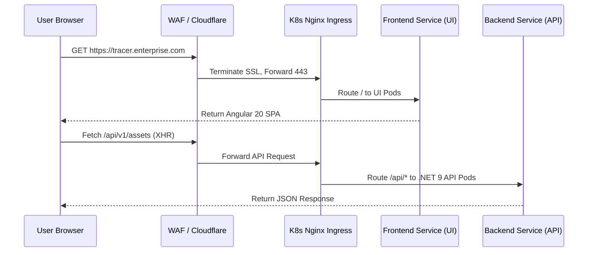
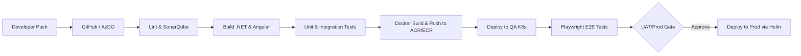

# Enterprise IT Asset Management System (Project Tracer)
## Document 11: Deployment & Infrastructure Design Document

**Prepared By:** Sakthivel P, Principal DevOps Architect  
**Document Version:** 1.0  
**Stack:** Docker, Kubernetes, Azure/AWS, GitHub Actions, Nginx, SQL Server, Redis  

---

## 1. Executive Summary
This document establishes the production-grade deployment and infrastructure architecture for Project Tracer. It aligns with Documents 1-10 to securely and reliably host the ASP.NET Core 9 backend, Angular 20 frontend, and SQL Server 2022 database. The architecture is cloud-agnostic but optimized for Kubernetes (AKS/EKS), utilizing containerization, automated CI/CD pipelines, and comprehensive observability.

---

## 2. Environment Strategy

| Environment | Purpose | Infrastructure Size | Data Sync | URL |
| :--- | :--- | :--- | :--- | :--- |
| **Development (Dev)** | Local & CI integration. | Docker Compose (Local) | Seeded Mock Data | `dev.tracer.internal` |
| **QA / Testing** | Automated E2E & QA validation. | K8s (1 Node), Basic PaaS | Anonymized Prod Snapshot | `qa.tracer.internal` |
| **UAT / Staging** | Business sign-off, Load testing. | K8s (2 Nodes), Standard PaaS | Pre-migration Prod Data | `uat.tracer.enterprise.com` |
| **Production (Prod)** | Live user traffic, High Availability. | K8s (3+ Nodes Auto-scale) | Live Production Data | `tracer.enterprise.com` |

---

## 3. Infrastructure Architecture

### 3.1 Cloud Deployment Diagram (Azure / AWS Pattern)
```mermaid
graph TD
    User((Users)) -->|HTTPS / TLS 1.3| WAF[Web Application Firewall / CDN]
    WAF --> Ingress[Nginx Ingress Controller / ALB]
    
    subgraph Kubernetes Cluster (AKS / EKS)
        Ingress --> UI_Pods[Angular UI Pods: Nginx Alpine]
        Ingress --> API_Pods[ASP.NET Core 9 API Pods]
        Ingress --> Worker_Pods[Hangfire Worker Pods]
        
        API_Pods --> Redis[(Redis Cache - Cluster)]
        Worker_Pods --> Redis
    end
    
    subgraph Managed Cloud Services
        API_Pods --> SQL[(Managed SQL Server / Azure SQL)]
        Worker_Pods --> SQL
        
        API_Pods --> Blob[(Azure Blob / AWS S3)]
        
        API_Pods --> KeyVault[(Azure Key Vault / AWS Secrets)]
    end
    
    subgraph Observability & Alerts
        API_Pods --> AppInsights[Application Insights / Prometheus]
        Worker_Pods --> AppInsights
        AppInsights --> Grafana[Grafana Dashboards]
        AppInsights --> SMTP[SendGrid / SMTP Relay]
    end
```

### 3.2 Network Diagram & Traffic Flow


### 3.3 Core Infrastructure Components
* **Reverse Proxy / Load Balancer:** Nginx Ingress Controller handles SSL termination and Layer 7 routing.
* **Database Deployment:** Managed SQL Server 2022 (Azure SQL Database / Amazon RDS) in a High Availability (Multi-AZ) configuration.
* **Blob Storage:** Azure Blob Storage / AWS S3 for saving user attachments, EULAs, and hardware manuals.
* **Redis:** Managed Redis instance (Azure Cache for Redis / ElastiCache) for L2 CQRS query caching, Hangfire state, and rate limiting.
* **SMTP:** External email gateway (SendGrid or corporate Exchange SMTP) securely accessed via VNet integration.

---

## 4. Container Strategy & Architecture

### 4.1 Backend Dockerfile (ASP.NET Core 9)
Uses a multi-stage build to ensure a minimal, secure production image.
```dockerfile
# Build Stage
FROM mcr.microsoft.com/dotnet/sdk:9.0-alpine AS build
WORKDIR /src
COPY ["Tracer.Api/Tracer.Api.csproj", "Tracer.Api/"]
COPY ["Tracer.Domain/Tracer.Domain.csproj", "Tracer.Domain/"]
# ... copy other layers
RUN dotnet restore "Tracer.Api/Tracer.Api.csproj"
COPY . .
WORKDIR "/src/Tracer.Api"
RUN dotnet build -c Release -o /app/build
RUN dotnet publish -c Release -o /app/publish /p:UseAppHost=false

# Runtime Stage
FROM mcr.microsoft.com/dotnet/aspnet:9.0-alpine AS final
WORKDIR /app
EXPOSE 8080
COPY --from=build /app/publish .
USER $APP_UID
ENTRYPOINT ["dotnet", "Tracer.Api.dll"]
```

### 4.2 Frontend Dockerfile (Angular 20 + Nginx)
```dockerfile
# Build Stage
FROM node:20-alpine AS build
WORKDIR /app
COPY package*.json ./
RUN npm ci
COPY . .
RUN npm run build --configuration=production

# Serve Stage
FROM nginx:alpine
COPY --from=build /app/dist/tracer-ui/browser /usr/share/nginx/html
COPY nginx.conf /etc/nginx/conf.d/default.conf
EXPOSE 80
CMD ["nginx", "-g", "daemon off;"]
```

### 4.3 Docker Compose Architecture (Local Development)
```yaml
version: '3.8'
services:
  tracer-api:
    build:
      context: .
      dockerfile: src/Tracer.Api/Dockerfile
    ports: ["5000:8080"]
    environment:
      - ConnectionStrings__DefaultConnection=Server=sql-server;Database=TracerDb;User=sa;Password=Your_Password123;TrustServerCertificate=True;
      - Redis__Configuration=redis:6379
    depends_on:
      - sql-server
      - redis

  tracer-ui:
    build:
      context: ./ui
      dockerfile: Dockerfile.dev
    ports: ["4200:4200"]

  sql-server:
    image: mcr.microsoft.com/mssql/server:2022-latest
    environment:
      - ACCEPT_EULA=Y
      - SA_PASSWORD=Your_Password123
    ports: ["1433:1433"]

  redis:
    image: redis:alpine
    ports: ["6379:6379"]
```

---

## 5. CI/CD Pipeline Strategy

### 5.1 Branching Strategy (GitFlow Custom)
* `main`: Represents production. Always stable.
* `release/vX.X`: Stabilization branches for UAT.
* `develop`: Integration branch for QA.
* `feature/*`: Developer branches. Merged to `develop` via PR.

### 5.2 CI/CD Pipeline Flow


### 5.3 GitHub Actions Workflow (CI/CD Example)
```yaml
name: Tracer CI/CD Pipeline

on:
  push:
    branches: [ "main", "develop" ]

jobs:
  build-and-test:
    runs-on: ubuntu-latest
    steps:
    - uses: actions/checkout@v4
    - name: Setup .NET 9
      uses: actions/setup-dotnet@v4
      with:
        dotnet-version: 9.0.x
    - name: Run Tests
      run: dotnet test tests/Tracer.Api.IntegrationTests/
      
  docker-build-push:
    needs: build-and-test
    runs-on: ubuntu-latest
    steps:
    - uses: actions/checkout@v4
    - name: Login to Azure Container Registry
      uses: azure/docker-login@v1
      with:
        login-server: traceracr.azurecr.io
        username: ${{ secrets.ACR_USERNAME }}
        password: ${{ secrets.ACR_PASSWORD }}
    - name: Build and Push API
      run: |
        docker build -t traceracr.azurecr.io/tracer-api:${{ github.sha }} -f src/Tracer.Api/Dockerfile .
        docker push traceracr.azurecr.io/tracer-api:${{ github.sha }}
        
  deploy-k8s:
    needs: docker-build-push
    runs-on: ubuntu-latest
    steps:
    - name: Set AKS Context
      uses: azure/aks-set-context@v3
      with:
        resource-group: tracer-rg
        cluster-name: tracer-aks
    - name: Deploy via Helm
      run: helm upgrade --install tracer ./charts/tracer --set api.image.tag=${{ github.sha }}
```

### 5.4 Release & Rollback Strategy
* **Release:** Rolling Deployments managed by Kubernetes. New pods are spun up and added to the service endpoint before old pods are terminated. Zero-downtime deployments.
* **Rollback:** Executed via `helm rollback tracer` or GitHub Actions rollback workflow restoring the previous stable image tag. Database rollbacks are handled via point-in-time restores, not reverse migrations.

---

## 6. Observability & Security

### 6.1 Monitoring & Logging
* **Logging:** Serilog writes structured JSON to `stdout`. FluentBit/Promtail scrapes logs from K8s nodes and ships them to an ELK stack or Azure Log Analytics.
* **Metrics:** OpenTelemetry SDK configured in ASP.NET Core 9 exposes `/metrics` endpoint. Prometheus scrapes this endpoint every 15s.
* **Dashboards:** Grafana visualizes MediatR query times, Hangfire queue lengths, and active DB connections.

### 6.2 Health Checks
Configured in K8s Deployment manifests mapping to ASP.NET Core health endpoints:
* **Liveness Probe:** `/health/live` (Checks if API is running).
* **Readiness Probe:** `/health/ready` (Checks SQL Server & Redis connectivity before routing traffic).

### 6.3 Secrets & Certificate Management
* **Secrets:** Azure Key Vault / AWS Secrets Manager. Secrets are injected into K8s Pods using the CSI Secrets Store Provider. No connection strings are stored in `appsettings.json`.
* **Certificates:** `cert-manager` running in K8s provisions automated Let's Encrypt TLS certificates for the Nginx Ingress Controller.

---

## 7. Business Continuity (DR & Backups)

### 7.1 Disaster Recovery (DR) Strategy
* **Active-Passive Setup:** Primary region serves all traffic. Secondary region has replicated database and infrastructure as code (IaC) ready to deploy via pipeline.
* **RPO (Recovery Point Objective):** 5 Minutes (Database Transaction Log backups).
* **RTO (Recovery Time Objective):** 2 Hours (Time to spin up K8s cluster and redirect DNS).

### 7.2 Backup Strategy
* **SQL Server:** Automated weekly full, daily differential, and 5-minute transaction log backups retained in geo-redundant Blob Storage.
* **Blob Storage:** Soft-delete enabled (30 days) and geo-replication (GRS).

### 7.3 Migration Strategy (Entity Framework)
* Migrations are **never** applied on startup (`context.Database.Migrate()` is forbidden in Prod).
* Migrations are generated as idempotent SQL scripts (`dotnet ef migrations script --idempotent`) and executed as a dedicated CI/CD pipeline step (via Azure DevOps Database Release or Flyway/DbUp) *before* the API pods are deployed.

---

## 8. Implementation Checklists

### 8.1 Infrastructure Provisioning Checklist
- [ ] VNet/VPC created with private subnets for DB and public subnets for Application Gateway/WAF.
- [ ] Kubernetes cluster provisioned with minimum 3 worker nodes.
- [ ] Managed SQL Server provisioned with strict firewall rules (VNet only).
- [ ] Redis cluster provisioned.
- [ ] Azure Key Vault / AWS Secrets Manager linked to K8s OIDC identity.

### 8.2 Security & Compliance Checklist
- [ ] WAF enabled with OWASP Top 10 rule sets.
- [ ] Ingress configured to strictly force HTTPS (TLS 1.3 only).
- [ ] Network Policies configured in K8s (UI pods can only talk to API pods; API pods can only talk to DB/Redis).
- [ ] Container Images scanned for CVEs using Trivy/Dependabot during CI.
- [ ] RunAsNonRoot security context enforced on all Pods.

### 8.3 Pre-Flight Deployment Checklist
- [ ] EF Core Migration script generated and reviewed by DBA.
- [ ] Load testing passed in UAT environment.
- [ ] Hangfire dashboard secured behind authentication.
- [ ] Application Insights connection string verified.
- [ ] Release branch locked and approved by Change Management.

---
*End of Document 11. Infrastructure is fully specified for DevSecOps implementation.*
