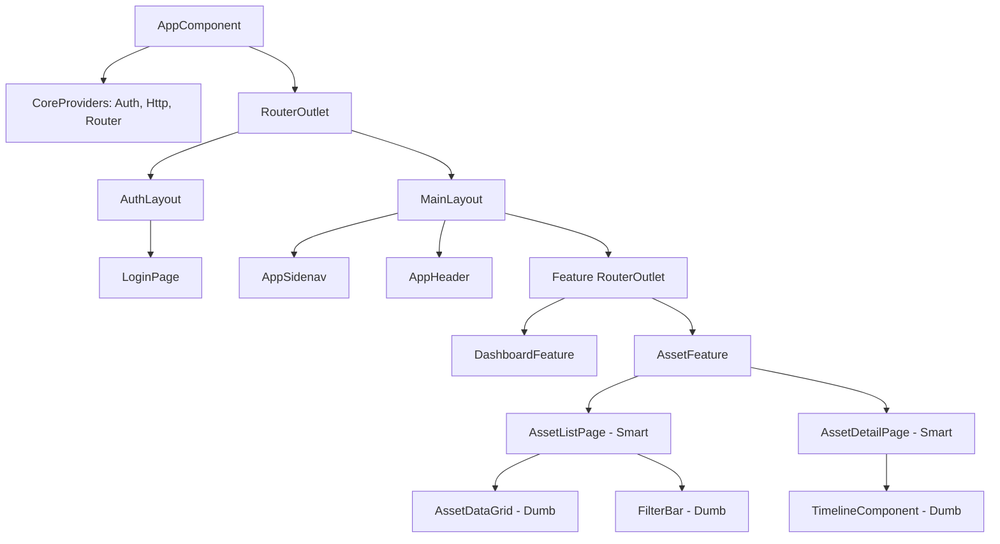
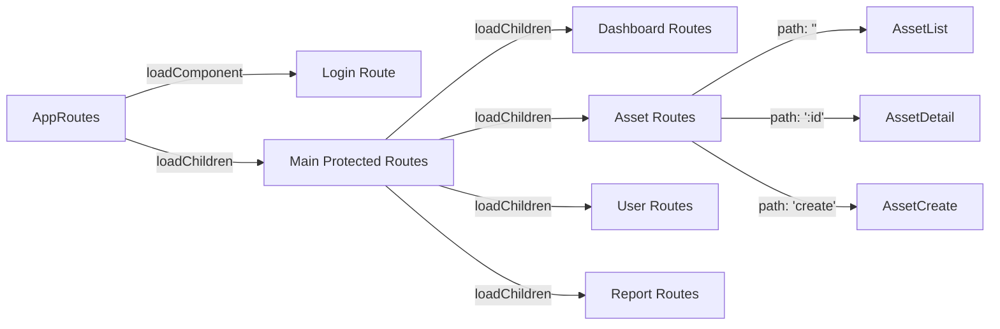
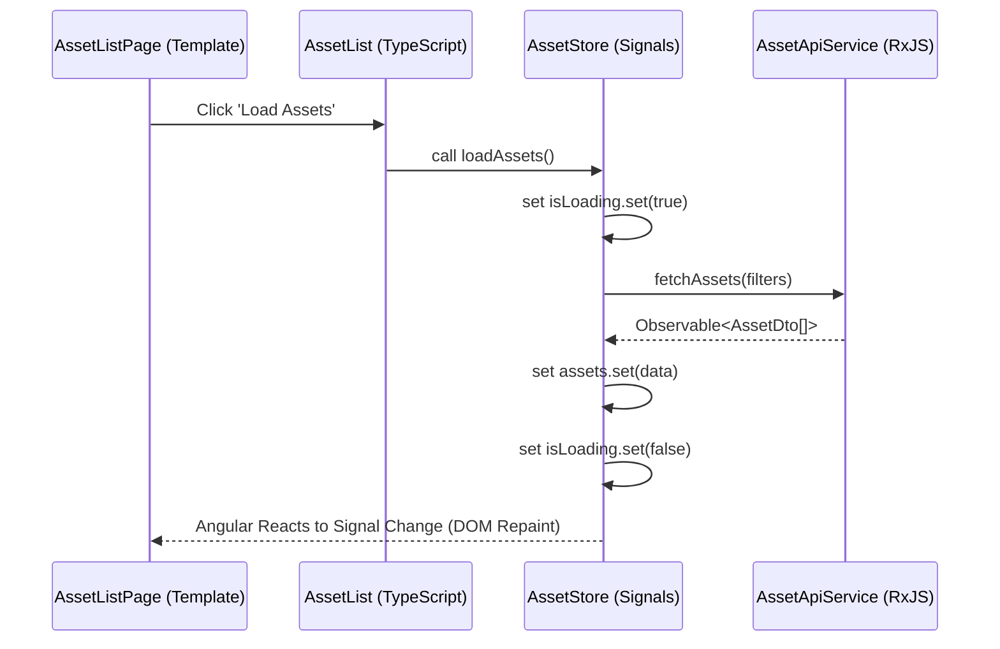
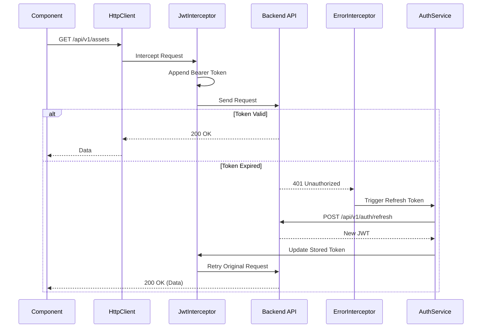

# Enterprise IT Asset Management System (Project Tracer)
## Document 9: Enterprise Frontend Architecture Specification

**Prepared By:** Sakthivel P, Principal Angular Architect  
**Document Version:** 1.0  
**Stack:** Angular 20, Signals, Standalone Components, Angular Material, RxJS, SCSS  

---

## 1. Executive Summary
This document establishes the production-ready frontend architecture for Project Tracer. Aligned with Documents 1-8, this architecture utilizes **Angular 20 Standalone Components** and a fully reactive **Signal-based state management** strategy. By eliminating `NgModule` boundaries and legacy Zone.js change detection (where possible), the frontend ensures enterprise-grade performance, scalability, and maintainability.

---

## 2. High-Level Architectural Strategies

### 2.1 State Management (Signal Store)
Tracer utilizes a localized, feature-based **Signal Store** pattern (inspired by `@ngrx/signals`). 
* **State:** Defined as immutable objects wrapped in a `signal`.
* **Derived State:** Read-only views created using `computed()`.
* **Mutations:** Strict update methods within injectable Store services.
* **Side Effects:** Handled via RxJS in services, bridging HTTP calls into Signal updates.

### 2.2 Routing & Lazy Loading Strategy
* **Standalone Routing:** `provideRouter()` with nested `Route` arrays.
* **Lazy Loading:** All feature modules are lazy-loaded using `loadChildren: () => import(...)`.
* **Component Deferral:** Heavy UI components (e.g., Dashboard Charts, Audit Logs Grids) utilize Angular 20 `@defer (on viewport)` blocks to optimize initial bundle size (LCP).

### 2.3 Offline & PWA Strategy
* **Service Worker:** `@angular/service-worker` configured for `performance` (caching static assets) and `freshness` (API calls).
* **IndexedDB:** Read-only reference data (Categories, Status Labels, Locations) is cached in IndexedDB to ensure rapid dropdown rendering and offline read capabilities.

### 2.4 Error Handling & Loading Strategy
* **Global Error Handler:** Implements `ErrorHandler` to catch unhandled UI exceptions and log them to Application Insights/Sentry.
* **HTTP Interceptor:** `HttpErrorInterceptor` catches 4xx/5xx responses, parsing the RFC 7807 Problem Details and dispatching a `MatSnackBar` notification.
* **Loading:** Centralized `LoadingSignal` injected into components, bound to `@defer` placeholder states and skeleton loaders.

### 2.5 Security, Theme, Accessibility (a11y), & i18n
* **Security:** Strict Content Security Policy (CSP), automatic DOM sanitization (Angular native), and HttpOnly cookie-based JWT parsing (or secure memory storage if strictly decoupled).
* **Theme:** SCSS-based CSS variables mapped to Angular Material 3 design tokens. Dark/Light mode toggled via `document.body.classList`.
* **A11y:** 100% compliance with WCAG 2.1 AA. Extensive use of `aria-live`, `aria-describedby`, and `cdkTrapFocus`.
* **i18n:** `@angular/localize` utilizing AOT translation compilation for zero-runtime overhead.

---

## 3. Global Application Structure

```text
src/
 ├── app/
 │    ├── core/                 # Singleton services, Interceptors, Guards, Global Store
 │    │    ├── auth/            # Auth state, JWT interceptor, Auth Guard
 │    │    ├── http/            # Base HTTP service, Error interceptor
 │    │    ├── store/           # Global signals (Theme, UserProfile)
 │    │    └── utils/           # Global utilities
 │    ├── shared/               # Reusable UI, Pipes, Directives (No business logic)
 │    │    ├── components/      # DataGrid, PageHeader, ConfirmDialog
 │    │    ├── directives/      # HasPermissionDirective, DragDropDirective
 │    │    └── pipes/           # CurrencyFormat, TimeAgo
 │    ├── layouts/              # Structural layouts
 │    │    ├── main-layout/     # Sidenav + Toolbar
 │    │    └── auth-layout/     # Centered card layout
 │    └── features/             # Lazy-loaded business domains (See Section 4)
 ├── assets/                    # i18n JSON, Images, Icons
 ├── styles/                    # Global SCSS, Material Theme variables
 └── main.ts                    # BootstrapApplication entry point
```

---

## 4. Feature Module Specifications

All features follow a strict **Smart/Dumb component architecture** and encapsulate their own State, Models, and Services.

### 4.1 Asset Module (`src/app/features/assets`)
**Purpose:** Core management of hardware lifecycles (Doc 8).
* **Components:**
  * *Pages (Smart):* `AssetListPage`, `AssetDetailPage`, `AssetCreatePage`.
  * *UI (Dumb):* `AssetFilterBar`, `AssetHistoryTimeline`, `AssetCheckoutForm`.
* **Dialogs:** `AssetCheckoutDialog`, `AssetCheckinDialog`, `AssetAuditDialog`.
* **Services:** `AssetApiService` (HTTP layer).
* **State Store:** `AssetStore` (Signals for `assets[]`, `selectedAsset`, `isLoading`).
* **Models/DTOs:** `AssetDto`, `CreateAssetCommand`, `AssetLifecycleEvent`.
* **Guards:** `UnsavedChangesGuard` (Create/Edit pages).
* **Resolvers:** `AssetDetailResolver` (Prefetch data before route transition).

### 4.2 Authentication & Authorization Modules (`src/app/core/auth`)
**Purpose:** JWT lifecycle and RBAC enforcement (Doc 7).
* **Components:** `LoginPage`, `ForgotPasswordPage`, `MfaChallengePage`.
* **Services:** `AuthService`, `TokenService`, `PermissionService`.
* **State Store:** `AuthStore` (Signals for `isAuthenticated`, `currentUser`, `roles`, `permissions[]`).
* **Interceptors:** `JwtInterceptor` (Attaches Bearer), `RefreshInterceptor` (Handles 401 retries).
* **Directives:** `*hasPermission="'Assets.Edit'"` (Structurally removes DOM elements if unauthorized).

### 4.3 Dashboard Module (`src/app/features/dashboard`)
**Purpose:** KPI aggregation and system overview.
* **Components:** `DashboardPage`, `KpiWidget`, `DepreciationChart`, `RecentActivityList`.
* **Services:** `DashboardApiService`.
* **State Store:** `DashboardStore` (Signals for `metrics`, `chartData`).
* **Performance:** Charts utilize `@defer (on viewport)` to delay loading D3.js/Chart.js libraries.

### 4.4 User & Role Modules (`src/app/features/users`, `.../roles`)
**Purpose:** Identity and Access management.
* **Components:** `UserListPage`, `UserProfilePage`, `RoleMatrixManager`.
* **Dialogs:** `ResetPasswordDialog`, `AssignRoleDialog`.
* **State Store:** `UserStore`, `RoleStore`.

### 4.5 License Module (`src/app/features/licenses`)
**Purpose:** Software seat tracking and compliance.
* **Components:** `LicenseListPage`, `LicenseDetailPage`, `SeatAllocationGrid`.
* **Dialogs:** `CheckoutSeatDialog`.
* **Models:** `LicenseDto`, `LicenseSeatDto`.

### 4.6 Maintenance Module (`src/app/features/maintenance`)
**Purpose:** Hardware repair and warranty tracking.
* **Components:** `MaintenanceListPage`, `RepairTicketForm`.
* **Store:** `MaintenanceStore` (Tracks active repairs vs historical).

### 4.7 Reports & Export Modules (`src/app/features/reports`)
**Purpose:** Asynchronous job polling for heavy data extraction.
* **Components:** `ReportBuilderPage`, `JobStatusTracker`.
* **State Store:** `ReportStore` (Signals tracking `activeJobs[]` and their percentage completion).
* **RxJS Usage:** Uses `timer()` and `switchMap()` for polling background job completion endpoints.

### 4.8 Settings & Notification Modules (`src/app/features/settings`)
**Purpose:** Tenant configurations and system alerts.
* **Components:** `GlobalSettingsPage`, `NotificationCenterDropdown`, `CustomFieldBuilder`.
* **Store:** `SettingsStore` (Injected at root to provide global configurations to all features).

---

## 5. Architectural Diagrams (Mermaid)

### 5.1 Component Hierarchy Diagram


### 5.2 Routing & Lazy Loading Diagram


### 5.3 Signal Store State Flow Diagram
Demonstrates the unidirectional data flow using Signals and RxJS.


### 5.4 Auth & Interceptor Flow Diagram


---

## 6. Performance & Optimization Strategy

1. **Change Detection:** By utilizing Signals and Standalone components, `ChangeDetectionStrategy.OnPush` is effectively bypassed in favor of localized, fine-grained DOM updates. Zone.js can be eventually phased out (Zoneless Angular).
2. **Virtual Scrolling:** Implemented via `@angular/cdk/scrolling`. Data grids (e.g., Asset List, User List) with > 100 rows will use `cdk-virtual-scroll-viewport` to maintain 60fps rendering.
3. **Bundle Optimization:** * Strict imports (avoiding barrel files `index.ts` where they break tree-shaking).
   * Image optimization via Angular `NgOptimizedImage` directive.
   * Font preloading in `index.html`.

## 7. Testing Strategy
* **Unit Testing:** `Jest` replaces Karma/Jasmine for faster, headless test execution. Services and Signal Stores are tested in isolation.
* **Component Testing:** Angular Testing Library (ATL) utilized to test components based on DOM accessibility queries (e.g., `getByRole`) rather than implementation details.
* **End-to-End (E2E):** `Playwright` handles full UI workflow testing (e.g., executing the Asset Checkout workflow from Login to EULA acceptance).

---
*End of Document 9. Architecture is production-ready and aligned with Docs 1-8.*
