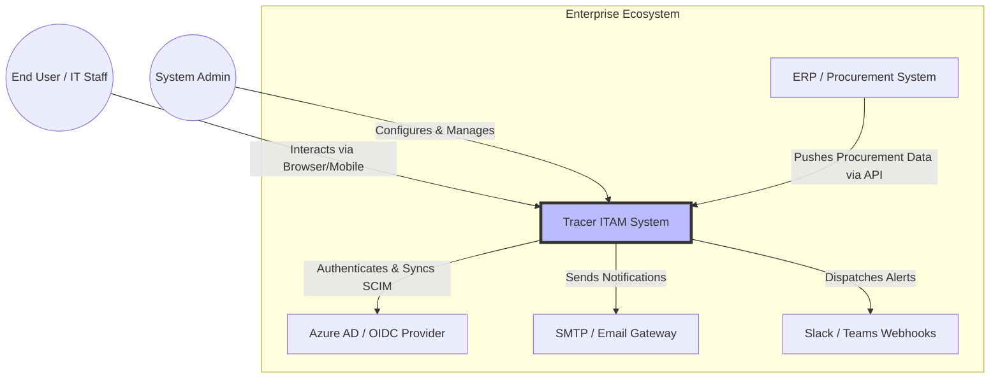
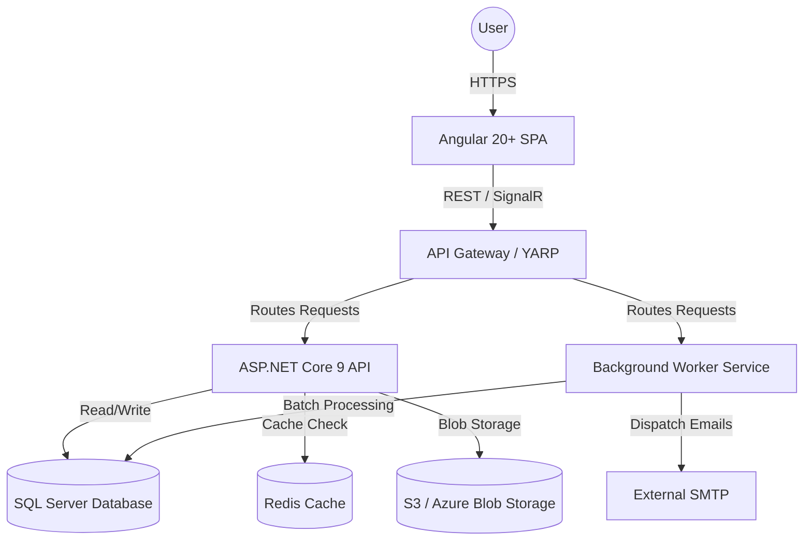
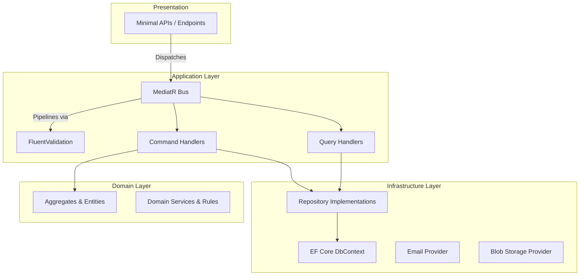
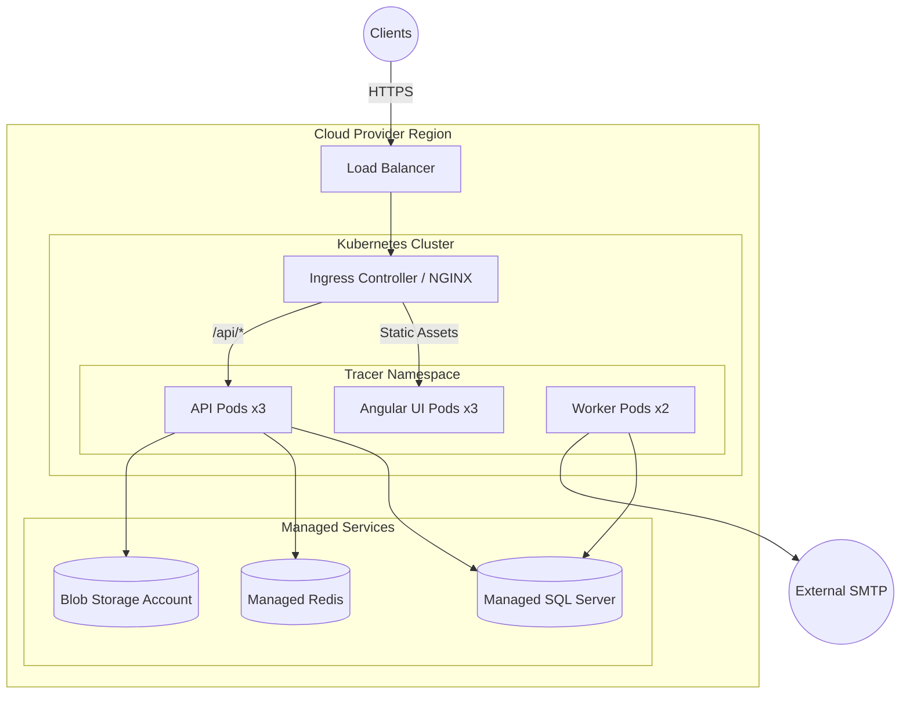
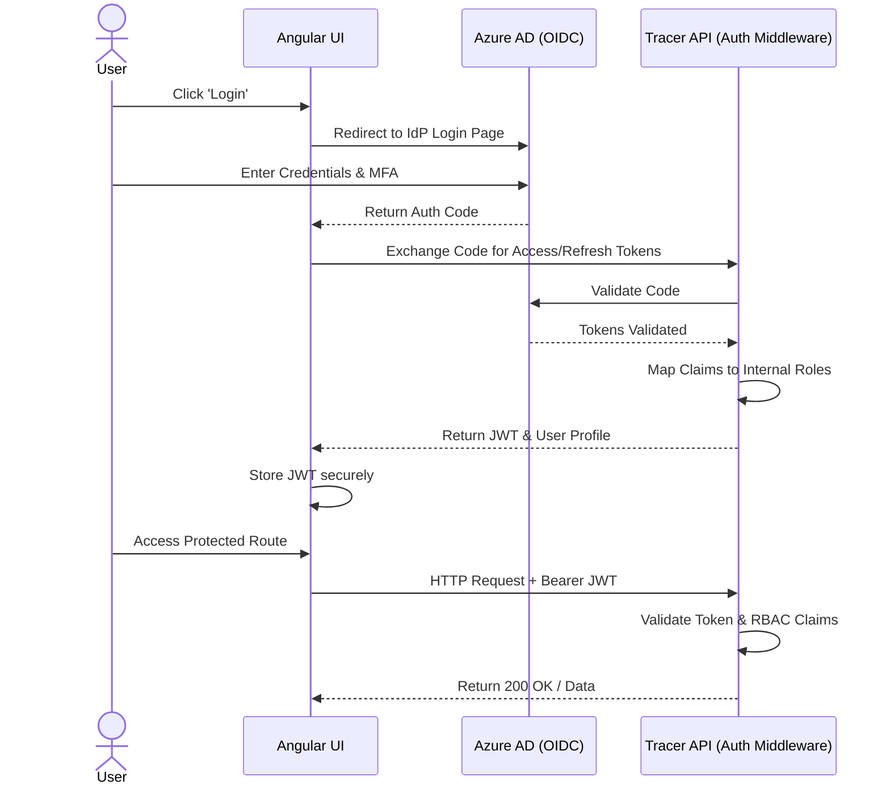
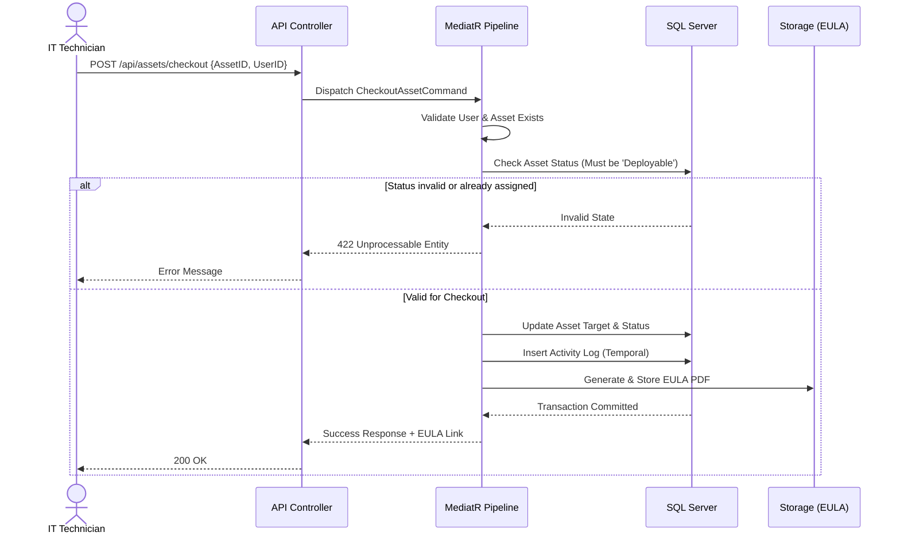
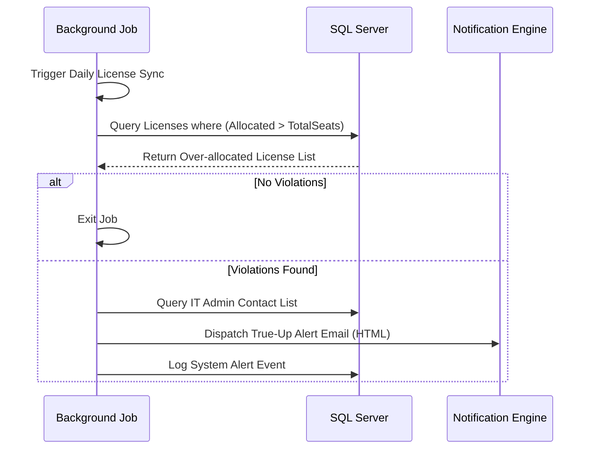
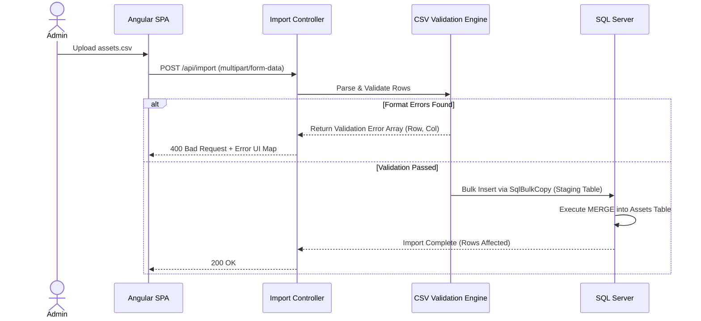

# Enterprise IT Asset Management System (Project Tracer)
## Document 3: High-Level Design (HLD)

**Prepared By:** Sakthivel P, Principal Enterprise Architect  
**Document Version:** 1.0  
**Status:** Approved for Architectural Review  

---

## 1. Introduction
This High-Level Design (HLD) document outlines the architectural blueprints for Project Tracer. Utilizing the C4 model (Context, Container, Component), alongside detailed sequence and deployment diagrams, this document provides a comprehensive visual and narrative guide to how the system is structured, deployed, and operates at scale using ASP.NET Core 9, Angular 20+, and SQL Server.

---

## 2. C4 Architecture Models

### 2.1 Level 1: System Context Diagram
This diagram illustrates Tracer within the broader enterprise ecosystem, highlighting interactions with external actors and systems.

**Component Explanation:**
* **Tracer ITAM System:** The core application boundaries.
* **Azure AD / IdP:** Provides centralized identity management and SCIM-based automated user provisioning.
* **SMTP & Messaging:** External communication channels for automated alerts (e.g., checkout EULAs, low stock warnings).
* **ERP:** Source of truth for initial hardware purchasing data, feeding into Tracer's pending inventory via secure REST APIs.

### 2.2 Level 2: Container Diagram
Breaks down the Tracer system into its major executing containers.

**Component Explanation:**
* **Angular 20+ SPA:** The static frontend application, utilizing Angular Signals for reactive state.
* **API Gateway (YARP):** Acts as the reverse proxy, handling SSL termination, rate limiting, and routing.
* **ASP.NET Core 9 API:** The core monolithic application hosting the Clean Architecture backend.
* **Background Worker Service:** Dedicated .NET Generic Host for executing cron jobs (e.g., license expiration checks, daily backups).
* **SQL Server:** Relational storage utilizing Temporal Tables for the Activity Log.
* **Redis Cache:** Distributed cache for session state, API response caching, and MediatR query caching.
* **S3/Blob Storage:** Unstructured storage for asset photos, PDF manuals, and EULA signatures.

### 2.3 Level 3: Component Diagram (Backend API)
Details the internal structure of the ASP.NET Core API container utilizing Clean Architecture and CQRS.

**Component Explanation:**
* **Minimal APIs:** Thin routing layer that strictly accepts HTTP requests and pushes them onto the MediatR bus.
* **MediatR Bus:** Implements the CQRS pattern. Write operations (Commands) and Read operations (Queries) are strictly separated.
* **FluentValidation:** Pipeline behavior that intercepts MediatR requests and rejects invalid payloads before they reach handlers.
* **Domain Entities:** The rich domain model (e.g., `Asset`, `License`) containing business logic and invariants. Zero external dependencies.
* **Infrastructure (EF Core):** Concrete implementation of database access, translating domain interactions into SQL queries.

---

## 3. Deployment Architecture

### 3.1 Kubernetes Deployment Diagram
Tracer is designed for containerized deployment using Docker and Kubernetes.

**Component Explanation:**
* **Horizontal Pod Autoscaling (HPA):** API and UI pods scale dynamically based on CPU/Memory thresholds.
* **Managed Services:** Database, Caching, and Storage are offloaded to cloud-native PaaS offerings for high availability and automated backups.

---

## 4. Sequence Diagrams & Workflows

### 4.1 Authentication & Authorization Flow (OIDC)

### 4.2 Asset Checkout Workflow

### 4.3 License True-Up & Allocation Workflow

### 4.4 Data Import Pipeline (CSV)

---

## 5. Sub-System Architectures

### 5.1 Logging & Activity Architecture
Tracer utilizes two distinct logging paradigms:
1.  **Application Telemetry (Serilog + OpenTelemetry):** Captures HTTP requests, exceptions, and performance metrics. Routed to ELK (Elasticsearch, Logstash, Kibana) or Datadog.
2.  **Domain Activity Logging (SQL Temporal Tables):** Business-level audit trails. Every domain entity (Asset, License, User) maps to a SQL Temporal Table. Any `UPDATE` or `DELETE` automatically pushes the previous state row into an immutable History table, linked by the transaction timestamp and User ID.

### 5.2 Caching Strategy
* **L1 Cache (In-Memory):** Scoped to the MediatR request pipeline to prevent duplicate database queries within a single HTTP request boundary.
* **L2 Cache (Redis Distributed):** Used for highly concurrent read models. 
    * *Example:* The `Categories` and `Locations` drop-down lists are cached in Redis. When an Admin adds a new Category, an `EntityCreatedEvent` invalidates the specific Redis key.

### 5.3 Background Jobs Framework
Implemented using **Quartz.NET** integrated into the ASP.NET Core Generic Host.
* **Job Persistence:** Quartz utilizes SQL Server to persist job triggers. If a worker pod crashes, another pod will pick up the stalled job.
* **Key Scheduled Jobs:**
    * `DailyDepreciationCalculatorJob`: Updates financial current-value fields.
    * `LicenseExpirationNotifierJob`: Scans for licenses expiring in 30/15/7 days.
    * `AdSyncWorker`: Polls Azure AD for delta changes if SCIM push is not utilized.

---
*End of Document 3. Awaiting next instruction.*
