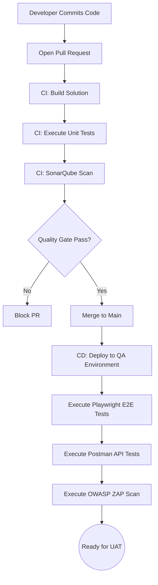
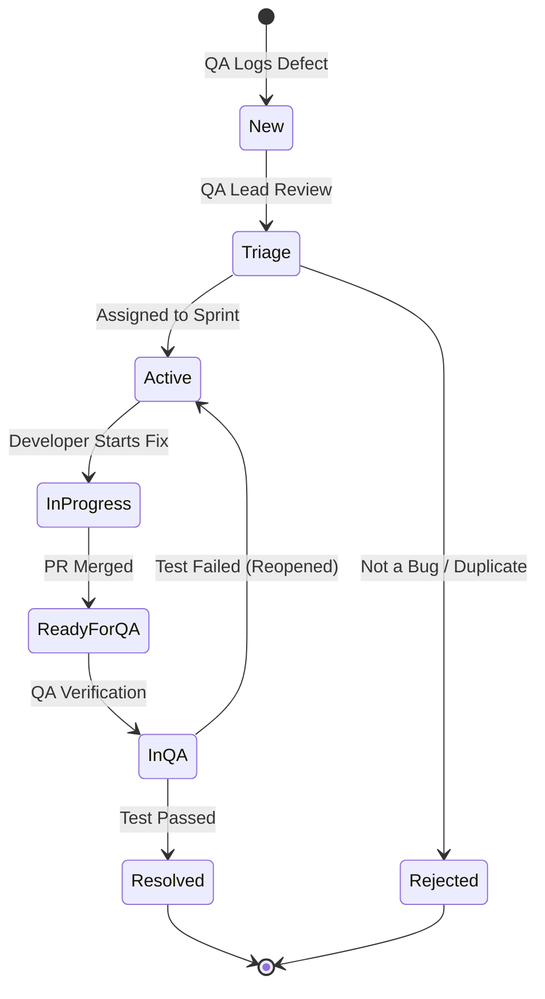
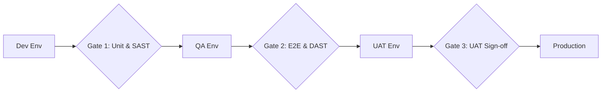

# Enterprise IT Asset Management System (Project Tracer)
## Document 12: Testing and Quality Assurance Design Document

**Prepared By:** Sakthivel P, Principal QA Architect  
**Document Version:** 1.0  
**Target Architecture:** ASP.NET Core 9, Angular 20, SQL Server, CQRS/MediatR, Kubernetes  

---

## 1. Global Testing & Quality Strategy

### 1.1 Quality Strategy Overview
The quality strategy for Project Tracer enforces a "Shift-Left" testing methodology. Quality is injected at the architecture and PR levels rather than waiting for post-deployment QA cycles. The strategy guarantees adherence to enterprise requirements outlined in Documents 1–11, ensuring high availability, strict RBAC compliance, and zero-defect deployments for critical asset lifecycle workflows.

### 1.2 Test Pyramid
The testing automation suite strictly adheres to the Agile Test Pyramid:
*   **Unit Tests (70%):** Fast, highly isolated tests targeting Domain Entities, Value Objects, MediatR Handlers, and Angular Standalone Components.
*   **Integration Tests (20%):** Tests crossing boundaries, specifically EF Core Repository interactions with SQL Server (using Testcontainers) and API Controller integrations.
*   **E2E / UI Tests (10%):** Browser-based workflows replicating the user journey from login to EULA acceptance using Playwright.

---

## 2. Testing Methodologies & Phases

### 2.1 Unit Testing
*   **Backend:** `xUnit`, `Moq`, and `FluentAssertions`. Targets Domain invariants and Application layer CQRS handlers.
*   **Frontend:** `Jest` and Angular Testing Library. Tests isolated Signals state transitions and Smart Component logic.

### 2.2 Integration Testing
*   **Backend:** `WebApplicationFactory` combined with `Testcontainers` (Dockerized SQL Server and Redis) to validate DB schemas, HTTP pipelines, and Outbox event publishing.

### 2.3 API Testing
*   **Tooling:** Postman / Newman integrated into CI.
*   **Scope:** Verifies HTTP status codes, JSON schema validation, pagination limits, and RFC 7807 Problem Details error formats.

### 2.4 UI & End-to-End (E2E) Testing
*   **Tooling:** `Playwright`.
*   **Scope:** Automated browser testing across Chromium, WebKit, and Firefox. Validates layout integrity, Angular routing, and full end-to-end asset procurement-to-checkout flows.

### 2.5 Security Testing
*   **Static Application Security Testing (SAST):** SonarQube scans on every PR.
*   **Dynamic Application Security Testing (DAST):** OWASP ZAP integrated into the QA release pipeline.
*   **Dependency Scanning:** GitHub Dependabot / Trivy for container image vulnerabilities.

### 2.6 Performance, Load, and Stress Testing
*   **Tooling:** `k6`.
*   **Load Testing:** Simulates 5,000 concurrent users accessing the Dashboard and executing Search queries to validate the 100ms response time requirement.
*   **Stress Testing:** Pushes bulk imports (10,000+ records) to validate Hangfire worker limits and SQL Server deadlock prevention.

### 2.7 Accessibility Testing
*   **Tooling:** `axe-core` integrated with Playwright.
*   **Scope:** Ensures WCAG 2.1 AA compliance across all Angular Material components.

### 2.8 Standard Pipeline Testing
*   **Smoke Testing:** Post-deployment validation of critical endpoints (`/health/ready`, `/api/v1/auth/login`).
*   **Sanity Testing:** Targeted execution of test suites on modified modules before merging.
*   **Regression Testing:** Automated execution of the full E2E and Integration suite nightly.
*   **User Acceptance Testing (UAT):** Manual sign-off by Department Managers and Finance Officers on the Staging environment.

---

## 3. QA Governance & Standards

### 3.1 Definition of Done (DoD)
A User Story is considered "Done" only when:
1.  Code compiles without warnings.
2.  Unit Test coverage for new code is >= 85%.
3.  SonarQube Quality Gate passes (0 Critical/Blocker defects, 0 Security Hotspots).
4.  API endpoints are documented via Swagger.
5.  Playwright E2E tests are written and passing for new workflows.
6.  Feature is deployed to the QA environment and passes Smoke Tests.

### 3.2 Code Coverage & Static Code Analysis
*   **Code Coverage Strategy:** Enforced via `coverlet.collector`. PRs failing the 85% threshold are automatically blocked by GitHub Actions/Azure DevOps branch policies.
*   **SonarQube Rules:** Enforces strict Clean Architecture rules (e.g., Domain layer cannot reference `Microsoft.EntityFrameworkCore`).

### 3.3 Defect Lifecycle & Severity Matrix
**Lifecycle:** `New -> Triage -> Active -> In Progress -> Ready for QA -> In QA -> Resolved / Closed`.
**Severity Matrix:**
*   **S1 (Critical):** Data loss, Security breach, System down. (Fix SLA: 4 Hours).
*   **S2 (High):** Core workflow broken (e.g., Cannot checkout asset), no workaround. (Fix SLA: 24 Hours).
*   **S3 (Medium):** Non-critical feature broken, workaround exists. (Fix SLA: Next Sprint).
*   **S4 (Low):** UI glitch, typo, minor layout issue. (Fix SLA: Backlog).

### 3.4 Risk-Based Testing & Test Data Strategy
*   **Test Data Strategy:** Ephemeral databases spun up via `Testcontainers` during CI. `Bogus` and `AutoFixture` used to generate randomized, realistic mock data for Assets, Users, and Licenses.
*   **Risk-Based Execution:** High-risk areas (Authentication, RBAC logic, Financial Depreciation calculations) enforce 100% mutation testing coverage.

---

## 4. Mermaid QA Diagrams

### 4.1 Test Workflow

### 4.2 Defect Lifecycle

### 4.3 Release Pipeline Quality Gates

---

## 5. Module-Specific Test Scenarios

### 5.1 Module: Authentication

#### Test Scenarios
*   **Positive Test Cases:** Verify successful CRUD operations and state transitions for Authentication with valid payloads.
*   **Negative Test Cases:** Verify rejection of invalid payloads, duplicate entries, and malformed identifiers.
*   **Boundary Test Cases:** Test maximum string lengths (255 chars), maximum pagination limits (1000), and integer boundaries.
*   **Validation Rules:** Assert that FluentValidation correctly identifies missing mandatory fields and returns 400 Bad Request.
*   **Error Handling Tests:** Simulate database timeouts and verify the Global Exception Middleware returns a standard RFC 7807 Problem Details response.
*   **Authorization Tests:** Attempt to access/mutate Authentication using a JWT that lacks the `Authentication.View` or `Authentication.Edit` claims. Expect 403 Forbidden.
*   **Authentication Tests:** Attempt to hit `Authentication` endpoints without a Bearer token. Expect 401 Unauthorized.
*   **Workflow Tests:** Validate event publishing. E.g., when a Authentication is mutated, ensure an Outbox event is created and processed by Hangfire.
*   **Performance Tests:** Ensure `GET /api/v1/authentication` responds in under 100ms at the P95 latency threshold.

### 5.2 Module: Users

#### Test Scenarios
*   **Positive Test Cases:** Verify successful CRUD operations and state transitions for Users with valid payloads.
*   **Negative Test Cases:** Verify rejection of invalid payloads, duplicate entries, and malformed identifiers.
*   **Boundary Test Cases:** Test maximum string lengths (255 chars), maximum pagination limits (1000), and integer boundaries.
*   **Validation Rules:** Assert that FluentValidation correctly identifies missing mandatory fields and returns 400 Bad Request.
*   **Error Handling Tests:** Simulate database timeouts and verify the Global Exception Middleware returns a standard RFC 7807 Problem Details response.
*   **Authorization Tests:** Attempt to access/mutate Users using a JWT that lacks the `Users.View` or `Users.Edit` claims. Expect 403 Forbidden.
*   **Authentication Tests:** Attempt to hit `Users` endpoints without a Bearer token. Expect 401 Unauthorized.
*   **Workflow Tests:** Validate event publishing. E.g., when a Users is mutated, ensure an Outbox event is created and processed by Hangfire.
*   **Performance Tests:** Ensure `GET /api/v1/users` responds in under 100ms at the P95 latency threshold.

### 5.3 Module: Roles

#### Test Scenarios
*   **Positive Test Cases:** Verify successful CRUD operations and state transitions for Roles with valid payloads.
*   **Negative Test Cases:** Verify rejection of invalid payloads, duplicate entries, and malformed identifiers.
*   **Boundary Test Cases:** Test maximum string lengths (255 chars), maximum pagination limits (1000), and integer boundaries.
*   **Validation Rules:** Assert that FluentValidation correctly identifies missing mandatory fields and returns 400 Bad Request.
*   **Error Handling Tests:** Simulate database timeouts and verify the Global Exception Middleware returns a standard RFC 7807 Problem Details response.
*   **Authorization Tests:** Attempt to access/mutate Roles using a JWT that lacks the `Roles.View` or `Roles.Edit` claims. Expect 403 Forbidden.
*   **Authentication Tests:** Attempt to hit `Roles` endpoints without a Bearer token. Expect 401 Unauthorized.
*   **Workflow Tests:** Validate event publishing. E.g., when a Roles is mutated, ensure an Outbox event is created and processed by Hangfire.
*   **Performance Tests:** Ensure `GET /api/v1/roles` responds in under 100ms at the P95 latency threshold.

### 5.4 Module: Permissions

#### Test Scenarios
*   **Positive Test Cases:** Verify successful CRUD operations and state transitions for Permissions with valid payloads.
*   **Negative Test Cases:** Verify rejection of invalid payloads, duplicate entries, and malformed identifiers.
*   **Boundary Test Cases:** Test maximum string lengths (255 chars), maximum pagination limits (1000), and integer boundaries.
*   **Validation Rules:** Assert that FluentValidation correctly identifies missing mandatory fields and returns 400 Bad Request.
*   **Error Handling Tests:** Simulate database timeouts and verify the Global Exception Middleware returns a standard RFC 7807 Problem Details response.
*   **Authorization Tests:** Attempt to access/mutate Permissions using a JWT that lacks the `Permissions.View` or `Permissions.Edit` claims. Expect 403 Forbidden.
*   **Authentication Tests:** Attempt to hit `Permissions` endpoints without a Bearer token. Expect 401 Unauthorized.
*   **Workflow Tests:** Validate event publishing. E.g., when a Permissions is mutated, ensure an Outbox event is created and processed by Hangfire.
*   **Performance Tests:** Ensure `GET /api/v1/permissions` responds in under 100ms at the P95 latency threshold.

### 5.5 Module: Assets

#### Test Scenarios
*   **Positive Test Cases:** Verify successful CRUD operations and state transitions for Assets with valid payloads.
*   **Negative Test Cases:** Verify rejection of invalid payloads, duplicate entries, and malformed identifiers.
*   **Boundary Test Cases:** Test maximum string lengths (255 chars), maximum pagination limits (1000), and integer boundaries.
*   **Validation Rules:** Assert that FluentValidation correctly identifies missing mandatory fields and returns 400 Bad Request.
*   **Error Handling Tests:** Simulate database timeouts and verify the Global Exception Middleware returns a standard RFC 7807 Problem Details response.
*   **Authorization Tests:** Attempt to access/mutate Assets using a JWT that lacks the `Assets.View` or `Assets.Edit` claims. Expect 403 Forbidden.
*   **Authentication Tests:** Attempt to hit `Assets` endpoints without a Bearer token. Expect 401 Unauthorized.
*   **Workflow Tests:** Validate event publishing. E.g., when a Assets is mutated, ensure an Outbox event is created and processed by Hangfire.
*   **Performance Tests:** Ensure `GET /api/v1/assets` responds in under 100ms at the P95 latency threshold.

### 5.6 Module: Asset Models

#### Test Scenarios
*   **Positive Test Cases:** Verify successful CRUD operations and state transitions for Asset Models with valid payloads.
*   **Negative Test Cases:** Verify rejection of invalid payloads, duplicate entries, and malformed identifiers.
*   **Boundary Test Cases:** Test maximum string lengths (255 chars), maximum pagination limits (1000), and integer boundaries.
*   **Validation Rules:** Assert that FluentValidation correctly identifies missing mandatory fields and returns 400 Bad Request.
*   **Error Handling Tests:** Simulate database timeouts and verify the Global Exception Middleware returns a standard RFC 7807 Problem Details response.
*   **Authorization Tests:** Attempt to access/mutate Asset Models using a JWT that lacks the `AssetModels.View` or `AssetModels.Edit` claims. Expect 403 Forbidden.
*   **Authentication Tests:** Attempt to hit `Asset Models` endpoints without a Bearer token. Expect 401 Unauthorized.
*   **Workflow Tests:** Validate event publishing. E.g., when a Asset Models is mutated, ensure an Outbox event is created and processed by Hangfire.
*   **Performance Tests:** Ensure `GET /api/v1/asset-models` responds in under 100ms at the P95 latency threshold.

### 5.7 Module: Manufacturers

#### Test Scenarios
*   **Positive Test Cases:** Verify successful CRUD operations and state transitions for Manufacturers with valid payloads.
*   **Negative Test Cases:** Verify rejection of invalid payloads, duplicate entries, and malformed identifiers.
*   **Boundary Test Cases:** Test maximum string lengths (255 chars), maximum pagination limits (1000), and integer boundaries.
*   **Validation Rules:** Assert that FluentValidation correctly identifies missing mandatory fields and returns 400 Bad Request.
*   **Error Handling Tests:** Simulate database timeouts and verify the Global Exception Middleware returns a standard RFC 7807 Problem Details response.
*   **Authorization Tests:** Attempt to access/mutate Manufacturers using a JWT that lacks the `Manufacturers.View` or `Manufacturers.Edit` claims. Expect 403 Forbidden.
*   **Authentication Tests:** Attempt to hit `Manufacturers` endpoints without a Bearer token. Expect 401 Unauthorized.
*   **Workflow Tests:** Validate event publishing. E.g., when a Manufacturers is mutated, ensure an Outbox event is created and processed by Hangfire.
*   **Performance Tests:** Ensure `GET /api/v1/manufacturers` responds in under 100ms at the P95 latency threshold.

### 5.8 Module: Categories

#### Test Scenarios
*   **Positive Test Cases:** Verify successful CRUD operations and state transitions for Categories with valid payloads.
*   **Negative Test Cases:** Verify rejection of invalid payloads, duplicate entries, and malformed identifiers.
*   **Boundary Test Cases:** Test maximum string lengths (255 chars), maximum pagination limits (1000), and integer boundaries.
*   **Validation Rules:** Assert that FluentValidation correctly identifies missing mandatory fields and returns 400 Bad Request.
*   **Error Handling Tests:** Simulate database timeouts and verify the Global Exception Middleware returns a standard RFC 7807 Problem Details response.
*   **Authorization Tests:** Attempt to access/mutate Categories using a JWT that lacks the `Categories.View` or `Categories.Edit` claims. Expect 403 Forbidden.
*   **Authentication Tests:** Attempt to hit `Categories` endpoints without a Bearer token. Expect 401 Unauthorized.
*   **Workflow Tests:** Validate event publishing. E.g., when a Categories is mutated, ensure an Outbox event is created and processed by Hangfire.
*   **Performance Tests:** Ensure `GET /api/v1/categories` responds in under 100ms at the P95 latency threshold.

### 5.9 Module: Suppliers

#### Test Scenarios
*   **Positive Test Cases:** Verify successful CRUD operations and state transitions for Suppliers with valid payloads.
*   **Negative Test Cases:** Verify rejection of invalid payloads, duplicate entries, and malformed identifiers.
*   **Boundary Test Cases:** Test maximum string lengths (255 chars), maximum pagination limits (1000), and integer boundaries.
*   **Validation Rules:** Assert that FluentValidation correctly identifies missing mandatory fields and returns 400 Bad Request.
*   **Error Handling Tests:** Simulate database timeouts and verify the Global Exception Middleware returns a standard RFC 7807 Problem Details response.
*   **Authorization Tests:** Attempt to access/mutate Suppliers using a JWT that lacks the `Suppliers.View` or `Suppliers.Edit` claims. Expect 403 Forbidden.
*   **Authentication Tests:** Attempt to hit `Suppliers` endpoints without a Bearer token. Expect 401 Unauthorized.
*   **Workflow Tests:** Validate event publishing. E.g., when a Suppliers is mutated, ensure an Outbox event is created and processed by Hangfire.
*   **Performance Tests:** Ensure `GET /api/v1/suppliers` responds in under 100ms at the P95 latency threshold.

### 5.10 Module: Companies

#### Test Scenarios
*   **Positive Test Cases:** Verify successful CRUD operations and state transitions for Companies with valid payloads.
*   **Negative Test Cases:** Verify rejection of invalid payloads, duplicate entries, and malformed identifiers.
*   **Boundary Test Cases:** Test maximum string lengths (255 chars), maximum pagination limits (1000), and integer boundaries.
*   **Validation Rules:** Assert that FluentValidation correctly identifies missing mandatory fields and returns 400 Bad Request.
*   **Error Handling Tests:** Simulate database timeouts and verify the Global Exception Middleware returns a standard RFC 7807 Problem Details response.
*   **Authorization Tests:** Attempt to access/mutate Companies using a JWT that lacks the `Companies.View` or `Companies.Edit` claims. Expect 403 Forbidden.
*   **Authentication Tests:** Attempt to hit `Companies` endpoints without a Bearer token. Expect 401 Unauthorized.
*   **Workflow Tests:** Validate event publishing. E.g., when a Companies is mutated, ensure an Outbox event is created and processed by Hangfire.
*   **Performance Tests:** Ensure `GET /api/v1/companies` responds in under 100ms at the P95 latency threshold.

### 5.11 Module: Departments

#### Test Scenarios
*   **Positive Test Cases:** Verify successful CRUD operations and state transitions for Departments with valid payloads.
*   **Negative Test Cases:** Verify rejection of invalid payloads, duplicate entries, and malformed identifiers.
*   **Boundary Test Cases:** Test maximum string lengths (255 chars), maximum pagination limits (1000), and integer boundaries.
*   **Validation Rules:** Assert that FluentValidation correctly identifies missing mandatory fields and returns 400 Bad Request.
*   **Error Handling Tests:** Simulate database timeouts and verify the Global Exception Middleware returns a standard RFC 7807 Problem Details response.
*   **Authorization Tests:** Attempt to access/mutate Departments using a JWT that lacks the `Departments.View` or `Departments.Edit` claims. Expect 403 Forbidden.
*   **Authentication Tests:** Attempt to hit `Departments` endpoints without a Bearer token. Expect 401 Unauthorized.
*   **Workflow Tests:** Validate event publishing. E.g., when a Departments is mutated, ensure an Outbox event is created and processed by Hangfire.
*   **Performance Tests:** Ensure `GET /api/v1/departments` responds in under 100ms at the P95 latency threshold.

### 5.12 Module: Locations

#### Test Scenarios
*   **Positive Test Cases:** Verify successful CRUD operations and state transitions for Locations with valid payloads.
*   **Negative Test Cases:** Verify rejection of invalid payloads, duplicate entries, and malformed identifiers.
*   **Boundary Test Cases:** Test maximum string lengths (255 chars), maximum pagination limits (1000), and integer boundaries.
*   **Validation Rules:** Assert that FluentValidation correctly identifies missing mandatory fields and returns 400 Bad Request.
*   **Error Handling Tests:** Simulate database timeouts and verify the Global Exception Middleware returns a standard RFC 7807 Problem Details response.
*   **Authorization Tests:** Attempt to access/mutate Locations using a JWT that lacks the `Locations.View` or `Locations.Edit` claims. Expect 403 Forbidden.
*   **Authentication Tests:** Attempt to hit `Locations` endpoints without a Bearer token. Expect 401 Unauthorized.
*   **Workflow Tests:** Validate event publishing. E.g., when a Locations is mutated, ensure an Outbox event is created and processed by Hangfire.
*   **Performance Tests:** Ensure `GET /api/v1/locations` responds in under 100ms at the P95 latency threshold.

### 5.13 Module: Software Licenses

#### Test Scenarios
*   **Positive Test Cases:** Verify successful CRUD operations and state transitions for Software Licenses with valid payloads.
*   **Negative Test Cases:** Verify rejection of invalid payloads, duplicate entries, and malformed identifiers.
*   **Boundary Test Cases:** Test maximum string lengths (255 chars), maximum pagination limits (1000), and integer boundaries.
*   **Validation Rules:** Assert that FluentValidation correctly identifies missing mandatory fields and returns 400 Bad Request.
*   **Error Handling Tests:** Simulate database timeouts and verify the Global Exception Middleware returns a standard RFC 7807 Problem Details response.
*   **Authorization Tests:** Attempt to access/mutate Software Licenses using a JWT that lacks the `SoftwareLicenses.View` or `SoftwareLicenses.Edit` claims. Expect 403 Forbidden.
*   **Authentication Tests:** Attempt to hit `Software Licenses` endpoints without a Bearer token. Expect 401 Unauthorized.
*   **Workflow Tests:** Validate event publishing. E.g., when a Software Licenses is mutated, ensure an Outbox event is created and processed by Hangfire.
*   **Performance Tests:** Ensure `GET /api/v1/software-licenses` responds in under 100ms at the P95 latency threshold.

### 5.14 Module: License Seats

#### Test Scenarios
*   **Positive Test Cases:** Verify successful CRUD operations and state transitions for License Seats with valid payloads.
*   **Negative Test Cases:** Verify rejection of invalid payloads, duplicate entries, and malformed identifiers.
*   **Boundary Test Cases:** Test maximum string lengths (255 chars), maximum pagination limits (1000), and integer boundaries.
*   **Validation Rules:** Assert that FluentValidation correctly identifies missing mandatory fields and returns 400 Bad Request.
*   **Error Handling Tests:** Simulate database timeouts and verify the Global Exception Middleware returns a standard RFC 7807 Problem Details response.
*   **Authorization Tests:** Attempt to access/mutate License Seats using a JWT that lacks the `LicenseSeats.View` or `LicenseSeats.Edit` claims. Expect 403 Forbidden.
*   **Authentication Tests:** Attempt to hit `License Seats` endpoints without a Bearer token. Expect 401 Unauthorized.
*   **Workflow Tests:** Validate event publishing. E.g., when a License Seats is mutated, ensure an Outbox event is created and processed by Hangfire.
*   **Performance Tests:** Ensure `GET /api/v1/license-seats` responds in under 100ms at the P95 latency threshold.

### 5.15 Module: Accessories

#### Test Scenarios
*   **Positive Test Cases:** Verify successful CRUD operations and state transitions for Accessories with valid payloads.
*   **Negative Test Cases:** Verify rejection of invalid payloads, duplicate entries, and malformed identifiers.
*   **Boundary Test Cases:** Test maximum string lengths (255 chars), maximum pagination limits (1000), and integer boundaries.
*   **Validation Rules:** Assert that FluentValidation correctly identifies missing mandatory fields and returns 400 Bad Request.
*   **Error Handling Tests:** Simulate database timeouts and verify the Global Exception Middleware returns a standard RFC 7807 Problem Details response.
*   **Authorization Tests:** Attempt to access/mutate Accessories using a JWT that lacks the `Accessories.View` or `Accessories.Edit` claims. Expect 403 Forbidden.
*   **Authentication Tests:** Attempt to hit `Accessories` endpoints without a Bearer token. Expect 401 Unauthorized.
*   **Workflow Tests:** Validate event publishing. E.g., when a Accessories is mutated, ensure an Outbox event is created and processed by Hangfire.
*   **Performance Tests:** Ensure `GET /api/v1/accessories` responds in under 100ms at the P95 latency threshold.

### 5.16 Module: Components

#### Test Scenarios
*   **Positive Test Cases:** Verify successful CRUD operations and state transitions for Components with valid payloads.
*   **Negative Test Cases:** Verify rejection of invalid payloads, duplicate entries, and malformed identifiers.
*   **Boundary Test Cases:** Test maximum string lengths (255 chars), maximum pagination limits (1000), and integer boundaries.
*   **Validation Rules:** Assert that FluentValidation correctly identifies missing mandatory fields and returns 400 Bad Request.
*   **Error Handling Tests:** Simulate database timeouts and verify the Global Exception Middleware returns a standard RFC 7807 Problem Details response.
*   **Authorization Tests:** Attempt to access/mutate Components using a JWT that lacks the `Components.View` or `Components.Edit` claims. Expect 403 Forbidden.
*   **Authentication Tests:** Attempt to hit `Components` endpoints without a Bearer token. Expect 401 Unauthorized.
*   **Workflow Tests:** Validate event publishing. E.g., when a Components is mutated, ensure an Outbox event is created and processed by Hangfire.
*   **Performance Tests:** Ensure `GET /api/v1/components` responds in under 100ms at the P95 latency threshold.

### 5.17 Module: Consumables

#### Test Scenarios
*   **Positive Test Cases:** Verify successful CRUD operations and state transitions for Consumables with valid payloads.
*   **Negative Test Cases:** Verify rejection of invalid payloads, duplicate entries, and malformed identifiers.
*   **Boundary Test Cases:** Test maximum string lengths (255 chars), maximum pagination limits (1000), and integer boundaries.
*   **Validation Rules:** Assert that FluentValidation correctly identifies missing mandatory fields and returns 400 Bad Request.
*   **Error Handling Tests:** Simulate database timeouts and verify the Global Exception Middleware returns a standard RFC 7807 Problem Details response.
*   **Authorization Tests:** Attempt to access/mutate Consumables using a JWT that lacks the `Consumables.View` or `Consumables.Edit` claims. Expect 403 Forbidden.
*   **Authentication Tests:** Attempt to hit `Consumables` endpoints without a Bearer token. Expect 401 Unauthorized.
*   **Workflow Tests:** Validate event publishing. E.g., when a Consumables is mutated, ensure an Outbox event is created and processed by Hangfire.
*   **Performance Tests:** Ensure `GET /api/v1/consumables` responds in under 100ms at the P95 latency threshold.

### 5.18 Module: Maintenance

#### Test Scenarios
*   **Positive Test Cases:** Verify successful CRUD operations and state transitions for Maintenance with valid payloads.
*   **Negative Test Cases:** Verify rejection of invalid payloads, duplicate entries, and malformed identifiers.
*   **Boundary Test Cases:** Test maximum string lengths (255 chars), maximum pagination limits (1000), and integer boundaries.
*   **Validation Rules:** Assert that FluentValidation correctly identifies missing mandatory fields and returns 400 Bad Request.
*   **Error Handling Tests:** Simulate database timeouts and verify the Global Exception Middleware returns a standard RFC 7807 Problem Details response.
*   **Authorization Tests:** Attempt to access/mutate Maintenance using a JWT that lacks the `Maintenance.View` or `Maintenance.Edit` claims. Expect 403 Forbidden.
*   **Authentication Tests:** Attempt to hit `Maintenance` endpoints without a Bearer token. Expect 401 Unauthorized.
*   **Workflow Tests:** Validate event publishing. E.g., when a Maintenance is mutated, ensure an Outbox event is created and processed by Hangfire.
*   **Performance Tests:** Ensure `GET /api/v1/maintenance` responds in under 100ms at the P95 latency threshold.

### 5.19 Module: Reports

#### Test Scenarios
*   **Positive Test Cases:** Verify successful CRUD operations and state transitions for Reports with valid payloads.
*   **Negative Test Cases:** Verify rejection of invalid payloads, duplicate entries, and malformed identifiers.
*   **Boundary Test Cases:** Test maximum string lengths (255 chars), maximum pagination limits (1000), and integer boundaries.
*   **Validation Rules:** Assert that FluentValidation correctly identifies missing mandatory fields and returns 400 Bad Request.
*   **Error Handling Tests:** Simulate database timeouts and verify the Global Exception Middleware returns a standard RFC 7807 Problem Details response.
*   **Authorization Tests:** Attempt to access/mutate Reports using a JWT that lacks the `Reports.View` or `Reports.Edit` claims. Expect 403 Forbidden.
*   **Authentication Tests:** Attempt to hit `Reports` endpoints without a Bearer token. Expect 401 Unauthorized.
*   **Workflow Tests:** Validate event publishing. E.g., when a Reports is mutated, ensure an Outbox event is created and processed by Hangfire.
*   **Performance Tests:** Ensure `GET /api/v1/reports` responds in under 100ms at the P95 latency threshold.

### 5.20 Module: Dashboard

#### Test Scenarios
*   **Positive Test Cases:** Verify successful CRUD operations and state transitions for Dashboard with valid payloads.
*   **Negative Test Cases:** Verify rejection of invalid payloads, duplicate entries, and malformed identifiers.
*   **Boundary Test Cases:** Test maximum string lengths (255 chars), maximum pagination limits (1000), and integer boundaries.
*   **Validation Rules:** Assert that FluentValidation correctly identifies missing mandatory fields and returns 400 Bad Request.
*   **Error Handling Tests:** Simulate database timeouts and verify the Global Exception Middleware returns a standard RFC 7807 Problem Details response.
*   **Authorization Tests:** Attempt to access/mutate Dashboard using a JWT that lacks the `Dashboard.View` or `Dashboard.Edit` claims. Expect 403 Forbidden.
*   **Authentication Tests:** Attempt to hit `Dashboard` endpoints without a Bearer token. Expect 401 Unauthorized.
*   **Workflow Tests:** Validate event publishing. E.g., when a Dashboard is mutated, ensure an Outbox event is created and processed by Hangfire.
*   **Performance Tests:** Ensure `GET /api/v1/dashboard` responds in under 100ms at the P95 latency threshold.

### 5.21 Module: Notifications

#### Test Scenarios
*   **Positive Test Cases:** Verify successful CRUD operations and state transitions for Notifications with valid payloads.
*   **Negative Test Cases:** Verify rejection of invalid payloads, duplicate entries, and malformed identifiers.
*   **Boundary Test Cases:** Test maximum string lengths (255 chars), maximum pagination limits (1000), and integer boundaries.
*   **Validation Rules:** Assert that FluentValidation correctly identifies missing mandatory fields and returns 400 Bad Request.
*   **Error Handling Tests:** Simulate database timeouts and verify the Global Exception Middleware returns a standard RFC 7807 Problem Details response.
*   **Authorization Tests:** Attempt to access/mutate Notifications using a JWT that lacks the `Notifications.View` or `Notifications.Edit` claims. Expect 403 Forbidden.
*   **Authentication Tests:** Attempt to hit `Notifications` endpoints without a Bearer token. Expect 401 Unauthorized.
*   **Workflow Tests:** Validate event publishing. E.g., when a Notifications is mutated, ensure an Outbox event is created and processed by Hangfire.
*   **Performance Tests:** Ensure `GET /api/v1/notifications` responds in under 100ms at the P95 latency threshold.

### 5.22 Module: Attachments

#### Test Scenarios
*   **Positive Test Cases:** Verify successful CRUD operations and state transitions for Attachments with valid payloads.
*   **Negative Test Cases:** Verify rejection of invalid payloads, duplicate entries, and malformed identifiers.
*   **Boundary Test Cases:** Test maximum string lengths (255 chars), maximum pagination limits (1000), and integer boundaries.
*   **Validation Rules:** Assert that FluentValidation correctly identifies missing mandatory fields and returns 400 Bad Request.
*   **Error Handling Tests:** Simulate database timeouts and verify the Global Exception Middleware returns a standard RFC 7807 Problem Details response.
*   **Authorization Tests:** Attempt to access/mutate Attachments using a JWT that lacks the `Attachments.View` or `Attachments.Edit` claims. Expect 403 Forbidden.
*   **Authentication Tests:** Attempt to hit `Attachments` endpoints without a Bearer token. Expect 401 Unauthorized.
*   **Workflow Tests:** Validate event publishing. E.g., when a Attachments is mutated, ensure an Outbox event is created and processed by Hangfire.
*   **Performance Tests:** Ensure `GET /api/v1/attachments` responds in under 100ms at the P95 latency threshold.

### 5.23 Module: Audit Logs

#### Test Scenarios
*   **Positive Test Cases:** Verify successful CRUD operations and state transitions for Audit Logs with valid payloads.
*   **Negative Test Cases:** Verify rejection of invalid payloads, duplicate entries, and malformed identifiers.
*   **Boundary Test Cases:** Test maximum string lengths (255 chars), maximum pagination limits (1000), and integer boundaries.
*   **Validation Rules:** Assert that FluentValidation correctly identifies missing mandatory fields and returns 400 Bad Request.
*   **Error Handling Tests:** Simulate database timeouts and verify the Global Exception Middleware returns a standard RFC 7807 Problem Details response.
*   **Authorization Tests:** Attempt to access/mutate Audit Logs using a JWT that lacks the `AuditLogs.View` or `AuditLogs.Edit` claims. Expect 403 Forbidden.
*   **Authentication Tests:** Attempt to hit `Audit Logs` endpoints without a Bearer token. Expect 401 Unauthorized.
*   **Workflow Tests:** Validate event publishing. E.g., when a Audit Logs is mutated, ensure an Outbox event is created and processed by Hangfire.
*   **Performance Tests:** Ensure `GET /api/v1/audit-logs` responds in under 100ms at the P95 latency threshold.

### 5.24 Module: Activity Logs

#### Test Scenarios
*   **Positive Test Cases:** Verify successful CRUD operations and state transitions for Activity Logs with valid payloads.
*   **Negative Test Cases:** Verify rejection of invalid payloads, duplicate entries, and malformed identifiers.
*   **Boundary Test Cases:** Test maximum string lengths (255 chars), maximum pagination limits (1000), and integer boundaries.
*   **Validation Rules:** Assert that FluentValidation correctly identifies missing mandatory fields and returns 400 Bad Request.
*   **Error Handling Tests:** Simulate database timeouts and verify the Global Exception Middleware returns a standard RFC 7807 Problem Details response.
*   **Authorization Tests:** Attempt to access/mutate Activity Logs using a JWT that lacks the `ActivityLogs.View` or `ActivityLogs.Edit` claims. Expect 403 Forbidden.
*   **Authentication Tests:** Attempt to hit `Activity Logs` endpoints without a Bearer token. Expect 401 Unauthorized.
*   **Workflow Tests:** Validate event publishing. E.g., when a Activity Logs is mutated, ensure an Outbox event is created and processed by Hangfire.
*   **Performance Tests:** Ensure `GET /api/v1/activity-logs` responds in under 100ms at the P95 latency threshold.

### 5.25 Module: Settings

#### Test Scenarios
*   **Positive Test Cases:** Verify successful CRUD operations and state transitions for Settings with valid payloads.
*   **Negative Test Cases:** Verify rejection of invalid payloads, duplicate entries, and malformed identifiers.
*   **Boundary Test Cases:** Test maximum string lengths (255 chars), maximum pagination limits (1000), and integer boundaries.
*   **Validation Rules:** Assert that FluentValidation correctly identifies missing mandatory fields and returns 400 Bad Request.
*   **Error Handling Tests:** Simulate database timeouts and verify the Global Exception Middleware returns a standard RFC 7807 Problem Details response.
*   **Authorization Tests:** Attempt to access/mutate Settings using a JWT that lacks the `Settings.View` or `Settings.Edit` claims. Expect 403 Forbidden.
*   **Authentication Tests:** Attempt to hit `Settings` endpoints without a Bearer token. Expect 401 Unauthorized.
*   **Workflow Tests:** Validate event publishing. E.g., when a Settings is mutated, ensure an Outbox event is created and processed by Hangfire.
*   **Performance Tests:** Ensure `GET /api/v1/settings` responds in under 100ms at the P95 latency threshold.

### 5.26 Module: Search

#### Test Scenarios
*   **Positive Test Cases:** Verify successful CRUD operations and state transitions for Search with valid payloads.
*   **Negative Test Cases:** Verify rejection of invalid payloads, duplicate entries, and malformed identifiers.
*   **Boundary Test Cases:** Test maximum string lengths (255 chars), maximum pagination limits (1000), and integer boundaries.
*   **Validation Rules:** Assert that FluentValidation correctly identifies missing mandatory fields and returns 400 Bad Request.
*   **Error Handling Tests:** Simulate database timeouts and verify the Global Exception Middleware returns a standard RFC 7807 Problem Details response.
*   **Authorization Tests:** Attempt to access/mutate Search using a JWT that lacks the `Search.View` or `Search.Edit` claims. Expect 403 Forbidden.
*   **Authentication Tests:** Attempt to hit `Search` endpoints without a Bearer token. Expect 401 Unauthorized.
*   **Workflow Tests:** Validate event publishing. E.g., when a Search is mutated, ensure an Outbox event is created and processed by Hangfire.
*   **Performance Tests:** Ensure `GET /api/v1/search` responds in under 100ms at the P95 latency threshold.

### 5.27 Module: Import

#### Test Scenarios
*   **Positive Test Cases:** Verify successful CRUD operations and state transitions for Import with valid payloads.
*   **Negative Test Cases:** Verify rejection of invalid payloads, duplicate entries, and malformed identifiers.
*   **Boundary Test Cases:** Test maximum string lengths (255 chars), maximum pagination limits (1000), and integer boundaries.
*   **Validation Rules:** Assert that FluentValidation correctly identifies missing mandatory fields and returns 400 Bad Request.
*   **Error Handling Tests:** Simulate database timeouts and verify the Global Exception Middleware returns a standard RFC 7807 Problem Details response.
*   **Authorization Tests:** Attempt to access/mutate Import using a JWT that lacks the `Import.View` or `Import.Edit` claims. Expect 403 Forbidden.
*   **Authentication Tests:** Attempt to hit `Import` endpoints without a Bearer token. Expect 401 Unauthorized.
*   **Workflow Tests:** Validate event publishing. E.g., when a Import is mutated, ensure an Outbox event is created and processed by Hangfire.
*   **Performance Tests:** Ensure `GET /api/v1/import` responds in under 100ms at the P95 latency threshold.

### 5.28 Module: Export

#### Test Scenarios
*   **Positive Test Cases:** Verify successful CRUD operations and state transitions for Export with valid payloads.
*   **Negative Test Cases:** Verify rejection of invalid payloads, duplicate entries, and malformed identifiers.
*   **Boundary Test Cases:** Test maximum string lengths (255 chars), maximum pagination limits (1000), and integer boundaries.
*   **Validation Rules:** Assert that FluentValidation correctly identifies missing mandatory fields and returns 400 Bad Request.
*   **Error Handling Tests:** Simulate database timeouts and verify the Global Exception Middleware returns a standard RFC 7807 Problem Details response.
*   **Authorization Tests:** Attempt to access/mutate Export using a JWT that lacks the `Export.View` or `Export.Edit` claims. Expect 403 Forbidden.
*   **Authentication Tests:** Attempt to hit `Export` endpoints without a Bearer token. Expect 401 Unauthorized.
*   **Workflow Tests:** Validate event publishing. E.g., when a Export is mutated, ensure an Outbox event is created and processed by Hangfire.
*   **Performance Tests:** Ensure `GET /api/v1/export` responds in under 100ms at the P95 latency threshold.

### 5.29 Module: Barcode

#### Test Scenarios
*   **Positive Test Cases:** Verify successful CRUD operations and state transitions for Barcode with valid payloads.
*   **Negative Test Cases:** Verify rejection of invalid payloads, duplicate entries, and malformed identifiers.
*   **Boundary Test Cases:** Test maximum string lengths (255 chars), maximum pagination limits (1000), and integer boundaries.
*   **Validation Rules:** Assert that FluentValidation correctly identifies missing mandatory fields and returns 400 Bad Request.
*   **Error Handling Tests:** Simulate database timeouts and verify the Global Exception Middleware returns a standard RFC 7807 Problem Details response.
*   **Authorization Tests:** Attempt to access/mutate Barcode using a JWT that lacks the `Barcode.View` or `Barcode.Edit` claims. Expect 403 Forbidden.
*   **Authentication Tests:** Attempt to hit `Barcode` endpoints without a Bearer token. Expect 401 Unauthorized.
*   **Workflow Tests:** Validate event publishing. E.g., when a Barcode is mutated, ensure an Outbox event is created and processed by Hangfire.
*   **Performance Tests:** Ensure `GET /api/v1/barcode` responds in under 100ms at the P95 latency threshold.

### 5.30 Module: QR Code

#### Test Scenarios
*   **Positive Test Cases:** Verify successful CRUD operations and state transitions for QR Code with valid payloads.
*   **Negative Test Cases:** Verify rejection of invalid payloads, duplicate entries, and malformed identifiers.
*   **Boundary Test Cases:** Test maximum string lengths (255 chars), maximum pagination limits (1000), and integer boundaries.
*   **Validation Rules:** Assert that FluentValidation correctly identifies missing mandatory fields and returns 400 Bad Request.
*   **Error Handling Tests:** Simulate database timeouts and verify the Global Exception Middleware returns a standard RFC 7807 Problem Details response.
*   **Authorization Tests:** Attempt to access/mutate QR Code using a JWT that lacks the `QRCode.View` or `QRCode.Edit` claims. Expect 403 Forbidden.
*   **Authentication Tests:** Attempt to hit `QR Code` endpoints without a Bearer token. Expect 401 Unauthorized.
*   **Workflow Tests:** Validate event publishing. E.g., when a QR Code is mutated, ensure an Outbox event is created and processed by Hangfire.
*   **Performance Tests:** Ensure `GET /api/v1/qr-code` responds in under 100ms at the P95 latency threshold.

---
*End of Document 12. Awaiting next instruction.*
