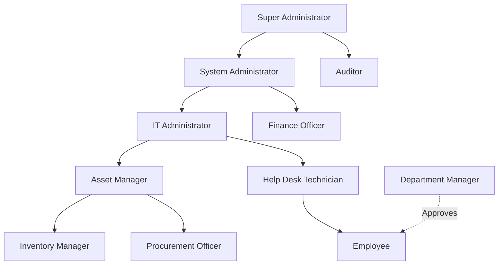
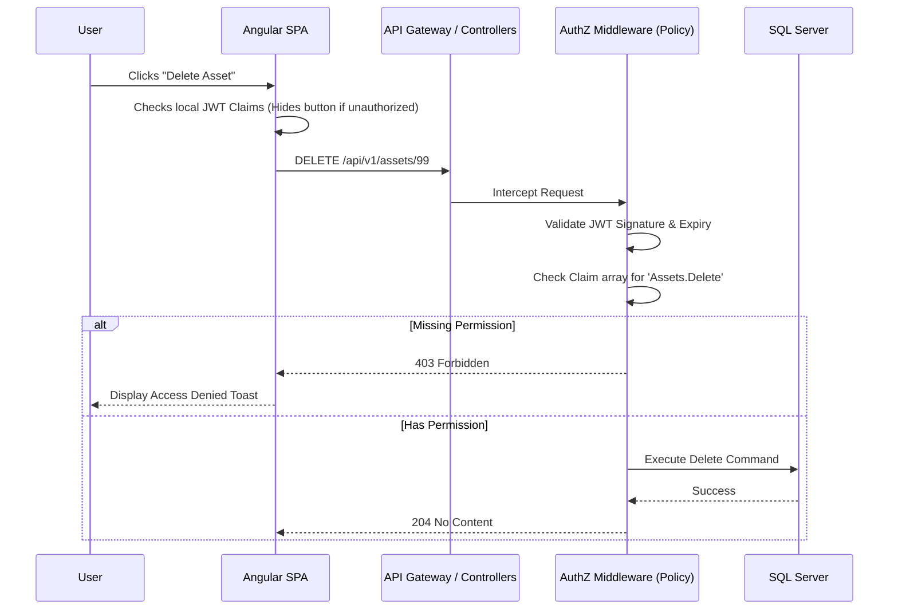

# Enterprise IT Asset Management System (Project Tracer)
## Document 7: Roles & Permissions Design Document (RBAC)

**Prepared By:** Sakthivel P, Security Architect  
**Document Version:** 1.0  
**Target Audience:** Backend Developers, Frontend Developers, Security Engineers, QA Teams  

---

## 1. Introduction & Security Posture
This document defines the Role-Based Access Control (RBAC) architecture for Project Tracer. It enforces the Principle of Least Privilege (PoLP) and strict Segregation of Duties (SoD) across all enterprise asset management operations. The system utilizes resource-based permissions injected as claims within JWT tokens.

---

## 2. Role Definitions

### 2.1 Super Administrator
* **Purpose:** The ultimate authority over the Tracer system, bypassing standard constraints to manage tenant-level configurations.
* **Responsibilities:** Initial system setup, disaster recovery, global security policy enforcement.
* **Allowed Operations:** All operations across all modules.
* **Restricted Operations:** None.
* **Approval Authority:** Override authority on all system approvals.
* **Reporting Access:** Full global reporting.
* **Administrative Capabilities:** System-wide settings, SSO/SCIM integrations, API key generation.

### 2.2 System Administrator
* **Purpose:** Technical management of the ITAM application excluding core security overrides.
* **Responsibilities:** Managing integrations, maintaining master data (Categories, Manufacturers), troubleshooting.
* **Allowed Operations:** CRUD on master data, user provisioning, system configurations.
* **Restricted Operations:** Cannot modify Super Admin roles, cannot delete Audit Logs.
* **Approval Authority:** Technical approvals (e.g., API token issuance).
* **Reporting Access:** Full system reporting.
* **Administrative Capabilities:** Webhooks, Notifications, Email Templates.

### 2.3 IT Administrator
* **Purpose:** Oversight of all IT assets and IT departmental workflows.
* **Responsibilities:** Managing IT staff, overseeing hardware lifecycle, software license compliance.
* **Allowed Operations:** Full CRUD on Assets, Licenses, Components, and Users.
* **Restricted Operations:** Cannot modify system integrations or global settings.
* **Approval Authority:** License true-ups, bulk hardware deprecation.
* **Reporting Access:** IT and Hardware metrics, Audit reports.
* **Administrative Capabilities:** Department-level configurations.

### 2.4 Asset Manager
* **Purpose:** Strategic management of the physical asset portfolio.
* **Responsibilities:** Defining asset models, managing depreciation, planning procurement cycles.
* **Allowed Operations:** CRUD on Asset Models, Categories, Status Labels, Depreciation Models.
* **Restricted Operations:** Cannot manage Users, Roles, or IT-specific configurations.
* **Approval Authority:** Asset disposals, state transitions to 'Archived'.
* **Reporting Access:** Financial depreciation, end-of-life forecasting.
* **Administrative Capabilities:** Custom field management.

### 2.5 Inventory Manager
* **Purpose:** Daily physical management of warehouse/stockroom inventory.
* **Responsibilities:** Receiving shipments, tagging assets, conducting physical audits.
* **Allowed Operations:** `Assets.Create`, `Assets.Edit`, `Assets.CheckIn`, `Assets.CheckOut`, Bulk Imports.
* **Restricted Operations:** Cannot delete assets, cannot view financial depreciation.
* **Approval Authority:** Physical stock count reconciliations.
* **Reporting Access:** Stock levels, pending shipments, audit discrepancies.
* **Administrative Capabilities:** None.

### 2.6 Procurement Officer
* **Purpose:** Managing relationships with suppliers and tracking inbound IT purchases.
* **Responsibilities:** Entering purchase orders, managing supplier data.
* **Allowed Operations:** CRUD on Suppliers, view pending inbound assets.
* **Restricted Operations:** Cannot deploy assets to users, cannot modify system configurations.
* **Approval Authority:** PO validations.
* **Reporting Access:** Supplier spend, procurement lead times.
* **Administrative Capabilities:** None.

### 2.7 Department Manager
* **Purpose:** Oversight of assets assigned to their specific business unit.
* **Responsibilities:** Reviewing department asset costs, approving internal hardware requests.
* **Allowed Operations:** `Assets.View` (Restricted to Department), `Reports.View` (Restricted).
* **Restricted Operations:** Cannot mutate asset records.
* **Approval Authority:** Employee hardware requests (Step 1).
* **Reporting Access:** Departmental asset allocation and cost reports.
* **Administrative Capabilities:** None.

### 2.8 Finance Officer
* **Purpose:** Managing the financial lifecycle and accounting of IT assets.
* **Responsibilities:** Auditing depreciation, tax reporting, cost-center cross-charging.
* **Allowed Operations:** View all Assets, manage Depreciation Models, export financial data.
* **Restricted Operations:** Cannot modify asset physical states or assignments.
* **Approval Authority:** Capital expenditure write-offs.
* **Reporting Access:** Full financial and depreciation reporting.
* **Administrative Capabilities:** None.

### 2.9 Auditor
* **Purpose:** Independent verification of system compliance and security.
* **Responsibilities:** Reviewing activity logs, ensuring compliance with SOC2/ISO27001.
* **Allowed Operations:** `AuditLogs.View`, `ActivityLogs.View`, `Reports.Export`.
* **Restricted Operations:** Strictly Read-Only. Cannot mutate any data.
* **Approval Authority:** Audit sign-offs.
* **Reporting Access:** All compliance and historical logs.
* **Administrative Capabilities:** None.

### 2.10 Help Desk Technician
* **Purpose:** Frontline support managing the day-to-day deployment of assets.
* **Responsibilities:** Fulfilling tickets, checking assets in/out, replacing components.
* **Allowed Operations:** `Assets.CheckIn`, `Assets.CheckOut`, `Maintenance.Create`, view user details.
* **Restricted Operations:** Cannot create/delete assets, cannot view financial data.
* **Approval Authority:** None.
* **Reporting Access:** Personal activity logs, daily deployment metrics.
* **Administrative Capabilities:** None.

### 2.11 Employee
* **Purpose:** Standard end-user of the organization.
* **Responsibilities:** Acknowledging receipt of assets, reporting damage.
* **Allowed Operations:** View assets currently assigned to self, sign EULAs.
* **Restricted Operations:** Cannot view other users' assets, cannot view inventory.
* **Approval Authority:** EULA acceptance.
* **Reporting Access:** None.
* **Administrative Capabilities:** None.

### 2.12 Guest
* **Purpose:** Unauthenticated or severely restricted temporary access.
* **Responsibilities:** Viewing public knowledge base or external barcode lookup (if enabled).
* **Allowed Operations:** Public API endpoints only.
* **Restricted Operations:** Completely sandboxed.

---

## 3. Resource-Based Permission Catalog

Permissions are structured as `Resource.Action`.

| Resource Domain | Available Permissions |
| :--- | :--- |
| **Assets** | `Assets.View`, `Assets.Create`, `Assets.Edit`, `Assets.Delete`, `Assets.Assign`, `Assets.CheckOut`, `Assets.CheckIn`, `Assets.Transfer`, `Assets.Clone`, `Assets.Dispose`, `Assets.Archive` |
| **Users** | `Users.View`, `Users.Create`, `Users.Edit`, `Users.Delete` |
| **Roles & Perms** | `Roles.Manage`, `Permissions.Manage` |
| **Reports** | `Reports.View`, `Reports.Export` |
| **System** | `Settings.Manage`, `API.Manage`, `Notifications.Manage` |
| **Operations** | `Maintenance.Manage`, `AuditLogs.View` |
| **Inventory** | `Licenses.Manage`, `Accessories.Manage`, `Components.Manage`, `Consumables.Manage` |

---

## 4. Architectural Matrices

### 4.1 Role Hierarchy Diagram


### 4.2 Module Access Matrix
*(Key: C = Create, R = Read, U = Update, D = Delete, X = Execute/Action)*

| Role | Assets | Licenses | Users | Finance | Settings | Audit Logs |
| :--- | :--- | :--- | :--- | :--- | :--- | :--- |
| **Super Admin** | CRUDX | CRUDX | CRUDX | CRUDX | CRUDX | R |
| **IT Admin** | CRUDX | CRUDX | CRUDX | R | R | R |
| **Inventory Mgr** | CRU-X | CRU-X | R---- | ----- | ----- | - |
| **Finance Officer**| R---- | R---- | R---- | CRUD- | ----- | R |
| **Help Desk** | R--UX | R--UX | R---- | ----- | ----- | - |
| **Employee** | R*--- | R*--- | ----- | ----- | ----- | - |
*( * = Restricted to self-assigned resources only )*

### 4.3 Approval Matrix
| Action | Initiator | First Approver | Final Approver |
| :--- | :--- | :--- | :--- |
| **Asset Disposal** | Inventory Manager | Asset Manager | Finance Officer |
| **Software True-Up**| IT Admin | IT Admin | Finance Officer |
| **New Hardware Req**| Employee | Department Manager| IT Admin |
| **EULA Acceptance** | System | Employee | Employee |

### 4.4 API Authorization Matrix & JWT Claims
The ASP.NET Core API enforces authorization using Policy-Based Routing.

* `[Authorize(Policy = "RequireAssetWrite")]` maps to `Assets.Create` OR `Assets.Edit`.
* **JWT Claim Structure:**
```json
{
  "sub": "user-guid-1234",
  "role": ["HelpDesk"],
  "permissions": ["Assets.View", "Assets.CheckOut", "Assets.CheckIn", "Maintenance.Create"],
  "tenantId": "company-guid-5678"
}
```

---

## 5. Security Principles & Business Rules

### 5.1 Authorization Flow Diagram


### 5.2 Segregation of Duties (SoD) Rules
To prevent internal fraud, the system strictly enforces the following constraints at the MediatR handler level:
1. **Procurement vs. Inventory:** The user who creates a Supplier/Purchase Order cannot be the user who checks the physical asset into the system.
2. **Disposal vs. Audit:** The user executing `Assets.Dispose` cannot be the same user holding the `Auditor` role reviewing the disposal logs.
3. **Self-Management:** A user cannot alter their own Role assignment or elevate their own Permissions, regardless of their administrative tier.

### 5.3 Least Privilege Strategy (Default Deny)
* All API endpoints (except `/api/v1/auth/*`) default to `[Authorize]`.
* If a permission is not explicitly granted in the user's role array, the action is denied. 
* UI components (e.g., Edit Buttons, Settings Navigation) use Angular structural directives (`*hasPermission="'Assets.Edit'"`) to physically remove DOM elements rather than just disabling them.

### 5.4 Audit & Compliance Requirements
* Every authorized mutation (POST, PUT, DELETE) automatically injects the `sub` (User ID) from the JWT into the Entity Framework `UpdatedBy` field.
* The Activity Log schema captures the `UserId`, `IP Address`, `TargetResource`, `Action`, and the `DeltaPayload` (before/after JSON state) for immutable security auditing.

---
*End of Document 7. Awaiting next instruction.*
