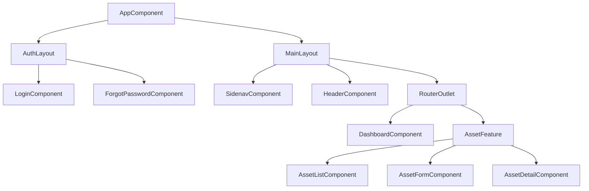
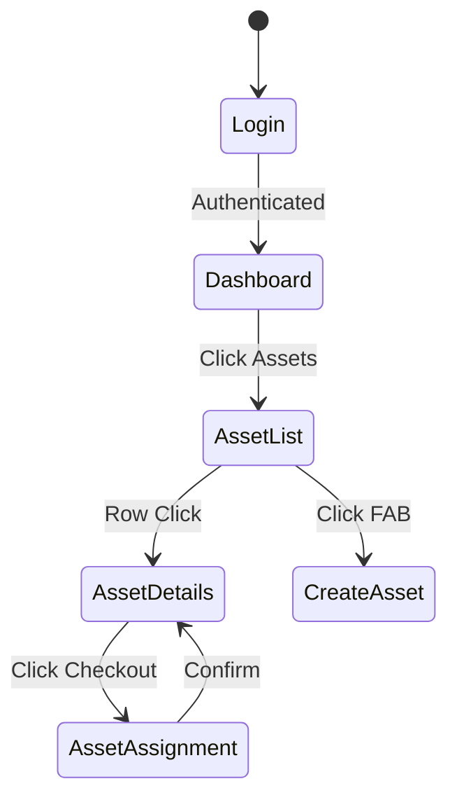

# Enterprise IT Asset Management System (Project Tracer)
## Document 6: UI/UX Design Specification

**Prepared By:** Sakthivel P, Senior UI/UX Architect  
**Document Version:** 1.0  
**Frontend Stack:** Angular 20, Angular Material, Standalone Components, Signals, SCSS  

---

## 1. Global Design System & Architecture

### 1.1 Theme Specification
* **Primary Color:** Deep Blue (`#1976D2`) - Used for primary actions, active states, and primary navigation highlights.
* **Accent Color:** Amber (`#FFC107`) - Used for warnings, pending statuses, and secondary call-to-actions.
* **Warn/Danger Color:** Red (`#F44336`) - Used for destructive actions (delete, unassign) and error states.
* **Success Color:** Green (`#4CAF50`) - Used for successful check-ins, active statuses, and completion toasts.
* **Surface/Background:** Light Gray (`#F5F5F6`) for app background, White (`#FFFFFF`) for cards and dialogs. Dark mode inverts to `#121212` and `#1E1E1E`.

### 1.2 Typography (Google Fonts: Roboto & Inter)
* **Headers (H1-H6):** `Inter`, bold, tracking tight.
* **Body/Data:** `Roboto`, regular, 14px (Standard Material density).
* **Code/Tags:** `Fira Code`, 12px for asset tags and system logs.

### 1.3 Spacing & Grid System
* **Base Unit:** 8px spacing system (8, 16, 24, 32, 48).
* **Grid:** 12-column responsive CSS Grid.
* **Containers:** Max-width 1440px for standard views, 100% width fluid for Dashboard and Data Grids.

### 1.4 Angular Material Components Used
* `MatTable` (with Virtual Scrolling for large datasets)
* `MatPaginator` & `MatSort`
* `MatDialog` (for checkout/checkin workflows)
* `MatSidenav` (Main navigation)
* `MatSnackBar` (Success/Error toasts)
* `MatCard` (Dashboard widgets & forms)
* `MatFormField`, `MatInput`, `MatSelect`, `MatAutocomplete`

### 1.5 Component Hierarchy (Angular 20 Standalone)

### 1.6 Navigation Flow

---

## 2. Screen Specifications

### 2.1 Screen: Dashboard

**1. Purpose:** Provide the interface for users to interact with dashboard data.

**2. Navigation:** Accessible via the main Sidenav under the specific module category.

**3. Breadcrumb:** `Home > Dashboard`

**4. User Story:** As an IT Admin, I want to access the Dashboard screen so that I can view, manage, and execute workflows related to dashboard.

**5. Wireframe Description:** A standard enterprise dashboard layout. Sidebar on the left, top header with user profile, and main content area occupying the remaining viewport.

**6. Layout:** Masonry-style grid of responsive `MatCard` widgets (KPIs, Charts, Recent Activity).

**7. Fields:** 
* Global search input, advanced filter dropdowns.

**8. Validation:** Angular Reactive Forms with Signal-based validation state tracking. Highlights invalid fields in Warn Color (`#F44336`) with `mat-error` hints.

**9. Buttons:** Primary action (e.g., 'Save', 'Create') as `mat-flat-button color='primary'`. Secondary actions as `mat-stroked-button`.

**10. Icons:** Material Symbol `dashboard` prominently used in headers and buttons.

**11. Dialogs:** Deletion confirmations and fast-action workflows (e.g., quick checkout) utilize `MatDialog` to prevent context switching.

**12. Data Grid Columns:** N/A for this view.

**13. Filters:** Column-specific filtering menus + Global debounced text search.

**14. Sorting:** Server-side sorting via `mat-sort-header` on column clicks.

**15. Pagination:** Server-side via `MatPaginator`. Default sizes: 20, 50, 100.

**16. Quick Actions / 17. Bulk Actions / 18. Context Menu:** N/A for this view type.

**19. Notifications:** CRUD operations dispatch a `MatSnackBar` indicating Success or Failure.

**20. Loading States:** Uses Angular 20 `@defer` blocks and Signals. Displays `ngx-skeleton-loader` placeholders during initial network fetch.

**21. Error States:** Network failures display a generic error graphic with a 'Retry' button.

**22. Empty States:** If no data exists, displays a central SVG illustration (e.g., empty box) with a call-to-action button to create the first record.

**23. Accessibility:** ARIA labels on all icon buttons. Full keyboard navigability (Tab-index). High contrast ratio compliance (WCAG AA).

**24. Responsive Behaviour:** On mobile (`max-width: 768px`), sidenav collapses to a hamburger menu. Grids convert to vertically stacked cards. Forms switch to single-column CSS Grid.

**25. Dark Mode Behaviour:** Background shifts to `#121212`. Text shifts to `#E0E0E0`. Surfaces (`MatCard`) lighten slightly to `#1E1E1E` for depth.

**26. Keyboard Shortcuts:** 
* `Ctrl + /` to focus Global Search.

---

### 2.2 Screen: Login

**1. Purpose:** Provide the interface for users to interact with login data.

**2. Navigation:** Accessible via the main Sidenav under the specific module category.

**3. Breadcrumb:** `Home > Login`

**4. User Story:** As an IT Admin, I want to access the Login screen so that I can view, manage, and execute workflows related to login.

**5. Wireframe Description:** A standard enterprise auth layout. Sidebar on the left, top header with user profile, and main content area occupying the remaining viewport.

**6. Layout:** Focused modal or detail view with tabbed navigation (`MatTabs`).

**7. Fields:** 
* Input fields specific to the entity (e.g., Name, Asset Tag, Status, Assigned To).

**8. Validation:** Angular Reactive Forms with Signal-based validation state tracking. Highlights invalid fields in Warn Color (`#F44336`) with `mat-error` hints.

**9. Buttons:** Primary action (e.g., 'Save', 'Create') as `mat-flat-button color='primary'`. Secondary actions as `mat-stroked-button`.

**10. Icons:** Material Symbol `login` prominently used in headers and buttons.

**11. Dialogs:** Deletion confirmations and fast-action workflows (e.g., quick checkout) utilize `MatDialog` to prevent context switching.

**12. Data Grid Columns:** N/A for this view.

**13. Filters / 14. Sorting / 15. Pagination:** N/A for this view type.

**16. Quick Actions / 17. Bulk Actions / 18. Context Menu:** N/A for this view type.

**19. Notifications:** CRUD operations dispatch a `MatSnackBar` indicating Success or Failure.

**20. Loading States:** Uses Angular 20 `@defer` blocks and Signals. Displays `ngx-skeleton-loader` placeholders during initial network fetch.

**21. Error States:** Network failures display a generic error graphic with a 'Retry' button.

**22. Empty States:** If no data exists, displays a central SVG illustration (e.g., empty box) with a call-to-action button to create the first record.

**23. Accessibility:** ARIA labels on all icon buttons. Full keyboard navigability (Tab-index). High contrast ratio compliance (WCAG AA).

**24. Responsive Behaviour:** On mobile (`max-width: 768px`), sidenav collapses to a hamburger menu. Grids convert to vertically stacked cards. Forms switch to single-column CSS Grid.

**25. Dark Mode Behaviour:** Background shifts to `#121212`. Text shifts to `#E0E0E0`. Surfaces (`MatCard`) lighten slightly to `#1E1E1E` for depth.

**26. Keyboard Shortcuts:** 
* `Ctrl + /` to focus Global Search.

---

### 2.3 Screen: Forgot Password

**1. Purpose:** Provide the interface for users to interact with forgot password data.

**2. Navigation:** Accessible via the main Sidenav under the specific module category.

**3. Breadcrumb:** `Home > Forgot Password`

**4. User Story:** As an IT Admin, I want to access the Forgot Password screen so that I can view, manage, and execute workflows related to forgot password.

**5. Wireframe Description:** A standard enterprise auth layout. Sidebar on the left, top header with user profile, and main content area occupying the remaining viewport.

**6. Layout:** Focused modal or detail view with tabbed navigation (`MatTabs`).

**7. Fields:** 
* Input fields specific to the entity (e.g., Name, Asset Tag, Status, Assigned To).

**8. Validation:** Angular Reactive Forms with Signal-based validation state tracking. Highlights invalid fields in Warn Color (`#F44336`) with `mat-error` hints.

**9. Buttons:** Primary action (e.g., 'Save', 'Create') as `mat-flat-button color='primary'`. Secondary actions as `mat-stroked-button`.

**10. Icons:** Material Symbol `lock_reset` prominently used in headers and buttons.

**11. Dialogs:** Deletion confirmations and fast-action workflows (e.g., quick checkout) utilize `MatDialog` to prevent context switching.

**12. Data Grid Columns:** N/A for this view.

**13. Filters / 14. Sorting / 15. Pagination:** N/A for this view type.

**16. Quick Actions / 17. Bulk Actions / 18. Context Menu:** N/A for this view type.

**19. Notifications:** CRUD operations dispatch a `MatSnackBar` indicating Success or Failure.

**20. Loading States:** Uses Angular 20 `@defer` blocks and Signals. Displays `ngx-skeleton-loader` placeholders during initial network fetch.

**21. Error States:** Network failures display a generic error graphic with a 'Retry' button.

**22. Empty States:** If no data exists, displays a central SVG illustration (e.g., empty box) with a call-to-action button to create the first record.

**23. Accessibility:** ARIA labels on all icon buttons. Full keyboard navigability (Tab-index). High contrast ratio compliance (WCAG AA).

**24. Responsive Behaviour:** On mobile (`max-width: 768px`), sidenav collapses to a hamburger menu. Grids convert to vertically stacked cards. Forms switch to single-column CSS Grid.

**25. Dark Mode Behaviour:** Background shifts to `#121212`. Text shifts to `#E0E0E0`. Surfaces (`MatCard`) lighten slightly to `#1E1E1E` for depth.

**26. Keyboard Shortcuts:** 
* `Ctrl + /` to focus Global Search.

---

### 2.4 Screen: User Management

**1. Purpose:** Provide the interface for users to interact with user management data.

**2. Navigation:** Accessible via the main Sidenav under the specific module category.

**3. Breadcrumb:** `Home > User Management`

**4. User Story:** As an IT Admin, I want to access the User Management screen so that I can view, manage, and execute workflows related to user management.

**5. Wireframe Description:** A standard enterprise grid layout. Sidebar on the left, top header with user profile, and main content area occupying the remaining viewport.

**6. Layout:** Full-width `MatCard` containing a filter toolbar, a `MatTable`, and a fixed `MatPaginator` at the bottom.

**7. Fields:** 
* Global search input, advanced filter dropdowns.

**8. Validation:** Angular Reactive Forms with Signal-based validation state tracking. Highlights invalid fields in Warn Color (`#F44336`) with `mat-error` hints.

**9. Buttons:** Primary action (e.g., 'Save', 'Create') as `mat-flat-button color='primary'`. Secondary actions as `mat-stroked-button`.

**10. Icons:** Material Symbol `people` prominently used in headers and buttons.

**11. Dialogs:** Deletion confirmations and fast-action workflows (e.g., quick checkout) utilize `MatDialog` to prevent context switching.

**12. Data Grid Columns:** Checkbox (for bulk), ID, Name/Tag, Status (Chip component), Assigned To, Location, Created At, Actions (Menu).

**13. Filters:** Column-specific filtering menus + Global debounced text search.

**14. Sorting:** Server-side sorting via `mat-sort-header` on column clicks.

**15. Pagination:** Server-side via `MatPaginator`. Default sizes: 20, 50, 100.

**16. Quick Actions:** Edit, Delete, Checkout inline buttons per row.

**17. Bulk Actions:** Visible when rows are selected: Bulk Delete, Bulk Edit, Bulk Label Generation.

**18. Context Menu:** Right-click support on rows to open the quick action `mat-menu`.

**19. Notifications:** CRUD operations dispatch a `MatSnackBar` indicating Success or Failure.

**20. Loading States:** Uses Angular 20 `@defer` blocks and Signals. Displays `ngx-skeleton-loader` placeholders during initial network fetch.

**21. Error States:** Network failures display a generic error graphic with a 'Retry' button.

**22. Empty States:** If no data exists, displays a central SVG illustration (e.g., empty box) with a call-to-action button to create the first record.

**23. Accessibility:** ARIA labels on all icon buttons. Full keyboard navigability (Tab-index). High contrast ratio compliance (WCAG AA).

**24. Responsive Behaviour:** On mobile (`max-width: 768px`), sidenav collapses to a hamburger menu. Grids convert to vertically stacked cards. Forms switch to single-column CSS Grid.

**25. Dark Mode Behaviour:** Background shifts to `#121212`. Text shifts to `#E0E0E0`. Surfaces (`MatCard`) lighten slightly to `#1E1E1E` for depth.

**26. Keyboard Shortcuts:** 
* `Ctrl + /` to focus Global Search.
* `Ctrl + N` to create a new record.

---

### 2.5 Screen: Role Management

**1. Purpose:** Provide the interface for users to interact with role management data.

**2. Navigation:** Accessible via the main Sidenav under the specific module category.

**3. Breadcrumb:** `Home > Role Management`

**4. User Story:** As an IT Admin, I want to access the Role Management screen so that I can view, manage, and execute workflows related to role management.

**5. Wireframe Description:** A standard enterprise grid layout. Sidebar on the left, top header with user profile, and main content area occupying the remaining viewport.

**6. Layout:** Full-width `MatCard` containing a filter toolbar, a `MatTable`, and a fixed `MatPaginator` at the bottom.

**7. Fields:** 
* Global search input, advanced filter dropdowns.

**8. Validation:** Angular Reactive Forms with Signal-based validation state tracking. Highlights invalid fields in Warn Color (`#F44336`) with `mat-error` hints.

**9. Buttons:** Primary action (e.g., 'Save', 'Create') as `mat-flat-button color='primary'`. Secondary actions as `mat-stroked-button`.

**10. Icons:** Material Symbol `badge` prominently used in headers and buttons.

**11. Dialogs:** Deletion confirmations and fast-action workflows (e.g., quick checkout) utilize `MatDialog` to prevent context switching.

**12. Data Grid Columns:** Checkbox (for bulk), ID, Name/Tag, Status (Chip component), Assigned To, Location, Created At, Actions (Menu).

**13. Filters:** Column-specific filtering menus + Global debounced text search.

**14. Sorting:** Server-side sorting via `mat-sort-header` on column clicks.

**15. Pagination:** Server-side via `MatPaginator`. Default sizes: 20, 50, 100.

**16. Quick Actions:** Edit, Delete, Checkout inline buttons per row.

**17. Bulk Actions:** Visible when rows are selected: Bulk Delete, Bulk Edit, Bulk Label Generation.

**18. Context Menu:** Right-click support on rows to open the quick action `mat-menu`.

**19. Notifications:** CRUD operations dispatch a `MatSnackBar` indicating Success or Failure.

**20. Loading States:** Uses Angular 20 `@defer` blocks and Signals. Displays `ngx-skeleton-loader` placeholders during initial network fetch.

**21. Error States:** Network failures display a generic error graphic with a 'Retry' button.

**22. Empty States:** If no data exists, displays a central SVG illustration (e.g., empty box) with a call-to-action button to create the first record.

**23. Accessibility:** ARIA labels on all icon buttons. Full keyboard navigability (Tab-index). High contrast ratio compliance (WCAG AA).

**24. Responsive Behaviour:** On mobile (`max-width: 768px`), sidenav collapses to a hamburger menu. Grids convert to vertically stacked cards. Forms switch to single-column CSS Grid.

**25. Dark Mode Behaviour:** Background shifts to `#121212`. Text shifts to `#E0E0E0`. Surfaces (`MatCard`) lighten slightly to `#1E1E1E` for depth.

**26. Keyboard Shortcuts:** 
* `Ctrl + /` to focus Global Search.
* `Ctrl + N` to create a new record.

---

### 2.6 Screen: Permission Management

**1. Purpose:** Provide the interface for users to interact with permission management data.

**2. Navigation:** Accessible via the main Sidenav under the specific module category.

**3. Breadcrumb:** `Home > Permission Management`

**4. User Story:** As an IT Admin, I want to access the Permission Management screen so that I can view, manage, and execute workflows related to permission management.

**5. Wireframe Description:** A standard enterprise grid layout. Sidebar on the left, top header with user profile, and main content area occupying the remaining viewport.

**6. Layout:** Full-width `MatCard` containing a filter toolbar, a `MatTable`, and a fixed `MatPaginator` at the bottom.

**7. Fields:** 
* Global search input, advanced filter dropdowns.

**8. Validation:** Angular Reactive Forms with Signal-based validation state tracking. Highlights invalid fields in Warn Color (`#F44336`) with `mat-error` hints.

**9. Buttons:** Primary action (e.g., 'Save', 'Create') as `mat-flat-button color='primary'`. Secondary actions as `mat-stroked-button`.

**10. Icons:** Material Symbol `security` prominently used in headers and buttons.

**11. Dialogs:** Deletion confirmations and fast-action workflows (e.g., quick checkout) utilize `MatDialog` to prevent context switching.

**12. Data Grid Columns:** Checkbox (for bulk), ID, Name/Tag, Status (Chip component), Assigned To, Location, Created At, Actions (Menu).

**13. Filters:** Column-specific filtering menus + Global debounced text search.

**14. Sorting:** Server-side sorting via `mat-sort-header` on column clicks.

**15. Pagination:** Server-side via `MatPaginator`. Default sizes: 20, 50, 100.

**16. Quick Actions:** Edit, Delete, Checkout inline buttons per row.

**17. Bulk Actions:** Visible when rows are selected: Bulk Delete, Bulk Edit, Bulk Label Generation.

**18. Context Menu:** Right-click support on rows to open the quick action `mat-menu`.

**19. Notifications:** CRUD operations dispatch a `MatSnackBar` indicating Success or Failure.

**20. Loading States:** Uses Angular 20 `@defer` blocks and Signals. Displays `ngx-skeleton-loader` placeholders during initial network fetch.

**21. Error States:** Network failures display a generic error graphic with a 'Retry' button.

**22. Empty States:** If no data exists, displays a central SVG illustration (e.g., empty box) with a call-to-action button to create the first record.

**23. Accessibility:** ARIA labels on all icon buttons. Full keyboard navigability (Tab-index). High contrast ratio compliance (WCAG AA).

**24. Responsive Behaviour:** On mobile (`max-width: 768px`), sidenav collapses to a hamburger menu. Grids convert to vertically stacked cards. Forms switch to single-column CSS Grid.

**25. Dark Mode Behaviour:** Background shifts to `#121212`. Text shifts to `#E0E0E0`. Surfaces (`MatCard`) lighten slightly to `#1E1E1E` for depth.

**26. Keyboard Shortcuts:** 
* `Ctrl + /` to focus Global Search.
* `Ctrl + N` to create a new record.

---

### 2.7 Screen: Asset List

**1. Purpose:** Provide the interface for users to interact with asset list data.

**2. Navigation:** Accessible via the main Sidenav under the specific module category.

**3. Breadcrumb:** `Home > Asset List`

**4. User Story:** As an IT Admin, I want to access the Asset List screen so that I can view, manage, and execute workflows related to asset list.

**5. Wireframe Description:** A standard enterprise grid layout. Sidebar on the left, top header with user profile, and main content area occupying the remaining viewport.

**6. Layout:** Full-width `MatCard` containing a filter toolbar, a `MatTable`, and a fixed `MatPaginator` at the bottom.

**7. Fields:** 
* Global search input, advanced filter dropdowns.

**8. Validation:** Angular Reactive Forms with Signal-based validation state tracking. Highlights invalid fields in Warn Color (`#F44336`) with `mat-error` hints.

**9. Buttons:** Primary action (e.g., 'Save', 'Create') as `mat-flat-button color='primary'`. Secondary actions as `mat-stroked-button`.

**10. Icons:** Material Symbol `devices` prominently used in headers and buttons.

**11. Dialogs:** Deletion confirmations and fast-action workflows (e.g., quick checkout) utilize `MatDialog` to prevent context switching.

**12. Data Grid Columns:** Checkbox (for bulk), ID, Name/Tag, Status (Chip component), Assigned To, Location, Created At, Actions (Menu).

**13. Filters:** Column-specific filtering menus + Global debounced text search.

**14. Sorting:** Server-side sorting via `mat-sort-header` on column clicks.

**15. Pagination:** Server-side via `MatPaginator`. Default sizes: 20, 50, 100.

**16. Quick Actions:** Edit, Delete, Checkout inline buttons per row.

**17. Bulk Actions:** Visible when rows are selected: Bulk Delete, Bulk Edit, Bulk Label Generation.

**18. Context Menu:** Right-click support on rows to open the quick action `mat-menu`.

**19. Notifications:** CRUD operations dispatch a `MatSnackBar` indicating Success or Failure.

**20. Loading States:** Uses Angular 20 `@defer` blocks and Signals. Displays `ngx-skeleton-loader` placeholders during initial network fetch.

**21. Error States:** Network failures display a generic error graphic with a 'Retry' button.

**22. Empty States:** If no data exists, displays a central SVG illustration (e.g., empty box) with a call-to-action button to create the first record.

**23. Accessibility:** ARIA labels on all icon buttons. Full keyboard navigability (Tab-index). High contrast ratio compliance (WCAG AA).

**24. Responsive Behaviour:** On mobile (`max-width: 768px`), sidenav collapses to a hamburger menu. Grids convert to vertically stacked cards. Forms switch to single-column CSS Grid.

**25. Dark Mode Behaviour:** Background shifts to `#121212`. Text shifts to `#E0E0E0`. Surfaces (`MatCard`) lighten slightly to `#1E1E1E` for depth.

**26. Keyboard Shortcuts:** 
* `Ctrl + /` to focus Global Search.
* `Ctrl + N` to create a new record.

---

### 2.8 Screen: Asset Details

**1. Purpose:** Provide the interface for users to interact with asset details data.

**2. Navigation:** Accessible via the main Sidenav under the specific module category.

**3. Breadcrumb:** `Home > Asset Details`

**4. User Story:** As an IT Admin, I want to access the Asset Details screen so that I can view, manage, and execute workflows related to asset details.

**5. Wireframe Description:** A standard enterprise detail layout. Sidebar on the left, top header with user profile, and main content area occupying the remaining viewport.

**6. Layout:** Focused modal or detail view with tabbed navigation (`MatTabs`).

**7. Fields:** 
* Global search input, advanced filter dropdowns.

**8. Validation:** Angular Reactive Forms with Signal-based validation state tracking. Highlights invalid fields in Warn Color (`#F44336`) with `mat-error` hints.

**9. Buttons:** Primary action (e.g., 'Save', 'Create') as `mat-flat-button color='primary'`. Secondary actions as `mat-stroked-button`.

**10. Icons:** Material Symbol `info` prominently used in headers and buttons.

**11. Dialogs:** Deletion confirmations and fast-action workflows (e.g., quick checkout) utilize `MatDialog` to prevent context switching.

**12. Data Grid Columns:** N/A for this view.

**13. Filters / 14. Sorting / 15. Pagination:** N/A for this view type.

**16. Quick Actions / 17. Bulk Actions / 18. Context Menu:** N/A for this view type.

**19. Notifications:** CRUD operations dispatch a `MatSnackBar` indicating Success or Failure.

**20. Loading States:** Uses Angular 20 `@defer` blocks and Signals. Displays `ngx-skeleton-loader` placeholders during initial network fetch.

**21. Error States:** Network failures display a generic error graphic with a 'Retry' button.

**22. Empty States:** If no data exists, displays a central SVG illustration (e.g., empty box) with a call-to-action button to create the first record.

**23. Accessibility:** ARIA labels on all icon buttons. Full keyboard navigability (Tab-index). High contrast ratio compliance (WCAG AA).

**24. Responsive Behaviour:** On mobile (`max-width: 768px`), sidenav collapses to a hamburger menu. Grids convert to vertically stacked cards. Forms switch to single-column CSS Grid.

**25. Dark Mode Behaviour:** Background shifts to `#121212`. Text shifts to `#E0E0E0`. Surfaces (`MatCard`) lighten slightly to `#1E1E1E` for depth.

**26. Keyboard Shortcuts:** 
* `Ctrl + /` to focus Global Search.

---

### 2.9 Screen: Create Asset

**1. Purpose:** Provide the interface for users to interact with create asset data.

**2. Navigation:** Accessible via the main Sidenav under the specific module category.

**3. Breadcrumb:** `Home > Create Asset`

**4. User Story:** As an IT Admin, I want to access the Create Asset screen so that I can view, manage, and execute workflows related to create asset.

**5. Wireframe Description:** A standard enterprise form layout. Sidebar on the left, top header with user profile, and main content area occupying the remaining viewport.

**6. Layout:** Centered, max-width 800px form using a CSS Grid layout for 2-column input fields.

**7. Fields:** 
* Input fields specific to the entity (e.g., Name, Asset Tag, Status, Assigned To).

**8. Validation:** Angular Reactive Forms with Signal-based validation state tracking. Highlights invalid fields in Warn Color (`#F44336`) with `mat-error` hints.

**9. Buttons:** Primary action (e.g., 'Save', 'Create') as `mat-flat-button color='primary'`. Secondary actions as `mat-stroked-button`.

**10. Icons:** Material Symbol `add_circle` prominently used in headers and buttons.

**11. Dialogs:** Deletion confirmations and fast-action workflows (e.g., quick checkout) utilize `MatDialog` to prevent context switching.

**12. Data Grid Columns:** N/A for this view.

**13. Filters / 14. Sorting / 15. Pagination:** N/A for this view type.

**16. Quick Actions / 17. Bulk Actions / 18. Context Menu:** N/A for this view type.

**19. Notifications:** CRUD operations dispatch a `MatSnackBar` indicating Success or Failure.

**20. Loading States:** Uses Angular 20 `@defer` blocks and Signals. Displays `ngx-skeleton-loader` placeholders during initial network fetch.

**21. Error States:** Network failures display a generic error graphic with a 'Retry' button.

**22. Empty States:** If no data exists, displays a central SVG illustration (e.g., empty box) with a call-to-action button to create the first record.

**23. Accessibility:** ARIA labels on all icon buttons. Full keyboard navigability (Tab-index). High contrast ratio compliance (WCAG AA).

**24. Responsive Behaviour:** On mobile (`max-width: 768px`), sidenav collapses to a hamburger menu. Grids convert to vertically stacked cards. Forms switch to single-column CSS Grid.

**25. Dark Mode Behaviour:** Background shifts to `#121212`. Text shifts to `#E0E0E0`. Surfaces (`MatCard`) lighten slightly to `#1E1E1E` for depth.

**26. Keyboard Shortcuts:** 
* `Ctrl + /` to focus Global Search.
* `Ctrl + S` to save the form.
* `Esc` to cancel and return to previous screen.

---

### 2.10 Screen: Edit Asset

**1. Purpose:** Provide the interface for users to interact with edit asset data.

**2. Navigation:** Accessible via the main Sidenav under the specific module category.

**3. Breadcrumb:** `Home > Edit Asset`

**4. User Story:** As an IT Admin, I want to access the Edit Asset screen so that I can view, manage, and execute workflows related to edit asset.

**5. Wireframe Description:** A standard enterprise form layout. Sidebar on the left, top header with user profile, and main content area occupying the remaining viewport.

**6. Layout:** Centered, max-width 800px form using a CSS Grid layout for 2-column input fields.

**7. Fields:** 
* Input fields specific to the entity (e.g., Name, Asset Tag, Status, Assigned To).

**8. Validation:** Angular Reactive Forms with Signal-based validation state tracking. Highlights invalid fields in Warn Color (`#F44336`) with `mat-error` hints.

**9. Buttons:** Primary action (e.g., 'Save', 'Create') as `mat-flat-button color='primary'`. Secondary actions as `mat-stroked-button`.

**10. Icons:** Material Symbol `edit` prominently used in headers and buttons.

**11. Dialogs:** Deletion confirmations and fast-action workflows (e.g., quick checkout) utilize `MatDialog` to prevent context switching.

**12. Data Grid Columns:** N/A for this view.

**13. Filters / 14. Sorting / 15. Pagination:** N/A for this view type.

**16. Quick Actions / 17. Bulk Actions / 18. Context Menu:** N/A for this view type.

**19. Notifications:** CRUD operations dispatch a `MatSnackBar` indicating Success or Failure.

**20. Loading States:** Uses Angular 20 `@defer` blocks and Signals. Displays `ngx-skeleton-loader` placeholders during initial network fetch.

**21. Error States:** Network failures display a generic error graphic with a 'Retry' button.

**22. Empty States:** If no data exists, displays a central SVG illustration (e.g., empty box) with a call-to-action button to create the first record.

**23. Accessibility:** ARIA labels on all icon buttons. Full keyboard navigability (Tab-index). High contrast ratio compliance (WCAG AA).

**24. Responsive Behaviour:** On mobile (`max-width: 768px`), sidenav collapses to a hamburger menu. Grids convert to vertically stacked cards. Forms switch to single-column CSS Grid.

**25. Dark Mode Behaviour:** Background shifts to `#121212`. Text shifts to `#E0E0E0`. Surfaces (`MatCard`) lighten slightly to `#1E1E1E` for depth.

**26. Keyboard Shortcuts:** 
* `Ctrl + /` to focus Global Search.
* `Ctrl + S` to save the form.
* `Esc` to cancel and return to previous screen.

---

### 2.11 Screen: Asset Assignment

**1. Purpose:** Provide the interface for users to interact with asset assignment data.

**2. Navigation:** Accessible via the main Sidenav under the specific module category.

**3. Breadcrumb:** `Home > Asset Assignment`

**4. User Story:** As an IT Admin, I want to access the Asset Assignment screen so that I can view, manage, and execute workflows related to asset assignment.

**5. Wireframe Description:** A standard enterprise action layout. Sidebar on the left, top header with user profile, and main content area occupying the remaining viewport.

**6. Layout:** Focused modal or detail view with tabbed navigation (`MatTabs`).

**7. Fields:** 
* Input fields specific to the entity (e.g., Name, Asset Tag, Status, Assigned To).

**8. Validation:** Angular Reactive Forms with Signal-based validation state tracking. Highlights invalid fields in Warn Color (`#F44336`) with `mat-error` hints.

**9. Buttons:** Primary action (e.g., 'Save', 'Create') as `mat-flat-button color='primary'`. Secondary actions as `mat-stroked-button`.

**10. Icons:** Material Symbol `assignment_ind` prominently used in headers and buttons.

**11. Dialogs:** Deletion confirmations and fast-action workflows (e.g., quick checkout) utilize `MatDialog` to prevent context switching.

**12. Data Grid Columns:** N/A for this view.

**13. Filters / 14. Sorting / 15. Pagination:** N/A for this view type.

**16. Quick Actions / 17. Bulk Actions / 18. Context Menu:** N/A for this view type.

**19. Notifications:** CRUD operations dispatch a `MatSnackBar` indicating Success or Failure.

**20. Loading States:** Uses Angular 20 `@defer` blocks and Signals. Displays `ngx-skeleton-loader` placeholders during initial network fetch.

**21. Error States:** Network failures display a generic error graphic with a 'Retry' button.

**22. Empty States:** If no data exists, displays a central SVG illustration (e.g., empty box) with a call-to-action button to create the first record.

**23. Accessibility:** ARIA labels on all icon buttons. Full keyboard navigability (Tab-index). High contrast ratio compliance (WCAG AA).

**24. Responsive Behaviour:** On mobile (`max-width: 768px`), sidenav collapses to a hamburger menu. Grids convert to vertically stacked cards. Forms switch to single-column CSS Grid.

**25. Dark Mode Behaviour:** Background shifts to `#121212`. Text shifts to `#E0E0E0`. Surfaces (`MatCard`) lighten slightly to `#1E1E1E` for depth.

**26. Keyboard Shortcuts:** 
* `Ctrl + /` to focus Global Search.

---

### 2.12 Screen: Asset Return

**1. Purpose:** Provide the interface for users to interact with asset return data.

**2. Navigation:** Accessible via the main Sidenav under the specific module category.

**3. Breadcrumb:** `Home > Asset Return`

**4. User Story:** As an IT Admin, I want to access the Asset Return screen so that I can view, manage, and execute workflows related to asset return.

**5. Wireframe Description:** A standard enterprise action layout. Sidebar on the left, top header with user profile, and main content area occupying the remaining viewport.

**6. Layout:** Focused modal or detail view with tabbed navigation (`MatTabs`).

**7. Fields:** 
* Input fields specific to the entity (e.g., Name, Asset Tag, Status, Assigned To).

**8. Validation:** Angular Reactive Forms with Signal-based validation state tracking. Highlights invalid fields in Warn Color (`#F44336`) with `mat-error` hints.

**9. Buttons:** Primary action (e.g., 'Save', 'Create') as `mat-flat-button color='primary'`. Secondary actions as `mat-stroked-button`.

**10. Icons:** Material Symbol `assignment_return` prominently used in headers and buttons.

**11. Dialogs:** Deletion confirmations and fast-action workflows (e.g., quick checkout) utilize `MatDialog` to prevent context switching.

**12. Data Grid Columns:** N/A for this view.

**13. Filters / 14. Sorting / 15. Pagination:** N/A for this view type.

**16. Quick Actions / 17. Bulk Actions / 18. Context Menu:** N/A for this view type.

**19. Notifications:** CRUD operations dispatch a `MatSnackBar` indicating Success or Failure.

**20. Loading States:** Uses Angular 20 `@defer` blocks and Signals. Displays `ngx-skeleton-loader` placeholders during initial network fetch.

**21. Error States:** Network failures display a generic error graphic with a 'Retry' button.

**22. Empty States:** If no data exists, displays a central SVG illustration (e.g., empty box) with a call-to-action button to create the first record.

**23. Accessibility:** ARIA labels on all icon buttons. Full keyboard navigability (Tab-index). High contrast ratio compliance (WCAG AA).

**24. Responsive Behaviour:** On mobile (`max-width: 768px`), sidenav collapses to a hamburger menu. Grids convert to vertically stacked cards. Forms switch to single-column CSS Grid.

**25. Dark Mode Behaviour:** Background shifts to `#121212`. Text shifts to `#E0E0E0`. Surfaces (`MatCard`) lighten slightly to `#1E1E1E` for depth.

**26. Keyboard Shortcuts:** 
* `Ctrl + /` to focus Global Search.

---

### 2.13 Screen: Asset Transfer

**1. Purpose:** Provide the interface for users to interact with asset transfer data.

**2. Navigation:** Accessible via the main Sidenav under the specific module category.

**3. Breadcrumb:** `Home > Asset Transfer`

**4. User Story:** As an IT Admin, I want to access the Asset Transfer screen so that I can view, manage, and execute workflows related to asset transfer.

**5. Wireframe Description:** A standard enterprise action layout. Sidebar on the left, top header with user profile, and main content area occupying the remaining viewport.

**6. Layout:** Focused modal or detail view with tabbed navigation (`MatTabs`).

**7. Fields:** 
* Input fields specific to the entity (e.g., Name, Asset Tag, Status, Assigned To).

**8. Validation:** Angular Reactive Forms with Signal-based validation state tracking. Highlights invalid fields in Warn Color (`#F44336`) with `mat-error` hints.

**9. Buttons:** Primary action (e.g., 'Save', 'Create') as `mat-flat-button color='primary'`. Secondary actions as `mat-stroked-button`.

**10. Icons:** Material Symbol `swap_horiz` prominently used in headers and buttons.

**11. Dialogs:** Deletion confirmations and fast-action workflows (e.g., quick checkout) utilize `MatDialog` to prevent context switching.

**12. Data Grid Columns:** N/A for this view.

**13. Filters / 14. Sorting / 15. Pagination:** N/A for this view type.

**16. Quick Actions / 17. Bulk Actions / 18. Context Menu:** N/A for this view type.

**19. Notifications:** CRUD operations dispatch a `MatSnackBar` indicating Success or Failure.

**20. Loading States:** Uses Angular 20 `@defer` blocks and Signals. Displays `ngx-skeleton-loader` placeholders during initial network fetch.

**21. Error States:** Network failures display a generic error graphic with a 'Retry' button.

**22. Empty States:** If no data exists, displays a central SVG illustration (e.g., empty box) with a call-to-action button to create the first record.

**23. Accessibility:** ARIA labels on all icon buttons. Full keyboard navigability (Tab-index). High contrast ratio compliance (WCAG AA).

**24. Responsive Behaviour:** On mobile (`max-width: 768px`), sidenav collapses to a hamburger menu. Grids convert to vertically stacked cards. Forms switch to single-column CSS Grid.

**25. Dark Mode Behaviour:** Background shifts to `#121212`. Text shifts to `#E0E0E0`. Surfaces (`MatCard`) lighten slightly to `#1E1E1E` for depth.

**26. Keyboard Shortcuts:** 
* `Ctrl + /` to focus Global Search.

---

### 2.14 Screen: Software Licenses

**1. Purpose:** Provide the interface for users to interact with software licenses data.

**2. Navigation:** Accessible via the main Sidenav under the specific module category.

**3. Breadcrumb:** `Home > Software Licenses`

**4. User Story:** As an IT Admin, I want to access the Software Licenses screen so that I can view, manage, and execute workflows related to software licenses.

**5. Wireframe Description:** A standard enterprise grid layout. Sidebar on the left, top header with user profile, and main content area occupying the remaining viewport.

**6. Layout:** Full-width `MatCard` containing a filter toolbar, a `MatTable`, and a fixed `MatPaginator` at the bottom.

**7. Fields:** 
* Global search input, advanced filter dropdowns.

**8. Validation:** Angular Reactive Forms with Signal-based validation state tracking. Highlights invalid fields in Warn Color (`#F44336`) with `mat-error` hints.

**9. Buttons:** Primary action (e.g., 'Save', 'Create') as `mat-flat-button color='primary'`. Secondary actions as `mat-stroked-button`.

**10. Icons:** Material Symbol `vpn_key` prominently used in headers and buttons.

**11. Dialogs:** Deletion confirmations and fast-action workflows (e.g., quick checkout) utilize `MatDialog` to prevent context switching.

**12. Data Grid Columns:** Checkbox (for bulk), ID, Name/Tag, Status (Chip component), Assigned To, Location, Created At, Actions (Menu).

**13. Filters:** Column-specific filtering menus + Global debounced text search.

**14. Sorting:** Server-side sorting via `mat-sort-header` on column clicks.

**15. Pagination:** Server-side via `MatPaginator`. Default sizes: 20, 50, 100.

**16. Quick Actions:** Edit, Delete, Checkout inline buttons per row.

**17. Bulk Actions:** Visible when rows are selected: Bulk Delete, Bulk Edit, Bulk Label Generation.

**18. Context Menu:** Right-click support on rows to open the quick action `mat-menu`.

**19. Notifications:** CRUD operations dispatch a `MatSnackBar` indicating Success or Failure.

**20. Loading States:** Uses Angular 20 `@defer` blocks and Signals. Displays `ngx-skeleton-loader` placeholders during initial network fetch.

**21. Error States:** Network failures display a generic error graphic with a 'Retry' button.

**22. Empty States:** If no data exists, displays a central SVG illustration (e.g., empty box) with a call-to-action button to create the first record.

**23. Accessibility:** ARIA labels on all icon buttons. Full keyboard navigability (Tab-index). High contrast ratio compliance (WCAG AA).

**24. Responsive Behaviour:** On mobile (`max-width: 768px`), sidenav collapses to a hamburger menu. Grids convert to vertically stacked cards. Forms switch to single-column CSS Grid.

**25. Dark Mode Behaviour:** Background shifts to `#121212`. Text shifts to `#E0E0E0`. Surfaces (`MatCard`) lighten slightly to `#1E1E1E` for depth.

**26. Keyboard Shortcuts:** 
* `Ctrl + /` to focus Global Search.
* `Ctrl + N` to create a new record.

---

### 2.15 Screen: Accessories

**1. Purpose:** Provide the interface for users to interact with accessories data.

**2. Navigation:** Accessible via the main Sidenav under the specific module category.

**3. Breadcrumb:** `Home > Accessories`

**4. User Story:** As an IT Admin, I want to access the Accessories screen so that I can view, manage, and execute workflows related to accessories.

**5. Wireframe Description:** A standard enterprise grid layout. Sidebar on the left, top header with user profile, and main content area occupying the remaining viewport.

**6. Layout:** Full-width `MatCard` containing a filter toolbar, a `MatTable`, and a fixed `MatPaginator` at the bottom.

**7. Fields:** 
* Global search input, advanced filter dropdowns.

**8. Validation:** Angular Reactive Forms with Signal-based validation state tracking. Highlights invalid fields in Warn Color (`#F44336`) with `mat-error` hints.

**9. Buttons:** Primary action (e.g., 'Save', 'Create') as `mat-flat-button color='primary'`. Secondary actions as `mat-stroked-button`.

**10. Icons:** Material Symbol `keyboard` prominently used in headers and buttons.

**11. Dialogs:** Deletion confirmations and fast-action workflows (e.g., quick checkout) utilize `MatDialog` to prevent context switching.

**12. Data Grid Columns:** Checkbox (for bulk), ID, Name/Tag, Status (Chip component), Assigned To, Location, Created At, Actions (Menu).

**13. Filters:** Column-specific filtering menus + Global debounced text search.

**14. Sorting:** Server-side sorting via `mat-sort-header` on column clicks.

**15. Pagination:** Server-side via `MatPaginator`. Default sizes: 20, 50, 100.

**16. Quick Actions:** Edit, Delete, Checkout inline buttons per row.

**17. Bulk Actions:** Visible when rows are selected: Bulk Delete, Bulk Edit, Bulk Label Generation.

**18. Context Menu:** Right-click support on rows to open the quick action `mat-menu`.

**19. Notifications:** CRUD operations dispatch a `MatSnackBar` indicating Success or Failure.

**20. Loading States:** Uses Angular 20 `@defer` blocks and Signals. Displays `ngx-skeleton-loader` placeholders during initial network fetch.

**21. Error States:** Network failures display a generic error graphic with a 'Retry' button.

**22. Empty States:** If no data exists, displays a central SVG illustration (e.g., empty box) with a call-to-action button to create the first record.

**23. Accessibility:** ARIA labels on all icon buttons. Full keyboard navigability (Tab-index). High contrast ratio compliance (WCAG AA).

**24. Responsive Behaviour:** On mobile (`max-width: 768px`), sidenav collapses to a hamburger menu. Grids convert to vertically stacked cards. Forms switch to single-column CSS Grid.

**25. Dark Mode Behaviour:** Background shifts to `#121212`. Text shifts to `#E0E0E0`. Surfaces (`MatCard`) lighten slightly to `#1E1E1E` for depth.

**26. Keyboard Shortcuts:** 
* `Ctrl + /` to focus Global Search.
* `Ctrl + N` to create a new record.

---

### 2.16 Screen: Components

**1. Purpose:** Provide the interface for users to interact with components data.

**2. Navigation:** Accessible via the main Sidenav under the specific module category.

**3. Breadcrumb:** `Home > Components`

**4. User Story:** As an IT Admin, I want to access the Components screen so that I can view, manage, and execute workflows related to components.

**5. Wireframe Description:** A standard enterprise grid layout. Sidebar on the left, top header with user profile, and main content area occupying the remaining viewport.

**6. Layout:** Full-width `MatCard` containing a filter toolbar, a `MatTable`, and a fixed `MatPaginator` at the bottom.

**7. Fields:** 
* Global search input, advanced filter dropdowns.

**8. Validation:** Angular Reactive Forms with Signal-based validation state tracking. Highlights invalid fields in Warn Color (`#F44336`) with `mat-error` hints.

**9. Buttons:** Primary action (e.g., 'Save', 'Create') as `mat-flat-button color='primary'`. Secondary actions as `mat-stroked-button`.

**10. Icons:** Material Symbol `memory` prominently used in headers and buttons.

**11. Dialogs:** Deletion confirmations and fast-action workflows (e.g., quick checkout) utilize `MatDialog` to prevent context switching.

**12. Data Grid Columns:** Checkbox (for bulk), ID, Name/Tag, Status (Chip component), Assigned To, Location, Created At, Actions (Menu).

**13. Filters:** Column-specific filtering menus + Global debounced text search.

**14. Sorting:** Server-side sorting via `mat-sort-header` on column clicks.

**15. Pagination:** Server-side via `MatPaginator`. Default sizes: 20, 50, 100.

**16. Quick Actions:** Edit, Delete, Checkout inline buttons per row.

**17. Bulk Actions:** Visible when rows are selected: Bulk Delete, Bulk Edit, Bulk Label Generation.

**18. Context Menu:** Right-click support on rows to open the quick action `mat-menu`.

**19. Notifications:** CRUD operations dispatch a `MatSnackBar` indicating Success or Failure.

**20. Loading States:** Uses Angular 20 `@defer` blocks and Signals. Displays `ngx-skeleton-loader` placeholders during initial network fetch.

**21. Error States:** Network failures display a generic error graphic with a 'Retry' button.

**22. Empty States:** If no data exists, displays a central SVG illustration (e.g., empty box) with a call-to-action button to create the first record.

**23. Accessibility:** ARIA labels on all icon buttons. Full keyboard navigability (Tab-index). High contrast ratio compliance (WCAG AA).

**24. Responsive Behaviour:** On mobile (`max-width: 768px`), sidenav collapses to a hamburger menu. Grids convert to vertically stacked cards. Forms switch to single-column CSS Grid.

**25. Dark Mode Behaviour:** Background shifts to `#121212`. Text shifts to `#E0E0E0`. Surfaces (`MatCard`) lighten slightly to `#1E1E1E` for depth.

**26. Keyboard Shortcuts:** 
* `Ctrl + /` to focus Global Search.
* `Ctrl + N` to create a new record.

---

### 2.17 Screen: Consumables

**1. Purpose:** Provide the interface for users to interact with consumables data.

**2. Navigation:** Accessible via the main Sidenav under the specific module category.

**3. Breadcrumb:** `Home > Consumables`

**4. User Story:** As an IT Admin, I want to access the Consumables screen so that I can view, manage, and execute workflows related to consumables.

**5. Wireframe Description:** A standard enterprise grid layout. Sidebar on the left, top header with user profile, and main content area occupying the remaining viewport.

**6. Layout:** Full-width `MatCard` containing a filter toolbar, a `MatTable`, and a fixed `MatPaginator` at the bottom.

**7. Fields:** 
* Global search input, advanced filter dropdowns.

**8. Validation:** Angular Reactive Forms with Signal-based validation state tracking. Highlights invalid fields in Warn Color (`#F44336`) with `mat-error` hints.

**9. Buttons:** Primary action (e.g., 'Save', 'Create') as `mat-flat-button color='primary'`. Secondary actions as `mat-stroked-button`.

**10. Icons:** Material Symbol `print` prominently used in headers and buttons.

**11. Dialogs:** Deletion confirmations and fast-action workflows (e.g., quick checkout) utilize `MatDialog` to prevent context switching.

**12. Data Grid Columns:** Checkbox (for bulk), ID, Name/Tag, Status (Chip component), Assigned To, Location, Created At, Actions (Menu).

**13. Filters:** Column-specific filtering menus + Global debounced text search.

**14. Sorting:** Server-side sorting via `mat-sort-header` on column clicks.

**15. Pagination:** Server-side via `MatPaginator`. Default sizes: 20, 50, 100.

**16. Quick Actions:** Edit, Delete, Checkout inline buttons per row.

**17. Bulk Actions:** Visible when rows are selected: Bulk Delete, Bulk Edit, Bulk Label Generation.

**18. Context Menu:** Right-click support on rows to open the quick action `mat-menu`.

**19. Notifications:** CRUD operations dispatch a `MatSnackBar` indicating Success or Failure.

**20. Loading States:** Uses Angular 20 `@defer` blocks and Signals. Displays `ngx-skeleton-loader` placeholders during initial network fetch.

**21. Error States:** Network failures display a generic error graphic with a 'Retry' button.

**22. Empty States:** If no data exists, displays a central SVG illustration (e.g., empty box) with a call-to-action button to create the first record.

**23. Accessibility:** ARIA labels on all icon buttons. Full keyboard navigability (Tab-index). High contrast ratio compliance (WCAG AA).

**24. Responsive Behaviour:** On mobile (`max-width: 768px`), sidenav collapses to a hamburger menu. Grids convert to vertically stacked cards. Forms switch to single-column CSS Grid.

**25. Dark Mode Behaviour:** Background shifts to `#121212`. Text shifts to `#E0E0E0`. Surfaces (`MatCard`) lighten slightly to `#1E1E1E` for depth.

**26. Keyboard Shortcuts:** 
* `Ctrl + /` to focus Global Search.
* `Ctrl + N` to create a new record.

---

### 2.18 Screen: Maintenance

**1. Purpose:** Provide the interface for users to interact with maintenance data.

**2. Navigation:** Accessible via the main Sidenav under the specific module category.

**3. Breadcrumb:** `Home > Maintenance`

**4. User Story:** As an IT Admin, I want to access the Maintenance screen so that I can view, manage, and execute workflows related to maintenance.

**5. Wireframe Description:** A standard enterprise grid layout. Sidebar on the left, top header with user profile, and main content area occupying the remaining viewport.

**6. Layout:** Full-width `MatCard` containing a filter toolbar, a `MatTable`, and a fixed `MatPaginator` at the bottom.

**7. Fields:** 
* Global search input, advanced filter dropdowns.

**8. Validation:** Angular Reactive Forms with Signal-based validation state tracking. Highlights invalid fields in Warn Color (`#F44336`) with `mat-error` hints.

**9. Buttons:** Primary action (e.g., 'Save', 'Create') as `mat-flat-button color='primary'`. Secondary actions as `mat-stroked-button`.

**10. Icons:** Material Symbol `build` prominently used in headers and buttons.

**11. Dialogs:** Deletion confirmations and fast-action workflows (e.g., quick checkout) utilize `MatDialog` to prevent context switching.

**12. Data Grid Columns:** Checkbox (for bulk), ID, Name/Tag, Status (Chip component), Assigned To, Location, Created At, Actions (Menu).

**13. Filters:** Column-specific filtering menus + Global debounced text search.

**14. Sorting:** Server-side sorting via `mat-sort-header` on column clicks.

**15. Pagination:** Server-side via `MatPaginator`. Default sizes: 20, 50, 100.

**16. Quick Actions:** Edit, Delete, Checkout inline buttons per row.

**17. Bulk Actions:** Visible when rows are selected: Bulk Delete, Bulk Edit, Bulk Label Generation.

**18. Context Menu:** Right-click support on rows to open the quick action `mat-menu`.

**19. Notifications:** CRUD operations dispatch a `MatSnackBar` indicating Success or Failure.

**20. Loading States:** Uses Angular 20 `@defer` blocks and Signals. Displays `ngx-skeleton-loader` placeholders during initial network fetch.

**21. Error States:** Network failures display a generic error graphic with a 'Retry' button.

**22. Empty States:** If no data exists, displays a central SVG illustration (e.g., empty box) with a call-to-action button to create the first record.

**23. Accessibility:** ARIA labels on all icon buttons. Full keyboard navigability (Tab-index). High contrast ratio compliance (WCAG AA).

**24. Responsive Behaviour:** On mobile (`max-width: 768px`), sidenav collapses to a hamburger menu. Grids convert to vertically stacked cards. Forms switch to single-column CSS Grid.

**25. Dark Mode Behaviour:** Background shifts to `#121212`. Text shifts to `#E0E0E0`. Surfaces (`MatCard`) lighten slightly to `#1E1E1E` for depth.

**26. Keyboard Shortcuts:** 
* `Ctrl + /` to focus Global Search.
* `Ctrl + N` to create a new record.

---

### 2.19 Screen: Reports

**1. Purpose:** Provide the interface for users to interact with reports data.

**2. Navigation:** Accessible via the main Sidenav under the specific module category.

**3. Breadcrumb:** `Home > Reports`

**4. User Story:** As an IT Admin, I want to access the Reports screen so that I can view, manage, and execute workflows related to reports.

**5. Wireframe Description:** A standard enterprise dashboard layout. Sidebar on the left, top header with user profile, and main content area occupying the remaining viewport.

**6. Layout:** Masonry-style grid of responsive `MatCard` widgets (KPIs, Charts, Recent Activity).

**7. Fields:** 
* Global search input, advanced filter dropdowns.

**8. Validation:** Angular Reactive Forms with Signal-based validation state tracking. Highlights invalid fields in Warn Color (`#F44336`) with `mat-error` hints.

**9. Buttons:** Primary action (e.g., 'Save', 'Create') as `mat-flat-button color='primary'`. Secondary actions as `mat-stroked-button`.

**10. Icons:** Material Symbol `bar_chart` prominently used in headers and buttons.

**11. Dialogs:** Deletion confirmations and fast-action workflows (e.g., quick checkout) utilize `MatDialog` to prevent context switching.

**12. Data Grid Columns:** N/A for this view.

**13. Filters:** Column-specific filtering menus + Global debounced text search.

**14. Sorting:** Server-side sorting via `mat-sort-header` on column clicks.

**15. Pagination:** Server-side via `MatPaginator`. Default sizes: 20, 50, 100.

**16. Quick Actions / 17. Bulk Actions / 18. Context Menu:** N/A for this view type.

**19. Notifications:** CRUD operations dispatch a `MatSnackBar` indicating Success or Failure.

**20. Loading States:** Uses Angular 20 `@defer` blocks and Signals. Displays `ngx-skeleton-loader` placeholders during initial network fetch.

**21. Error States:** Network failures display a generic error graphic with a 'Retry' button.

**22. Empty States:** If no data exists, displays a central SVG illustration (e.g., empty box) with a call-to-action button to create the first record.

**23. Accessibility:** ARIA labels on all icon buttons. Full keyboard navigability (Tab-index). High contrast ratio compliance (WCAG AA).

**24. Responsive Behaviour:** On mobile (`max-width: 768px`), sidenav collapses to a hamburger menu. Grids convert to vertically stacked cards. Forms switch to single-column CSS Grid.

**25. Dark Mode Behaviour:** Background shifts to `#121212`. Text shifts to `#E0E0E0`. Surfaces (`MatCard`) lighten slightly to `#1E1E1E` for depth.

**26. Keyboard Shortcuts:** 
* `Ctrl + /` to focus Global Search.

---

### 2.20 Screen: Notifications

**1. Purpose:** Provide the interface for users to interact with notifications data.

**2. Navigation:** Accessible via the main Sidenav under the specific module category.

**3. Breadcrumb:** `Home > Notifications`

**4. User Story:** As an IT Admin, I want to access the Notifications screen so that I can view, manage, and execute workflows related to notifications.

**5. Wireframe Description:** A standard enterprise grid layout. Sidebar on the left, top header with user profile, and main content area occupying the remaining viewport.

**6. Layout:** Full-width `MatCard` containing a filter toolbar, a `MatTable`, and a fixed `MatPaginator` at the bottom.

**7. Fields:** 
* Global search input, advanced filter dropdowns.

**8. Validation:** Angular Reactive Forms with Signal-based validation state tracking. Highlights invalid fields in Warn Color (`#F44336`) with `mat-error` hints.

**9. Buttons:** Primary action (e.g., 'Save', 'Create') as `mat-flat-button color='primary'`. Secondary actions as `mat-stroked-button`.

**10. Icons:** Material Symbol `notifications` prominently used in headers and buttons.

**11. Dialogs:** Deletion confirmations and fast-action workflows (e.g., quick checkout) utilize `MatDialog` to prevent context switching.

**12. Data Grid Columns:** Checkbox (for bulk), ID, Name/Tag, Status (Chip component), Assigned To, Location, Created At, Actions (Menu).

**13. Filters:** Column-specific filtering menus + Global debounced text search.

**14. Sorting:** Server-side sorting via `mat-sort-header` on column clicks.

**15. Pagination:** Server-side via `MatPaginator`. Default sizes: 20, 50, 100.

**16. Quick Actions:** Edit, Delete, Checkout inline buttons per row.

**17. Bulk Actions:** Visible when rows are selected: Bulk Delete, Bulk Edit, Bulk Label Generation.

**18. Context Menu:** Right-click support on rows to open the quick action `mat-menu`.

**19. Notifications:** CRUD operations dispatch a `MatSnackBar` indicating Success or Failure.

**20. Loading States:** Uses Angular 20 `@defer` blocks and Signals. Displays `ngx-skeleton-loader` placeholders during initial network fetch.

**21. Error States:** Network failures display a generic error graphic with a 'Retry' button.

**22. Empty States:** If no data exists, displays a central SVG illustration (e.g., empty box) with a call-to-action button to create the first record.

**23. Accessibility:** ARIA labels on all icon buttons. Full keyboard navigability (Tab-index). High contrast ratio compliance (WCAG AA).

**24. Responsive Behaviour:** On mobile (`max-width: 768px`), sidenav collapses to a hamburger menu. Grids convert to vertically stacked cards. Forms switch to single-column CSS Grid.

**25. Dark Mode Behaviour:** Background shifts to `#121212`. Text shifts to `#E0E0E0`. Surfaces (`MatCard`) lighten slightly to `#1E1E1E` for depth.

**26. Keyboard Shortcuts:** 
* `Ctrl + /` to focus Global Search.
* `Ctrl + N` to create a new record.

---

### 2.21 Screen: Settings

**1. Purpose:** Provide the interface for users to interact with settings data.

**2. Navigation:** Accessible via the main Sidenav under the specific module category.

**3. Breadcrumb:** `Home > Settings`

**4. User Story:** As an IT Admin, I want to access the Settings screen so that I can view, manage, and execute workflows related to settings.

**5. Wireframe Description:** A standard enterprise form layout. Sidebar on the left, top header with user profile, and main content area occupying the remaining viewport.

**6. Layout:** Centered, max-width 800px form using a CSS Grid layout for 2-column input fields.

**7. Fields:** 
* Input fields specific to the entity (e.g., Name, Asset Tag, Status, Assigned To).

**8. Validation:** Angular Reactive Forms with Signal-based validation state tracking. Highlights invalid fields in Warn Color (`#F44336`) with `mat-error` hints.

**9. Buttons:** Primary action (e.g., 'Save', 'Create') as `mat-flat-button color='primary'`. Secondary actions as `mat-stroked-button`.

**10. Icons:** Material Symbol `settings` prominently used in headers and buttons.

**11. Dialogs:** Deletion confirmations and fast-action workflows (e.g., quick checkout) utilize `MatDialog` to prevent context switching.

**12. Data Grid Columns:** N/A for this view.

**13. Filters / 14. Sorting / 15. Pagination:** N/A for this view type.

**16. Quick Actions / 17. Bulk Actions / 18. Context Menu:** N/A for this view type.

**19. Notifications:** CRUD operations dispatch a `MatSnackBar` indicating Success or Failure.

**20. Loading States:** Uses Angular 20 `@defer` blocks and Signals. Displays `ngx-skeleton-loader` placeholders during initial network fetch.

**21. Error States:** Network failures display a generic error graphic with a 'Retry' button.

**22. Empty States:** If no data exists, displays a central SVG illustration (e.g., empty box) with a call-to-action button to create the first record.

**23. Accessibility:** ARIA labels on all icon buttons. Full keyboard navigability (Tab-index). High contrast ratio compliance (WCAG AA).

**24. Responsive Behaviour:** On mobile (`max-width: 768px`), sidenav collapses to a hamburger menu. Grids convert to vertically stacked cards. Forms switch to single-column CSS Grid.

**25. Dark Mode Behaviour:** Background shifts to `#121212`. Text shifts to `#E0E0E0`. Surfaces (`MatCard`) lighten slightly to `#1E1E1E` for depth.

**26. Keyboard Shortcuts:** 
* `Ctrl + /` to focus Global Search.
* `Ctrl + S` to save the form.
* `Esc` to cancel and return to previous screen.

---

### 2.22 Screen: Audit Logs

**1. Purpose:** Provide the interface for users to interact with audit logs data.

**2. Navigation:** Accessible via the main Sidenav under the specific module category.

**3. Breadcrumb:** `Home > Audit Logs`

**4. User Story:** As an IT Admin, I want to access the Audit Logs screen so that I can view, manage, and execute workflows related to audit logs.

**5. Wireframe Description:** A standard enterprise grid layout. Sidebar on the left, top header with user profile, and main content area occupying the remaining viewport.

**6. Layout:** Full-width `MatCard` containing a filter toolbar, a `MatTable`, and a fixed `MatPaginator` at the bottom.

**7. Fields:** 
* Global search input, advanced filter dropdowns.

**8. Validation:** Angular Reactive Forms with Signal-based validation state tracking. Highlights invalid fields in Warn Color (`#F44336`) with `mat-error` hints.

**9. Buttons:** Primary action (e.g., 'Save', 'Create') as `mat-flat-button color='primary'`. Secondary actions as `mat-stroked-button`.

**10. Icons:** Material Symbol `history` prominently used in headers and buttons.

**11. Dialogs:** Deletion confirmations and fast-action workflows (e.g., quick checkout) utilize `MatDialog` to prevent context switching.

**12. Data Grid Columns:** Checkbox (for bulk), ID, Name/Tag, Status (Chip component), Assigned To, Location, Created At, Actions (Menu).

**13. Filters:** Column-specific filtering menus + Global debounced text search.

**14. Sorting:** Server-side sorting via `mat-sort-header` on column clicks.

**15. Pagination:** Server-side via `MatPaginator`. Default sizes: 20, 50, 100.

**16. Quick Actions:** Edit, Delete, Checkout inline buttons per row.

**17. Bulk Actions:** Visible when rows are selected: Bulk Delete, Bulk Edit, Bulk Label Generation.

**18. Context Menu:** Right-click support on rows to open the quick action `mat-menu`.

**19. Notifications:** CRUD operations dispatch a `MatSnackBar` indicating Success or Failure.

**20. Loading States:** Uses Angular 20 `@defer` blocks and Signals. Displays `ngx-skeleton-loader` placeholders during initial network fetch.

**21. Error States:** Network failures display a generic error graphic with a 'Retry' button.

**22. Empty States:** If no data exists, displays a central SVG illustration (e.g., empty box) with a call-to-action button to create the first record.

**23. Accessibility:** ARIA labels on all icon buttons. Full keyboard navigability (Tab-index). High contrast ratio compliance (WCAG AA).

**24. Responsive Behaviour:** On mobile (`max-width: 768px`), sidenav collapses to a hamburger menu. Grids convert to vertically stacked cards. Forms switch to single-column CSS Grid.

**25. Dark Mode Behaviour:** Background shifts to `#121212`. Text shifts to `#E0E0E0`. Surfaces (`MatCard`) lighten slightly to `#1E1E1E` for depth.

**26. Keyboard Shortcuts:** 
* `Ctrl + /` to focus Global Search.
* `Ctrl + N` to create a new record.

---

### 2.23 Screen: Search

**1. Purpose:** Provide the interface for users to interact with search data.

**2. Navigation:** Accessible via the main Sidenav under the specific module category.

**3. Breadcrumb:** `Home > Search`

**4. User Story:** As an IT Admin, I want to access the Search screen so that I can view, manage, and execute workflows related to search.

**5. Wireframe Description:** A standard enterprise grid layout. Sidebar on the left, top header with user profile, and main content area occupying the remaining viewport.

**6. Layout:** Full-width `MatCard` containing a filter toolbar, a `MatTable`, and a fixed `MatPaginator` at the bottom.

**7. Fields:** 
* Global search input, advanced filter dropdowns.

**8. Validation:** Angular Reactive Forms with Signal-based validation state tracking. Highlights invalid fields in Warn Color (`#F44336`) with `mat-error` hints.

**9. Buttons:** Primary action (e.g., 'Save', 'Create') as `mat-flat-button color='primary'`. Secondary actions as `mat-stroked-button`.

**10. Icons:** Material Symbol `search` prominently used in headers and buttons.

**11. Dialogs:** Deletion confirmations and fast-action workflows (e.g., quick checkout) utilize `MatDialog` to prevent context switching.

**12. Data Grid Columns:** Checkbox (for bulk), ID, Name/Tag, Status (Chip component), Assigned To, Location, Created At, Actions (Menu).

**13. Filters:** Column-specific filtering menus + Global debounced text search.

**14. Sorting:** Server-side sorting via `mat-sort-header` on column clicks.

**15. Pagination:** Server-side via `MatPaginator`. Default sizes: 20, 50, 100.

**16. Quick Actions:** Edit, Delete, Checkout inline buttons per row.

**17. Bulk Actions:** Visible when rows are selected: Bulk Delete, Bulk Edit, Bulk Label Generation.

**18. Context Menu:** Right-click support on rows to open the quick action `mat-menu`.

**19. Notifications:** CRUD operations dispatch a `MatSnackBar` indicating Success or Failure.

**20. Loading States:** Uses Angular 20 `@defer` blocks and Signals. Displays `ngx-skeleton-loader` placeholders during initial network fetch.

**21. Error States:** Network failures display a generic error graphic with a 'Retry' button.

**22. Empty States:** If no data exists, displays a central SVG illustration (e.g., empty box) with a call-to-action button to create the first record.

**23. Accessibility:** ARIA labels on all icon buttons. Full keyboard navigability (Tab-index). High contrast ratio compliance (WCAG AA).

**24. Responsive Behaviour:** On mobile (`max-width: 768px`), sidenav collapses to a hamburger menu. Grids convert to vertically stacked cards. Forms switch to single-column CSS Grid.

**25. Dark Mode Behaviour:** Background shifts to `#121212`. Text shifts to `#E0E0E0`. Surfaces (`MatCard`) lighten slightly to `#1E1E1E` for depth.

**26. Keyboard Shortcuts:** 
* `Ctrl + /` to focus Global Search.
* `Ctrl + N` to create a new record.

---

### 2.24 Screen: Import

**1. Purpose:** Provide the interface for users to interact with import data.

**2. Navigation:** Accessible via the main Sidenav under the specific module category.

**3. Breadcrumb:** `Home > Import`

**4. User Story:** As an IT Admin, I want to access the Import screen so that I can view, manage, and execute workflows related to import.

**5. Wireframe Description:** A standard enterprise form layout. Sidebar on the left, top header with user profile, and main content area occupying the remaining viewport.

**6. Layout:** Centered, max-width 800px form using a CSS Grid layout for 2-column input fields.

**7. Fields:** 
* Input fields specific to the entity (e.g., Name, Asset Tag, Status, Assigned To).

**8. Validation:** Angular Reactive Forms with Signal-based validation state tracking. Highlights invalid fields in Warn Color (`#F44336`) with `mat-error` hints.

**9. Buttons:** Primary action (e.g., 'Save', 'Create') as `mat-flat-button color='primary'`. Secondary actions as `mat-stroked-button`.

**10. Icons:** Material Symbol `publish` prominently used in headers and buttons.

**11. Dialogs:** Deletion confirmations and fast-action workflows (e.g., quick checkout) utilize `MatDialog` to prevent context switching.

**12. Data Grid Columns:** N/A for this view.

**13. Filters / 14. Sorting / 15. Pagination:** N/A for this view type.

**16. Quick Actions / 17. Bulk Actions / 18. Context Menu:** N/A for this view type.

**19. Notifications:** CRUD operations dispatch a `MatSnackBar` indicating Success or Failure.

**20. Loading States:** Uses Angular 20 `@defer` blocks and Signals. Displays `ngx-skeleton-loader` placeholders during initial network fetch.

**21. Error States:** Network failures display a generic error graphic with a 'Retry' button.

**22. Empty States:** If no data exists, displays a central SVG illustration (e.g., empty box) with a call-to-action button to create the first record.

**23. Accessibility:** ARIA labels on all icon buttons. Full keyboard navigability (Tab-index). High contrast ratio compliance (WCAG AA).

**24. Responsive Behaviour:** On mobile (`max-width: 768px`), sidenav collapses to a hamburger menu. Grids convert to vertically stacked cards. Forms switch to single-column CSS Grid.

**25. Dark Mode Behaviour:** Background shifts to `#121212`. Text shifts to `#E0E0E0`. Surfaces (`MatCard`) lighten slightly to `#1E1E1E` for depth.

**26. Keyboard Shortcuts:** 
* `Ctrl + /` to focus Global Search.
* `Ctrl + S` to save the form.
* `Esc` to cancel and return to previous screen.

---

### 2.25 Screen: Export

**1. Purpose:** Provide the interface for users to interact with export data.

**2. Navigation:** Accessible via the main Sidenav under the specific module category.

**3. Breadcrumb:** `Home > Export`

**4. User Story:** As an IT Admin, I want to access the Export screen so that I can view, manage, and execute workflows related to export.

**5. Wireframe Description:** A standard enterprise form layout. Sidebar on the left, top header with user profile, and main content area occupying the remaining viewport.

**6. Layout:** Centered, max-width 800px form using a CSS Grid layout for 2-column input fields.

**7. Fields:** 
* Input fields specific to the entity (e.g., Name, Asset Tag, Status, Assigned To).

**8. Validation:** Angular Reactive Forms with Signal-based validation state tracking. Highlights invalid fields in Warn Color (`#F44336`) with `mat-error` hints.

**9. Buttons:** Primary action (e.g., 'Save', 'Create') as `mat-flat-button color='primary'`. Secondary actions as `mat-stroked-button`.

**10. Icons:** Material Symbol `get_app` prominently used in headers and buttons.

**11. Dialogs:** Deletion confirmations and fast-action workflows (e.g., quick checkout) utilize `MatDialog` to prevent context switching.

**12. Data Grid Columns:** N/A for this view.

**13. Filters / 14. Sorting / 15. Pagination:** N/A for this view type.

**16. Quick Actions / 17. Bulk Actions / 18. Context Menu:** N/A for this view type.

**19. Notifications:** CRUD operations dispatch a `MatSnackBar` indicating Success or Failure.

**20. Loading States:** Uses Angular 20 `@defer` blocks and Signals. Displays `ngx-skeleton-loader` placeholders during initial network fetch.

**21. Error States:** Network failures display a generic error graphic with a 'Retry' button.

**22. Empty States:** If no data exists, displays a central SVG illustration (e.g., empty box) with a call-to-action button to create the first record.

**23. Accessibility:** ARIA labels on all icon buttons. Full keyboard navigability (Tab-index). High contrast ratio compliance (WCAG AA).

**24. Responsive Behaviour:** On mobile (`max-width: 768px`), sidenav collapses to a hamburger menu. Grids convert to vertically stacked cards. Forms switch to single-column CSS Grid.

**25. Dark Mode Behaviour:** Background shifts to `#121212`. Text shifts to `#E0E0E0`. Surfaces (`MatCard`) lighten slightly to `#1E1E1E` for depth.

**26. Keyboard Shortcuts:** 
* `Ctrl + /` to focus Global Search.
* `Ctrl + S` to save the form.
* `Esc` to cancel and return to previous screen.

---

*End of Document 6. Awaiting next instruction.*
